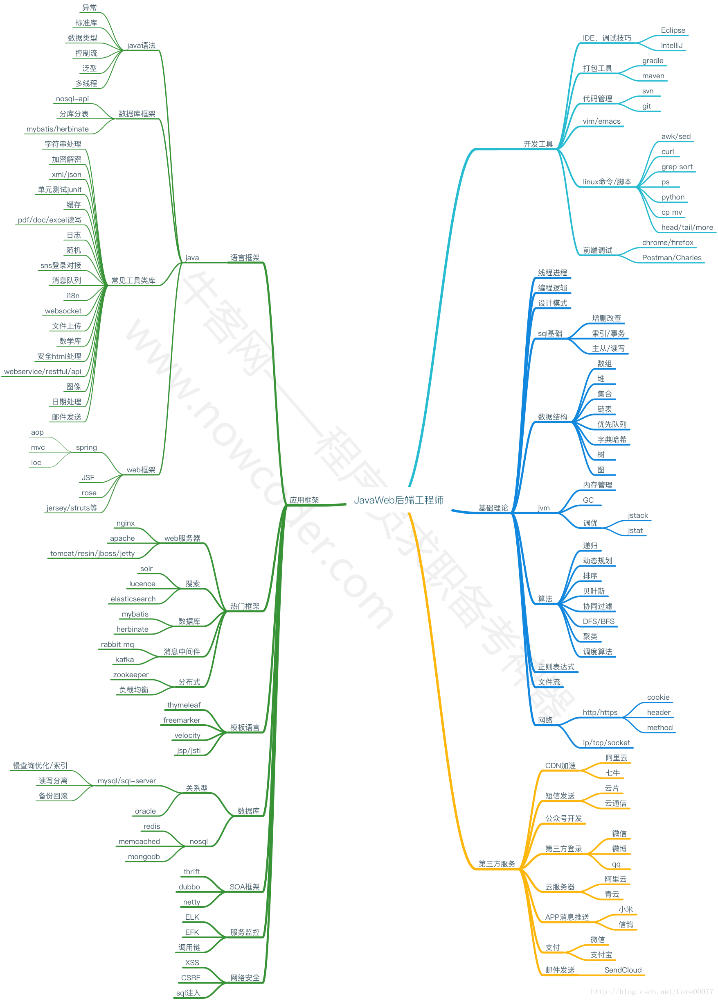

2017/10/12 星期四 19:47:52 Edit by Core Chan 

此Java Web总结仅用于个人学习，仅供参考。

目前技能点：

- java SE除了swing/awt等图形化界面
- jdbc api
- mysql

**建议上面的技能点点完后再往下走。**

总体路线规划为：

1. servlet/jsp等J2EE基础内容
2. 跟视频或者教程不用框架写后台
3. ssh框架+ssm框架
4. 实践一到两个具体项目

<!-- more -->

# J2EE ##
**必要**基础内容，servlet作为**重点**看，jsp jstl等内容可以不完全掌握但必须 **全部**了解。

> 发哥推荐书籍：《servlet 和 jsp学习指南》

# 纯J2EE项目 ##
做一个不用框架的后台项目，了解后台的整体过程和大部分底层的姿势。
> 知乎平台参考资料：[如何成为JAVA工程师](https://zhuanlan.zhihu.com/p/29222077) 推荐王勇老师DRP项目

笔者个人认为可以配合《servlet 和 jsp学习指南》一起食用。先技术、后思想，实践出真知。

# SSH+SSM ##
参考资料：[泛泛谈SSM和SSH](http://blog.csdn.net/mengdonghui123456/article/details/51591399)

两者无论谁先上手都无所谓，学习框架是为了快速开发，原理依旧是基于servlet，学习框架的同时接触MVC、DAO设计模式，理解这些设计模式对框架的解读至关重要

关于MVC的参考资料：

> [谈谈MVC模式](http://www.ruanyifeng.com/blog/2007/11/mvc.html) 
> 
> [如何理解Web应用程序的MVC模型](https://www.zhihu.com/question/27897315)
> 
> [真正理解及区分MVC,DAO,Action,Service](http://blog.sina.com.cn/s/blog_56b55e510101jxc0.html) 

>[ mvc dao层、service层 到底怎么写](http://blog.csdn.net/shaoduo/article/details/50683853)
>
>[MVC+DAO设计模式实例](http://blog.csdn.net/tao_sun/article/details/19124853)
## Spring学习 ###
在学习框架及整合到项目中前，应当对框架有一定的了解，尤其是核心框架Spring，建议先把Spring实战快速看一遍，再结合SSH框架实践开发项目

推荐书籍：Spring实战
## Spring+Struts+Hibernate ###
建议结合项目边看边写

推荐书籍：轻量级Java EE企业应用实战 Struts 2+Spring 4+Hibernate整合开发
## Spring+SpringMVC+MyBatis###
在SSH技能点点亮之后就可以正式用SSM进行开发了

参考资料：
>[SSM框架——详细整合教程（Spring+SpringMVC+MyBatis）](http://blog.csdn.net/zhshulin/article/details/37956105)

## 最后 ###
为了对付面试，可以看Spring源码、JVM源码，后期面试具体可以参考面经

>[【面经汇总】2018校招面经汇总贴，101家企业，覆盖各大职位（持续更新）](https://zhuanlan.zhihu.com/p/30032665)
>
>[阿里巴巴，美团等各大互联网公司Java工程师笔经面经：](https://www.zhihu.com/question/26350691/answer/201135416)
>
>[阿里巴巴、美团等各大互联网公司的 Java 类校招对本科生的要求是什么？](https://www.zhihu.com/question/26350691/answer/42692522)

最后附上一张Java Web技能树，技能树来源：
https://www.zhihu.com/question/26350691/answer/201135416
