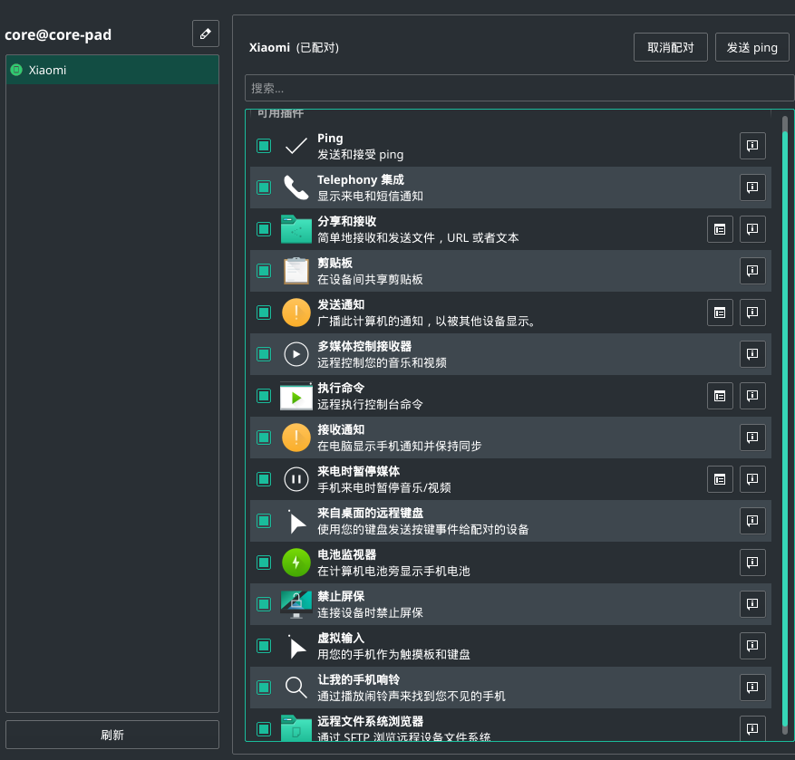
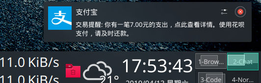
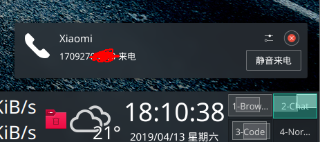
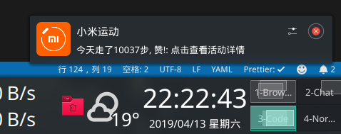

# 写在前面

安利一个神器，真神器从不bb，直接上图。

<!-- more -->

# 目前有的功能

- 一般我们会想发一段文字放到手机上——或者手机上有个一段文字（比如收到的手机验证码）需要输入到电脑。以前需要**一个个输入**或者使用QQ的**我的手机**，使用`KDE Connect`就只是一个复制的事情。
- 找不到手机在哪？一键找手机（放音乐）
- 手机接受的文件想拷到电脑里？电脑里的文件想传到手机里？直接通过原生的资源管理器dolphin拖一拖就完事儿。
- 手机上可以操控电脑——把屏幕当作触摸板使用，ppt演示据方便。
- 手机控制媒体——下一曲、音量、暂停等等。
  - 手机来短信/通知/电话/邮件？电脑全能收到。
  - 电脑的所有通知？手机也能收到。
  - 而且上面这两点不会重复通知！任何一个设备端将通知划掉，另一个设备上的通知也会被划掉！
- 手机远程执行提前预设好的指令——比如之前写好的脚本等。

基本上你能想得到的用途它都有。举个例子，我刚点的外卖：

然后……

还有……

KDE真香，linux真香。

不过仅限于同一局域网下。（这很正常啦，以后ipv6就好了）