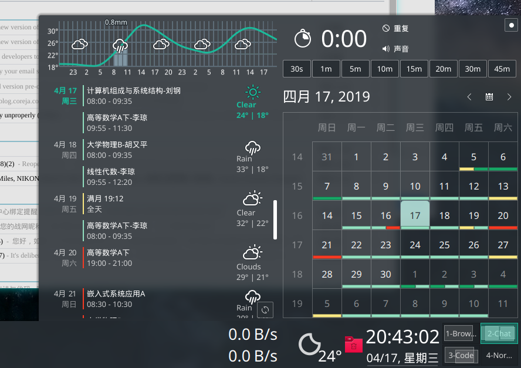

# 写在前面

最近被一款KDE平台上的Widget吸引到了，名字叫[Event Calendar](https://github.com/Zren/plasma-applet-eventcalendar).

嘿嘿这个插件的中文版是我翻译的喔～:wink:这是[PR](https://github.com/Zren/plasma-applet-eventcalendar/pull/71)

放张我的使用截图先吸个睛好了



<!-- more -->

# 来由

其实一切都只是起源于一个[issue](https://github.com/Zren/plasma-applet-eventcalendar/issues/67)，我对于插件里的时间显示实在忍无可忍。它会自动将整点时间——比如`7:00 - 11:00`改成`7 - 11`——作为`24小时`用户，这样效果看起来非常僵硬！

然后我就提了个issue想知道怎么改，开发者告诉我本意是`7 - 11AM`看起来会比较简洁，改好之后我道谢后顺便问了下需不需要中文翻译……

然后他就开了个[issue](<https://github.com/Zren/plasma-applet-eventcalendar/issues/69>)跟我讲翻译的规范……其实做了一次翻译之后就发现感觉还蛮好的。怎么说呢？有些很常用普通的词汇，有些翻译你得斟酌blabla……

# 特点

## 天气预报+日程+google日历+倒计时器

这几个特点简直就是一下子击中了我！

它会自动和google日历同步，google日历有多好用我就不说了，直接[看这篇文章](<https://www.zhihu.com/question/21146939>)吧！

天气预报之前我用的`weather widget`，分时播报天气，很棒。有温度曲线。这个插件直接就cover了！爽到！

倒计时器更是很棒啊！我第一次用kde就上了个倒计时器，现在也加入到里面去了！

## 使用与原生数字时钟相同的样式

在体验上感觉就是在使用原生的数字时钟，感官特别棒。

点一下右下角的时钟，就能弹出上面的截图效果。

## 在插件上滚动滚轮可以调节音量

当然还可以配置其他的命令（暂时没想到有更好的）

# 安装

安装很简单啦，KDE平台小伙伴直接去搜`Event Calendar`或者访问<https://store.kde.org/p/998901/>就ok啦。

不过那边大概率还没更新中文版的，推荐直接github上安装。（不过我的PR现在还暂时没过，应该是仓库维护者还没上线）

```shell
git clone https://github.com/Zren/plasma-applet-eventcalendar.git
cd plasma-applet-eventcalendar
sh ./install
```

就好啦～因为kde store上的版本相对比较老旧，肯定还是github上拉下来的新一些，推荐后者。

# 结语

和github上的大佬们交流还是很有意思的，尤其是可以帮助锻炼英语写作和阅读……而且说出“xxx插件是我翻译的”这句话的时候巨有成就感hhhh.

