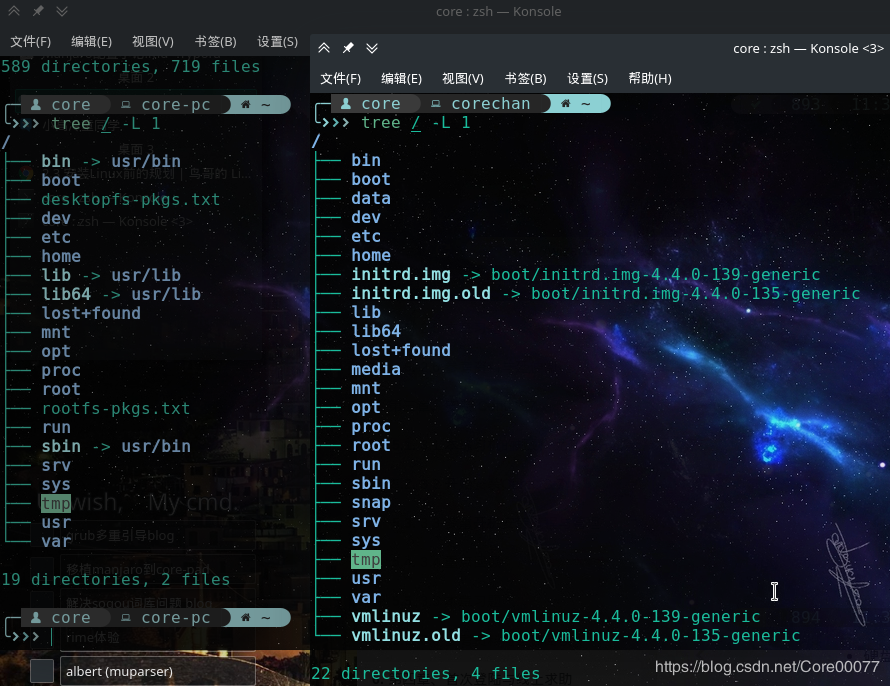

# 挂载点记录

因为使用的是120G固态+1T机械硬盘，固态里面还有windows系统，所以省吃俭用一共给Manjaro分配了32g空间在固态，130g左右在机械，根据鸟叔第四版（今年十月发布了！）以及FHS，以下是我的分配方案。

表格上半部分是ssd，下半部分是hdd

| 挂载点    | 容量   | 用途                             |
| --------- | ------ | -------------------------------- |
| /boot     | 500M   | 系统内核                         |
| /boot/efi | 500M   | 多启动引导（使用了rEFInd）       |
| /var      | 8G     | varible的意思，用来存放系统      |
| /opt      | 8G     | 第三方应用                       |
| /         | 16G    | 根目录，系统所在处               |
| ～～～    | ～～～ | ～～～～～～                     |
| /swap     | 16G    | 交换分区（看到也有使用swapfile） |
| /tmp      | 10G    | 临时文件                         |
| /home     | 100G   | home目录放置各种个人文档         |

<!-- more -->

# 额外补充

针对挂载点，额外补充一下一些发现：/usr目录下有一套/usr/bin, /usr/sbin, /usr/lib，根目录下也有一套/bin, /sbin, /lib。以前区别主要在于根目录下尤其是/bin的工具是一些基本的维护工具（比如cd, ls），现在没什么区别。

现在的linux发行版一般会用一个软link过去，防止删除了他们就凉了，也同时区分清楚（以免混淆这历史遗留问题）。但在ubuntu、debian等linux发行版上，他们都是分别独立存在的，而在arch这样的发行版上就直接使用了软链。

具体看下图，左边是manjaro(arch)，右边则是腾讯云上的ubuntu-server。

原因的话引用一下知乎大佬的专栏：[Linux 文件系统详解 | Linux 中国](https://zhuanlan.zhihu.com/p/38802277)

>   `/usr`
>
>   `/usr` 目录是在 UNIX 早期用户的主目录所处的地方。然而，正如我们上面看到的，现在 `/home`是用户保存他们的东西的地方。如今，`/usr` 包含了大量目录，而这些目录又包含了应用程序、库、文档、壁纸、图标和许多其他需要应用程序和服务共享的内容。
>
>   你还可以在 `/usr` 目录下找到 `bin`，`sbin`，`lib` 目录，它们与挂载到根目录下的那些有什么区别呢？现在的区别不是很大。在早期，`/bin` 目录（挂载在根目录下的）只会包含一些基本的命令，例如 `ls`、`mv` 和 `rm` ；这是一些在安装系统的时候就会预装的一些命令，用于维护系统的一个基本的命令。 而 `/usr/bin` 目录则包含了用户自己安装和用于工作的软件，例如文字处理器，浏览器和一些其他的软件。
>
>   但是许多现代的 Linux 发行版只是把所有的东西都放到 `/usr/bin` 中，并让 `/bin` 指向 `/usr/bin`，以防彻底删除它会破坏某些东西。因此，Debian、Ubuntu 和 Mint 仍然保持 `/bin`和 `/usr/bin` （和 `/sbin` 和 `/usr/sbin` ）分离；其他的，比如 Arch 和它衍生版，只是有一个“真实”存储二进制程序的目录，`/usr/bin`，其余的任何 `bin` 目录是指向 `/usr/`bin` 的“假”目录。

不过这样就留下了一个潜在的问题，即如果安装arch或其衍生版把/usr单独分出来的时候，开机时会因为/usr还没挂载，而开机却需要读取/sbin/init，需要手动修复。具体可以看另一篇博客：[manjaro (arch)安装完成后重启报错：Root device mounted successfully, but /sbin/init does not exist.](https://blog.csdn.net/Core00077/article/details/85228956)
