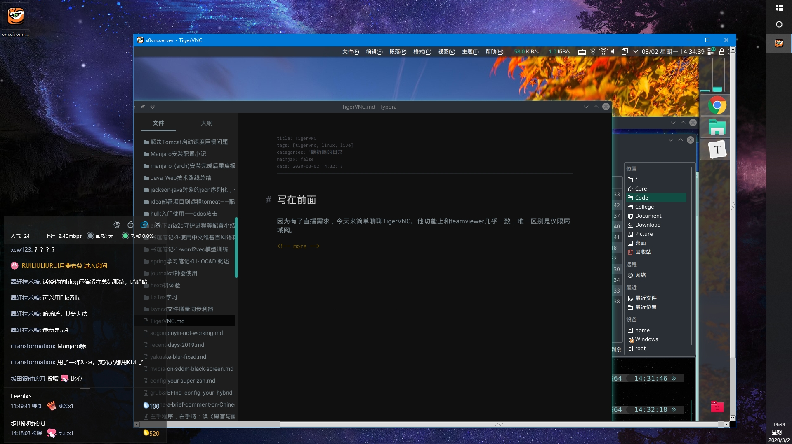

# 写在前面

因为有了直播需求，今天来简单聊聊TigerVNC。他功能上和teamviewer几乎一致，唯一区别是仅限局域网。那为什么还要介绍它了？因为局域网好用呀～而且开源软件轻量级超乎想象。

<!-- more -->

# 需求

直接使用我的Linux商务本直播的话，性能跟不上，而且风扇噪音太大影响直播体验；而我又暂时不想在高性能台式机上装manjaro（尽管现在已经提上了议程），所以鬼才如我想出了这个思路：使用高性能平台的windows进行直播，再将商务本的屏幕通过远程桌面软件投到windows上。

那个时候teamviewer就显得很臃肿了。毕竟它要做的是内网穿透，能实现在内网的电脑能在公网上远程控制，而我需要的仅仅只是局域网远程桌面，甚至都不一定需要控制。

然后观众中一位大佬就来点评了，他说tigerVNC还可以，然后就在他的指导下完成了首次TigerVNC体验，感觉还不错。

---

具体需求是linux端作为tigerVNC的server，然后windows端连接server并观看屏幕。

# 安装

```shell
yay -Sy tigervnc #安装tigervnc
```

这软件很小，但很酷。windows端直接[下载](https://bintray.com/tigervnc/stable/tigervnc/1.10.1)页面里的`vncviewer`，一共才十几兆，绿色版无需安装。

# 使用

我主要是参考的[这篇](https://wiki.archlinux.org/index.php/Virtual_Network_Computing_(%E7%AE%80%E4%BD%93%E4%B8%AD%E6%96%87))wiki，使用起来相对比较方便，首先linux端需要打开端口，比如

```shell
vncserver :1
```

就相当于打开了第一个端口[^端口号规则]，这时5901端口就打开了，然后在windows端的vncviewer里输入对应linux机器的ip+端口号即可访问。

[^端口号规则]: 端口号规则：5900+n=物理端口号，n是输入时打开的端口。

不过我访问的时候出现了问题，即它并不会直接展示桌面环境，而是会出现终端，这是我目前百思不得其解的地方，有些地方说修改`～/.vnc`下的startup文件，修改成对应的桌面环境即可，可我目前没有成功。

---

访问桌面的另一个方式就是`在物理显示器上（5900端口）运行VNC服务`，这个就比较粗暴，直接把linux机器上的桌面物理信号传过来，实际上性能会差一些，但是方便一些（主要是不知道方法一咋整）。

```shell
x0vncserver -display :0 -passwordfile ~/.vnc/passwd
```

直接写这句话就好，这样在windows端访问5900端口即可。