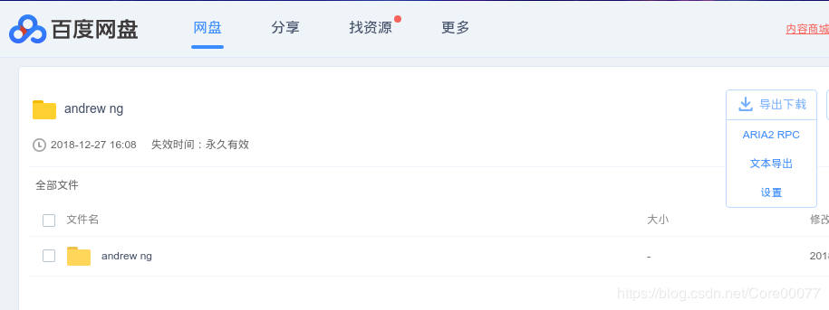
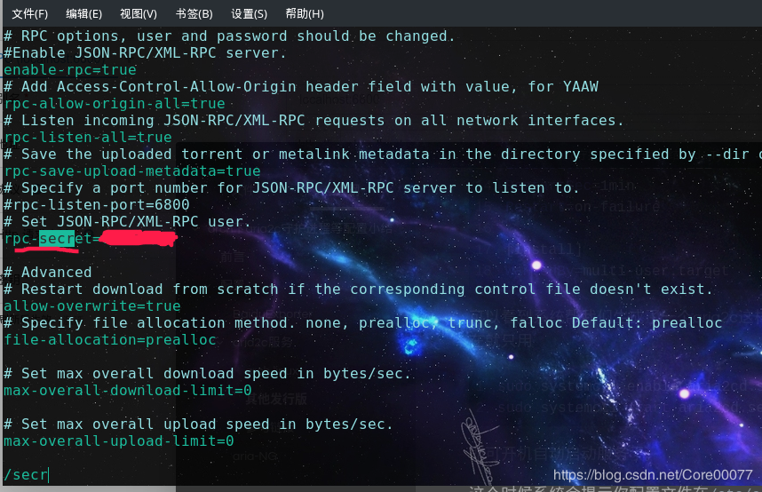
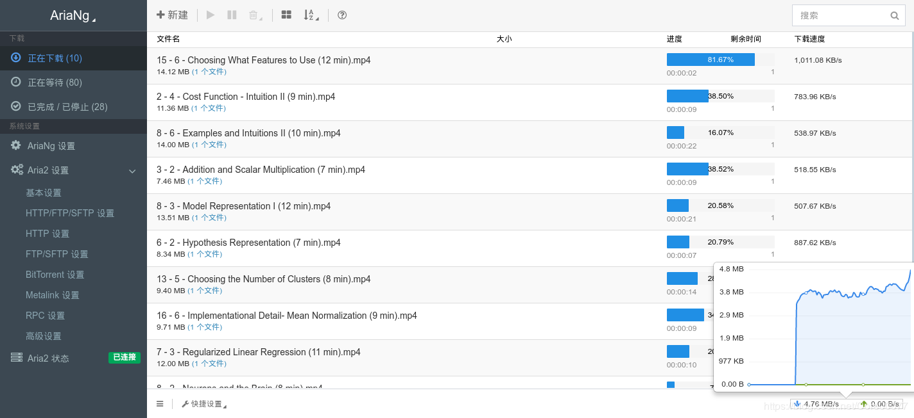
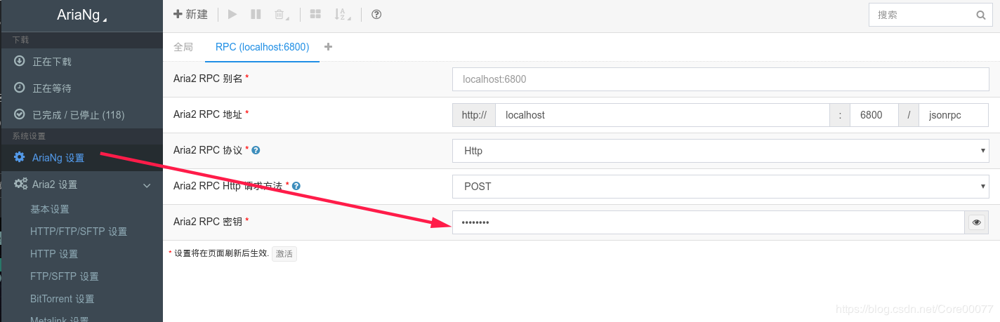

# 前言

[aria2c](https://aria2.github.io/)是个好东西，可以把他简单理解为是下载管理器的后端，配合一些前端程序，比如[ariaNG](https://github.com/mayswind/AriaNg)，可以管理其下载的各类东西，再配合百度云导出真实下载地址的插件[BaiduExporter](https://github.com/acgotaku/BaiduExporter)，爽到不要不要的。所以决定简单总结一下。

<!--more-->


# 配置

## BaiduExporter

首先是BaiduExporter，安装很简单，具体的去github上拿吧（链接在上面），安装插件之后可以看到多了一个导出下载按钮


设置的时候配置好aria2c服务开启的端口号即可，默认的端口是6800，token后面是本地aira2c服务的配置文件里的秘钥，具体内容会在后面讲。


## aria2c服务

### arch linux

arch（我用的manjaro-kde）系的就很舒服，毕竟坐拥最大的用户仓库aur，前几天在aur上一搜，发现还真有现成的aria2c-daemon，还是帮你配置好systemd守护进程的，热度还算不错。二话不说，先来一发：

`yay -Sy aria2c-daemon`

安好之后会发现给你新加了个用户，叫aria2c，这个服务就是由aira2c这个系统账户完成的了。我们简单瞅一眼他service咋写的

```shell
[Unit]
Description=aria2c Service
Requires=network.target
After=dhcpcd.service

[Service]
Type=forking
User=aria2c
Group=aria2c
WorkingDirectory=/var/share/aria2c
EnvironmentFile=/etc/conf.d/aria2c-env.conf
ExecStart=/usr/bin/aria2c -D --conf-path=${ARIA2C_CONF} --save-session-interval=180 --save-session=${ARIA2C_SESSION}
ExecReload=/usr/bin/kill -HUP $MAINPID
RestartSec=1min
Restart=on-failure

[Install]
WantedBy=multi-user.target
```

可以看到系统帮我们生成了一个aria2c这样的系统账户来执行aria2c服务，现在就只用

```shell
sudo systemctl enable aria2cd.service #设服务为开启启动
sudo systemctl start aria2cd.service #启动服务
```

即可开机自动启动服务了。

这个时候系统会提示你配置文件在`/etc/conf.d/aria2.conf`里，然后`/var/share/aria2c`是当前的下载路径。aria2的log和session都存在这里。

哦还有在配置文件`/etc/conf.d/aria2.conf`里记得写一下rpc-secret字段，可以自定义，当然也可以生成。这就是前面设置里的那个token。

还可以配置监听的端口号，默认值是6800



### 其他发行版

其他的发行版像ubuntu，`apt install aria2c`是会安好的，然后参考一下（大量）网页，把aria2c配置好，之前配置过ubuntu的，反正挺累的就是。

### 参考链接

想要了解aria2一些配置等的参考链接如下：

[aria2配置示例](https://binux.blog/2012/12/aria2-examples/)

[aria2使用说明](https://aria2c.com/usage.html)

[aria2官网](https://aria2.github.io/)

## aria-NG

这是第三件套，毕竟aria2c装好了之后，总不能每次下载都用命令行操作，麻烦而且不能方便的并行控制，aria2c提供了rpc接口，这也是为什么前面要把aria2当做一个守护进程来使用。

[ariaNG](https://github.com/mayswind/AriaNg)就是这样一个前端，可以方便的完成查看下载速度、下载管理等各种操作，一个简单的截图了解一下：



可以看到这里可以配置各种aria2的设置，作者翻译简直就是良苦用心。作为本地下载器，可以直接在上面给的github链接里下载release里的all-in-one版本，直接打开本地html网页即可查看。

下好all-in-one版本后，打开之前要记得把前面写的--rpc-secret填一下，不然前端会连不上后台下载进程。



# 问题

## Q:为什么登录处出现了新的用户aria2c？

A:这主要是因为aria2c-daemon的作者在新添加用户的时候没有把aria2c作为系统用户添加。（简单地说就是作者背锅，一会儿给他提交各pr去）

[aria2c-daemon](https://github.com/yhfudev/aria2c-daemon-arch.git)这是作者在aur上公布的upstream仓库，git clone下来看代码

```shell
post_install() {
        echo -n "Adding aria2c user and group ..."
        # --no-create-home
        useradd aria2c -d /var/share/aria2c/ -U -s /bin/nologin && echo " done."
        passwd -l aria2c &>/dev/null

        install -d /var/share/aria2c/
        touch /var/share/aria2c/aria2c.log
        touch /var/share/aria2c/aria2c.session

        chmod 600 /etc/conf.d/aria2c.conf
        chown aria2c:aria2c /etc/conf.d/aria2c.conf
        chown aria2c:aria2c /etc/conf.d/aria2c-env.conf
        chown -R aria2c:aria2c /var/share/aria2c/

        echo "Now the aria2cd is installed, you may want to ..."
        echo "  1. check the config file for aria2cd at /etc/conf.d/aria2c.conf"
        echo "  2. get the downloaded files at /var/share/aria2c/"
}

post_remove() {
        echo -n -e "\nRemoving aria2c user/group..."
        userdel aria2c && echo " done."
        echo "Now the aria2cd was removed from your system,"
        echo "you may need to check the directory /var/share/aria2c/ by manual."
}

```

注意看第四行作者添加的是普通身份用户，不太对，修改成

```shell
useradd aria2c -r -d /var/share/aria2c/ -s /bin/nologin && echo " done."
```

即可，-r在这里是指添加系统账户（不会出现在登录界面），改好之后把之前安的卸掉（会帮你把aria2c用户删掉）。然后重新打包并安装即可。

```shell
makepkg -As
pacman -U aria2c-daemon-0.1-1-any.pkg.tar.xz
```

## Q:我把下载路径改成了自己的用户目录，然后下什么东西都下不来，怎么办？

因为你的守护进程是由aria2c账户执行的，他本身无权限访问你的工作目录，所以会出问题。比较好的解决方案使用一个aria2c有权限的目录，然后软链到自己的Downloads下：

1.  在home下建一个aria2c用户目录，修改所有者为aria2c:aria2c
2.  在这aria2c下面建立一个Downloads目录作为aria2c的下载路径，同样修改所有者为aria2c:aria2c；
3.  把自己加入到aria2c用户组里，修改Downloads权限为775（方便自己访问）。
4.  `ln -s /home/aria2c/Downloads ~/Downloads/aria2c`把这个下载目录软链过去。
