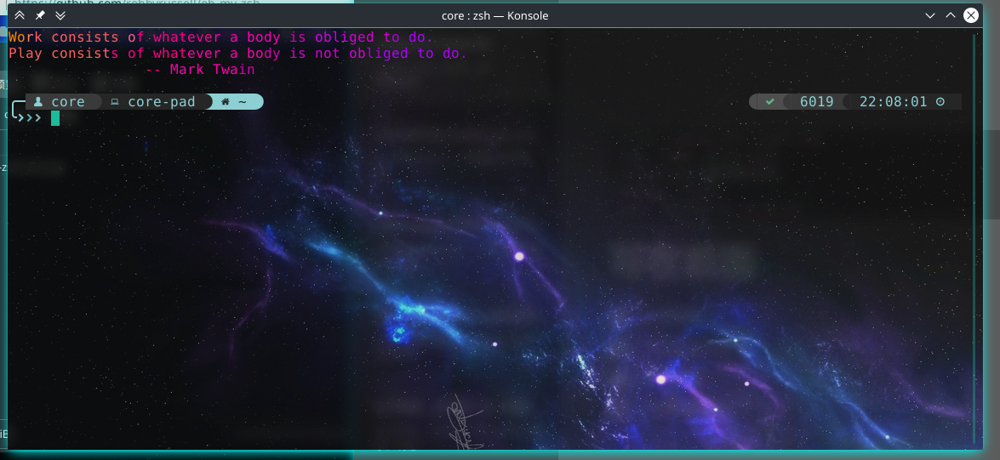
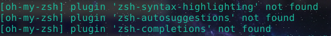

# 写在前面

大致介绍一下怎么配一个这样子的zsh，本教程可配合 [【新手向】15分钟学会从0开始的好看zsh配置！](https://www.bilibili.com/video/av62718465/)食用～也可以单独使用。



<!-- more -->

# 安装zsh


```shell
yay -Sy zsh
```

# 官方安装oh-my-zsh

## 官方安装法

[官方](https://github.com/robbyrussell/oh-my-zsh)的方法就是

```shell
sh -c "$(curl -fsSL https://raw.githubusercontent.com/robbyrussell/oh-my-zsh/master/tools/install.sh)"
```

## 小睿安装法

不过github这网越来越难上了，帮大家调整了一下，直接用这个[oh-my-zsh](oh-my-zsh.zip)就好。

1. 下载上述链接，将其中的`oh-my-zsh`变成`.oh-my-zsh`并放在用户目录下。
2. 执行 `sh install-edited.sh`来安装我稍作改编的安装脚本。（原始脚本还是得在github上clone）

# 使用如图的好看主以及题？

如果想直接配出这个内容，可以不用官方安装～

直接下载[oh-my-zsh-core.zip](oh-my-zsh-core.zip)，其中包含了改编的`oh-my-zsh`以及我定制后[powerlevel9k](https://github.com/Powerlevel9k/powerlevel9k)的主题以及其对应的[nerd font](https://github.com/ryanoasis/nerd-fonts/)字体。

1. 下载上述链接，将其中的`oh-my-zsh-core`变成`.oh-my-zsh`并放在用户目录下。
2. 复制`zshrc`变成`.zshrc`到用户目录下
3. 执行`chsh -s /usr/bin/zsh`，默认使用zsh，这个时候输入zsh应该已经能看到雏形了。
4. 安装压缩包里的两个字体（或者上述有关`nerd font`链接中任意字体）
5. 设置你的终端，使用刚刚安装好的字体
6. enjoy it.

为了避免一些问题，额外步骤如下：

- 记得提前安装autojump `yay -Sy autojump`

# QAQ(FAQ)

遇到下图情况怎么办？



这是因为有些插件没有安装，这些插件都包含在了`oh-my-zsh-core`里，当然不想要这些插件想自己配置的话，那就改改`.zshrc`文件咯。

