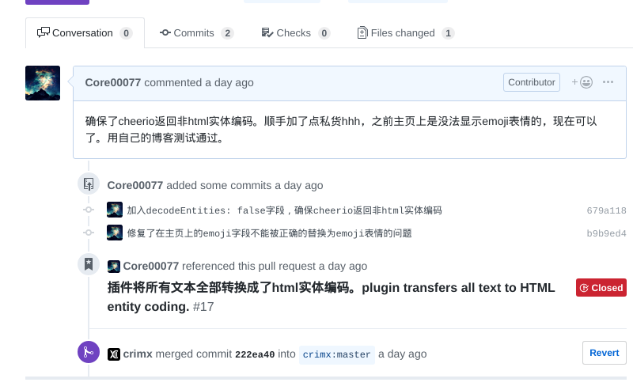

# 写在前面

博客又新增了静态的一键分享，使用[shareJS](<https://github.com/overtrue/share.js>)项目提供的一键分享。

还有评论系统改用valine了，香是真的香。

以及博客可以使用emoji:joy:了（不过emoji用的github的api，很有可能很多人看不见？）

前面还有个莫名其妙的图片插入bug，也修复了。

然后还用了一个大佬写的悬浮式注脚[^注脚]，不过可惜目前注脚还没法在主页使用……先暂时不管这个问题吧。

[^注脚]: 就是**这种**啦～甚至还能往里面插入`LaTex`$\lim_\limits{core\to\infty} \cfrac{1}{core}$嘻嘻嘻当然还有超链接[pandoc-tippy](<https://github.com/RichardYan314/hexo-pandoc-tippy>)

毕竟我是个弱鸡，能和大佬们一起开发是一件巨兴奋的事情。就简单的聊一下这段时间和各种不同的人交流的感觉吧。

<!-- more -->

# 参与贡献的项目与感受

以下经历按时间线写，不分先后。

## hexo-pandoc-tippy[^tippy]

[^tippy]: <https://github.com/RichardYan314/hexo-pandoc-tippy>

写这个项目的大佬似乎是国外大佬，留学生目测？项目是给博客的注脚提供悬浮框。

因为pandoc的渲染器没有人做注脚的悬浮框，我在网上翻来翻去总算找到了一个基于pandoc的，可是折腾了一下午发现有悬浮框（js生效了）但样式不对，在博客上是能看到网站引了tippy.css，也不知道这个文件该放在何处才能被引。

后来给作者提交issue[^tippy-issue]，可以看到当时的我如此羞涩hhh。

> 非常感谢大佬开发，一直苦于pandoc渲染器没有好用的可悬浮的tippy。
>
> 不过有些问题（不做前端，有些不太懂）：
>
> - 安好了启用后一直没有找到css/tippy.css的资源，看得出来能调tippy.js（悬浮框可以使用），但对应的css似乎无法加载（我也没有tippy.css，emmmmm主要是也不知道是哪个文件引的tippy.css就有点僵）。后来在您博客下[footnote](https://richardyan.site/Footnote-Test/)找到了您写的tippy.css，放在了css/tippy.css，然而还是没出您css的效果，审查元素发现这些元素并没有对应的class（所以css选择器选不到），具体情况可以看[我的这篇博客](https://coreja.com/%E5%AD%A6%E4%B9%A0%E7%AC%94%E8%AE%B0/2019/03/LaTex%E5%AD%A6%E4%B9%A0/)
> - （上面是没有在_config.yml配置tippy但配置了pandoc）看见readme里有提到tippy配置，tippy下theme_file不管是填tippy.css还是css/tippy.css还是/css/tippy.css，都会报错
>
> ```
> events.js:173
>       throw er; // Unhandled 'error' event
>       ^
> 
> Error: ENOENT: no such file or directory, open 'tippy.css'
> Emitted 'error' event at:
>     at ReadStream.data.on.err (/home/core/Documents/hexo_blogs/node_modules/hexo/lib/hexo/router.js:145:14)
>     at ReadStream.emit (events.js:197:13)
>     at /home/core/Documents/hexo_blogs/node_modules/graceful-fs/graceful-fs.js:207:14
>     at /home/core/Documents/hexo_blogs/node_modules/graceful-fs/graceful-fs.js:258:16
>     at FSReqCallback.args [as oncomplete] (fs.js:145:20)
> ```
>
> PS: 您的readme关于tippy文档customization theme的url更新了，新的是[这个](https://atomiks.github.io/tippyjs/#themes)
>
> PPS：非常感谢您的开源贡献，个人博客一直很希望有这个注脚功能，感谢大佬！El Psy Congroo

怎么说呢？当时还是很害羞的，然后碰巧找到作者博客发现这是个石头门粉啊。写完了之后就果断在末尾El Psy Congroo。哈哈哈哈究极中二。贴一下这个可爱博主的博客吧[未来ガジェット研究所](<https://richardyan.site/>)。

后来写完了之后自己尝试了一下别的操作，竟然css引到了！原来作者写的配置文件需要给tippy.css的路径，作者在readme里也确实提到了，可我当时不知道这个路径是指博客根目录还是hexo的根目录。（毕竟我前端菜……当时确实没想到他是用js直接把css写到style里去的，所以甚至觉得这不是个**必填项**，准备最后再配置它）

后来项目接触多了发现js还是很容易理解的，会去看一些提供的源码（甚至还debug）。

[^tippy-issue]: <https://github.com/RichardYan314/hexo-pandoc-tippy/issues/1>

哈哈刚刚写着博客的时候顺手就又给作者提了个issue[^new function]，这次是希望提供新功能。

如果后面我不忙的话我自己来写吧嘿嘿。

[^new function]: [新功能]注脚以非数字形式展示](<https://github.com/RichardYan314/hexo-pandoc-tippy/issues/2>)

（hexo-pandoc-tippy作者Richard：mmp我一共就写了这么个插件，两个issue还都是你提的，找茬？）

## valine[^valine]

[^valine]:<https://github.com/xCss/Valine>

valine这是个大项目，利用leanCloud提供免费云服务实现的静态博客的评论模块。可我按照文档规规矩矩的完成了所有步骤，但始终会有个奇怪的报错，而且页面没法渲染出来。

我是真的忙了好半天，完全没有任何头绪。当时也不太会看源码，用chrome上的debugger对着压缩过后的代码看了巨久……我还纳闷来着：“*为啥这些大佬都这么强？函数名变量名全是一个字母？*”

哇就一点办法都没有，网上也没搜到，巨难过，然后去提了个issue[^valine-issue]，想着这么大的项目，可能没什么人会理我吧……

[^valine-issue]: 原issue看这里 <https://github.com/xCss/Valine/issues/172>

> 在next主题下配置了valine，是最新版本v1.3.6
>
> bug描述：无法显示评论
> bug复现：100%
> bug来源：[我的博客](https://coreja.com/%E7%9E%8E%E6%8A%98%E8%85%BE%E7%9A%84%E6%97%A5%E5%B8%B8/2019/03/lsyncd%E6%96%87%E4%BB%B6%E5%A2%9E%E9%87%8F%E5%90%8C%E6%AD%A5%E5%88%A9%E5%99%A8/)
>
> 欢迎大佬直接去我博客下debug哈哈。
>
> 额外信息：只开启了next主题下的valine，leanCloud_visitor**没有开启**，同时leanCloud的**控制台能看到counter**的信息，但**没有comments**。即阅读+1是ok的，bug应该是`valine.min.js`无法加载评论。
>
> bug信息：
>
> ```javascript
> TypeError: Cannot read property 'hide' of undefined
>     at r.ErrorHandler (Valine.min.js:12)
>     at r.init (Valine.min.js:12)
>     at new r (Valine.min.js:12)
>     at new i (Valine.min.js:12)
>     at (index):1891
> ```
>
> 补充信息，试过1.3.5 1.3.4 1.2.5，均出现同样问题。怀疑是配置问题，但是目前没有什么头绪，求求各位大佬帮助。

你知道吗？作者！**瞬间**！就！**回复了！**

> 收到，初步判断是你加了 `lang: zh-Hans`报错，请更改为`lang: zh-cn` 重试。
>
> > Ps. 这应该是个Bug，感谢反馈。下个版本修复。

哇小透明激动的要死，调整了配置后果然就好了！tql！

顺带一提刚刚我发现这事情发生在十天前……

## hexo-filter-github-emojis[^github-emojis]

[^github-emojis]: <https://github.com/crimx/hexo-filter-github-emojis/>

这是个小项目，star的人不算很多，不过看得出来博客上使用emoji也的确是刚需。但是看它上次commit的时间——哇快半年前了，该不会是很久没有维护了吧？issue上作者好像也不怎么回消息……emm

这次的问题是——其实这个包我很早就引用了，用起来很舒服，不过问题有2：

- 在博客首页上的emoji无法正常显示
- 搜索功能会发现我的所有文字内容全变成了`&#a1258`这样的html实体编码（虽然浏览器上看上去没问题

最近才发现这个问题，遂去解决——先把所有issue看一遍……没有类似的问题。恩这个问题我可能暂时搞不定，时间不太够，先提个issue[^emoji-issue]吧。

[^emoji-issue]: <https://github.com/crimx/hexo-filter-github-emojis/issues/17>

当时不知道作者哪国人，正好想练英语，就发了双语（逼格起来hhh）。

再滚回去看源码，在网上查了知道怎么用vscode的debugger（不得不说真挺好用的），一行一行跑那个node。发现在一个特定的地方它会把`::`包裹起来的emoji改为html实体编码，可是我这边改完了之后覆盖到原先的变量时，**整篇文章**的都变成html实体编码了。

没想到作者马上回复我了，一针见血指出问题可能的原因（后来被证实是问题所在），不过作者后来没玩hexo了，跑去用nuxt做博客了（以后有空我也玩），怀疑是我环境里有别的插件冲突，就懒得折腾，建议我自行解决后提个pr上来。

我也正好想自己debug试试，一边debug一边和作者讲时事情况（作者大佬别放弃我啊我是萌新不会js不会node啊）。后来在大佬的提示下发现这其实是cheerio本身的问题，需要额外提供一个参数来禁止html实体编码。边写还边发现了渲染器的处理数据，发现——前面第一个问题`主页上emoji无法正常显示`说不定也能解决了！

然后撸起袖子改了3行代码，完美解决[^github-emoji-pr]！

[^github-emoji-pr]: <https://github.com/crimx/hexo-filter-github-emojis/pull/18>



作者就很快直接把我改后的代码merge到master上发布了，还直接更新了npm仓库。哇就感觉爽到！

## shareJS[^shareJS]

[^shareJS]: <https://github.com/overtrue/share.js/>

这是个实打实的中等项目，毕竟一键分享是真·刚需。但是作者很久没维护了，似乎是个腾讯大佬。其中有个小bug是url过长会出错（已有issue[^shareJS-issue]），实际上调查发现是引用的QRCode本身有bug，不接受过长的url，网上也有fork后解决问题的js，我让作者更新（但作者回复很慢，估计鹅厂加班比较猛？），于是就直接引了一份过来，自己琢磨了会儿gulp压缩打包的工具，发布了一份给自己用，效果还不错。

后来在issue下更新自己这边的动态，并且很贴心的提交了pr，作者直接回了句已merge。哇爽到～

[^shareJS-issue]: <https://github.com/overtrue/share.js/issues/127>

# 总结

总之~~gayhub~~ github给我们提供了一个和大佬们交流的平台，在上面能找到很多需要的轮子，很多东西都非常具有实用性，尤其是自己贡献的代码被作者采用的感觉——巨爽！

就这样了。晚安。