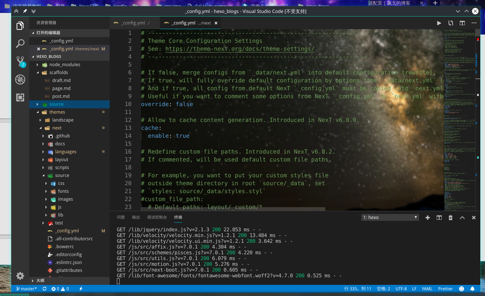
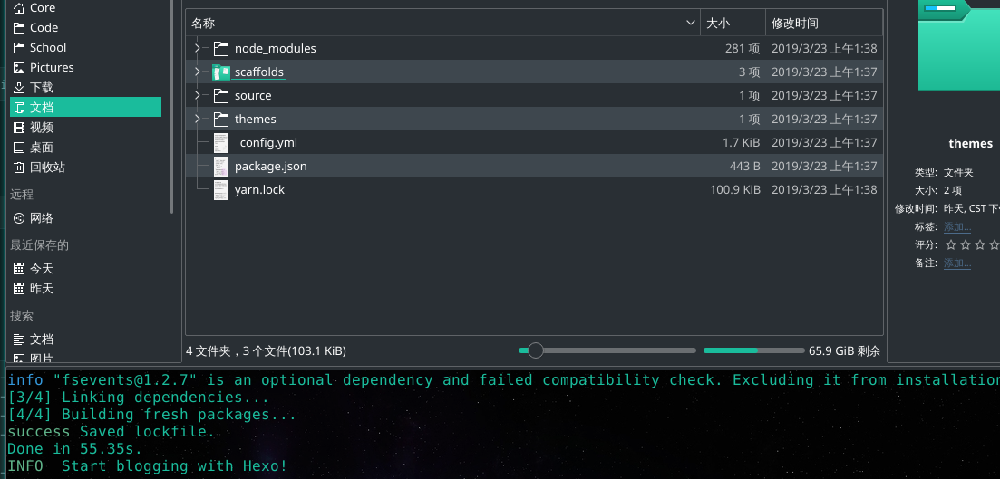
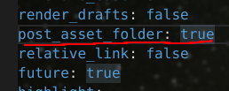

# 前言
终于开始搭载个人博客了，这里详细记录了此博客的所有安装过程。包括各类插件的作用、部分配置文件的尝试、front-matter等等。



<!-- more -->

# 安装

## 环境安装

```shell
sudo npm install hexo-cli -g
```

## 安装

```shell
hexo init
```



完成后记得要

```shell
npm install
```

然后访问[localhost:4000](localhost:4000)就可以看到已经安装好的博客在本地躺着了。

## 插件

```shell
npm install --save hexo-deployer-git
npm install --save hexo-asset-image
npm install --save hexo-math
npm uninstall --save hexo-renderer-marked
npm install --save hexo-renderer-pandoc
npm install --save hexo-filter-flowchart
```

### hexo-deployer-git

它是用来一键deploy到git上的，比如github主页就可以用它，需要在hexo目录下的config文件配置如下（仓库改成自己的）：

```yaml
deploy:
  type: git
  repository: git@github.com:Core00077/core00077.github.io.git
  branch: master
```

### hexo-asset-image

用来插入图片，因为图片的相对路径什么的比较麻烦，这里使用这个插件并且配合typora的设置（如图）即可高枕无忧


哦差点忘了说还得改hexo目录下config，如图改成`true`即可。



### hexo-math

用来支持latex的

### hexo-renderer-pandoc

因为hexo本身不支持latex，hexo-math不够，还需要一个markdown渲染器。

这里要记得先卸载原生的渲染器，再安装新的。

```shell
npm uninstall --save hexo-renderer-mark
npm install --save hexo-renderer-pandoc
```

选择pandoc的原因主要是参考这篇文章[^1]。pandoc帮我们解决了很多问题，而且自带比如注脚、上下标之类的md拓展语法。

[^1]: [Hexo 书写 LaTeX 公式时的一些问题及解决方法](https://jdhao.github.io/2017/10/06/hexo-markdown-latex-equation/)

另一个有趣的作者推荐`hexo-renderer-kramed`，并且提供了其中latex支持性的修改方法[^6]

[^6]: [Hexo功能支持扩展](<https://zhum.in/blog/tutorial/server/Hexo%E5%8A%9F%E8%83%BD%E6%94%AF%E6%8C%81%E6%89%A9%E5%B1%95/>)

不过提一句，我很喜欢一个作者的悬浮注脚插件[^3]，不过和pandoc不兼容，不知道pandoc有没有这方面的功能。

[^3]: [Hexo 里的脚注插件](<https://kchen.cc/2016/11/10/footnotes-in-hexo/>)

### hexo-filter-flowchart

忘了在哪看到了，很棒的流程图插件（虽然我还不会写）

## 主题

就用拓展性和实用性目前都很强的NexT主题8[^2]，这个主题可以在里面配置math等，很方便。它本身也提供了很多插件。

```shell
git clone https://github.com/theme-next/hexo-theme-next themes/next
```

[^2]: [hexo-theme-next](https://github.com/theme-next/hexo-theme-next)

# 配置

前面已经提到了诸如git部署、post文章和资源等配置。

hexo最关键的配置就是hexo本身的配置[^4]和其主题的配置[^5]。

[^4]: [hexo官方文档](https://hexo.io/zh-cn/docs/)
[^5]: [NexT主题官方文档](<https://theme-next.iissnan.com/getting-started.html>)

# 使用

```shell
hexo d # 等于hexo deploy 一键部署到配置文件的git地址
hexo g # 等于hexo generate 用于生成静态页面和database
hexo s # 等于hexo server 开启服务！后面可以加--debug参数看详细输出
hexo clean # 清除掉所有generate的内容，一般不需要使用
```

