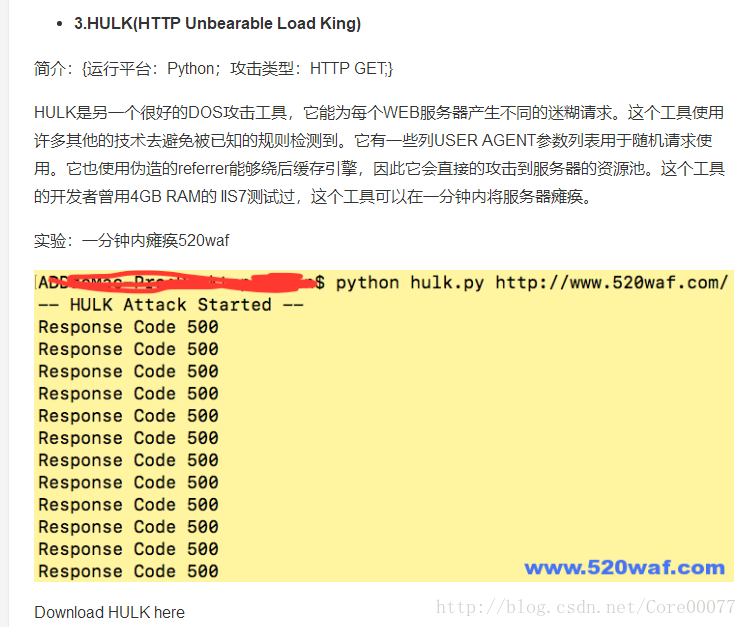
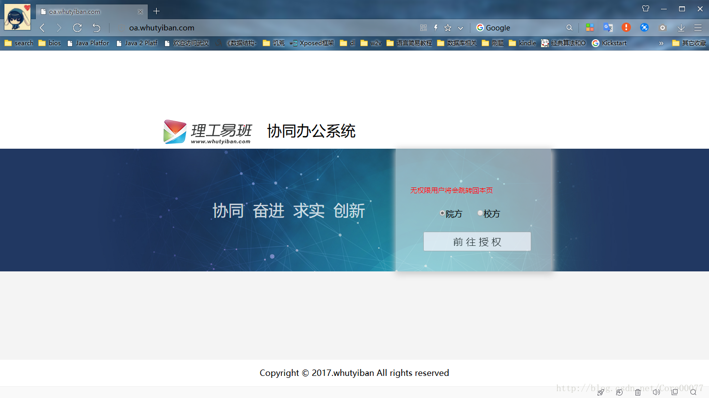
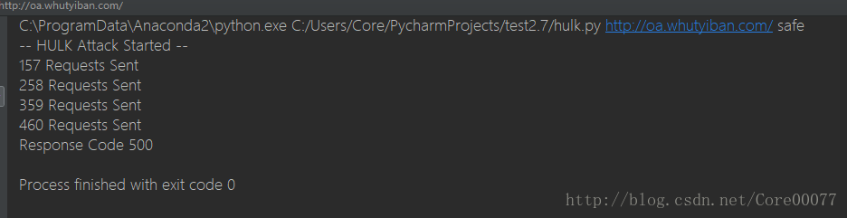
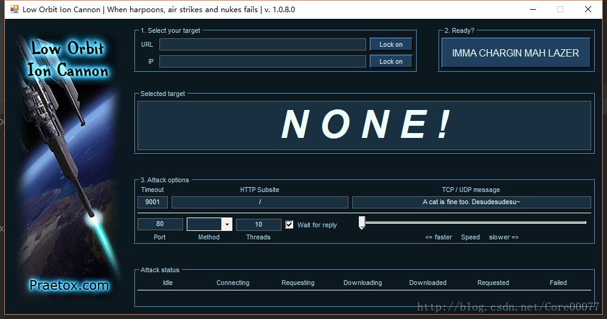

# 起因

怎么就突然想攻击别人了呢？
实际是这样——今天得到消息说我和小伙伴暑假帮 [理工易班](http://www.whutyiban.com/) 做的外包项目 [理工易班协同办公系统](http://oa.whutyiban.com/) 的钱，要等到年后才能拿到了！当时我就不开心了，怎么说这也是十一国庆节就交付了的东西，你们拿我们的东西参加比赛还拿了奖，这钱就变成了能拖就拖？
具体原因不表，一下子我这个黑客技术没有入门的小伙子突然萌生的攻击他们网站的想法，emmmmmm反正后台是自己人，估计也没想到要去处理被攻击以及反追踪什么的，我就玩玩吧。

<!-- more -->

## ddos攻击
还是先稍微介绍下：

> DoS(Denial Of Service)攻击是指故意的攻击网络协议实现的缺陷或直接通过野蛮手段残忍地耗尽被攻击对象的资源，目的是让目标计算机或网络无法提供正常的服务或资源访问，使目标系统服务系统停止响应甚至崩溃。

以上简介来自 [这里](http://www.freebuf.com/sectool/36545.html)

我稍微找了下工具，发现这个网站提供的还不错，然后从上往下试了试，发现拿工具攻击好像是个很容易的事情hhhhh

hulk这个工具算很棒的，LOIC的问题可能就在于没办法隐藏自己，其他的有些在linux上配置不过来的，依赖包太老了下不到的，就没有考虑，今天就只讲讲hulk吧。

# hulk.py

先附上网站膜拜一下[DOS攻击兵器库[Updated for 2017]](https://www.520waf.com/2017/08/dos-attacks-free-dos-attacking-tools/)

也没有什么好多讲的，开始攻击[理工易班协同办公系统](http://oa.whutyiban.com/) 

- 攻击之前

- 攻击中

这边报500错了就证明服务器已经崩了。

- 外网访问 

大致就写这么多吧。

我要开始攻击自己的服务器玩了hhhhhh感觉蛮有意思的。。

阿发现hulk攻不下我自己的腾讯云服务器，好像是因为我开过ddos防御？

想学习黑客技术的可以拿这个入个门，文件的源码地址我丢出来了：在下面
https://dl.packetstormsecurity.net/DoS/hulk.zip
有空我看看这个源码，顺便自己做点工具试试嘿嘿嘿

# 顺便再介绍一个LOIC

嗯后来我攻击自己服务器的时候就是用这个工具拿下的，比py友好多了，不过看不到代码emmmmmm。
