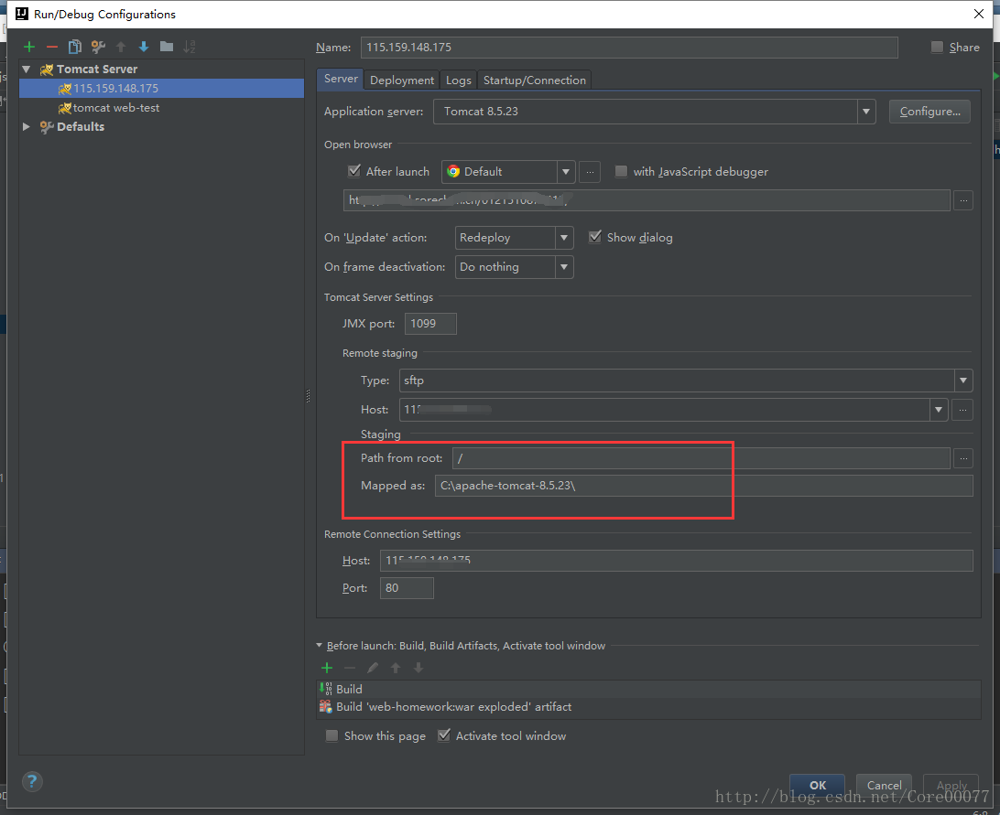

因为网上搜到的基本都是linux配置方案，linux本身就有sftp协议，而windows服务端则基本没有教程……昨晚踩了好多坑，就此记录。

主要参考的是[idea部署项目到远程tomcat](http://blog.csdn.net/tianjun2012/article/details/52795202)这篇文章，然而它没有提供windows服务端的配置，稍作补充。

<!-- more -->

# 配置服务端
## 先决条件

- tomcat
- java环境

这俩都没有就别往下看了2333.
## TOMCAT配置
1.在tomcat/bin下找到catalina.bat/catalina.sh
2.参考[idea官网关于远程tomcat的配置信息](https://www.jetbrains.com/help/idea/2016.1/run-debug-configuration-tomcat-server.html)  调整参数调用jmx，具体可以看第3、4点。

 - port指远程调试端口
 - hostname设置为远程服务器的ip
>-Dcom.sun.management.jmxremote 
-Dcom.sun.management.jmxremote.port=xxxx 
-Dcom.sun.management.jmxremote.ssl=false 
-Dcom.sun.management.jmxremote.authenticate=false 
-Djava.rmi.server.hostname=xxx.xxx.xxx.xxx

3.如果是linux端则在catalina.sh首行加入如下信息（记得在vim下手打，windows和linux的换行不一样）
```shell
export CATALINA_OPTS="-Dcom.sun.management.jmxremote 
-Dcom.sun.management.jmxremote.port=1099 
-Dcom.sun.management.jmxremote.ssl=false 
-Dcom.sun.management.jmxremote.authenticate=false 
-Djava.rmi.server.hostname=192.168.110.52"

export JAVA_OPTS="-Dcom.sun.management.jmxremote=
-Dcom.sun.management.jmxremote.port=1099
-Dcom.sun.management.jmxremote.ssl=false
-Dcom.sun.management.jmxremote.authenticate=false"
```
4.如果是windows端则在catalina.bat里加入下列信息，切记export改为set以外，要把引号去掉，同时不能有换行，每个环境变量需要在一行内完成。
```shell
set CATALINA_OPTS=-Dcom.sun.management.jmxremote -Dcom.sun.management.jmxremote.port=1099 -Dcom.sun.management.jmxremote.ssl=false -Dcom.sun.management.jmxremote.authenticate=false -Djava.rmi.server.hostname=192.168.110.52

set JAVA_OPTS=-Dcom.sun.management.jmxremote= -Dcom.sun.management.jmxremote.port=1099 -Dcom.sun.management.jmxremote.ssl=false -Dcom.sun.management.jmxremote.authenticate=false
```
## SFTP配置（只有windows端需要）
为什么要给windows配置sftp呢，因为idea部署项目需要文件传输呀。在本地idea配置时会需要使用sftp去连接远程服务器，而linux因为通过ssh连接，本身就提供了这个服务，所以我看到的绝大部分参考博文都是用的linux服务器，直接就可以连接了。而windows端并没有，所以用windows端搭java后台的同学这个坑恐怕都踩到过。

这里就需要在windows服务端安装一个sftp服务，使用的是freesshd，这里参考了这篇博客 [windows平台搭建SFTP服务器](https://rookiefly.cn/detail/55)，写的很详细，不予赘述。
记得安装好后在右下角找这个软件，它不会弹窗的，使用时要把ssh和telnet两个勾都打上。

如果后面配置idea时发现连接不成功可以再看看这篇文章 [windows 上搭建 sftp 服务器 --freesshd](http://blog.csdn.net/zhangliang_571/article/details/45598939)，我凌晨配置的时候百思不得其解，idea就是连不到sftp，一直提示auth failed，而后才发现自己开了俩……所以其中一个的ssh一直开不了，杀掉进程即可。

# 配置idea客户端
这个部分和我之前上面说的参考的那个大佬基本一致：[idea部署项目到远程tomcat](http://blog.csdn.net/tianjun2012/article/details/52795202)。相同的部分不予赘述，直接去看就好。

就有一个坑再提一下。

昨天凌晨4点困到不行，上面的一切困难都克服了，可就在这最后一部分的配置信息有个地方填错了，项目就是部署不上去！

都绝望了，打算让赖拐自己上tomcat手动配置了……不过还是本着探索精神瞅了瞅控制台上面一大串java报错的内容，仔细看了看发现是idea设置tomcat地点出了问题！



就是这个mapped as，这里应该填tomcat所在目录！而不是tomcat\webapps\

改成如图上的内容后代码就可以正常的跑起来了。

瞬间就又不困了……不过为了不猝死，还是在钻睡袋里睡一会儿吧，明天马原课上再睡一会儿。