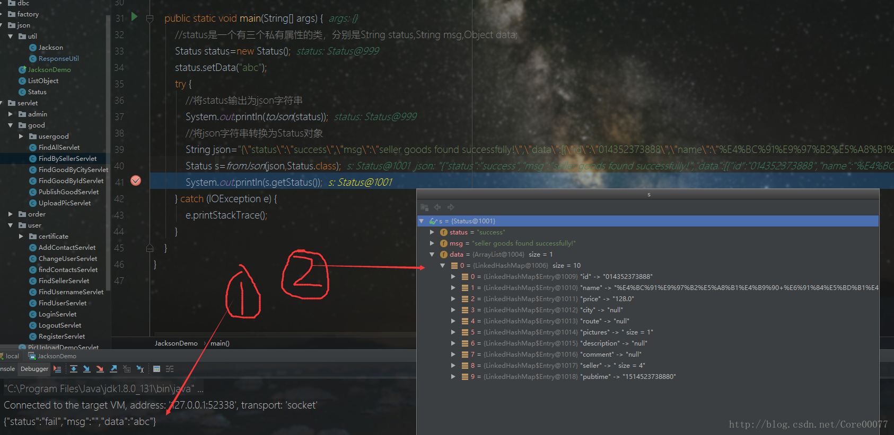

# 日常
总算是把版本2.0写完了，晚上通一通接口，看看还有哪些小bug。

今天说说我下午发现的关于java对象的json序列号的一个问题，大概就是在使用jackson的包序列化对象的时候，有两个我后来添加的成员**怎么也无法被序列化！总是缺少那两个属性！**
## 问题原因

丝毫没有办法的我，查了一通资料，竟然发现没有和我类似经历的人！只好自己找问题所在了……
其实实际问题是：**我要序列化的那个对象，因为我新增了属性，而新增的属性我没有写getter，所以private是无法被jackson的包访问到的！**

<!-- more -->

# 解决
写了getter之后，问题顺利解决

## 附：jackson包使用小demo+单例模式
```java
import com.fasterxml.jackson.core.JsonProcessingException;
import com.fasterxml.jackson.databind.ObjectMapper;

import java.io.IOException;

public class JacksonDemo {
    //私有静态实例，赋值为空，延迟加载
    private static ObjectMapper objectMapper=null;
    //私有构造，防止实例化
    private JacksonDemo(){}
    //静态方法创建单个实例
    public static ObjectMapper getObjectMapper(){
        if(objectMapper==null){
            objectMapper=new ObjectMapper();
        }
        return objectMapper;
    }

    private static String toJson(Object object) throws JsonProcessingException {
        //java对象序列化为Json字符串
        return getObjectMapper().writeValueAsString(object);
    }

    private static <T> T  fromJson(String json,Class<T> type) throws IOException {
        //将Json字符串反序列化为java对象
        return getObjectMapper().readValue(json,type);
    }

    public static void main(String[] args) {
        //status是一个有三个私有属性的类，分别是String status,String msg,Object data;
        Status status=new Status();
        status.setData("abc");
        try {
            //将status输出为json字符串
            System.out.println(toJson(status));
            //将json字符串转换为Status对象
            String json="{\"status\":\"success\",\"msg\":\"seller goods found successfully!\",\"data\":[{\"id\":\"014352373888\",\"name\":\"%E4%BC%91%E9%97%B2%E5%A8%B1%E4%B9%90+%E6%91%84%E5%BD%B1%E4%B9%8B%E5%9C%B0\",\"price\":128.0,\"city\":null,\"route\":null,\"pictures\":[\"/img/goods/014352373888/1.png\"],\"description\":null,\"comment\":null,\"seller\":{\"headPicture\":\"/img/headPic.png\",\"phoneNumber\":\"11111111111\",\"sex\":null,\"name\":\"testuser\"},\"pubtime\":\"1514523738880\"}]}";
            Status s=fromJson(json,Status.class);
            System.out.println(s.getStatus());
        } catch (IOException e) {
            e.printStackTrace();
        }
    }
}
```
# 总结
结果如图，emmmmmm。

- 这里可以看到转换成json字符串就比较单一
- 转换成java对象，仔细看小框：对于我给出的class文件，它会正确的实例化这个类，而我类里的Object对象由于没有特定的类，所以默认键值对是使用的LinkedHashMap，而键值对之间的数组使用的是ArrayList


PS:2018年快乐！
关于Jackson注解的内容参考大佬的文章 [Jackson常用注解介绍](http://blog.csdn.net/u013772876/article/details/70311985)