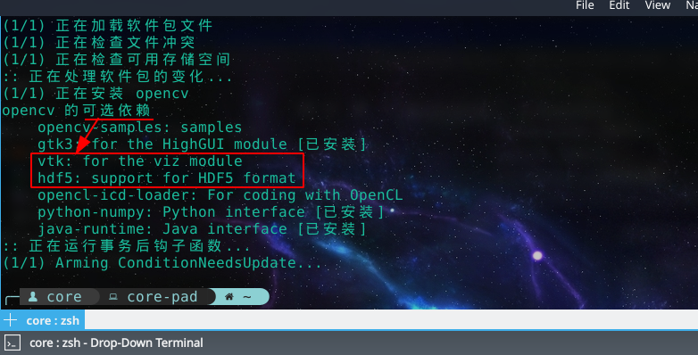

# 写在前面

在帮女票配置opencv的环境的时候，免不了要安装opencv啦，可是安装好之后一直在报错，看上去是有很多依赖找不到。就连opencv官方提供的example也跑不起来。

最有意思的是，这些依赖明明都存在，可就偏偏找不到，踩了无数个坑。从换opencv的版本、自己编译opencv，到查这些依赖的位置、CMakeLists研究——最后找到了解决方案，原来真的是有依赖没装……

于是便想顺手总结一下这个问题——关于**linux软件的安装**。


<!-- more -->

以下贴出一部分报错信息，以方便爬虫以及*信息检索*[^流量引入]嘿嘿。

[^流量引入]:其实主要是想多来一点人康康我的博客啦嘻嘻嘻，正巧这个问题也没什么人记录过。

```c++
====================[ Build | opencv_example | Debug ]==========================
/opt/clion/bin/cmake/linux/bin/cmake --build /home/core/Desktop/example_cmake/cmake-build-debug --target opencv_example -- -j 2
Scanning dependencies of target opencv_example
[ 50%] Building CXX object CMakeFiles/opencv_example.dir/example.cpp.o
[100%] Linking CXX executable opencv_example
/usr/bin/ld: warning: libhdf5.so.103, needed by /usr/lib/libopencv_hdf.so.4.1.0, not found (try using -rpath or -rpath-link)
/usr/bin/ld: warning: libvtkInteractionStyle.so.1, needed by /usr/lib/libopencv_viz.so.4.1.0, not found (try using -rpath or -rpath-link)
/usr/bin/ld: warning: libvtkFiltersExtraction.so.1, needed by /usr/lib/libopencv_viz.so.4.1.0, not found (try using -rpath or -rpath-link)
/usr/bin/ld: warning: libvtkRenderingLOD.so.1, needed by /usr/lib/libopencv_viz.so.4.1.0, not found (try using -rpath or -rpath-link)
/usr/bin/ld: warning: libvtkIOPLY.so.1, needed by /usr/lib/libopencv_viz.so.4.1.0, not found (try using -rpath or -rpath-link)
[...]
/usr/bin/ld: /usr/lib/libopencv_viz.so.4.1.0: undefined reference to `typeinfo for vtkWriter'
/usr/bin/ld: /usr/lib/libopencv_viz.so.4.1.0: undefined reference to `vtkPolyData::SetStrips(vtkCellArray*)'
/usr/bin/ld: /usr/lib/libopencv_hdf.so.4.1.0: undefined reference to `H5P_CLS_DATASET_CREATE_ID_g'
/usr/bin/ld: /usr/lib/libopencv_viz.so.4.1.0: undefined reference to `vtkInteractorStyle::EndTimer()'
/usr/bin/ld: /usr/lib/libopencv_viz.so.4.1.0: undefined reference to `vtkPolyData::SetVerts(vtkCellArray*)'
/usr/bin/ld: /usr/lib/libopencv_viz.so.4.1.0: undefined reference to `vtkAlgorithm::PropagateUpdateExtent()'
[...]
```

# 问题解决

得益于后来搜到的[一篇博客](<https://www.jianshu.com/p/95679f152550>)，帮助我理解了问题。

> 以上我们可以看到 OpenCV的依赖关系。其中有些是Optional,根据我们自己的需要而定制的。
>  在此我们要想让Python能够调用OpenCV库，还需要添加 hdf5 以及 python-numpy这两个包。笔者是基于python3，若是python2则添加python2-numpy.

分析上面的报错信息，结合opencv包的[依赖项](https://www.archlinux.org/packages/extra/x86_64/opencv/)，我们还差`hdf5`和`vtk`这两个包。

```bash
yay -Sy hdf5 vtk
```

安装好后，再到Clion跑一把，woc成了！


# 简单总结

就在我还在纳闷——为什么不直接在包安装的时候就直接帮我们安装这些依赖，搞的我找半天的时候——我突然发现……

其实linux软件的安装在输入和输出之间，早就和我们说清楚了**需要做什么**，比如：



你看人家早就说了opencv不要这些依赖也是可以跑的啦，而且还告诉你了它可能需要哪些依赖……

aur上也有说明：


# 一点迷思

果然linux:thumbsup: ，学会查文档真的很重要。话说回来，当时决定彻底放弃win不就是因为VS给预装了太多我基本上没可能用到的组件，以至于**体积太大**，显得臃肿么？

后来在win平台装Clion、minGW，不就是为了缩减这些的开支么？

linux满足了我“量体裁衣”的需求——只安装我需要的，我自然是不可以怪linux的包管理软件/或者是opencv的维护者的——更何况他们也写清楚了这些依赖是可选的。只好怪自己太菜了——不过也的确如此，文档写得很清楚的东西，是我没有好好看。

我感到很有意思的一点是：很多时候当我们遇到了令我们不悦的事情时，我们总是倾向于去责备——不管到底是谁的错——总之把锅甩给一个不是自己的人就好。可人人都不想背锅，这大概就是为什么最后锅总是丢给国家、大众、愚民这样的**抽象团体**了8。

也许逃避苛责是我们现代人的本能了吧，以至于出现了这样的现象：

- 微软的VS太大太臃肿了——傻逼微软。
- Linux怎么没提醒我需要安这个依赖——弱智Linux。
- 怎么编译错了——辣鸡编译器。
- 不小心把/home弄没了——woc什么玩意儿Linux？

说实话，就连我最一开始也很不爽地抱怨：为什么opencv没跟我说要安这个依赖？？？弱智opencv！

——事实是：打脸啪啪响。

我**最最最**欣赏我女票的一点就是：她**真的真的真的**非常勇于承认错误。这是我觉得最可贵的。不是我这种事后诸葛亮，是**从头到尾**都会去找自己身上的问题的稀有级人类。

她自己的解释是：

> 我就是很怂啦，不喜欢和任何人起冲突，所以会避让blablabla……

但比如有这样的事情发生，她的第一反应我想肯定是去*责备自己没有注意这一点*。tql

**愿这个世界少一点抱怨与苛责，多一些度量与反思。**