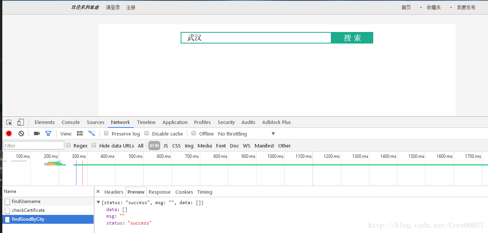
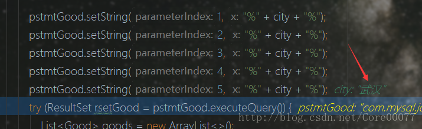
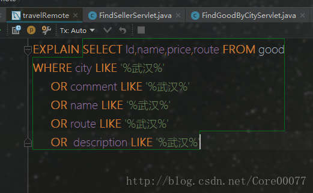
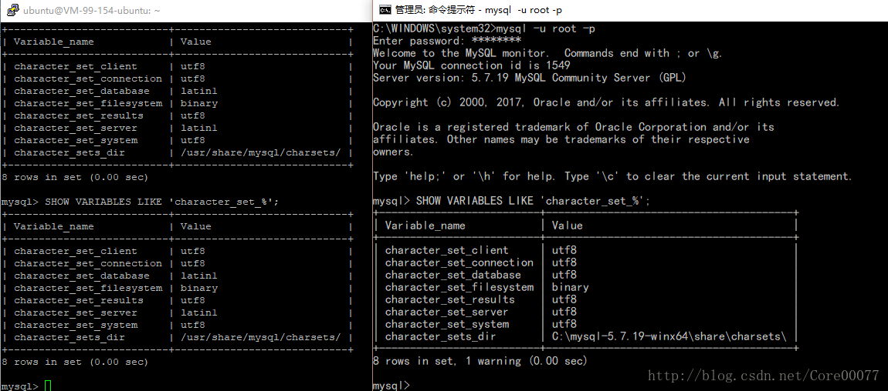

# 问题
感谢学妹帮忙找到的bug——在服务器端的搜索功能无法使用。
而问题的难点在于，这个功能我在localhost测试确实正常的。


这里能看到数据请求发送是成功的，而localhost可以把正确的结果放到data里，而服务器端不行，显然应该是DAO层出现了问题，这锅首先肯定是给我这个后台背稳了。

各种猜测和测试而不得，最终在远程debug才发现问题所在——**数据库的字符集问题**

<!-- more -->

# 解决问题

## 远程debug
远程用idea在服务器上的tomcat去debug的过程不多描述，在 [之前的博客](http://blog.csdn.net/core00077/article/details/78652407) 里就已经写过了，debug的话需要在catalina的java_opt里加个参数，参数在idea中tomcat配置那块会给出的，具体的就不多说。

## 发现根源
既然是DAO层，那么就具体一行一行的跑跑看。
前端传过来的city正确获取到了，嗯就是“武汉”，字符串也没问题。

那看看PrepareStatement最后结果咋样。

嗯？？什么鬼？？？？乱码了？？
那问题应该就出在这里了
再用idea的console跑跑sql命令

可以正常得到结果，行，那就是这里setString没有正确执行的问题了。去网上找找资料咯。

## 解决
参考了这篇文章：[Java使用PreparedStatement查询MySql中文乱码问题](http://blog.csdn.net/yu992324/article/details/52619041)
这篇文章里面关于数据库编码讲得很细，超棒的。

回头看看服务器上数据库的编码和本地数据库的编码，果然有些不是utf-8


那现在剩下的问题就是改成utf-8了！
```shell
sudo nano /etc/mysql/mysql.conf.d/mysqld.cnf
```
在这个配置文件里找到[mysqld]，然后加如下列字段，ojbk！
```shell
[mysqld]
default-character-set=utf8
```
然后重启mysql
```shell
sudo service mysql restart
```
嗯？？无法重启是怎么回事？！
原因是当前这个数据库建立的时候是以默认character也就是latinl建立的，这个时候说改默认就改默认，那我们数据库岂不是很没面子？

所以只能备份数据库（导出数据库的语句）+然后从删库到跑路了

删掉了这个数据库，就能正常重启mysql了。随后再添加数据库，还原数据。

最后再截一张搜索成功的图


# 总结
没啥好总结的，主要是多查资料很关键，感谢各位前辈们在网上的无私奉献。
和数据库字符编码原理相关的干货： [深入Mysql字符集设置](http://blog.csdn.net/fdipzone/article/details/18180325)

ps:北二的三鲜拌面原来是没有蘑菇的，好吃。