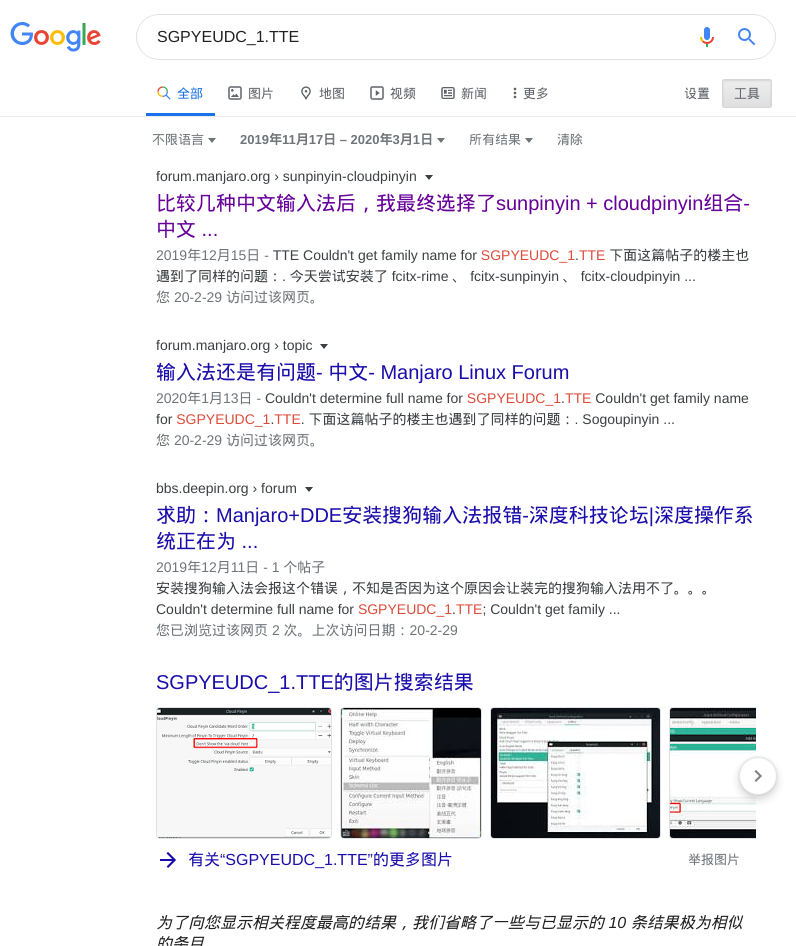

# 写在前面

前些时日总有小伙伴问我为什么他们搜狗拼音用不了，我当时就觉得，输入法都安不好，要不劝退吧？结果今天发现这个坑了，你还别说，我也没搞好！

<!-- more -->

# Bug复现

昨天开启了学习直播（其实主要是为了监督我自己学习），发现搜狗拼音老毛病又犯了：`出现异常，请删除～/.config/Sogou...`（具体路径记不清了）。为了在直播装13，我上去反手就删除了用户目录下的`.sogouinput`，结果果然删错了。后来就索性干脆清理干净了之后重新安装[^第一张图]，结果还是老毛病——打字的时候候选框出不来/乱码，我想着大概重启了就好了，可是并没有，随后去aur上找找最新评论。不看不知道，一看：人没了[^最新评论]

[^第一张图]: 安装的时候就出现第一张图的报错了，只是当时没怎么在意
[^最新评论]: https://aur.archlinux.org/packages/fcitx-sogoupinyin/

另外，Ubuntu和优麒麟上搜狗拼音是可以正常使用的（deepin不知道）

# 解决（伪）

有事没事找度娘，我按照更新日期的范围搜索了关键词，一共就出来了4条相关的结果。

其中比较有用的就是前两个链接，都是manjaro论坛里的。里面给出了概率性解决的方案以及替代方案，我直接贴出来吧。

- https://forum.manjaro.org/t/topic/112926/2
- https://forum.manjaro.org/t/sunpinyin-cloudpinyin/114282

而我自己试过，并没有解决搜狗拼音的问题，所以我尝试无果后直接换了sunpinyin+cloudpinyin，尽管如此，它还真就不如搜狗好用（唉）

# 思考

最后谈谈思路吧，其实问题不算难解决，候选框乱码我猜测是中文字体的问题，同时关键词`SGPYEUDC_1.TTE`也看起来像个字体（猜测是搜狗自己的字体，因为输入法必须涵盖足够的生僻字，一般的字体并不能满足需求），那比较明显的就是移植包并不能够使用这个字体（大概）

另外一点则是为什么这么长时间没人解决，人只有遇到了问题才想解决，而根据我自己的体验以及评论不难看出，如果之前安装过此输入法，则大概率不会出现问题[^问题]，所以没多少人关注到这个问题；另一点是国内Linux用户本来就少，非中文用户也没机会用到搜狗输入法呀，所以国外友人也很难提出/解决这个问题。

[^问题]: 我出现问题主要是因为自己手贱删错东西了