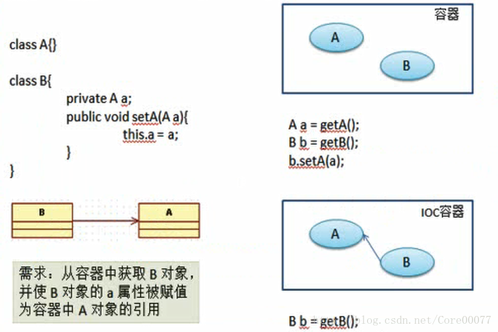
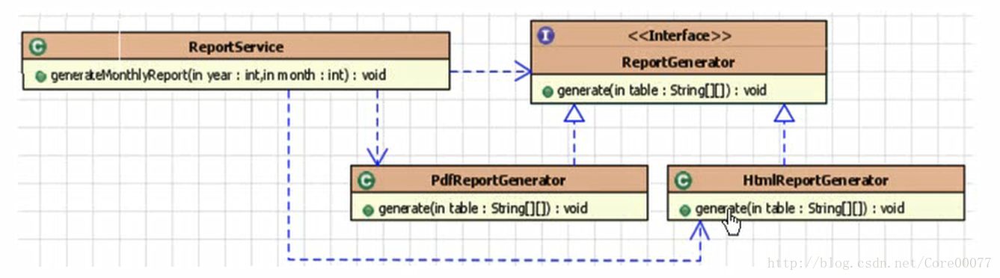
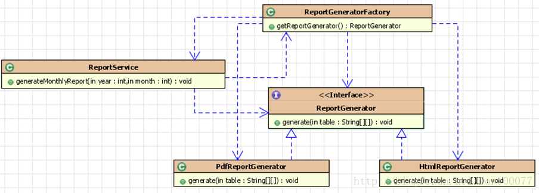
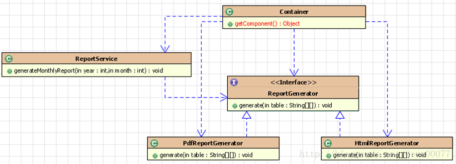

# 前言
没什么好说的
引一句话：
> 你是你自己最大的倚仗。

# 正文
## IOC(Inversion of Control)
控制反转

核心思想是：反转资源获取的方向。
**容器主动的将资源推送给它所管理的组件。组件只需要选择一种合适的方式来接受资源。**

<!-- more -->

引用视频里的例子来讲：

> 以前要买菜，你得上街去买，IOC的思想则是你在院子里放个框，菜会自己蹦进来。

其实很好理解，之前是向某个组件发请求要资源，现在是资源自己过来。

## DI(Dependecy Injection)
依赖注入

**是IOC的另一种表达，组件以预定好的方式（比如getter和setter）接受来自容器的资源注入。**

依赖组件注入。

## 小例子

## IOC的前生 -- 分离接口与实现
一个service需要通过调接口来生成html或pdf报表。那我需要知道接口，还需要知道接口的具体实现的细节

## IOC的前生 -- 采用工厂设计模式
使用工厂模式之后，不需要了解接口实现的细节，直接用工厂模式即可。

## IOC -- 采用控制反转
使用规格好了的容器（装菜的篮子），，使用generator接口直接将资源注入给service

