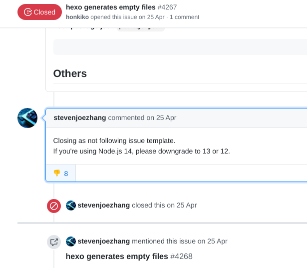

# 写在前面

hexo用的头大，打算迁移本blog到gatsby了。

<!-- more -->

# 从Node升级说起

作为arch用户，保持更新的好处不言而喻——永远可以用最新功能，但牺牲的则是系统的稳定性——你没办法保证所有更新都不会引入某个bug或者不向下兼容的组件导致冲突。而终于在某次系统把node也给升级之后，hexo blog出问题了——渲染页面是空白的。

我最近更新blog也比较慢，所以问题发现的比较慢，但定位问题和查找解决方案就会比较快，上面这张图我差不多在发现问题没多久就看到了。

# 解决过程

让我没想到的是实际上的解决过程非常的崎岖和坎坷，毕竟直接让你downgrade的方案我是不太认可的，尤其是这是4月底的消息，那不管怎样upgrade的fix肯定出了吧？抱着这个思路，我果然搜到了其他关于更新版本就可以解决的方案。

在更新了各类包之后，hexo渲染出来的页面并没有解决问题，尽管不再是空白页面了，但出现了hexo模版的swig语法的内容，看来渲染又出问题了。

尽管文字轻描淡写，但实际上定位bug需要很多操作，包括但不限于清空本地和远程git、debug渲染过程，而且在发现渲染问题之前还有别的包出了问题，比如panflute不支持更新后的pandoc语法树什么的。

我确实没想到半年没更新blog变化会这么多。迫于时间关系，而且写blog怎么能时间都花在debug blog本身呢。在尝试了许久无果后，果断用nvm安了12.0的nodejs，然后包全部还原到原始版本，一切都是从前的模样。重新渲染一遍，又出现了一些小bug，不过不影响渲染就行了，剩下的写个小脚本粘合一下，没什么大问题。

# crimx安利的gatsby

直接放[链接](https://blog.crimx.com/2019/04/18/%E6%90%AD%E5%BB%BA-gatsby-%E5%8D%9A%E5%AE%A2%E4%B8%80%EF%BC%9A%E4%B8%BA%E4%BB%80%E4%B9%88%E9%80%89-gatsby/#%E4%B8%BA%E4%BB%80%E4%B9%88%E9%80%89-gatsby)比较快，不过还是引用一小部分他的文字

> 我的博客最初是用 Github Pages 默认的 [Jekyll](https://jekyllrb.com/) 框架，其使用的 [Liquid](https://shopify.github.io/liquid/) 模板引擎在使用上有诸多不便。
>
> 后来基于 Node.js 的 [Hexo](https://hexo.io/) 横空出世，我便重构了[博客](https://blog2018.crimx.com/)对其深入整合，还为其写了一个 [emoji 插件](https://github.com/crimx/hexo-filter-github-emojis)。在编写过程中发现其 API 设计比较不成熟，调试体验也不是很好，阅读其它插件代码时发现很多都需要用到未公开接口。同时资源管理需要借助其它 Task runner，如当时比较流行的 Grunt 和 Gulp 。这样下来直接依赖了大量包，冲突不可避免的产生。
>
> 在一次换系统之后，项目终于构建不了了，包冲突处理起来非常头疼，也影响到了写博文的兴致。
>
> 拖延了一段时间后，终于开始考虑更换框架。这时 React Angular Vue 生态已比较成熟，所以就没必要考虑其它的模板引擎。
>
> 首先注意到的是新星 [VuePress](https://vuepress.vuejs.org/) 。然而考察过后发现其正在 v1 到 v2 的更替期，v1 功能比较简陋，v2 还在 alpha 期不稳定。且 VuePress 目前还是针对静态文档优化比较多，作为博客依然比较简陋。
>
> 这时 [@unicar](https://twitter.com/unicar9) 正好推荐了基于 React 的 [Gatsby](https://www.gatsbyjs.org/)。发现其生态很强大，再搭配 React 庞大的生态，确实非常吸引人。
>
> 而且在了解过程中还发现了 [Netlify CMS](https://netlifycms.org/) 这个内容管理平台，如此一来，文章数据完全可以存在 Github 中，同时可以便捷地编辑文章。

在好不容易恢复了blog之后，可能这个风格的hexo还会持续用一段时间，尽管折腾新blog也花时间，但毕竟这样能省下不少未来继续折腾这个被我东改西改的hexo的时间，想想也是好的。

之前一直计划着要出的hexo搭建记录blog看来也得咕了，**这种记录式blog一定要在过程中记录**，不然就成总结blog了，既不详细又不实用。那么下次搭建gatsby的时候记录一下吧。

# 总结

hexo 还是让我经历了许多有趣的经历的，但其维护经历变成了几乎每一个间隔（2-6个月）都不可避免的事件，时间越来越宝贵，以后会搭建到基于gatsby的blog，过程也会一并记录。不过这个hexo_blog的配置还是会保留在github上。

