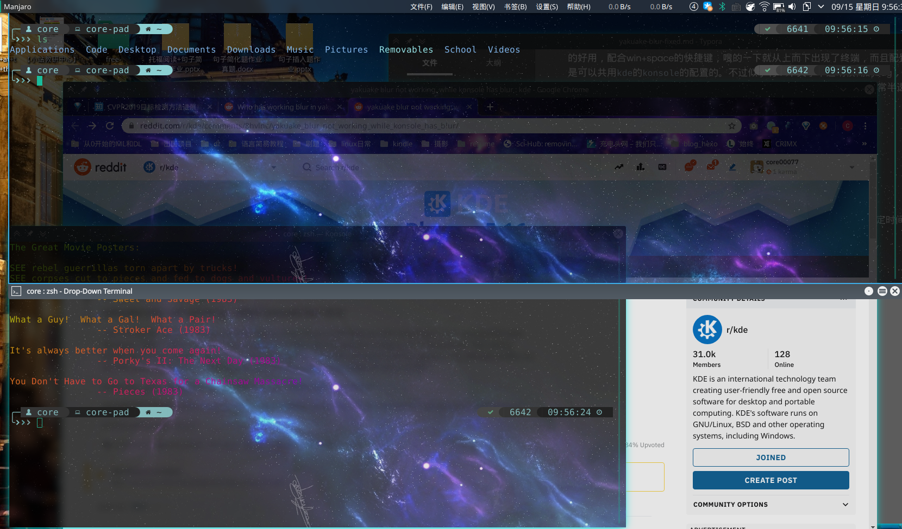
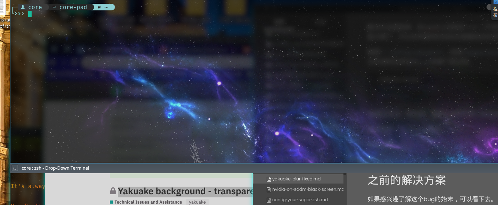

# 写在前面

`kde`自带`yakuake`——拉幕式终端仿真器（其实就是一个下拉式的terminal）是真的好用，配合win+space的快捷键，嗖的一下就从上而下出现了终端，而且配置是可以共用`kde`的`konsole`的配置的。不过似乎有一个关于半透明模糊的bug，即当设置了半透明+模糊的背景时，会出现如图的情况——`konsole`可以正常半透明并模糊，但yakuake不行。



<!-- more -->

# 解决

## 目前最好的解决方案

解决方法很简单，在reddit上找到的[办法](https://www.reddit.com/r/kde/comments/crzyl6/who_has_working_blur_in_yakuake_19080/)（不得不提一句google搜索+限定时间简直太棒了，可以非常便利的找到近期最相关的资料）。

编辑`~/.config/yakuakerc`，找到`[Appearance]`项，增加一个参数`Blur=true`，当然透明也得设为`true`就像下面这样。

```bash
[Appearance]
Translucency=true
Blur=true
```

 如果没有这一项的话，直接在文件的最上面添加即可。

最后重启一下`yakuake`即可。



## 之前的解决方案

如果感兴趣了解这个bug的始末，可以看下去。

最一开始我发现这个问题并搜到的解决方案来自manjaro的论坛，在[Yakuake background - transparency works, blur doesn’t](https://forum.manjaro.org/t/yakuake-background-transparency-works-blur-doesnt/57905)这篇文章中，热心网友发现这一bug。

> It is a known “bug”, hopefully it will be resolved in the not so distant future.
> https://phabricator.kde.org/D10063

并提出使用`xdotool`这一工具来解决问题。在`.zshrc`里添加这一段代码即可。

```shell
if [[ $(ps --no-header -p $PPID -o comm) =~ '^yakuake$' ]]; then
        for wid in $(xdotool search --pid $PPID); do
            xprop -f _KDE_NET_WM_BLUR_BEHIND_REGION 32c -set _KDE_NET_WM_BLUR_BEHIND_REGION 0 -id $wid; done
fi
```

不过随着arch的更新，我发现这一方法在最近的一次更新中无效了，遂找到了前面提到的最优解决方案。果然**需求**才是第一生产力呀。

# 后记

补充感慨一下搜索引擎使用，我搜索的关键词是`yakuake blur`，直击关键词**主体+特点**。一般我的套路是先搜范围较大的，然后再搜问题的关键词。


显然这样搜到的前两个都是极其相关的内容，也正是我们上文提到的第二好的解决方案。但显然这两条虽然比较火且相关度较高，但仍然欠缺时效性——都是一年前的，解决方案已经太老了，不能适用最新的需求。

所以再限定一下搜索时间的范围，根据搜索的结果，依次定在`一年内`，`半年内`，`一个月内`。事实上在一个月内的内容就已经被限定在相当小的范围内了，此时搜索到的最相关的内容就可以认为是解决了`时效性`的问题——不过有时候限定了时间范围的话，`相关性`这一指标就会下降，所以需要动态调整。

比如我限定时间在`过去一个月`后，搜索到的结果中第一条和第二条都是有效的解决方案。

