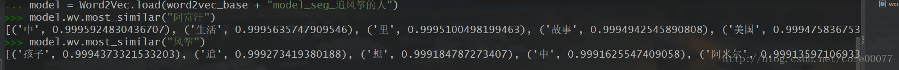
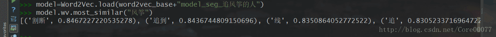

# 前言
整体索引在此 
[书蕴——基于书评的人工智能推荐系统](http://blog.csdn.net/core00077/article/details/79184183)

上次把文本进行了预处理，主要是使用正则去除标签以及对文本去除停用词以及结巴分词。
后续还会加入tf-idf来动态选取停用词。

# word2vec模型训练

## word2vec简介
关于word2vec到底是什么，推荐一个链接：[DL4J，有对理解帮助很大的图文](https://deeplearning4j.org/cn/word2vec)
虽然链接里的word2vec是java写的，和我们用的python word2vec不太一致，但思想上是一致的，而且文章具有深度的科研性以及广度的科普性，值得一看。

<!-- more -->

## gensim

gensim是python的一个包，包含word2vec。不过安装起来相对麻烦，需要scipy和numpy依赖，最简单的安装方案是去anaconda下载python3，自带这些包。

我是先手动去找的依赖，然后一个小细节上的问题是：numpy不能直接安装，要去下载官网上写了+mkl的版本（比如我的是1.13.1+mkl）不知道后续的版本有没有更新解决问题。其余的还算顺利。
当时也很着急，就先下了anaconda，不得不说的确效率而且快速，直接就可以使用。

## 正式使用
各种使用姿势我参考了很多，我特别懒，不细说怎么训练了，直接放链接。
如果是新手，建议按照从上到下的顺序食用，不推荐一次性看完，如果只是想使用的话，看到参数和官方文档就足够了。

- [这个链接是我17年暑假的启蒙，帮助很多](http://www.52nlp.cn/%E7%BB%B4%E5%9F%BA%E7%99%BE%E7%A7%91%E8%AF%AD%E6%96%99%E4%B8%AD%E7%9A%84%E8%AF%8D%E8%AF%AD%E7%9B%B8%E4%BC%BC%E5%BA%A6%E6%8E%A2%E7%B4%A2)
- [处理中文维基百科的步骤，我训练的中文维基百科的语料库就是跟着这个来的](https://segmentfault.com/a/1190000010129248)
- [原理上的理解word2vec以及参数使用](http://blog.csdn.net/zl_best/article/details/53433072)
- [官方英文文档](https://radimrehurek.com/gensim/models/word2vec.html)
- [十分细节的理解word2vec](http://blog.csdn.net/questionfish/article/details/46725475)
- [声称是看了此文还不懂word2vec，就说明是博主太笨的文章](http://www.sohu.com/a/128794834_211120)

## talk is cheap, show me the code
```python
import time
import gensim
import multiprocessing
import logging
import os

logging.basicConfig(format='%(asctime)s : %(levelname)s : %(message)s',
                    level=logging.INFO)


def train_book(book_base, book_name, outfile_base):
    infile = book_base + book_name
    outfile = "model_" + book_name.replace('.txt', '')
    model = gensim.models.Word2Vec(gensim.models.word2vec.LineSentence(infile),
                                   size=100, min_count=5, sg=1,
                                   workers=multiprocessing.cpu_count())
    model.save(outfile_base + "model\\" + outfile)
    model.wv.save_word2vec_format(
        outfile_base + "vector\\" + "vector_" + outfile,
        outfile_base + "vocabulary\\" + "vocabulary_" + outfile,
        binary=False)


if __name__ == '__main__':
    indir = "书评\\seg\\"
    books = os.listdir(indir)
    begin = time.time()
    for book in books:
        train_book(indir, book, "书评\\word2vec\\")
    # train_book(indir, "seg_追风筝的人.txt", "书评\\word2vec\\")
    total_end = time.time()
    print("Total procesing time: %d seconds" % (total_end - begin))
```
日常不写注释，反正我看得懂代码，不不不以后还是把注释补上吧。= =
大致解释一下，就是从已经分好词的目录中把所有文本文件逐个训练出模型，模型分别为model、vector和vocabulary（分别是可供使用的二进制文件、向量表和词汇表）词汇表包含词频，对于人工筛选停用词帮助挺大的。

根据官方文档，模型训练会扫描两遍文本内容，一遍是统计词频，第二遍才是建立树模型等等（这里描述可能不够精确）
## 使用
训练的结果往往和语料库关系很大。怎么使用word2vec我就不多说了，这里直接引用下：
```python
model.most_similar(positive=['woman', 'king'], negative=['man'])  
#输出[('queen', 0.50882536), ...]  
  
model.doesnt_match("breakfast cereal dinner lunch".split())  
#输出'cereal'  
  
model.similarity('woman', 'man')  
#输出0.73723527  
  
model['computer']  # raw numpy vector of a word  
#输出array([-0.00449447, -0.00310097,  0.02421786, ...], dtype=float32)  
```
具体的例子我建议看看 [这篇blog](http://blog.csdn.net/mebiuw/article/details/52303622)，一目了然

## 效果
因为一开始语料库实在太小，拿《追风筝的人》这本书的书评举例，一开始只有60条长评，相对而言内容太少。效果很差


根据vocabulary，阿富汗和风筝这两个词是文本中出现频率较多的内容，而与其关联的词，第一个竟然是“中”？当然这个其实主要是停用词没选好的问题。整体其实还不算差，毕竟风筝能和孩子、追、阿米尔这些词关联度较为靠近，算不错的了。

然后再看看余弦值，这就很过分了，全是0.999+就太接近了，这个时候语料库不够大的问题才充分得以暴露。词和词之间距离过近，那么潜在噪音带来的影响就不可估量了。比如中这个字，在大一些的语料库中是很难排在这么前面的（参考维基百科语料库训练的结果，我训练了一次，连停用词都没去。以后有空填坑写博客）

所以找到小伙伴，强烈要求评论给多一些，冬瑜也是很给力，直接来了一份1000条长评的追风筝的人（之前是60条）

训练之后的结果如下：

效果拔群！
明显词与词直接距离拉开了，也没看见什么“中”了，嗯1000条其实相对来说是个不错的水准了，当然还是更希望语料库更大，这样相关性就更明确了。

# 总结
先写到这里吧，关于模型训练这边，后期很多参数肯定要微调，找到一个相对合理的效果。关于效果的测量，其实也是有待斟酌，还是那句话，先尽快做出一个原型吧。

以上。