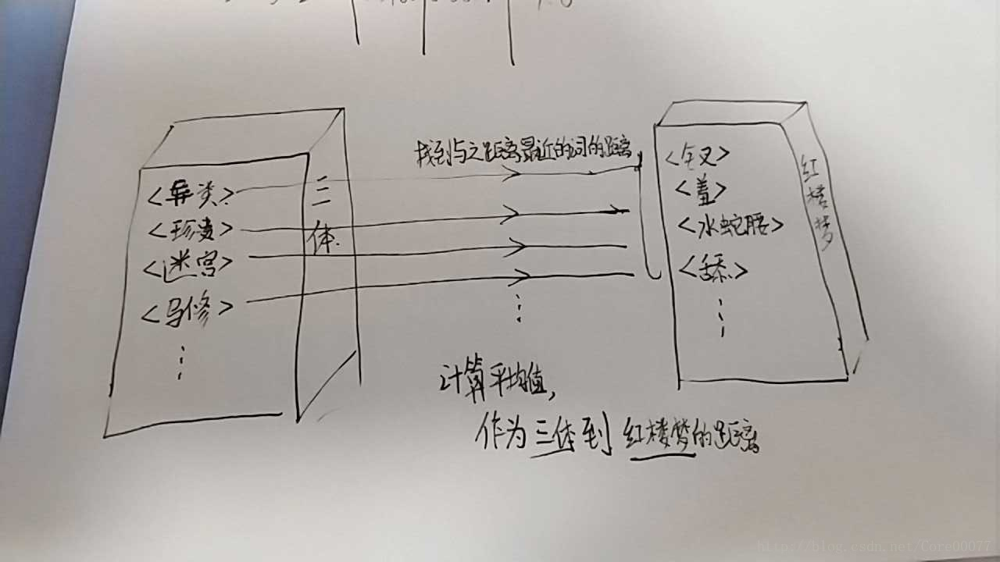

# 前言

书蕴笔记系列索引在这里：[书蕴——基于书评的人工智能推荐系统](http://blog.csdn.net/core00077/article/details/79184183)

前面说到了我们已经提取出每本书的标签集合了，那么现在的关键问题就是通过标签来进行书籍推荐了，这大概也是一个**阶段性重点**了，毕竟这个时间节点是直接见成效的时刻。这篇博客将以“计算书籍之间的距离”为主，先介绍思路，重点通过控制变量法调节各个参数，罗列出不同的效果，并确定效果最好的阈值。

# 思路
当我们已经拿到每本书的标签（tags[]）之后，剩下的就是去找tags列表里每一项之间的距离。
这里每一项都是[上一篇文章](http://blog.csdn.net/core00077/article/details/79242590)的思路下计算得到的标签集合

具体思路是：使用中文维基百科语料库训练出的word2vec模型作为泛集，在泛集中找到两本书标签之间的距离，使用平均值等不同方式计算书与书的距离。

<!-- more -->

## 泛集与中文维基百科
这里先谈一谈“泛集”的概念。我们把使用平时说话、正常语境下的语料库训练出的word2vec模型称为泛集，因为泛集“泛”的特点，它涵盖的内容更加贴近我们的生活，比如我们在生活中知道“男人之于女人正如男孩之于女孩”，我们知道，泛集也知道。所以把这些标签放在泛集中计算关联度更具有生活层面上意义，具体的做法可以见下图

>[题外话]我使用gensim的word2vec训练维基百科语料库的内容在 [[书蕴笔记-1]word2vec模型训练](http://blog.csdn.net/Core00077/article/details/79192252) 中有过提及，参考资料也不少,欢迎查看
### 结合例子


结合这张图比方说《三体》这本书有很多个标签，标签<异类>这个词和《红楼梦》这本书的众多标签都有距离，那么我们取最近的1个（或多个求平均）的距离，称之为“标签-书最近距离”，重复整个过程，然后《三体》的所有标签都有一个值，取平均值，这个平均值作为《三体》到《红楼梦》两本书直接的距离。

## 合理性
稍微解释下这样计算的合理性：

一开始我是计算《三体》中每个标签到《红楼梦》中所有标签的距离的平均值，因为一个标签到所有标签的距离的平均，不就该是这个标签到这本书的距离么？然而结果却不尽人意（后面结果部分会提及），当我测试到这本书到自己的距离的时候，竟然结果差强人意到只有0.058，这显然是不符合的。

为了表述清晰，这里把源书称作为书A，目标书称作为书B。书A的标签列表称作为A.tag，第一个标签为A.tag[0]，B也类似。

分析其实不难看出，关键就在A书的标签A.tag[0]到B.tag的所有标签而言，大部分的关联度本就是非常低的。假设A.tag[0]最近的那个标签是B.tag[x]，那这个距离我们假设是1（1是最近距离，即这个标签在B书中也存在），而A.tag[0]到其他标签的距离都比较远（这种情况很容易出现，比如在泛集中，三体中的标签<宇宙>和三体3中的标签<宇宙>距离很近，而和三体3的标签<马修>距离非常远——毕竟我们平时说起宇宙，没人会想到马修）那么A.tag[0]这B书的联系，就会被大量不相关的词语给“分摊”掉，从而得到一个非常低的结果。

所以我们改为取A.tag[0]到B.tag中最近标签的距离，即取A书到B书关联度最大的词的距离，再求平均。
这就是一个词到一本书的距离的计算，取这个词到一本书的所有词距离最近的那一个。

当然这样也是有缺陷的。毕竟一个词到一本书的距离不能只由这本书最近的一个标签来决定，至少应该取前几求平均。

## 流程

如果一本书有n个标签，那么计算这本书与其他书之间的距离分为两步：
1. 计算标签X到一群标签的距离
2. 反复步骤1，取这些距离的平均值。

所以不难看出重点在于第一步。

下面通过不同的维度的不同参数、使用控制变量法来对第一步进行实验。

## 源码
```python
from gensim.models import Word2Vec
import os


def extract_tag_set(model_name, new_word_set):
    word2vec_base = '书评\\word2vec\\model\\'
    model = Word2Vec.load(word2vec_base + model_name)  # type: Word2Vec
    word_set = set()  # 结果集
    # new_word_set = {"阿米尔"}  # 新词集
    temp_word_set = set()  # 关联词集
    for i in range(3):
        for word in new_word_set:
            top5 = model.wv.most_similar(word, topn=5)
            for l in top5:
                temp_word_set.add(l[0])
        word_set = temp_word_set | word_set
        new_word_set.clear()
        new_word_set = temp_word_set.copy()
        temp_word_set.clear()
        # print(word_set)
    return word_set


def calculate_distance(book_a, book_b):
    distances = set()
    for tag_a in book_a:
        avg_max_distance = 0
        loop_times = 3
        for temp in range(loop_times):  
            top_word = ""
            max_distance = 0
            top_word_set = set()
            for tag_b in book_b:
                if tag_b not in top_word_set:
                    try:
                        distance = wiki_model.wv.similarity(tag_a, tag_b)
                        if distance > max_distance:
                            max_distance = distance
                            top_word = tag_b
                    except KeyError:
                        continue
                # print(tag_a + " " + tag_b + " distance: " + str(distance))
            if max_distance != 0:
                top_word_set.add(top_word)
                avg_max_distance += max_distance
        avg_max_distance /= loop_times
        distances.add((tag_a, avg_max_distance))

    distance_sum = 0
    for distance in distances:
        distance_sum += distance[1]
    return distance_sum / len(distances)


if __name__ == '__main__':
    models = os.listdir("书评\\word2vec\\model\\")
    print("正在读取中文维基百科语料库word2vec模型…")
    wiki_model = Word2Vec.load(
        r"D:\zhwiki_model\word2vec_gensim")  # type: Word2Vec
    tags = list()
    for model in models:
        words = set()
        with open("书评\\word2vec\\vocabulary\\vocabulary_" + model,
                  "r", encoding="utf-8")as vocabulary:
            words.add(vocabulary.readline().split(" ")[0])
            words.add(vocabulary.readline().split(" ")[0])
            words.add(vocabulary.readline().split(" ")[0])
        # print(words)
        print("正在提取 %s 中的标签…" % model)
        tag = extract_tag_set(model, words)
        print("%s 中的标签为:" % model)
        print(tag)
        tags.append((model, tag))

    print("{0:{space}<10}".format("", space=chr(12288)), end='')
    for a in tags:
        print("{0:{space}<15}".format(a[0], space=chr(12288)), end='')
    print()
    for a in tags:
        print("{0:{space}<15}".format(a[0], space=chr(12288)), end='')
        for b in tags:
            # print("正在计算 %s 到 %s 的距离..." % (a[0], b[0]))
            # print("%s to %s 距离为 %f" % (
            #     a[0], b[0], calculate_distance(a[1], b[1])))
            print("%-20f" % calculate_distance(a[1], b[1]), end='')
        print()


```
稍微解释一下，其中extract_tag方法是上一篇提到的，不予赘述。

……好像也没什么好解释的。摆结果分析结果吧。
# 测试与结论
计算的样本是1000条评论，书籍分别是三体、三体3、红楼梦以及一个无关书籍追风筝的人

期望：
三体与三体3的距离较近，三体与红楼梦的距离较远

以提取标签环节的 取高频词冷启动、迭代深度、迭代广度以及 计算标签-书距离4个维度 使用**控制变量法** 来实验，总结出参数的影响，使用试错法调节出最佳参数。

## 关键参数表

**参考标准**

| 冷启动高频词前n | 迭代深度 | 迭代广度 | 标签-书距离         |
| --------------- | -------- | -------- | ------------------- |
| 3               | 3        | 5        | 取最大值前3的平均值 |

下列参数表均以参考标准表对照做比较

### 标签-书距离

| 编号 | 冷启动高频词前n | 迭代深度 | 迭代广度 | 标签-书距离         |
| ---- | --------------- | -------- | -------- | ------------------- |
| 1    | 3               | 3        | 5        | 取平均值            |
| 2    | 3               | 3        | 5        | 取最大值            |
| 3    | 3               | 3        | 5        | 取最大值前2的平均值 |
| 4    | 3               | 3        | 5        | 取最大值前5的平均值 |

### 高频词

| 编号 | 冷启动高频词前n | 迭代深度 | 迭代广度 | 标签-书距离         |
| ---- | --------------- | -------- | -------- | ------------------- |
| 1    | 1               | 3        | 5        | 取最大值前3的平均值 |
| 2    | 2               | 3        | 5        | 取最大值前3的平均值 |
| 3    | 5               | 3        | 5        | 取最大值前3的平均值 |

### 迭代深度

| 编号 | 冷启动高频词前n | 迭代深度 | 迭代广度 | 标签-书距离         |
| ---- | --------------- | -------- | -------- | ------------------- |
| 1    | 3               | 1        | 5        | 取最大值前3的平均值 |
| 2    | 3               | 2        | 5        | 取最大值前3的平均值 |
| 3    | 3               | 5        | 5        | 取最大值前3的平均值 |

### 迭代广度

| 编号 | 冷启动高频词前n | 迭代深度 | 迭代广度 | 标签-书距离         |
| ---- | --------------- | -------- | -------- | ------------------- |
| 1    | 3               | 3        | 1        | 取最大值前3的平均值 |
| 2    | 3               | 3        | 3        | 取最大值前3的平均值 |
| 3    | 3               | 3        | 7        | 取最大值前3的平均值 |

## 结果

~~先发出去吧，结果吃晚饭了跑~~

怠惰的我竟然又隔了一天才写……我背锅

强调一下，出于效率考虑，标签使用的是python的set数据结构，所以看起来输出的标签有所不同。实际上经测试，对同一本书而言，其余参数不变的情况下，标签是相同的。

结果根据上面的标准跑出各种结果如下：

**参考标准结果**
|冷启动高频词前n|迭代深度|迭代广度|标签-书距离|
|-|||
|3|3|5|取最大值前3的平均值|
```
正在读取中文维基百科语料库word2vec模型…
正在提取 model_seg_三体 中的标签…
model_seg_三体 中的标签为:
{'生死存亡', '挫败', '星人', '消除', '三者', '处境', '要义', '讽刺', '一瞬间', '忠诚', '顽强', '之中', '信徒', '第一次', '狂妄', '异常', '日子', '救赎', '相通', '说到底', '对此', '弱者', '困境', '集体', '中三体', '众生', '轻松', '开启', '本性', '代价', '注定', '无可', '光明', '外部', '行走', '演变', '统治', '揭开', '初衷', '和平共处', 'lt', '留恋', '或者说', '浮现', '了爱', '并未', '面纱', '跳出', '防卫', '慢', '忠实', '潜意识', '名', '逃避', '后半段', '从头到尾', '地方', '第一步', '款', '一遍', '伏笔', '刚刚', '派别', '好奇', '结尾', '起源', '截然不同', '稳藏', '挽救', '重复', '恶劣', '不算', '一员', '生态系统', '融合', '两本', '适宜', '异化', '路上', '试', '解脱', '蛮荒', '网游', '星期', '映射', '灭亡', '可谓', '一段时间', '美妙', '接触', '意志', '子孙', '处于', '争当', '终结', '初步', '降临到', '曙光', '逃过', '赤裸裸', '思绪', '更何况', '期盼', '三册', '一度', '主观', '艰难', '人类文明', '一幕', '外力', '张力', '精神领袖', '寻求', '隐隐约约', '前提', '一切都是', '产物', '探寻', '监督', '当做', '打开', '透露', '解答', '全局', '面前', '参透', '安全感', '淘汰', '推向', '第三本', '正义', '作出', '丧失', '关乎', '条件', '在精神上', '交代', '说起', '不利于', '守护者', '哭', '开端', '残忍', '慢慢', '改善', '开发', '暗示', '舒适', '一章', '终于', '不用说', '不可避免', '不禁', '覆灭', '一页', '书名', '奇异', '所有人', '现状', '变革', 'boss', '罪恶', 'high', '灿烂', '博弈', '招募', '厌恶', '引向', '尾', '出路', '插叙', '不值一提', '反抗', '世界末日', '介入', '住', '重如泰山', '守护', '未必', '知晓', '悟', '刷', '正式', 'gt', '对外', '最深', '共鸣', '登陆', '无关', '生死', '一口气', '一周', '萌芽', '第二本', '野蛮', '斗争', '灾难', '抑制', '稍微', '人权', '至极', '流浪', 'PS', '剿灭', '引子', '想着', '是否是', '珍贵', '困难', '堕落', '外来', '打算', '迫使', '融入', '宇宙空间', '详细', '2', '斥', '持续', '看待', '科学界', '后续', '相遇', '疑问', '状态', '移居', '短', '24.', '审视', '演化', '消亡', '引出', '民众', '一共', '相', '语', '愿望', '安德', '面对', '没想到', '几天', '分为', '终将', '里', '巧合', '悄然', '翻开', '4.', '怪物', '后果', '异类', '残酷', '揭晓', '搏杀', '悲惨', '寄希望于', '好奇心', '支配', '意识', '做法', '画卷', '推演', '拉开', '警方', '自相残杀', '审问者', '抱', '如饥似渴'}
正在提取 model_seg_三体Ⅲ 中的标签…
model_seg_三体Ⅲ 中的标签为:
{'生死存亡', '存亡', '庞大', '点睛之笔', '后记', '浩劫', '回顾', '数次', '领袖', '复杂性', '衰亡', '赶上', '气势', '媲美', '之中', '理由', '归还给', '赢得', '回应', '选择题', '旧', '简介', '功夫', '局面', '球', '狂妄', '深意', '忠于', '物竞天择', '愤怒', '怜悯', '救赎', '灭顶之灾', '直面', '当作', '新', '无垠', '超出', '弱者', '续集', '足以', '无能为力', '光亮', '催生出', '归宿', '中三体', '料到', '气势磅礴', '抵抗', '忽视', '举动', '刷新', '达成', '版本', '看不见', '和平共处', '总体', '至高无上', '拍成电影', '高潮迭起', '看成', '短视', '足够', '保卫战', '公斤', '回到', '渴望', '跳跃', '一款', '绝境', '战胜', '直至', '压力', '重生', '蝗虫', '刚刚', '初次', '尘埃', '倒计时', '繁衍', '挽救', '小儿科', '新生', '重启', '引来', '唏嘘', '还给', '微不足道', '无可救药', '求生', '奇迹', '抛弃', '瓜葛', '误读', '归于', '最为', '两本书', '灭亡', '防备', '接触', '已然', '五公斤', '一抹', '以求', '共同努力', '诞生', '高于', '想来', '初步', '希冀', '视为', '摆脱', '一二', '潘多拉', '远方', '权利', '领导者', '走到', '人类文明', '临时', '紧张', '失效', '寻求', '输给', '无边', '数量级', '预言', '一具', '热寂', '自取灭亡', '号召', '关乎', '完结', '亿万年', '归还', '死尸', '全宇宙', '送向', '意图', '冒失', '一页', '小事', '暗黑', '严锋', '诡谲', '俗套', '罪恶', '孕育', '不为过', '最让人', '轮回', '辛苦', '不复存在', '漂流瓶', '时刻', '定格', '反抗', '如果说', '恐慌', '证据', '疑点', '挣扎', '正式', '疏忽', '生死', '终点', '罪人', 'I', '消化', '鱼缸', '跨入', '看作', '众矢之的', '面临', '上看', '可知', '灾难', '死去', '平淡', '归零', '自大', '惊喜', '暗无天日', '浅', '应对', '超凡脱俗', '光锥', '跨', '序', '贴切', '大同', '已有', '后续', '生态', '一小', '启示', '浮云', '外形', '有害', '循环', '消亡', '贯穿', '惊讶', '怨恨', '显而易见', '数量', '招来', '长时间', '了前', '忘却', '盲目', '娓娓道来', '留在', '翻开', '这时候', '折磨', '沧海一粟', 'NB', '漫长', '灭绝', '临界值', '安利', '危难', '搏杀', '遭受', '寄希望于', '记录', '所处', '回归', '苟延残喘', '笼罩', '百年', '自信', '卑微', '定位', '自相残杀', '亿万', '抗争'}
正在提取 model_seg_红楼梦 中的标签…
model_seg_红楼梦 中的标签为:
{'终归', '后悔', '妨碍', '口里', '小性儿', '有没有', '闺阁', '说完', '书外', '儒林外史', '当初', '说道', '黛', '包容', '正册', '篇幅', '你好', '表白', '越发', '要紧', '矫情', '模仿', '出入', '由来', '邢岫烟', '生平', '不理', '抢', '心中', '不远', '列', '独独', '宝琴', '太多太多', '多行', '几十回', '那段', '册', '此话', '爱黛玉', '出彩', '可说', '穿插', '半天', '无处', '无可', '作诗', '婶子', '脸谱化', '没意思', '林姑娘', '册页', '图册', '不至', '并未', '差点', '中', '好好', '不信', '晚年', '貌似', '爱哭', '口气', '紫鹃', '第十三回', '成亲', '正面', '回去', '假寐', '留神', '无不', '这话', '回到', '绝妙', '暧昧', '真情', '隐晦', '象', '吃醋', '胡说', '聪明伶俐', '哭哭啼啼', '许', '坏', '问问', '一下子', '好歹', '尖酸刻薄', '学诗', '情敌', '听到', '臭男人', '着墨', '推', '周到', '吟诗', '联诗', '言语', '场面', '出口', '心目', '提示', '阿Q', '后期', '放心', '早知如此', '伴侣', '宝', '提醒', '咬', '心病', '猫', '多疑', '谜团', '体谅', '笔法', '着力', '一流', '细致', '站住', '晓得', '惋惜', '问道', '三次', '发现自己', '见到', '解答', '倒像', '混账', '十二支', '之口', '多早晚', '写到', '小气', '冤', '不明', '交代', '刻薄', '关切', '开端', '第二回', '生分', '第五回', '淋漓尽致', '瞧', '一名', '湘云', '第三十一回', '热闹', '醪曲', '大方', '围绕', '撒谎', '小性', '之时', '顺序', '听见', '奢华', '哭泣', '硬', '仅凭', '安慰', '亲密', '宝贝', '猜测', '黛玉', '要说', '虎狼', '雪雁', '取笑', '乱说', '可不是', '神秘', '在意', '通考', '仿佛', '怔', '难过', '后事', '一口气', '房中', '堵', '亲姐姐', '推之于', '打趣', '摔', '没人', '贴心', '十二钗', '玩笑话', '第三回', '极妙', '删掉', '褒贬', '厕所', '妹纸', '面貌', '回来', '真性情', '外', '玉宝钗', '反面', '留得', '曲笔', '感激', '走进', '小心眼', '计较', '不见得', '疑惑', '吵架', '提及', '冷笑', '心意', '心碎', '金锁', '细微', '曲折', '心爱', '好像', '说不出来', '和宝钗', '青梅竹马', '多处', '混帐', '颇为', '平空', '出场', '伤感', '哄', '走出', '里', '留在', '判曲', '寻觅', '懂事', '脑海中', '惜墨如金', '多半', '槛', '小人物', '心直口快', '夸', '俯拾皆是', '岔开', '和黛玉', '言情', '相爱', '敬重', '开心', '信息', '淘气', '剧中', '说错', '不该', '试探', '饱满', '说出', '宝钗', '传神', '谜', '柜', '点头'}
正在提取 model_seg_追风筝的人 中的标签…
model_seg_追风筝的人 中的标签为:
{'后记', '奴仆', '胜利', '参加', '哈桑', '风险', '佣人', '包容', '上书', '喉结', '冬日', '赢得', '米尔', '高手', '欺凌', '他家', '忠心', '人能', '捡', '一只', '无条件', '胜利者', '陪伴', '阿米尔', '荣耀', '翱翔', '忠实', '玩伴', '揍', '比赛', '那年', '人世', '无动于衷', '1975', '对手', '赢回', '领养', '理所当然', '放飞', '最出色', '亲生', '直视', '情同手足', '头发', '追到', '停止', '天空', '不肯', '奉献', '动摇', '但他却', '玻璃', '阿桑', '无怨无悔', '骗子', '抚养', '当做', '出头', '相仿', '冬天', '掠起', '宠爱', '飞翔', '亲人', '惨死', '伤', '奋力', '遇上', '隐忍', '天上', '手足', '长长的', '亲密', '坏孩子', '学会', '竟是', '灿烂', '侵犯', '亲', '弟弟', '亲密无间', '守护', '羞辱', '占有', '冠军', '命中注定', '线', '情同', '捍卫', '死去', '维护', '上前', '求', '追回', '深爱', '离去', '坠落', '一同', '斗', '毫无保留', '关爱', '合', '久久', '疼爱', '蠕动', '打败', '阿赛夫', '忠心耿耿', '挺身', '兼', '怨恨', '激怒', '至死', '塞尔', '服侍', '空中', '亲兄弟', '大赛', '伙伴', '无私', '飞', '吞咽', '落地', '哈森', '祝你好运', '掉落', '冷淡', '不顾', '爱和', '追', '逆来顺受', '割断', '好受'}
　　　　　　　　　　model_seg_三体　　　model_seg_三体Ⅲ　　model_seg_红楼梦　　model_seg_追风筝的人
model_seg_三体　　　0.641413            0.444835            0.384929            0.354435            
model_seg_三体Ⅲ　　0.451066            0.632567            0.373845            0.361493            
model_seg_红楼梦　　0.410419            0.398263            0.635157            0.369873            
model_seg_追风筝的人0.415998            0.421336            0.416097            0.647488            
```


## 标签-书距离
- 取平均值
```
正在读取中文维基百科语料库word2vec模型…
正在提取 model_seg_三体 中的标签…
model_seg_三体 中的标签为:
{'萌芽', '日子', '消除', '尾', '从头到尾', '当做', '前提', '众生', '一口气', '三册', '安德', '防卫', '适宜', '生死', '对外', '结尾', '巧合', '慢', '厌恶', '一页', '寻求', '罪恶', '监督', '终结', '异化', '信徒', '好奇', '探寻', '顽强', '后果', '消亡', '伏笔', '灭亡', '融入', '移居', '之中', '住', '演化', '至极', '持续', '引子', '稍微', '书名', '人类文明', '光明', '疑问', '自相残杀', '外部', '世界末日', '赤裸裸', '灾难', '丧失', '舒适', '逃避', '一度', '起源', '了爱', '地方', '愿望', '一遍', '2', '映射', '美妙', '一共', '意志', '星期', '打算', '现状', '怪物', '奇异', '后半段', '审问者', '想着', '反抗', '刷', '重如泰山', 'boss', '关乎', '未必', '网游', '斥', '刚刚', '初步', '外力', '拉开', '几天', '面纱', 'PS', '期盼', '登陆', '悄然', '星人', '4.', '搏杀', '和平共处', '中三体', '交代', '后续', '不值一提', '24.', '留恋', '思绪', '第二本', '说起', '详细', '三者', '或者说', '透露', '一切都是', '轻松', '蛮荒', '潜意识', '宇宙空间', '灿烂', '一幕', '解脱', '一章', '淘汰', '救赎', '相遇', '款', '两本', '分为', '接触', '条件', '本性', '跳出', '不算', '行走', '寄希望于', '改善', '一段时间', '短', '不利于', '引出', '代价', '哭', '面前', '困难', '挫败', '名', '招募', '争当', '不用说', '在精神上', '忠诚', '不禁', 'high', '无关', '知晓', '处于', '曙光', '流浪', '困境', '意识', '第一步', '作出', '介入', '终将', '试', '开端', '子孙', '统治', '抱', '演变', '揭晓', '第三本', '更何况', '看待', '守护者', '野蛮', '逃过', '对此', '并未', '重复', '斗争', '全局', '慢慢', '产物', '如饥似渴', '做法', '状态', '挽救', '解答', '生死存亡', '安全感', '正义', '打开', '审视', '悲惨', '狂妄', '共鸣', '异类', '不可避免', '张力', '一员', '暗示', '堕落', '引向', '残忍', '剿灭', '是否是', '迫使', '讽刺', '变革', '融合', '悟', '里', '博弈', '珍贵', '艰难', '浮现', '集体', '忠实', '一瞬间', '推向', '处境', '终于', 'gt', '可谓', '截然不同', '主观', '开启', '推演', '揭开', '面对', '降临到', '恶劣', '覆灭', '抑制', '守护', '残酷', '外来', '所有人', '第一次', '生态系统', '隐隐约约', '派别', '要义', '路上', '弱者', '插叙', '无可', '正式', '画卷', '科学界', '出路', '稳藏', '说到底', '最深', '参透', '注定', '没想到', '支配', '好奇心', '开发', '翻开', '语', '相', 'lt', '相通', '人权', '民众', '初衷', '异常', '一周', '精神领袖', '警方'}
正在提取 model_seg_三体Ⅲ 中的标签…
model_seg_三体Ⅲ 中的标签为:
{'完结', '以求', '后记', '倒计时', '灭顶之灾', '罪人', 'I', '局面', '所处', '亿万年', '忠于', '生死', '求生', '惊讶', '数量', '旧', '高潮迭起', '一二', '盲目', '一页', '领导者', '怨恨', '寻求', '罪恶', '孕育', '笼罩', '存亡', '诞生', '一具', '有害', '引来', '热寂', '防备', '一款', '消亡', '诡谲', '看成', '灭亡', '漂流瓶', '权利', '临时', '无垠', '之中', '刷新', '一小', '光亮', '人类文明', '自相残杀', '繁衍', '最为', '衰亡', '物竞天择', '定位', '自大', '微不足道', '光锥', '显而易见', '苟延残喘', '灾难', '奇迹', '贴切', '一抹', '当作', '点睛之笔', '抛弃', '失效', '初次', '无可救药', '长时间', '自信', '可知', '续集', '尘埃', '绝境', '自取灭亡', '拍成电影', '危难', '回归', '高于', '领袖', '已有', '反抗', '深意', '消化', '大同', '关乎', '简介', '浅', '浩劫', '初步', '刚刚', '应对', '辛苦', '轮回', '死尸', '数次', '疑点', '希冀', '搏杀', '和平共处', '足以', '中三体', '瓜葛', '忘却', '共同努力', '疏忽', '后续', '百年', '回应', '全宇宙', '看不见', '跳跃', '超凡脱俗', '想来', '意图', '看作', '记录', '不复存在', '忽视', '救赎', '接触', '寄希望于', '催生出', '跨', '重生', '赶上', '冒失', '惊喜', '走到', '归宿', '保卫战', '气势磅礴', '紧张', '遭受', '潘多拉', '鱼缸', '庞大', '预言', '送向', '娓娓道来', '误读', '公斤', '料到', '沧海一粟', '折磨', '输给', '怜悯', '平淡', '球', '理由', '版本', '足够', '摆脱', '已然', '最让人', '恐慌', '愤怒', '举动', '定格', '归还', '视为', '严锋', '功夫', '短视', '五公斤', '数量级', '气势', '浮云', '如果说', '灭绝', '挽救', '生态', '无边', '生死存亡', '亿万', '还给', '贯穿', '临界值', '号召', '死去', '归还给', '狂妄', '两本书', '卑微', '循环', '直至', '达成', '抵抗', '上看', '漫长', '抗争', '留在', '序', '暗无天日', '至高无上', '暗黑', '小事', '终点', '众矢之的', '挣扎', '启示', '小儿科', '证据', '归零', '无能为力', '归于', '回顾', '新', '渴望', '超出', '面临', '直面', '招来', '媲美', '赢得', '时刻', '重启', '选择题', '安利', '弱者', '新生', '正式', '不为过', 'NB', '唏嘘', '回到', '总体', '跨入', '蝗虫', '压力', '远方', '翻开', '战胜', '复杂性', '这时候', '了前', '外形', '俗套'}
正在提取 model_seg_红楼梦 中的标签…
model_seg_红楼梦 中的标签为:
{'反面', '体谅', '后悔', '寻觅', '柜', '宝贝', '面貌', '一名', '胡说', '一口气', '多早晚', '由来', '站住', '虎狼', '岔开', '妨碍', '真情', '作诗', '几十回', '小心眼', '早知如此', '传神', '不见得', '阿Q', '模仿', '放心', '绝妙', '终归', '不该', '俯拾皆是', '醪曲', '仿佛', '中', '象', '周到', '冷笑', '说错', '走出', '难过', '吃醋', '回来', '情敌', '吵架', '堵', '书外', '推', '生平', '留神', '在意', '林姑娘', '曲折', '槛', '伤感', '差点', '心病', '提及', '那段', '多处', '发现自己', '留得', '篇幅', '信息', '半天', '惜墨如金', '儒林外史', '谜团', '小性', '判曲', '后事', '十二支', '推之于', '你好', '紫鹃', '臭男人', '谜', '没意思', '坏', '心碎', '貌似', '玉宝钗', '饱满', '多疑', '和黛玉', '曲笔', '撒谎', '之口', '抢', '说完', '混账', '好像', '十二钗', '惋惜', '心爱', '交代', '多半', '写到', '亲密', '言情', '闺阁', '咬', '宝', '相爱', '吟诗', '仅凭', '联诗', '试探', '褒贬', '一下子', '剧中', '黛', '言语', '雪雁', '问道', '围绕', '见到', '可不是', '问问', '不理', '当初', '通考', '敬重', '听到', '正面', '极妙', '场面', '哄', '第三回', '哭哭啼啼', '真性情', '三次', '宝琴', '册页', '越发', '着力', '爱黛玉', '奢华', '晓得', '细致', '尖酸刻薄', '关切', '猜测', '金锁', '和宝钗', '删掉', '黛玉', '开心', '淋漓尽致', '隐晦', '此话', '晚年', '成亲', '婶子', '册', '平空', '这话', '心意', '开端', '出场', '说不出来', '有没有', '包容', '出口', '小人物', '图册', '聪明伶俐', '着墨', '猫', '刻薄', '贴心', '出入', '并未', '后期', '邢岫烟', '疑惑', '小气', '不信', '房中', '口气', '神秘', '矫情', '不至', '摔', '解答', '学诗', '不明', '笔法', '外', '假寐', '好歹', '计较', '脑海中', '倒像', '感激', '硬', '宝钗', '爱哭', '顺序', '打趣', '一流', '安慰', '回去', '无不', '提醒', '留在', '热闹', '不远', '生分', '混帐', '淘气', '里', '许', '走进', '玩笑话', '没人', '好好', '夸', '列', '提示', '独独', '多行', '懂事', '出彩', '穿插', '第十三回', '颇为', '可说', '哭泣', '说道', '妹纸', '取笑', '怔', '脸谱化', '小性儿', '点头', '乱说', '心直口快', '青梅竹马', '第二回', '冤', '无可', '心目', '第三十一回', '说出', '回到', '之时', '伴侣', '正册', '要紧', '表白', '心中', '瞧', '第五回', '无处', '暧昧', '要说', '太多太多', '厕所', '听见', '大方', '细微', '口里', '亲姐姐', '湘云'}
正在提取 model_seg_追风筝的人 中的标签…
model_seg_追风筝的人 中的标签为:
{'伙伴', '坠落', '离去', '后记', '亲兄弟', '当做', '掠起', '弟弟', '无条件', '参加', '怨恨', '骗子', '久久', '追', '捍卫', '亲人', '理所当然', '亲生', '追到', '飞翔', '相仿', '天上', '他家', '斗', '玻璃', '荣耀', '情同手足', '激怒', '冠军', '毫无保留', '哈森', '奋力', '出头', '阿桑', '服侍', '长长的', '赢回', '冬天', '人世', '亲密无间', '情同', '好受', '无私', '蠕动', '无动于衷', '米尔', '飞', '捡', '那年', '亲密', '比赛', '欺凌', '逆来顺受', '吞咽', '冷淡', '灿烂', '天空', '抚养', '陪伴', '祝你好运', '兼', '人能', '胜利者', '掉落', '至死', '忠心耿耿', '忠心', '坏孩子', '挺身', '深爱', '上前', '塞尔', '领养', '线', '学会', '羞辱', '最出色', '揍', '空中', '包容', '阿赛夫', '直视', '宠爱', '对手', '无怨无悔', '关爱', '哈桑', '惨死', '手足', '不顾', '一只', '爱和', '喉结', '死去', '隐忍', '占有', '胜利', '风险', '大赛', '一同', '佣人', '不肯', '疼爱', '上书', '合', '伤', '忠实', '打败', '奉献', '维护', '竟是', '阿米尔', '动摇', '停止', '守护', '落地', '追回', '高手', '冬日', '玩伴', '放飞', '赢得', '遇上', '奴仆', '亲', '头发', '割断', '翱翔', '求', '侵犯', '命中注定', '但他却', '1975'}
　　　　　　　　　　model_seg_三体　　　model_seg_三体Ⅲ　　model_seg_红楼梦　　model_seg_追风筝的人
model_seg_三体　　　0.088230            0.079731            0.074904            0.068008            
model_seg_三体Ⅲ　　0.079731            0.079169            0.071153            0.067319            
model_seg_红楼梦　　0.074904            0.071153            0.151354            0.103012            
model_seg_追风筝的人0.068008            0.067319            0.103012            0.121055 
```
- 取最大值
```python
正在读取中文维基百科语料库word2vec模型…
正在提取 model_seg_三体 中的标签…
model_seg_三体 中的标签为:
{'对外', '忠实', '一度', '共鸣', 'gt', '巧合', '打算', '解脱', '想着', '一员', '悲惨', '逃过', '拉开', '星人', '和平共处', '生死', '审视', '挫败', '信徒', '留恋', '潜意识', '覆灭', '派别', '曙光', '人权', '罪恶', '变革', '详细', '状态', '4.', '引子', '不值一提', '异常', '科学界', '疑问', '所有人', '好奇心', '一幕', '引向', '三册', '赤裸裸', '愿望', '出路', '灿烂', '说起', '外部', '作出', '顽强', '对此', '悄然', '不可避免', '挽救', '适宜', '2', '映射', '博弈', '未必', '子孙', '之中', '注定', '不利于', '跳出', '无可', '第一次', '最深', '争当', '一章', '搏杀', '说到底', '救赎', '期盼', '两本', '揭晓', '不算', '光明', '讽刺', '演化', '要义', '相通', '张力', '不用说', '揭开', '开启', '当做', '灭亡', '哭', '众生', '世界末日', '暗示', '一遍', '好奇', '书名', '三者', '外来', '参透', '厌恶', '第一步', '狂妄', '异化', '第三本', '面纱', '插叙', '舒适', '更何况', '一页', '登陆', '轻松', '演变', '困境', '现状', '后半段', '防卫', '初衷', '残忍', '迫使', '统治', '生态系统', '终于', '意识', '正式', '语', '开发', '解答', '消亡', '后续', '民众', '人类文明', '反抗', '野蛮', '精神领袖', '结尾', '透露', '集体', '前提', '思绪', '招募', '丧失', '相', '尾', '意志', '监督', '守护', '改善', '融合', '里', '星期', '慢', '一共', '恶劣', '网游', '后果', '奇异', '打开', '开端', '路上', '24.', '伏笔', '融入', '探寻', '困难', '斥', '本性', '刷', '持续', '宇宙空间', '知晓', '产物', '灾难', '交代', '淘汰', '推演', '或者说', '残酷', '款', '推向', '全局', 'high', '萌芽', '安全感', '异类', '住', '做法', '代价', '不禁', '面前', '第二本', '面对', '艰难', '刚刚', '起源', '关乎', '自相残杀', '珍贵', '试', '画卷', 'PS', '斗争', '浮现', '弱者', '可谓', '守护者', '堕落', '警方', '审问者', '中三体', '翻开', '忠诚', '如饥似渴', '稳藏', '支配', '短', '了爱', '无关', '引出', '抑制', '重如泰山', '从头到尾', 'lt', '几天', '名', '初步', '地方', '隐隐约约', '流浪', '并未', '安德', '生死存亡', '逃避', '没想到', '介入', '接触', '是否是', '看待', '悟', '行走', '条件', '日子', '蛮荒', '正义', '相遇', '主观', '怪物', '在精神上', '终将', '重复', '抱', '处于', 'boss', '移居', '一段时间', '至极', '稍微', '终结', '处境', '一口气', '寄希望于', '降临到', '美妙', '一瞬间', '慢慢', '一周', '寻求', '剿灭', '外力', '消除', '一切都是', '分为', '截然不同'}
正在提取 model_seg_三体Ⅲ 中的标签…
model_seg_三体Ⅲ 中的标签为:
{'一具', '看成', '领袖', '已有', '浮云', '生死', '终点', '以求', '初步', '预言', '序', '和平共处', '衰亡', '回到', '点睛之笔', '回归', '罪恶', '初次', '功夫', '跨入', '贯穿', '求生', '外形', '理由', '平淡', '一小', '大同', '压力', '五公斤', '疏忽', '定位', '长时间', '最让人', '罪人', '热寂', '归于', '这时候', '挽救', '浅', '惊讶', '存亡', '号召', '回应', '全宇宙', '物竞天择', '愤怒', '之中', '小儿科', '灭绝', '复杂性', '不为过', '希冀', '搏杀', '救赎', '灭顶之灾', '无能为力', '漂流瓶', '总体', '了前', '轮回', '紧张', '归宿', '死去', '唏嘘', '归零', '严锋', '无可救药', '气势', '灭亡', '新', '一款', '回顾', '媲美', '赶上', '局面', '重生', '短视', '盲目', '狂妄', '归还', '超凡脱俗', '版本', '循环', '怨恨', '一页', '无边', '意图', '如果说', '证据', '走到', '疑点', '赢得', '所处', '绝境', '气势磅礴', '直至', '自取灭亡', '瓜葛', '辛苦', '安利', '生态', '怜悯', '正式', '光亮', '苟延残喘', '拍成电影', '足够', '消亡', '上看', '倒计时', '高于', '招来', '料到', '一抹', '忘却', '后续', '看作', '归还给', '暗黑', '人类文明', '反抗', '超出', '亿万年', '失效', '远方', '误读', '当作', '消化', '有害', '惊喜', '娓娓道来', '暗无天日', '抗争', '送向', '足以', '死尸', '百年', '时刻', '自信', '恐慌', '鱼缸', '直面', '贴切', '小事', '折磨', 'I', '繁衍', '续集', '战胜', '公斤', '选择题', '刷新', '蝗虫', '临时', '防备', '灾难', '想来', '忠于', '留在', '至高无上', '光锥', '自大', '最为', '球', '数量级', '保卫战', '奇迹', '应对', '临界值', '数次', '记录', '忽视', '亿万', '启示', '刚刚', '关乎', '自相残杀', '达成', '还给', '催生出', '可知', '新生', '弱者', '无垠', '重启', '已然', '中三体', '跨', '挣扎', '一二', '危难', '翻开', '诞生', '尘埃', '权利', '诡谲', '沧海一粟', '抛弃', '后记', '笼罩', '生死存亡', '看不见', '定格', '面临', '接触', '卑微', '孕育', '微不足道', 'NB', '领导者', '摆脱', '漫长', '高潮迭起', '庞大', '跳跃', '数量', '俗套', '渴望', '抵抗', '共同努力', '完结', '众矢之的', '遭受', '输给', '不复存在', '视为', '寄希望于', '冒失', '引来', '深意', '浩劫', '简介', '举动', '潘多拉', '两本书', '寻求', '显而易见', '旧'}
正在提取 model_seg_红楼梦 中的标签…
model_seg_红楼梦 中的标签为:
{'黛', '心碎', '后悔', '象', '不信', '好好', '篇幅', '回到', '外', '包容', '提示', '婶子', '取笑', '夸', '剧中', '提醒', '隐晦', '寻觅', '言情', '吟诗', '情敌', '出场', '吵架', '提及', '穿插', '周到', '和宝钗', '一下子', '说错', '回去', '绝妙', '槛', '出口', '正册', '三次', '场面', '爱黛玉', '咬', '问问', '冷笑', '惜墨如金', '推', '无可', '醪曲', '宝贝', '生分', '小人物', '不理', '倒像', '多疑', '宝', '岔开', '脸谱化', '口气', '金锁', '第二回', '着墨', '小性', '矫情', '第十三回', '打趣', '留神', '模仿', '林姑娘', '几十回', '后事', '惋惜', '胡说', '阿Q', '冤', '顺序', '可不是', '臭男人', '房中', '册', '终归', '体谅', '心病', '多早晚', '玩笑话', '真性情', '生平', '你好', '暧昧', '有没有', '站住', '紫鹃', '作诗', '厕所', '此话', '猫', '哭哭啼啼', '敬重', '宝钗', '仅凭', '由来', '撒谎', '联诗', '难过', '计较', '中', '伤感', '瞧', '太多太多', '解答', '柜', '颇为', '心爱', '多半', '淘气', '放心', '小心眼', '聪明伶俐', '妹纸', '那段', '神秘', '心意', '刻薄', '堵', '点头', '不该', '说完', '感激', '乱说', '可说', '懂事', '发现自己', '之口', '真情', '听见', '听到', '晓得', '谜', '问道', '多处', '小气', '说道', '走进', '好像', '图册', '正面', '极妙', '宝琴', '围绕', '里', '一名', '尖酸刻薄', '表白', '走出', '怔', '细致', '无处', '平空', '爱哭', '黛玉', '儒林外史', '亲密', '貌似', '混账', '书外', '开端', '奢华', '细微', '热闹', '第三回', '出彩', '妨碍', '谜团', '信息', '说出', '差点', '和黛玉', '交代', '疑惑', '大方', '说不出来', '留在', '哄', '仿佛', '吃醋', '当初', '无不', '独独', '曲笔', '列', '贴心', '脑海中', '哭泣', '假寐', '相爱', '不明', '反面', '虎狼', '十二支', '晚年', '心目', '第三十一回', '好歹', '玉宝钗', '抢', '传神', '试探', '摔', '开心', '判曲', '早知如此', '饱满', '安慰', '没人', '半天', '在意', '并未', '通考', '不至', '多行', '要紧', '湘云', '心中', '青梅竹马', '伴侣', '出入', '关切', '闺阁', '写到', '俯拾皆是', '面貌', '第五回', '学诗', '褒贬', '册页', '口里', '后期', '这话', '要说', '坏', '曲折', '淋漓尽致', '越发', '删掉', '十二钗', '见到', '一流', '不远', '不见得', '回来', '硬', '留得', '着力', '一口气', '言语', '之时', '猜测', '邢岫烟', '推之于', '许', '心直口快', '小性儿', '成亲', '没意思', '笔法', '雪雁', '混帐', '亲姐姐'}
正在提取 model_seg_追风筝的人 中的标签…
model_seg_追风筝的人 中的标签为:
{'一同', '忠实', '停止', '参加', '维护', '坏孩子', '包容', '命中注定', '欺凌', '无怨无悔', '逆来顺受', '他家', '坠落', '占有', '冬日', '天空', '米尔', '惨死', '空中', '冠军', '灿烂', '那年', '至死', '冬天', '1975', '天上', '手足', '亲', '玩伴', '捡', '头发', '伙伴', '死去', '当做', '哈森', '无动于衷', '捍卫', '揍', '落地', '飞翔', '亲生', '离去', '上书', '毫无保留', '怨恨', '赢得', '学会', '翱翔', '出头', '追回', '一只', '羞辱', '最出色', '阿桑', '亲人', '长长的', '喉结', '久久', '亲密无间', '阿赛夫', '胜利', '荣耀', '不肯', '玻璃', '亲兄弟', '服侍', '无私', '侵犯', '人世', '深爱', '上前', '合', '关爱', '遇上', '守护', '激怒', '追', '伤', '兼', '动摇', '掉落', '赢回', '亲密', '蠕动', '冷淡', '塞尔', '吞咽', '斗', '领养', '挺身', '比赛', '掠起', '情同手足', '情同', '不顾', '风险', '奉献', '阿米尔', '相仿', '理所当然', '追到', '人能', '放飞', '疼爱', '但他却', '好受', '飞', '骗子', '大赛', '后记', '奋力', '佣人', '竟是', '线', '隐忍', '祝你好运', '直视', '忠心', '抚养', '奴仆', '无条件', '高手', '爱和', '割断', '打败', '胜利者', '弟弟', '陪伴', '求', '对手', '忠心耿耿', '宠爱', '哈桑'}
　　　　　　　　　　model_seg_三体　　　model_seg_三体Ⅲ　　model_seg_红楼梦　　model_seg_追风筝的人
model_seg_三体　　　1.000000            0.523683            0.438873            0.410665            
model_seg_三体Ⅲ　　0.539988            1.000000            0.421056            0.426219            
model_seg_红楼梦　　0.484921            0.464930            1.000000            0.435706            
model_seg_追风筝的人0.475934            0.478586            0.466497            1.000000  
```
- 取最大值前2的平均值
```
正在读取中文维基百科语料库word2vec模型…
正在提取 model_seg_三体 中的标签…
model_seg_三体 中的标签为:
{'开发', '终于', '是否是', '抱', '一共', '星期', '没想到', '24.', '轻松', '第一步', '众生', '意识', '融入', '一段时间', '人类文明', '前提', '探寻', '无关', '代价', '统治', '隐隐约约', '名', '重如泰山', '不值一提', '逃过', '一幕', '寄希望于', '搏杀', '派别', '住', '面对', '挫败', '招募', '顽强', '在精神上', '忠诚', '移居', '主观', 'high', '外部', '无可', '持续', '弱者', '里', '一切都是', '灿烂', '子孙', '语', '试', '集体', '交代', '演化', '后续', '伏笔', '思绪', '不可避免', '斥', '自相残杀', '斗争', '透露', '一周', '处境', '日子', '困难', '未必', '演变', '书名', '更何况', '推演', '美妙', '接触', '后果', '科学界', '和平共处', '登陆', '信徒', '翻开', '悟', '开启', '关乎', '光明', '全局', '稍微', '意志', '后半段', '恶劣', '好奇', '灭亡', '迫使', '灾难', '三册', '慢慢', '精神领袖', '适宜', '注定', '相通', '寻求', '打算', '稳藏', '忠实', '之中', '揭晓', '一页', '处于', '不算', '留恋', '曙光', '引向', '如饥似渴', '奇异', '愿望', '刚刚', '地方', '行走', '人权', '残忍', '几天', '说起', '对外', '起源', '珍贵', '防卫', '审问者', '外来', '网游', '产物', '生态系统', '引子', '安全感', '正义', '好奇心', '浮现', '狂妄', '抑制', '款', '或者说', '一度', '刷', '消亡', '相', '知晓', '并未', '解答', '赤裸裸', '拉开', '要义', '不禁', '详细', '揭开', '终结', '支配', '共鸣', '变革', '宇宙空间', '一口气', '慢', '守护', '尾', '打开', 'lt', '中三体', '融合', '插叙', '说到底', '至极', '蛮荒', '初步', '安德', '改善', '丧失', '可谓', '一章', '不用说', '面前', '覆灭', '逃避', '讽刺', '相遇', '第三本', '一瞬间', '正式', '潜意识', '终将', '挽救', '分为', '现状', '开端', '疑问', '重复', '介入', '审视', '路上', '画卷', '想着', '剿灭', '三者', '舒适', '第一次', '消除', '出路', '所有人', '民众', '外力', '一员', '警方', '异类', '星人', '困境', '期盼', '结尾', '2', '截然不同', '厌恶', '野蛮', '哭', '罪恶', '看待', '条件', '异常', '萌芽', '短', '引出', '堕落', '悲惨', '监督', '第二本', '跳出', '巧合', '对此', '不利于', 'PS', '解脱', '怪物', '作出', '做法', '了爱', '悄然', '当做', '状态', '推向', '参透', '反抗', '4.', '张力', '本性', '守护者', '最深', '生死存亡', '面纱', '博弈', '映射', '淘汰', '流浪', '初衷', '暗示', '一遍', '残酷', '生死', '争当', '异化', 'gt', 'boss', '艰难', '两本', '救赎', '世界末日', '从头到尾', '降临到'}
正在提取 model_seg_三体Ⅲ 中的标签…
model_seg_三体Ⅲ 中的标签为:
{'归宿', '生态', '看作', '卑微', '蝗虫', '繁衍', '消化', '料到', '后记', '无能为力', '抛弃', '一款', '如果说', '外形', '存亡', '衰亡', '引来', '自大', '达成', '死去', '人类文明', '超出', '想来', '简介', '高潮迭起', '初次', '气势', '危难', '版本', '希冀', '已有', '无边', '不为过', '归零', '寄希望于', '搏杀', '唏嘘', '定格', '渴望', '怜悯', '超凡脱俗', '战胜', '弱者', '应对', '最让人', '气势磅礴', '小事', '后续', '一小', '娓娓道来', '这时候', '自相残杀', '怨恨', '显而易见', '旧', '重生', '深意', '苟延残喘', '平淡', '序', '直面', '临时', '领导者', '刷新', '定位', '接触', '还给', '光锥', '热寂', '和平共处', '看成', '翻开', '死尸', '远方', '折磨', '高于', '防备', '浮云', '紧张', '关乎', '复杂性', '点睛之笔', '回归', '疑点', '俗套', '长时间', '亿万', '灭亡', '灭绝', '自信', '百年', '灾难', '回到', '直至', '寻求', '权利', '鱼缸', '启示', '求生', '之中', '一页', '疏忽', '一抹', '记录', '误读', '招来', '了前', '一具', '挣扎', '刚刚', '漂流瓶', '一二', '归于', '归还给', '赢得', '足够', '球', '局面', '归还', 'NB', '终点', '潘多拉', '总体', '狂妄', '抵抗', '众矢之的', '功夫', '庞大', '意图', '举动', '消亡', '当作', '两本书', '已然', '严锋', '笼罩', '共同努力', '催生出', '沧海一粟', '续集', '失效', '惊讶', '领袖', '恐慌', '中三体', '新', '初步', '选择题', '贯穿', '忽视', 'I', '以求', '看不见', '奇迹', '正式', '孕育', '视为', '漫长', '媲美', '挽救', '自取灭亡', '留在', '保卫战', '临界值', '诞生', '诡谲', '回顾', '摆脱', '循环', '盲目', '理由', '跨入', '浩劫', '倒计时', '小儿科', '忘却', '数量级', '微不足道', '遭受', '输给', '亿万年', '公斤', '短视', '数量', '赶上', '预言', '罪人', '证据', '尘埃', '绝境', '不复存在', '可知', '罪恶', '暗无天日', '全宇宙', '足以', '五公斤', '所处', '新生', '有害', '惊喜', '安利', '时刻', '号召', '辛苦', '灭顶之灾', '暗黑', '冒失', '跨', '光亮', '完结', '走到', '数次', '无可救药', '愤怒', '无垠', '浅', '物竞天择', '回应', '忠于', '反抗', '跳跃', '拍成电影', '重启', '生死存亡', '面临', '贴切', '送向', '轮回', '生死', '瓜葛', '至高无上', '上看', '压力', '救赎', '抗争', '大同', '最为'}
正在提取 model_seg_红楼梦 中的标签…
model_seg_红楼梦 中的标签为:
{'当初', '岔开', '咬', '婶子', '听见', '暧昧', '不该', '心碎', '出入', '心目', '玉宝钗', '见到', '着力', '虎狼', '宝', '情敌', '哄', '疑惑', '哭哭啼啼', '谜团', '真情', '伴侣', '回来', '冤', '宝钗', '没人', '乱说', '俯拾皆是', '宝琴', '没意思', '小人物', '第三十一回', '篇幅', '许', '脸谱化', '细微', '口里', '正册', '细致', '妨碍', '无可', '贴心', '里', '仅凭', '绝妙', '围绕', '提及', '中', '多半', '混账', '包容', '面貌', '册页', '这话', '提示', '柜', '交代', '爱黛玉', '硬', '判曲', '此话', '开心', '猫', '仿佛', '取笑', '回去', '相爱', '奢华', '言情', '传神', '貌似', '厕所', '安慰', '不远', '后悔', '终归', '感激', '图册', '打趣', '坏', '曲折', '心意', '删掉', '宝贝', '问问', '要说', '走进', '作诗', '好像', '怔', '不信', '留神', '差点', '象', '回到', '极妙', '顺序', '学诗', '十二支', '哭泣', '场面', '要紧', '第二回', '伤感', '不明', '和黛玉', '生分', '越发', '难过', '亲密', '着墨', '放心', '热闹', '雪雁', '尖酸刻薄', '多行', '心病', '冷笑', '紫鹃', '十二钗', '懂事', '好歹', '笔法', '妹纸', '槛', '吟诗', '胡说', '出口', '敬重', '多早晚', '说错', '有没有', '说出', '小性', '一流', '关切', '假寐', '表白', '可不是', '猜测', '褒贬', '颇为', '口气', '那段', '无不', '湘云', '并未', '堵', '穿插', '推之于', '玩笑话', '书外', '解答', '外', '好好', '一口气', '周到', '点头', '亲姐姐', '第十三回', '混帐', '淘气', '夸', '醪曲', '在意', '闺阁', '出彩', '吃醋', '太多太多', '体谅', '提醒', '多疑', '淋漓尽致', '摔', '联诗', '隐晦', '刻薄', '之口', '留在', '黛玉', '由来', '册', '晚年', '开端', '可说', '青梅竹马', '三次', '听到', '半天', '心爱', '房中', '独独', '说完', '瞧', '正面', '试探', '阿Q', '你好', '列', '成亲', '信息', '黛', '走出', '谜', '爱哭', '大方', '惜墨如金', '问道', '模仿', '推', '留得', '说不出来', '不至', '无处', '不理', '第五回', '邢岫烟', '站住', '心中', '生平', '抢', '发现自己', '心直口快', '脑海中', '早知如此', '寻觅', '矫情', '真性情', '说道', '曲笔', '一名', '晓得', '聪明伶俐', '吵架', '一下子', '剧中', '臭男人', '计较', '儒林外史', '林姑娘', '神秘', '之时', '倒像', '小心眼', '撒谎', '后事', '反面', '饱满', '小气', '第三回', '出场', '后期', '和宝钗', '平空', '通考', '言语', '写到', '不见得', '金锁', '惋惜', '小性儿', '几十回', '多处'}
正在提取 model_seg_追风筝的人 中的标签…
model_seg_追风筝的人 中的标签为:
{'后记', '冷淡', '不肯', '侵犯', '对手', '死去', '米尔', '哈森', '塞尔', '飞', '停止', '弟弟', '落地', '亲人', '相仿', '求', '占有', '但他却', '斗', '佣人', '毫无保留', '忠心耿耿', '参加', '揍', '灿烂', '荣耀', '包容', '放飞', '玻璃', '一只', '怨恨', '天空', '追', '学会', '维护', '无条件', '不顾', '命中注定', '隐忍', '那年', '上前', '伙伴', '动摇', '竟是', '他家', '兼', '大赛', '忠实', '好受', '情同手足', '理所当然', '亲密无间', '线', '冬天', '亲', '坏孩子', '亲密', '赢得', '赢回', '坠落', '忠心', '领养', '爱和', '深爱', '人能', '疼爱', '天上', '陪伴', '捍卫', '逆来顺受', '合', '比赛', '阿桑', '无动于衷', '羞辱', '挺身', '守护', '空中', '高手', '吞咽', '追到', '抚养', '亲生', '冠军', '亲兄弟', '胜利', '捡', '上书', '割断', '打败', '欺凌', '激怒', '掉落', '祝你好运', '关爱', '骗子', '情同', '喉结', '人世', '掠起', '无怨无悔', '阿赛夫', '至死', '长长的', '头发', '离去', '冬日', '手足', '服侍', '无私', '奉献', '一同', '奴仆', '翱翔', '宠爱', '伤', '风险', '当做', '蠕动', '飞翔', '1975', '久久', '直视', '胜利者', '哈桑', '出头', '阿米尔', '惨死', '最出色', '玩伴', '奋力', '遇上', '追回'}
　　　　　　　　　　model_seg_三体　　　model_seg_三体Ⅲ　　model_seg_红楼梦　　model_seg_追风筝的人
model_seg_三体　　　0.743172            0.470818            0.404420            0.374538            
model_seg_三体Ⅲ　　0.478740            0.737983            0.391034            0.383682            
model_seg_红楼梦　　0.428832            0.413694            0.723097            0.385464            
model_seg_追风筝的人0.436529            0.441304            0.433411            0.747859  
```
- 取最大值前5的平均值
```
正在读取中文维基百科语料库word2vec模型…
正在提取 model_seg_三体 中的标签…
model_seg_三体 中的标签为:
{'隐隐约约', '警方', '一章', '变革', '路上', '翻开', '怪物', '曙光', '堕落', '行走', '巧合', '疑问', '外力', '剿灭', '改善', '详细', '产物', '世界末日', '期盼', '支配', '分为', '未必', '反抗', '意识', '一员', '子孙', '灭亡', '刷', '灾难', '众生', '轻松', '守护', '人类文明', '或者说', '书名', '本性', '没想到', '尾', '状态', '要义', '悄然', '安德', '抱', '守护者', '斥', '短', '不算', '争当', '招募', '重如泰山', '精神领袖', '结尾', '当做', '恶劣', '救赎', '困难', '外来', '里', '派别', '一度', '一幕', '逃避', '刚刚', '映射', '第一步', '一遍', '想着', 'boss', '潜意识', 'lt', '一页', '作出', '淘汰', '融入', '愿望', '星人', '几天', '抑制', '中三体', '不可避免', '后续', '第三本', '思绪', '斗争', '揭开', '罪恶', '忠实', '艰难', '对此', '是否是', '后半段', '美妙', '解脱', '暗示', '对外', '在精神上', '残忍', '移居', '不利于', 'gt', '引子', '挽救', '条件', '好奇', '从头到尾', '弱者', '开端', '所有人', '引向', '生死存亡', '插叙', '打算', '如饥似渴', '第二本', '相', '伏笔', '和平共处', '流浪', '开发', '哭', '之中', '登陆', '审视', '终于', '一切都是', '名', '不值一提', '两本', '好奇心', '起源', '覆灭', '相通', '面纱', '寻求', '探寻', '主观', '24.', '异化', '一周', '顽强', '跳出', '终将', '集体', '初步', '语', '融合', '舒适', '珍贵', '一口气', '人权', '萌芽', '演变', '生态系统', '推向', '面前', '一共', '正式', '灿烂', '截然不同', '更何况', '消除', '生死', '困境', '前提', '降临到', '网游', '共鸣', '全局', '知晓', '第一次', '一段时间', '地方', '统治', '说起', '丧失', '注定', '审问者', '不用说', '看待', '2', '民众', '揭晓', '星期', '挫败', '适宜', '留恋', '正义', '面对', '慢', '安全感', '介入', '宇宙空间', '持续', '处境', '说到底', '最深', '代价', '交代', '自相残杀', '无关', '外部', '处于', '初衷', '引出', '后果', '厌恶', '浮现', '接触', '狂妄', '奇异', '张力', '三册', '迫使', '相遇', '可谓', '推演', '无可', '重复', '4.', '野蛮', '博弈', '三者', '光明', '监督', '一瞬间', '关乎', '试', '稳藏', '稍微', '画卷', '演化', '参透', '打开', '透露', '开启', '异类', '搏杀', '讽刺', '了爱', '悲惨', 'high', '逃过', '住', '现状', '不禁', '日子', '意志', 'PS', '忠诚', '科学界', '防卫', '并未', '悟', '至极', '解答', '消亡', '慢慢', '异常', '蛮荒', '信徒', '款', '终结', '做法', '寄希望于', '赤裸裸', '出路', '拉开', '残酷'}
正在提取 model_seg_三体Ⅲ 中的标签…
model_seg_三体Ⅲ 中的标签为:
{'达成', '浅', '面临', '回顾', '翻开', '预言', '摆脱', '众矢之的', '直至', '归还给', '抵抗', '失效', '续集', '唏嘘', '倒计时', '跳跃', '盲目', '反抗', '共同努力', '浩劫', '赶上', '招来', '灭亡', '跨入', '复杂性', '灾难', '记录', '暗无天日', '人类文明', '抗争', '全宇宙', '循环', '防备', '紧张', '惊喜', '外形', '保卫战', '如果说', '高于', '当作', '严锋', '跨', '冒失', '亿万', '数次', '应对', '气势磅礴', '媲美', '归还', '罪人', '庞大', '长时间', '救赎', '灭绝', '完结', '领导者', '愤怒', '贴切', '存亡', '娓娓道来', '后记', '刚刚', '短视', '诡谲', '一页', '惊讶', '自大', '轮回', '至高无上', '引来', 'NB', '瓜葛', '定格', '小事', '权利', '死尸', '中三体', '无边', '后续', '诞生', '号召', '还给', '死去', '罪恶', 'I', '奇迹', '潘多拉', '已然', '一二', '归宿', '归零', '生态', '挽救', '求生', '弱者', '绝境', '恐慌', '战胜', '生死存亡', '看不见', '所处', '数量', '浮云', '和平共处', '贯穿', '终点', '重启', '笼罩', '回归', '无能为力', '足够', '之中', '孕育', '卑微', '新', '亿万年', '意图', '怜悯', '选择题', '远方', '最为', '大同', '留在', '公斤', '寻求', '折磨', '初步', '走到', '消化', '不复存在', '总体', '灭顶之灾', '渴望', '安利', '正式', '想来', '旧', '压力', '忘却', '两本书', '拍成电影', '衰亡', '生死', '尘埃', '疏忽', '料到', '局面', '自取灭亡', '举动', '定位', '输给', '辛苦', '俗套', '赢得', '遭受', '一具', '漂流瓶', '物竞天择', '挣扎', '启示', '气势', '看作', '误读', '高潮迭起', '催生出', '忽视', '光亮', '版本', '显而易见', '直面', '自相残杀', '希冀', '送向', '视为', '光锥', '接触', '狂妄', '鱼缸', '无垠', '时刻', '临界值', '重生', '苟延残喘', '序', '一小', '一抹', '漫长', '百年', '可知', '小儿科', '不为过', '看成', '回应', '超凡脱俗', '归于', '怨恨', '证据', '了前', '点睛之笔', '关乎', '疑点', '初次', '沧海一粟', '超出', '平淡', '危难', '自信', '热寂', '有害', '五公斤', '一款', '搏杀', '最让人', '新生', '功夫', '抛弃', '球', '回到', '深意', '繁衍', '蝗虫', '数量级', '以求', '无可救药', '简介', '已有', '刷新', '暗黑', '消亡', '忠于', '足以', '临时', '这时候', '微不足道', '寄希望于', '领袖', '上看', '理由'}
正在提取 model_seg_红楼梦 中的标签…
model_seg_红楼梦 中的标签为:
{'在意', '硬', '可说', '暧昧', '奢华', '猫', '绝妙', '真性情', '中', '站住', '不信', '口气', '口里', '出入', '你好', '谜团', '列', '紫鹃', '打趣', '夸', '言情', '宝琴', '湘云', '问问', '房中', '心病', '判曲', '不见得', '场面', '晓得', '图册', '没人', '混帐', '言语', '三次', '取笑', '小气', '脸谱化', '谜', '心意', '混账', '许', '貌似', '小性', '和宝钗', '儒林外史', '模仿', '寻觅', '心目', '一名', '试探', '不理', '哭泣', '仿佛', '亲姐姐', '小性儿', '里', '说不出来', '哄', '尖酸刻薄', '反面', '半天', '不明', '传神', '一下子', '乱说', '真情', '要紧', '热闹', '心中', '由来', '信息', '多早晚', '后期', '出场', '细致', '终归', '说完', '多疑', '刻薄', '生分', '生平', '惋惜', '成亲', '删掉', '册', '醪曲', '褒贬', '极妙', '撒谎', '册页', '相爱', '第十三回', '柜', '妹纸', '情敌', '那段', '饱满', '点头', '走出', '晚年', '懂事', '包容', '臭男人', '安慰', '外', '开端', '说错', '书外', '一流', '多处', '倒像', '槛', '篇幅', '可不是', '放心', '矫情', '学诗', '之时', '怔', '着墨', '邢岫烟', '好好', '假寐', '吵架', '心碎', '宝', '淘气', '越发', '听到', '抢', '联诗', '太多太多', '猜测', '好像', '吟诗', '留在', '颇为', '出口', '提及', '吃醋', '写到', '多行', '妨碍', '一口气', '无处', '摔', '细微', '独独', '惜墨如金', '胡说', '大方', '后悔', '神秘', '提示', '平空', '笔法', '冷笑', '不该', '正册', '瞧', '体谅', '曲笔', '玉宝钗', '伴侣', '推', '留得', '这话', '第二回', '难过', '关切', '穿插', '婶子', '好歹', '闺阁', '留神', '有没有', '宝贝', '回来', '爱哭', '阿Q', '表白', '交代', '聪明伶俐', '疑惑', '虎狼', '淋漓尽致', '仅凭', '隐晦', '十二支', '走进', '听见', '小人物', '冤', '说道', '咬', '黛', '十二钗', '无可', '青梅竹马', '提醒', '着力', '周到', '之口', '哭哭啼啼', '见到', '堵', '小心眼', '宝钗', '不远', '作诗', '早知如此', '林姑娘', '爱黛玉', '出彩', '亲密', '几十回', '正面', '推之于', '发现自己', '坏', '雪雁', '岔开', '厕所', '剧中', '心直口快', '伤感', '要说', '和黛玉', '围绕', '脑海中', '通考', '问道', '多半', '计较', '象', '当初', '玩笑话', '第三十一回', '后事', '回到', '第五回', '俯拾皆是', '第三回', '贴心', '心爱', '金锁', '说出', '顺序', '无不', '没意思', '差点', '并未', '不至', '解答', '敬重', '面貌', '回去', '黛玉', '开心', '曲折', '此话', '感激'}
正在提取 model_seg_追风筝的人 中的标签…
model_seg_追风筝的人 中的标签为:
{'追回', '玻璃', '一同', '逆来顺受', '比赛', '抚养', '忠心', '风险', '胜利者', '停止', '天上', '玩伴', '动摇', '亲密无间', '守护', '奴仆', '放飞', '惨死', '激怒', '无私', '飞翔', '离去', '塞尔', '欺凌', '当做', '冬日', '奉献', '后记', '骗子', '吞咽', '坠落', '弟弟', '阿桑', '情同手足', '捍卫', '陪伴', '对手', '不顾', '竟是', '死去', '线', '宠爱', '那年', '忠实', '参加', '兼', '翱翔', '爱和', '头发', '最出色', '捡', '落地', '相仿', '佣人', '忠心耿耿', '包容', '亲生', '空中', '荣耀', '伤', '长长的', '割断', '追到', '深爱', '领养', '人能', '祝你好运', '好受', '阿米尔', '冷淡', '但他却', '蠕动', '服侍', '隐忍', '挺身', '伙伴', '亲兄弟', '大赛', '毫无保留', '掉落', '疼爱', '维护', '灿烂', '揍', '掠起', '赢回', '侵犯', '1975', '一只', '亲人', '上前', '学会', '赢得', '冬天', '上书', '命中注定', '直视', '关爱', '天空', '米尔', '无动于衷', '阿赛夫', '人世', '亲', '哈森', '坏孩子', '胜利', '飞', '打败', '遇上', '出头', '不肯', '怨恨', '久久', '至死', '哈桑', '亲密', '喉结', '羞辱', '求', '情同', '合', '追', '理所当然', '手足', '无怨无悔', '冠军', '无条件', '占有', '奋力', '高手', '斗', '他家'}
　　　　　　　　　　model_seg_三体　　　model_seg_三体Ⅲ　　model_seg_红楼梦　　model_seg_追风筝的人
model_seg_三体　　　0.543360            0.411711            0.360203            0.328523            
model_seg_三体Ⅲ　　0.417171            0.530695            0.350174            0.333458            
model_seg_红楼梦　　0.385527            0.375893            0.550589            0.348428            
model_seg_追风筝的人0.387797            0.394974            0.393458            0.549333 
```
### 高频词
- 高频词取前1
```
正在读取中文维基百科语料库word2vec模型…
正在提取 model_seg_三体 中的标签…
model_seg_三体 中的标签为:
{'正式', '翻开', '如饥似渴', '刷', '打算', '现状', '张力', '几天', '语', '结尾', '揭开', '引子', '伏笔', '第一次', '解答', '哭', '信徒', '一周', '守护者', '打开', '一遍', '两本', '终于', '精神领袖', '开发', '一页', '挫败', '变革', '探寻', '一度', '对外', '安德', '流浪', 'lt', '2', '第二本', '至极', '初步', '一章', '拉开', '插叙', '剿灭', '曙光', '三者', '引出', '奇异', '后半段', '一幕', '三册', '交代', '没想到', '星人', '科学界', '后续', '对此', '想着', '浮现', '演化', '派别', '住', '第三本', '透露', '网游', '介入', '并未', '面纱', '尾', '分为', '思绪', '说到底', '最深', '招募', 'PS', '审问者', 'gt', 'boss', '说起', '开端', '书名', '可谓', '异常', '刚刚', '初衷', 'high', '稍微', '24.', '款', '抱', '讽刺', '防卫', '警方', '登陆', '名', '接触', '轻松', '详细', '一口气', '星期'}
正在提取 model_seg_三体Ⅲ 中的标签…
model_seg_三体Ⅲ 中的标签为:
{'一具', '诞生', '回归', '奇迹', '归还给', '孕育', '旧', '新', '远方', '物竞天择', '浮云', '尘埃', '一抹', '终点', '暗黑', '无边', '不复存在', '走到', '临界值', '亿万年', '卑微', '热寂', '送向', '忽视', '催生出', '看不见', '重生', '归于', '五公斤', '光锥', '沧海一粟', '定格', '漂流瓶', '之中', '归宿', '重启', '球', '循环', '还给', '生态', '新生', '数量', '归还', '微不足道', '留在', '回到', '鱼缸', '号召', '死尸', '暗无天日', '亿万', '所处', '直面', '公斤', '证据', '小事', '死去', '百年', '跨', '归零', '直至', '漫长', '光亮', '无垠', '轮回'}
正在提取 model_seg_红楼梦 中的标签…
model_seg_红楼梦 中的标签为:
{'宝', '敬重', '之时', '心碎', '小心眼', '小性儿', '取笑', '无可', '大方', '和黛玉', '妹纸', '体谅', '计较', '安慰', '玉宝钗', '试探', '打趣', '吃醋', '贴心', '寻觅', '夸', '周到', '不理', '心中', '尖酸刻薄', '懂事', '真性情', '雪雁', '刻薄', '作诗', '表白', '和宝钗', '情敌', '成亲', '黛玉', '紫鹃', '心直口快', '金锁', '房中', '邢岫烟', '聪明伶俐', '联诗', '难过', '亲密', '暧昧', '惋惜', '晓得', '终归', '吵架', '哭哭啼啼', '青梅竹马', '摔', '伤感', '心意', '臭男人', '哭泣', '宝钗', '包容', '多疑', '爱哭', '伴侣', '宝琴', '推之于', '言语', '亲姐姐', '黛', '学诗', '爱黛玉', '相爱', '真情', '湘云', '小气', '小性'}
正在提取 model_seg_追风筝的人 中的标签…
model_seg_追风筝的人 中的标签为:
{'当做', '激怒', '离去', '挺身', '捍卫', '情同手足', '竟是', '风险', '上前', '情同', '宠爱', '无私', '阿米尔', '隐忍', '侵犯', '至死', '阿赛夫', '忠心耿耿', '命中注定', '毫无保留', '但他却', '他家', '佣人', '服侍', '玩伴', '深爱', '好受', '手足', '守护', '亲密无间', '忠心', '兼', '停止', '不肯', '怨恨', '欺凌', '亲密', '动摇', '奉献', '伙伴', '阿桑', '无动于衷', '理所当然', '羞辱', '爱和', '奴仆', '伤', '出头', '一同', '坏孩子', '遇上', '包容', '占有', '揍', '塞尔', '赢回', '米尔', '相仿', '关爱', '哈桑', '哈森', '直视', '学会', '陪伴', '无条件', '骗子', '亲人', '求'}
　　　　　　　　　　model_seg_三体　　　model_seg_三体Ⅲ　　model_seg_红楼梦　　model_seg_追风筝的人
model_seg_三体　　　0.605169            0.295540            0.274822            0.275313            
model_seg_三体Ⅲ　　0.318792            0.574530            0.259322            0.281915            
model_seg_红楼梦　　0.369000            0.328575            0.652473            0.423555            
model_seg_追风筝的人0.345508            0.320451            0.406931            0.638015 
```
- 高频词取前2
```
正在读取中文维基百科语料库word2vec模型…
正在提取 model_seg_三体 中的标签…
model_seg_三体 中的标签为:
{'三者', '分为', '接触', '做法', 'lt', '外部', '监督', '信徒', '打开', '注定', '流浪', '异化', '书名', '透露', '登陆', 'high', '子孙', 'gt', '伏笔', '防卫', '派别', '解答', '顽强', '至极', '寄希望于', '拉开', '一遍', '民众', '降临到', '交代', '一章', '挫败', '丧失', '灭亡', '详细', '结尾', '思绪', '移居', '刷', '一度', '轻松', '科学界', '打算', '审问者', '招募', '一幕', '厌恶', '一瞬间', '所有人', '面纱', '2', '作出', '和平共处', '演化', '最深', '剿灭', '终将', '忠诚', '24.', '自相残杀', '张力', '正式', '没想到', '光明', '灾难', '关乎', '开发', '斗争', '说到底', '精神领袖', '产物', '逃避', '第一次', '正义', 'boss', '面前', '刚刚', '住', '开端', 'PS', '统治', '一页', '后续', '三册', '消除', '外力', '人类文明', '代价', '本性', '抱', '第二本', '反抗', '覆灭', '生死', '集体', '稍微', '可谓', '一周', '面对', '守护', '翻开', '逃过', '介入', '不用说', '讽刺', '想着', '插叙', '对此', '曙光', '挽救', '消亡', '款', '寻求', '网游', '浮现', '当做', '探寻', '奇异', '警方', '现状', '在精神上', '哭', '罪恶', '变革', '名', '守护者', '留恋', '堕落', '相通', '星期', '初衷', '一口气', '引出', '终于', '第三本', '如饥似渴', '残忍', '两本', '异常', '星人', '外来', '引子', '揭开', '安全感', '几天', '推向', '适宜', '了爱', '后果', '不可避免', '并未', '对外', '救赎', '尾', '安德', '后半段', '狂妄', '抑制', '悲惨', '出路', '意志', '愿望', '初步', '改善', '语', '说起', '众生'}
正在提取 model_seg_三体Ⅲ 中的标签…
model_seg_三体Ⅲ 中的标签为:
{'浮云', '看不见', '接触', '意图', '漂流瓶', '热寂', '上看', '预言', '高潮迭起', '当作', '贴切', '启示', '定位', '证据', '后记', '光锥', '归还给', '功夫', '亿万', '平淡', '光亮', '初次', '紧张', '一具', '定格', '一抹', '不为过', '数次', '最让人', '总体', '惊讶', '重生', 'NB', '回归', '沧海一粟', '忽视', '归宿', '忘却', '瓜葛', '冒失', '有害', '倒计时', '回应', '衰亡', '无垠', '旧', '贯穿', '严锋', '尘埃', '搏杀', '回到', '复杂性', '卑微', '安利', '远方', '足以', '孕育', '外形', '鱼缸', '归还', '可知', '中三体', '正式', '直至', '留在', '一小', 'I', '疑点', '庞大', '数量', '刷新', '亿万年', '还给', '辛苦', '刚刚', '一页', '续集', '后续', '临界值', '跨', '已有', '唏嘘', '一款', '诞生', '送向', '看成', '完结', '终点', '序', '深意', '回顾', '新生', '点睛之笔', '潘多拉', '足够', '娓娓道来', '保卫战', '微不足道', '这时候', '小儿科', '直面', '笼罩', '疏忽', '翻开', '已然', '暗无天日', '归零', '众矢之的', '催生出', '气势', '死尸', '数量级', '跳跃', '版本', '之中', '超凡脱俗', '浅', '公斤', '长时间', '防备', '号召', '消化', '跨入', '记录', '漫长', '生态', '暗黑', '诡谲', '媲美', '最为', '一二', '走到', '重启', '五公斤', '轮回', '看作', '气势磅礴', '拍成电影', '不复存在', '所处', '想来', '百年', '俗套', '赶上', '循环', '物竞天择', '了前', '超出', '死去', '误读', '如果说', '惊喜', '球', '奇迹', '无边', '新', '初步', '小事', '显而易见', '两本书', '简介', '归于'}
正在提取 model_seg_红楼梦 中的标签…
model_seg_红楼梦 中的标签为:
{'有没有', '林姑娘', '安慰', '撒谎', '学诗', '越发', '打趣', '听到', '不该', '怔', '混帐', '紫鹃', '要说', '不信', '伤感', '体谅', '口里', '无处', '极妙', '心意', '后事', '作诗', '多早晚', '半天', '真情', '平空', '点头', '后悔', '哭泣', '晓得', '好歹', '黛', '取笑', '小心眼', '早知如此', '无可', '惋惜', '不至', '摔', '周到', '猫', '没意思', '坏', '贴心', '在意', '多行', '包容', '敬重', '青梅竹马', '爱哭', '乱说', '难过', '留神', '亲姐姐', '多疑', '邢岫烟', '回来', '说出', '懂事', '出口', '听见', '和宝钗', '玩笑话', '多半', '联诗', '站住', '放心', '开心', '心病', '哭哭啼啼', '当初', '暧昧', '冷笑', '妨碍', '不见得', '金锁', '咬', '真性情', '这话', '聪明伶俐', '雪雁', '说完', '心直口快', '爱黛玉', '倒像', '表白', '生分', '寻觅', '心中', '推之于', '留得', '成亲', '情敌', '大方', '淘气', '此话', '小性', '婶子', '臭男人', '说错', '虎狼', '岔开', '伴侣', '试探', '宝', '小性儿', '推', '差点', '吃醋', '一口气', '可说', '房中', '哄', '终归', '亲密', '好好', '夸', '硬', '冤', '提醒', '不理', '混账', '问问', '之时', '玉宝钗', '回去', '妹纸', '要紧', '宝钗', '你好', '吵架', '黛玉', '言语', '可不是', '说道', '刻薄', '没人', '尖酸刻薄', '堵', '口气', '相爱', '心碎', '瞧', '问道', '宝贝', '计较', '和黛玉', '假寐', '小气', '胡说', '宝琴', '湘云', '感激', '说不出来'}
正在提取 model_seg_追风筝的人 中的标签…
model_seg_追风筝的人 中的标签为:
{'伙伴', '命中注定', '但他却', '兼', '他家', '毫无保留', '冷淡', '米尔', '理所当然', '无动于衷', '隐忍', '欺凌', '守护', '宠爱', '不顾', '无怨无悔', '挺身', '奉献', '激怒', '情同手足', '佣人', '遇上', '爱和', '玩伴', '亲', '当做', '出头', '疼爱', '亲生', '奴仆', '领养', '塞尔', '捍卫', '羞辱', '相仿', '哈桑', '揍', '深爱', '逆来顺受', '学会', '惨死', '维护', '亲兄弟', '手足', '直视', '弟弟', '占有', '不肯', '人世', '至死', '亲密', '离去', '一同', '求', '阿米尔', '忠心耿耿', '阿赛夫', '包容', '阿桑', '停止', '亲密无间', '情同', '无条件', '侵犯', '抚养', '动摇', '上前', '好受', '服侍', '死去', '骗子', '风险', '伤', '赢回', '关爱', '亲人', '哈森', '无私', '怨恨', '忠实', '忠心', '陪伴', '竟是', '坏孩子'}
　　　　　　　　　　model_seg_三体　　　model_seg_三体Ⅲ　　model_seg_红楼梦　　model_seg_追风筝的人
model_seg_三体　　　0.632014            0.396672            0.336581            0.329701            
model_seg_三体Ⅲ　　0.382973            0.598206            0.316146            0.285448            
model_seg_红楼梦　　0.390020            0.381719            0.634560            0.393300            
model_seg_追风筝的人0.410675            0.372365            0.436761            0.654538 
```
- 高频词取前5
```
正在读取中文维基百科语料库word2vec模型…
正在提取 model_seg_三体 中的标签…
model_seg_三体 中的标签为:
{'住', '守护者', '指数', '异化', '警方', '不可避免', '打算', '技术水平', '审问者', '膨胀', 'high', '欲', '解答', '年龄', '介入', '生命体', '网游', '后果', '抑制', '合作', '赤裸裸', '信徒', '残酷', '争当', '透露', '人口', '思绪', '高级', '所有人', '共鸣', '恶劣', '开启', '接触', '无可', '平静', '外部', '塌缩', '行走', '慢慢', '参透', '引向', '低等', '留恋', '一切都是', '征服', '刚刚', '斗争', '不利于', '张力', '尾', '说起', '揭晓', '算不上', '逃过', '反抗', '干掉', '最深', '飞速发展', '寄希望于', '插叙', '主观', '石头', '内部', '抱', '疑问', '款', '高等', '关乎', '共存', '看待', '集体', '空荡荡', '终结', '迫使', '怪物', '斥', '低级', '逃避', '生态系统', '无数', '厌恶', '匀速', '资源', '一轮', '美妙', '改善', '增大', '一瞬间', '流浪', '博大', '三册', '博弈', '民众', '轻松', '一口气', '安全感', '奇异', '减少', '不禁', '优胜劣汰', '消失', '高层次', '野蛮', '短', '顽强', '归还', '起源', '外来', '小蚂蚁', '终将', '一周', '单位', 'A', '相遇', '守恒', '状态', '拉开', '外力', '善意', '试', '翻开', '推向', '实质', '细胞', '引子', '救赎', '相通', '处境', '生死', '异常', '生死存亡', '星人', '并未', '宇宙空间', '星体', '道德水准', '恒星系', '揭开', '地方', '蚂蚁', '灿烂', '恶意', '地外', '向化', '蛮荒', '萌芽', '没想到', '语', '第二本', '守护', '奥秘', '做法', '困境', '丧失', '至极', '种族', '慢', '注定', '科学界', '想着', 'lt', '暗示', '交代', '覆灭', '不算', '好奇', '世界末日', '潜意识', '艰难', '陌生', '一度', '广阔', '映射', '后半辈子', '剿灭', '融合', '光粒', 'PS', '画卷', '尘埃', '作出', '神奇', '哭', '浮现', '淘汰', '适宜', '两本', '稳藏', '期盼', '要义', '宫殿', '珍贵', '茫茫', 'gt', '人权', '一只', '路上', '传播', '回归', 'B', '众生', '意志', '后续', '值', '虚无', '这场', '光明', '存续', '初步', '寻求', '招募', '厮杀', '曙光', '出路', '好奇心', '分裂', '交流', '消亡', '罪恶', '初衷', '登陆', '新生', '三者', '分为', '舒适', '打开', '不值一提', '跳出', '重如泰山', '微不足道', '在精神上', '一员', '无关', '一章', '愿望', '自相残杀', '当做', '更何况', '移居', '代价', '母', '本性', '引出', '派别', '进一步', '解脱', '弱者', '清理', '可谓', '面纱', '安德', '沟通', '一代', '24.', '监督', '堕落', '审视', '极小', 'boss', '2', '挫败', '第三本', '演变', '截然不同', '轮回', '演化', '伏笔', '一幕', '条件', '一页', '最弱', '第一步', '知晓', '刷', '重复', '一共', '融入', '忠诚', '变革', '灾难', '结尾', '原始', '全局', '变', '面前', '产物', '正义', '是否是', '名', '中三体', '浩瀚', '从头到尾', '开端', '防卫', '推演', '居住', '处于', '诞生', '残忍', '和平共处', '困难', '对外', '狂妄', '探知', '前提', '一遍', '现状', '统治', '第一条', '子孙', '悲惨', '悟', '支配', '忠实', '重启', '灭亡', '巧合', '0.5', '书名', '挽救', '异类', '里', '或者说', '小事', '消除', '一段时间', '孕育出', '第一次', '搏杀', '隐隐约约', '争夺', '开发', '对此', '讽刺', '后半段', '探寻', '悄然', '归零', '很小', '灭掉', '如饥似渴', '面对', '正式', '精神领袖', '终于', '相互', '未必', '详细', '相', '说到底', '违反', '降临到', '稍微', '差异', '了爱', '无数个', '意识', '星期', '不用说', '小小的', '一粒', '持续', '人类文明', '之中', '几天', '4.', '日子'}
正在提取 model_seg_三体Ⅲ 中的标签…
model_seg_三体Ⅲ 中的标签为:
{'严锋', '两本书', '异化', '料到', '友好', '所处', '揭露', '视为', '乃是', '幻觉', '高等级', '应对', '定格', '归于', '催生出', '长久', '友善', '呼吁', '输给', '构筑', '已然', '苛刻', '觅母', '大同', '衡量', '高级', '最最', '版本', '接触', '显而易见', '浅', '深意', '循环', '微小', '趋向于', '低等', '死尸', '临界值', '低阶', '看不见', '无解', '辛苦', '刚刚', '领袖', '依旧', '忽视', '至高无上', '笼罩', '意图', '拍成电影', '惨烈', '永存', '高峰', '亿万年', '反抗', '回到', '足以', '寄希望于', '上看', '布局', '小儿科', '已有', '神级', '平淡', '温情', '关乎', '怜悯', '蝗虫', '高等', '灭绝', '唱', '自信', '低级', '自取灭亡', '性', '危难', '推广', '忠于', '怨恨', '无可救药', '完结', '抗争', '赶上', '展现', '终', '愤怒', '顺手', '跳跃', '最为', '绝境', '领悟', '摆脱', 'NB', '归还', '外来', '绝大部分', '何种', '归还给', '百年', '翻开', '保卫战', '初次', '中大', '救赎', '瓜葛', '淋漓尽致', '选择题', '有害', '倒计时', '生死', '生死存亡', '一款', '时刻', '紧张', '强者', '新', '登场', '灭顶之灾', '地外', '记忆', '基调', '引来', '赢得', '庞大', '的的', '浮云', '生态', '号召', '媲美', '高潮迭起', '局面', '不为过', '无垠', '种族', '限度', '如果说', '想来', '怎么回事', '折磨', '繁衍', '高阶', '惊喜', '忘却', '超乎', '高于', '整部', '终点', '寒冷', '灰飞烟灭', '看成', '足够', '尘埃', '公斤', '全程', '罪人', '适宜', '社会科学', '嵌入', '功夫', '一二', '公布', '防备', '剖析', '定位', '全宇宙', '留在', '疏忽', '证实', '要义', '善恶', '外形', '提到', '中', '呈现出', '一小', '暗无天日', '一点点', '无能为力', '死去', '意象', '超出', '误读', '领导者', '苟延残喘', '暗黑', '更是', '回归', '不复存在', '鱼缸', '走到', '直面', '举动', '旧', '招来', '后续', '回应', '团结', '球', '启示', '初步', '印记', '寻求', '光锥', '送向', '消亡', '最深处', '罪恶', '希冀', '新生', '止步', '数量级', '战胜', '亮色', '可知', '广袤', '微不足道', '失效', '拥挤', '衰亡', '揭示', '亿万', '俗套', '自相残杀', '理由', '五公斤', '适者生存', '两点', '阐释', '残暴', '引出', '确认', '精致', '玩完', '弱者', '光亮', '潘多拉', '要素', '数次', '共同努力', '点睛之笔', '气势磅礴', '战场', '气势', '最让人', '合理性', '苦苦', '娓娓道来', '以求', '轮回', '演化', '抛弃', '跨', '临时', '诡谲', '一页', '重复', '惊讶', '总体', '灾难', '原始', '孕育', '嘲笑', '坠落', '掠夺', '需求', '是否是', '中三体', '远方', '出自', '一系列', '安利', '空旷', '一抹', '主体', '复杂性', '记录', '毫无疑问', '诞生', '和平共处', '生存竞争', '开放式', '对外', '狂妄', 'I', '唏嘘', '渴望', '求生', '盲目', '引入', '重生', '回顾', '配不上', '恐慌', '重启', '无边', '挽救', '存亡', '漫长', '数量', '灭亡', '长时间', '还给', '续集', '里', '超凡脱俗', '小事', '刷新', '抵抗', '了前', '无足轻重', '奇迹', '疑点', '保障', '紧紧', '漂流瓶', '完蛋', '搏杀', '热寂', '直至', '跨入', '攻击方式', '但当', '权利', '后记', '归零', '秩序', '卑微', '看作', '简介', '贴切', '范畴', '挣扎', '贯穿', '正式', '短视', '预言', '答', '阐述', '冒失', '遭受', '所说', '压力', '消化', '证据', '当作', '物竞天择', '归宿', '面临', '众矢之的', '浩劫', '自大', '无不', '序', '殖民', '达成', '废墟', '这时候', '沧海一粟', '留', '人类文明', '之中', '一具', '情形'}
正在提取 model_seg_红楼梦 中的标签…
model_seg_红楼梦 中的标签为:
{'三国', '心直口快', '小心眼', '本书', '周', '硬', '当初', '一篇', '周到', '看过', '考据', '厕所', '不至', '十二支', '不理', '哭泣', '猜测', '生分', '凹', '岔开', '解答', '安在', '醪曲', '老先生', '之时', '寻觅', '删掉', '孤傲', '半天', '曲折', '题目', '抢', '读完', '言情', '电视剧', '湘云', '问问', '围绕', '无可', '第三回', '回去', '解析', '三国演义', '脑海中', '推', '那段', '细致', '黛玉', '说完', '韵文', '第五回', '肠断', '发现自己', '听见', '叙事', '神秘', '说错', '撒谎', '古典小说', '诗词', '回到', '晚年', '早知如此', '混账', '语言', '尖酸刻薄', '俯拾皆是', '顺序', '没人', '多半', '真情', '出场', '好像', '完整', '取笑', '说道', '爱黛玉', '心病', '系列', '黛', '堵', '乱说', '敬重', '册页', '着力', '心碎', '脂批', '惋惜', '生平', '着墨', '槛', '四大名著', '一口气', '新版', '列', '册', '不及', '学术', '走出', '放心', '出彩', '不见得', '大方', '打趣', '林姑娘', '暧昧', '在读', '流传', '宝钗', '体谅', '独独', '走进', '留神', '小说', '相爱', '房中', '青梅竹马', '第三十一回', '玉宝钗', '心意', '淋漓尽致', '小学', '和宝钗', '小性', '柜', '点评', '爱哭', '心爱', '并未', '表白', '文章', '张爱玲', '吟诗', '二人', '多行', '水浒传', '平空', '判曲', '吵架', '不信', '重读', '模仿', '哄', '亦可', '许', '玩笑话', '象', '出口', '后悔', '憨', '饱满', '哭哭啼啼', '书评', '推荐', '后期', '伴侣', '宝', '篇幅', '交代', '阿Q', '猫', '好歹', '小性儿', '越发', '说不出来', '写诗', '第十三回', '反面', '儒林外史', '言语', '站住', '涉及', '感激', '多疑', '提示', '收藏', '留在', '写作', '巨著', '正面', '中', '出众', '此话', '图册', '隐晦', '亲密', '一名', '虎狼', '书外', '端庄', '高中', '魇', '不远', '摔', '不该', '这部', '谜', '夸', '试探', '点头', '胡说', '和黛玉', '咬', '故事情节', '三次', '小气', '大学', '妹纸', '作品', '懂事', '风格', '谜团', '曲笔', '说出', '惜墨如金', '雪雁', '多早晚', '仿佛', '诗歌', '钗', '出入', '多处', '难过', '小人物', '留得', '终归', '一下子', '心中', '水浒', '亲姐姐', '作诗', '口里', '怔', '瞧', '没意思', '不读', '褒贬', '创作', '一本', '笔法', '写到', '提醒', '提及', '场面', '信息', '关切', '几十回', '第一遍', '细微', '热闹', '贴心', '颇为', '婶子', '一部', '貌似', '听到', '安慰', '吃醋', '宝琴', '要紧', '宝贝', '要说', '奇书', '意境', '由来', '心目', '包容', '在意', '淘气', '手法', '计较', '开心', '可不是', '结构', '学诗', '闺阁', '看完', '开端', '比黛玉', '坏', '书写', '推之于', '冷笑', '清高', '极妙', '矫情', '品格', '一遍', '情敌', '联诗', '无处', '之口', '刘心武', '这话', '疑惑', '口气', '伤感', '不明', '邢岫烟', '紫鹃', '第二回', '评论', '十二钗', '妨碍', '里', '晶馆', '玉湘云', '成亲', '见到', '冤', '有没有', '脸谱化', '聪明伶俐', '传神', '红学家', '差点', '臭男人', '外', '西游记', '文本', '太多太多', '仅凭', '可说', '白海棠', '晓得', '金锁', '正册', '通考', '刻薄', '倒像', '作家', '穿插', '假寐', '孤高自许', '真性情', '好好', '回来', '混帐', '初中', '后事', '绝妙', '一流', '无不', '面貌', '奢华', '你好', '问道', '剧中', '著作'}
正在提取 model_seg_追风筝的人 中的标签…
model_seg_追风筝的人 中的标签为:
{'阿赛夫', '不肯', '奉献', '落地', '学会', '服侍', '娶', '欢笑', '莎莎', '回乡', '情同', '猜测', '概念', '深爱', '捍卫', '尘封', '领养', '飞扬', '对手', '最出色', '苦涩', '意味深长', '童话', '已然', '无论怎样', '抢', '最最', '坎坷', '追到', '话题', '摇曳', '路途', '富人', '那年', '欺凌', '开启', '盗窃犯', '窥视', '天平', '揍', '爱人', '试炼', '视如己出', '激起', '佣人', '翱翔', '包含', '得去', '重点', '远离', '出头', '结论', '心态', '很大', '逆来顺受', '仪式', '不顾', '着去', '爱和', '好多', '参加', '说起', '岳父', '大团圆', '些许', '和谐', '亲', '亲密无间', '崇拜', '敬仰', '线', '一心', '复苏', '忠心耿耿', '亲切', '继承', '承载', '害死', '明天', '负担', '飞翔', '上书', '怨恨', '维护', '认', '历练', '平和', '有趣', '哈桑', '欺侮', '父', '终', '玩伴', '宠爱', '无怨无悔', '穷人', '荒芜', '伤', '幼年', '无动于衷', '历程', '丈夫', '终将', '长长的', '吞咽', '德高望重', '暗示着', '走过', '激怒', '走进', '主旨', '刻骨铭心', '视', '混乱', '阿桑', '羞辱', '那份', '生育', '洗涤', '高手', '颠覆', '服务', '般', '重现', '缓缓', '生意', '灿烂', '捕捉到', '伙伴', '关爱', '象', '阶段', '半辈子', '占有', '认同', '索拉雅', '守护', '震惊', '逃往', '赢得', '倾听', '抚养', '死讯', '远', '割断', '手足', '流', '谈到', '鲁迅', '好受', '受尽', '阿米尔', '身世', '交代', '人父', '感慨', '罕', '整部', '荣耀', 'PS', '赞美', '侵犯', '比赛', '奋力', '祝你好运', '破碎', '大赛', '冬天', '有血有肉', '飞', '本事', '遇上', '命中注定', '公主', '情同手足', '理所当然', '震憾', '绽放', '生日礼物', '忠心', '光彩', '亲密', '一点点', '圣人', '一只', '无私', '死去', '善解人意', '米尔', '倒叙', '所不', '赎回', '淡淡的', '迷失', '疼爱', '名正言顺', '慈爱', '天堂', '无条件', '亲生', '出路', '冠军', '哈森', '地球', '女儿', '毫无保留', '完满', '子宫', '洗礼', '骗子', '可爱', '挺身', '执意', '1975', '来临', '坏孩子', '支离破碎', '起飞', '动摇', '蠕动', '平衡', '不为人知', '鲜活', '折射', '人能', '公开', '奴仆', '不得而知', '安稳', '当做', '夸奖', '接近', '挽留', '捡', '视而不见', '求', '酸楚', '一同', '难再', '如他', '天上', '停止', '直视', '低声', '空中', '久久', '概括', '公正', '风险', '关怀', '夫妇', '审视', '是从', '相认', '离世', '弟弟', '兼', '呼应', '祝福', '敬爱', '知晓', '形容', '胜利者', '轨迹', '前途', '冷淡', '上前', '严厉', '年少无知', '追回', '几十年', '包容', '坠落', '玻璃', '尊敬', '小径', '几次', '名誉', '开端', '一如既往', '亲人', '隐忍', '抛开', '赢回', '血缘关系', '同根', '男人', '长河', '对话', '喉结', '渺小', '之处', '斗', '轻描淡写', '忠实', '国土', '这段', '模糊', '癌症', '暂时', '成人', '充实', '高大', '里', '陪伴', '看不到', '但他却', '末尾', '坚守', '芭的', '不论是', '人世', '离去', '怀念', '胜利', '跟随', '偏爱', '合', '前行', '头发', '掉落', '后记', '自救', '简介', '二十六年', '坚信', '慈善', '追', '放飞', '亲兄弟', '传达', '斑斓', '两半', '命名', '欢乐', '逼迫', '冬日', '天空', '塞尔', '至死', '触及', '俩', '片段', '伟岸', '相仿', '独占', '热爱', '惨死', '竟是', '留', '掠起', '打败', '过世', '隐约', '他家'}
　　　　　　　　　　model_seg_三体　　　model_seg_三体Ⅲ　　model_seg_红楼梦　　model_seg_追风筝的人
model_seg_三体　　　0.644470            0.471979            0.386085            0.420268            
model_seg_三体Ⅲ　　0.475494            0.644211            0.394138            0.425905            
model_seg_红楼梦　　0.413370            0.417209            0.650036            0.423352            
model_seg_追风筝的人0.437641            0.442803            0.433745            0.656330 
```

### 迭代深度
- 深度为1
```
正在读取中文维基百科语料库word2vec模型…
正在提取 model_seg_三体 中的标签…
model_seg_三体 中的标签为:
{'之中', '里', '分为', '接触', '所有人', '面对', '意识', '人类文明', '没想到', '映射', '安德', '第一次', '重复', '面前', '灭亡'}
正在提取 model_seg_三体Ⅲ 中的标签…
model_seg_三体Ⅲ 中的标签为:
{'后续', '回归', '新', '生态', '已然', '归零', '接触', '灾难', '人类文明', 'I', '面临', '挣扎', '重生', '自大', '刚刚'}
正在提取 model_seg_红楼梦 中的标签…
model_seg_红楼梦 中的标签为:
{'紫鹃', '心中', '后悔', '亲密', '第五回', '言语', '混帐', '里', '说出', '黛玉', '这话', '正面', '册页', '早知如此', '反面'}
正在提取 model_seg_追风筝的人 中的标签…
model_seg_追风筝的人 中的标签为:
{'比赛', '割断', '守护', '哈桑', '阿米尔', '阿桑', '离去', '伙伴', '追', '追到', '哈森', '线'}
　　　　　　　　　　model_seg_三体　　　model_seg_三体Ⅲ　　model_seg_红楼梦　　model_seg_追风筝的人
model_seg_三体　　　0.533904            0.291994            0.261160            0.187588            
model_seg_三体Ⅲ　　0.309323            0.550995            0.178684            0.170323            
model_seg_红楼梦　　0.268599            0.188932            0.610178            0.215089            
model_seg_追风筝的人0.216823            0.173863            0.222038            0.553065  
```
- 深度为2
```
正在读取中文维基百科语料库word2vec模型…
正在提取 model_seg_三体 中的标签…
model_seg_三体 中的标签为:
{'科学界', '消亡', '人类文明', '现状', '生死', '赤裸裸', '融入', '一章', '灭亡', '异化', 'gt', '一遍', '出路', '解脱', '覆灭', '重复', '派别', '一段时间', '面前', '所有人', '不值一提', '救赎', '打算', '起源', '网游', '一切都是', '没想到', '讽刺', '斗争', '映射', '注定', '第一次', '寄希望于', '灾难', '堕落', '伏笔', '巧合', '结尾', '外部', '无关', '初步', '对外', '终结', '宇宙空间', '艰难', '里', '分为', '做法', '处于', '揭开', '相', '之中', '逃避', '招募', '愿望', '翻开', '残酷', '安德', '残忍', '地方', '狂妄', '或者说', '灿烂', '一员', '面对', '后果', '一度', '本性', '说起', '美妙', '接触', '意识', '终于'}
正在提取 model_seg_三体Ⅲ 中的标签…
model_seg_三体Ⅲ 中的标签为:
{'已然', '挣扎', '人类文明', '这时候', 'I', '面临', '气势', '辛苦', '忘却', '归宿', '灭亡', '抛弃', '已有', '当作', '如果说', '回归', '求生', '贴切', '回到', '完结', '遭受', '序', '视为', '长时间', '罪人', '庞大', '启示', '回顾', '奇迹', '寻求', '光亮', '生死存亡', '直至', '重生', '之中', '灭顶之灾', '公斤', '恐慌', '盲目', '中三体', '球', '自大', '归零', '五公斤', '时刻', '鱼缸', '重启', '定位', '狂妄', '反抗', '后续', '救赎', '拍成电影', '刚刚', '生态', '轮回', '诞生', '归还', '记录', '自相残杀', '正式', 'NB', '新生', '接触', '新', '绝境', '终点', '灾难'}
正在提取 model_seg_红楼梦 中的标签…
model_seg_红楼梦 中的标签为:
{'试探', '生平', '交代', '曲折', '热闹', '半天', '表白', '混帐', '早知如此', '和黛玉', '冷笑', '真情', '并未', '回到', '反面', '小人物', '玉宝钗', '小性', '此话', '一名', '要说', '生分', '谜团', '提及', '爱黛玉', '正册', '玩笑话', '正面', '出口', '亲密', '紫鹃', '学诗', '无可', '林姑娘', '说出', '谜', '第五回', '言语', '暧昧', '绝妙', '宝钗', '宝贝', '乱说', '寻觅', '听见', '黛玉', '册页', '宝', '心中', '中', '这话', '里', '伤感', '湘云', '细致', '和宝钗', '十二支', '放心', '硬', '吵架', '面貌', '写到', '闺阁', '小心眼', '雪雁', '不该', '后悔', '小性儿', '情敌', '多行', '着墨', '不至', '混账', '象', '外', '坏'}
正在提取 model_seg_追风筝的人 中的标签…
model_seg_追风筝的人 中的标签为:
{'欺凌', '守护', '阿米尔', '追到', '阿桑', '天空', '荣耀', '胜利', '比赛', '隐忍', '玻璃', '吞咽', '不肯', '一只', '奴仆', '玩伴', '斗', '离去', '胜利者', '竟是', '伤', '喉结', '对手', '冠军', '割断', '最出色', '哈桑', '停止', '冬天', '捍卫', '空中', '一同', '灿烂', '求', '高手', '学会', '亲密', '伙伴', '米尔', '大赛', '飞', '哈森', '佣人', '无条件', '他家', '追', '赢回', '深爱', '线'}
　　　　　　　　　　model_seg_三体　　　model_seg_三体Ⅲ　　model_seg_红楼梦　　model_seg_追风筝的人
model_seg_三体　　　0.608611            0.398662            0.333730            0.287565            
model_seg_三体Ⅲ　　0.399346            0.593699            0.308872            0.289193            
model_seg_红楼梦　　0.333183            0.319952            0.597591            0.310220            
model_seg_追风筝的人0.314775            0.311872            0.322988            0.611783    
```
- 深度为5
```
正在读取中文维基百科语料库word2vec模型…
正在提取 model_seg_三体 中的标签…
model_seg_三体 中的标签为:
{'刚刚', '一发', 'P367', '救赎', '两部', '消亡', '两天', '隐隐', '审问者', '福尔摩斯', '区分', '但因其', '生态', '谈到', '死角', '推断', '何在', '犹豫', '部', '集合', '详细', '帮忙', '地用', '最为', '伙伴', '主观', '不利于', '响应', '起因', '截然不同', '养', '存有', '暂时', '算不算', '宣扬', '落入', '独到', '留恋', '谈判', '最深', '最低', '封住', '如痴如醉', '黑暗面', '涅槃', '后续', '生态平衡', '难看', 'C', '袭', '占为己有', '加总', '日常', '要挟', '败', '退一步讲', '寻找', '很慢', '反正', '克服', '居住', '三册', '延续下去', '接受', '保存', '个人感觉', '趣味性', '硬着头皮', '儿童', '放到', '某种意义', '出路', '含', '一轮', '拘谨', '唐突', '据点', '攻击者', '象征', '曲', '后果', '牺牲', '狂放', '遭遇', '何种地步', '正文', '揪心', '夸奖', '之中', '太多太多', '隐隐约约', '4.', '想着', '大开', '无穷的', '铺开', '燃起', '以求', '衬托', '几位', '告别', '没看', '自然环境', '全息', '妥协', '一瞬间', '实践者', '惨绝人寰', '仔细', '领悟出', '间谍', '神级', '岁', '避难所', '二三', '酱油', '无际', '只得', '耶稣', '斗争', '衰退', 'P309', '主旨', '惧怕', '题目', '用心', '罪恶', '万恶', '违反', '一看', '指控', '拥抱', '活生生', '推荐', '重塑', '置于', '是否是', '难过', '韦德', '种子', '自救', '随便', '撕成', '整本', '杨文洁', '反观', '瑰丽', '组建', '渴望', '洛克', '整体性', '数量级', '画卷', '无辜', '安利', '首创', '意想不到', '抓捕', '先读', '无边', '举动', '幕布', '易如反掌', '关键因素', '忠诚', '明知', '求得', '久久', '集体', '映衬', '驱逐', '丧失', '搬', '陈文洁', '前所未有', '壮观', '偏离', '比不上', '静静', '全局', '专题', '异化', '万劫不复', '暗讽', '灰烬', '请求', '效力', '往后', '时间跨度', '入', '揭开', '讲到', '读到', '清理', '劝说', '破获', '异常', '强制性', '矫情', '纲领', '宣誓', '无规律', '高富帅', '苛刻', '遏制', '此类', '当一', '源', '爱不释手', '起源', '愚昧', '生理需求', '看待', 'P46', '与外', '全程', '想尽办法', '极力推荐', '可贵', '蹭', '款', '豁然开朗', '单一', '一半', '后半辈子', '原著', '收割', '星舰', '笔墨', '环保', '财富', '至此', '寄托', '觉着', '宝贝儿', '四', '解救', '虎头蛇尾', '幻觉', '塔', '来源于', '2', '阴暗面', '脑海', '破璧', '影子', '期许', '就是指', '他者', '状况', '归宿', '精华', '大自然', '前来', '要死', '足以', '贪婪', '评', '三分之一', '充当', '透', '不如说是', '秩序', '说服', '作者简介', '交代', '一步步', '三天', '450', '凌乱', '意境', '巧合', '薄弱', '生物链', '依托', '船只', '赋予', '刷', '很久', '负面', '作出', '迎来', '讲完', '往前', '采访', '很棒', '一股脑', '最爱', '副标题', '象征意义', '环环相扣', '建立联系', '可悲', '预设', '有所提高', '悄然', '面纱', '变迁', '原本', '弊端', '一二', '接', '第二遍', '发展史', '戛然而止', '苟延残喘', '小时', '所要', '一周', '承担责任', '冷', '呼应', '列入', '构架', '过渡', '登陆', '低等', '引向', '全集', '局', '推崇', '非理性', '游戏规则', '共存', '旁白', '不同凡响', '远高于', '最糟', '建构', '空洞', '魔力', '浪子', '潜意识', '现实主义者', '人脑', '虚拟现实', '移居', '增大', '抛出', '深深地', '愿', '开头', '合情合理', '无数次', '肮脏', '说起', '恶心', '碎片', '争夺', '引诱', '物质基础', '即时', '进军', '背离', '纬度', '单独', '软肋', '奋斗', '多页', '解答', '延续', '恍然大悟', '最底层', '塑造成', '并未', '各国', '特性', '笑点', '指数', '布局', '开创', '演变', '末世', '邀请', '归于', '失衡', '黯然失色', '主动', '动机', '一段时间', '黑森林', '投降', '拓展', '顺利', '碰到', '人文精神', '邻居', '忠于', '无一不', '音乐', '冲撞', '繁殖', '不值一提', '作死', '感冒', '日子', '直到现在', '擦肩而过', '从未有过', '牢记', '环保主义者', '蹦出', '生理', '争当', '整部书', '新颖', '交织', '实体书', '利益', '做法', '腐败', '防卫', '看一看', '残酷', '一处', '懒得', '酣畅淋漓', '宿命', '起始', '刻意追求', '迫使', '拉开', '破绽', '不论是', '脉络', '不予', '玄妙', '无关紧要', '跳脱', '逃', '不可思议', '名', '降临到', '彼此之间', '分为', '难题', '适应环境', '不算', '前言', '反省', '伦理', '通讯', '最差', '主宰', '种族', '壁者', '牢不可破', '持枪', '尾声', '一代', '所见', '遍及', '不想', '不强', '载体', '壮大', '前半部', '善于', '令人遗憾', '走马观花', '真面目', '毁灭性', '篇章', '消减', 'boss', '依赖', '亮点', '净化', '逃过', '抉择', '以此', '不通', '设施', '人想', '干什么', '时会', '表述', '人人平等', '坚毅', '言', '睡意', '想必', '上报', '犯', '为首', '达成', '预见', '末尾', '更何况', '切入', '混沌', '孤立', '付出', '通话', '审视', '价格', '不可否认', '斥', '取代', '开启', '信息化', '差点', '现世', '14.', '累赘', '3', '表达方式', '低估', '拾起', '辉煌', '无感', '吊', '称道', '如章', '想要', '火种', '人间', '前前后后', '透露', '坦然', '实', '慢慢', '渐入佳境', '拖沓', '想成', '长篇小说', '心态', '派别', '一再', '距离感', '志向', '超自然', '捏', '感与', '终极目标', '讲诉', '回看', '纷争', '派系', '停', '暴露', '若干年', '传达', '宽恕', '首选', '根本无法', '一派', '奉', '一批', '津津有味', '优点', '无奈', '啃', '评定', '微不足道', '淘汰', '爹', '生命力', '二分之一', '太棒了', '比较简单', '流水账', '4', '却以', '简单化', '是从', '19.', '共鸣', '敬畏', '生命体', '不确定性', '错过', '高大', 'P240', '抗衡', '故事会', '跟上', '总有一天', '这部分', '先下手为强', '草草', '恒星系', '消解', '毅然决然', '很火', '着看', '决心', '海北', '只不过', '紧密', '五毛', '称霸一方', '不足为奇', '170', '动荡', '不能平静', '启程', '正义', '情怀', '天外', '苏德', '守护者', '永恒不变', '為了', '呆板', '冷冰冰', '范儿', '淋漓尽致', '等看', '生成', '两次', '高层次', '22.', '孜孜以求', '代言人', '操控', '知晓', '笔法', '蠢', '果壳', '说不清楚', '融入', '正题', '白天', '实则', '衰落', '下看', '地球科学', '确切', '对策', '奇异', '莫名其妙', '有意识', '太好了', '极小', '细微', '困境', '向往已久', '实质', '更深', '蓝', '一遍', '痛快', '可谓', '曙光', '截留', '教主', '无论怎样', '牺牲品', '令人震惊', '教训', '诞生', '口', 'P16', '新世界', '纪元前', '两句话', '生存条件', '婊', '虚构', '生死', '账', '有无', '好看', '神迹', '打游戏', '善待', '梳理', '钥匙', '进化论', '道路', '飘忽', '全宇宙', '很长', '好感', '虎视眈眈', '镜像', '即是', '消除', '意犹未尽', '人吃人', '书名', '推向', '自称', '失去人性', '汪洋恣肆', '千人一面', '和平', '看透', '悟', '不及', '又名', '软弱', '扯', '听闻', '需求', '轻松', '弱化', '仅仅只是', '企及', '母', '简陋', '太厚道', '优胜劣汰', '头目', '可知', '正式', '思绪', '后半', '过硬', '五分钟', '初步', '搭建', '三部', 'J3X1', '信心', '交叉', '链条', '生死存亡', '谜团', '最弱', '挣脱', '讽刺', '翻开', '主动攻击', '高层', '舒适', '商战', '接地', '了如指掌', '三种', '挽救', '俯视', '发呆', '意志', 'threebody', '对得起', '科技进步', '赤裸裸', '第二条', '重温', '自然法则', '足矣', '好玩', '人马座', '把握', '仅靠', 'ps', '偶像', '跌宕', '90', '母性', '啊啊啊', '外力', '匹夫有责', '潮流', 'XX', '收尾', '群居', '刚刚开始', '粗略', '脱离', '要务', '落选者', '提示', '统治权', '之处', '不配', '最惨', '试试', '改善', '产物', '了反', '小小', '二战', '惶惶不安', '铁血', '上天入地', '遥遥领先', '三次', '报道', '反馈', '叛徒', '传播方式', '感触', '恰到好处', '名称', '区域', '不亚于', '压迫', '完本', '零碎', '埋头', '最长', '盲目', '复杂性', '精确', '挫败', '时隔', '安睡', '剿灭', '买来', '指示', '尾', '中三体', '抑制', '勇气', '多维度', '社会关系', '苦难', '高知', '日志', '喷', '不得已而为之', '想见', '如饥似渴', '黑', '欲', '活得', '重建', '深沉', '猪脚', '安全感', '恶性', '传递情报', '重构', '写实', '环', '140', '侵占', '孕育', '顺理成章', '突兀', 'BUG', '面向', '演化', '领悟', '万万', '不可避免', '第一次', '跃然纸上', '接触', '面前', '变革', '前瞻性', '节奏感', '有爱', '创造力', '现身', '异', '浩大', '好书', '增', '超前', '重如泰山', '发给', '独有', '曾一度', '悲惨', '那罗辑', '祈求', '随处可见', '发动', '女主', '奥义', '放眼', '不算什么', '灾难', '废寝忘食', '升维', '看得起', '前提', '堕落', '恨不得', '灭掉', '所想', '宇宙空间', '串联', '厮杀', 'Highlight', '埋伏', '同归于尽', '大战', '类比', '陆续', '将来', '简', '何去何从', '察觉到', '那位', '合作', '多余', '外部', '感悟', '何种', '面对', '效忠', '序曲', '听完', '接连', '轻描淡写', '自大', '星体', '丑陋', '年才', '增长', '开端', '利弊', '自然规律', '随意性', '引来', '首次', '憎恨', '半本', '激进', '孕育出', '讲文明', '古今中外', '别扭', '搏斗', '第一点', '莫名', '全新', '优先', '商业', '毋庸置疑', '听说', '字里行间', '较量', '越往后', '繁衍生息', '翻', '杞人忧天', '虚幻', '民众', '偶遇', '奇思妙想', '互动', '住', '漂浮', '互助', '意料之外', '名义', '重拾', '灭亡', '博大', '必然性', '两大', '一幕', '关乎', '变更', '信物', '原有', '先是', '中要', '歼灭', '锁定', '始作俑者', '忠实', '策划', '憧憬', '人程', '首领', '寄希望于', '各种各样', '开发', '细', '新生', '传承', '令人信服', '毁灭者', '奇诡', '条件', '借由', '释卷', '萌芽', '细细', '恒定', '规模宏大', '会员', '意识形态', '期盼', '捕食者', '墓地', '新编', '模样', '很漂亮', '警方', '惊讶', '外来', '动容', '道德观', '融合', '准则', '探知', '出发点', '放心', '异类', '抵达', '风险', '精神领袖', '想用', '探究', '地理位置', '热血', '年后', '向善', 'P34', '平凡', '一条线', '高度发达', '纠结', '占据', '浑然一体', '来源', '直白', '一度', '繁衍', '正当', '通信', '费劲', '起起落落', '至关重要', '完结', '实力', '揭晓', '无关', '告知', '爆', '无情', '暴君', '一晃', '机缘巧合', '这两点', '寻求', '地想', '一员', '冰湖', '悲伤', '诉说', '最大化', '没关系', '向往', '无可挑剔', '至极', '..', '三派', '历史进程', '发送给', '变异', '显而易见', '礼拜', '中所', '困难', '精彩', '不可理喻', '意料', '持续', '三本', '人权', '星球大战', '层', '袭击', '后才', '同胞', '反抗', '始终', '第一位', '好几个', '受害人', '页', '走上', '来龙去脉', '全套', '拜读', '定论', '世界末日', '境地', '无常', '小说吧', '人类文明', '高于', '实质性', '稚嫩', '有意思', '公告', '期望', '烟雨', '了爱', '铺陈', '埋下', '得不到', '很强', '见解', '石器时代', '跳出', '跟着', '富饶', '短信', '光亮', '开辟', '横跨', '飘荡', '穷山恶水', '全世界', '没能', '传送', '短', '丑恶', '支线', '膨胀', '贸然', '旁边', '空虚', '警报', '正像', 'PS', '试', '剥夺', '沮丧', '中心思想', '弱者', '教义', '咒语', '狂妄自大', '全文', '语', '机制', '高明', '搏杀', '借用', 'high', '下载', '远远不够', '狂妄', '阶级', '弄懂', '发起者', '智力', '效果', '想不出', '个人观点', '活着', '承载', '终于', '遐想', '招来', '得知', '存续', '牢', '在我心中', '介入', '形容', '着急', '参透', '瞎', '独裁者', '皆大欢喜', '偏执狂', '一页', '枷锁', '铺垫', '路', '这一', '前因后果', '体外', '未曾', '掠夺', 'II', '深知', '主体', '点评', '真要', '翻看', '举措', '无政府', '难当', '源于', '断断续续', '要义', '痞子', '续集', 'I', '削弱', '第一本', '发来', '在精神上', '无可', '宜居', '微妙', '麻木', '不难', '不得而知', '太精彩', '浮现', 'P48', '说到底', '一口气', '恶劣', '整套书', '强国', '招致', '赌注', '本源', '份量', '真谛', 'xxx', '重点', '多样', '大洋', '不小', '屠杀', '好奇心', '占有', '来信', '迫不及待', '突破性', '伏笔', '手不释卷', '有点像', '叶文杰', '蚁生', '微小', '化身', '干巴巴', '所思', '自愿', '光明', '担负', '天真', '口碑', '扰乱', '之际', '意识', '通读', '一脸', '烈日', '沟通交流', '花费', '崇尚', '贯彻', '源自', '横亘', '分裂', '精巧', '解脱', '残忍', '写下去', '分割线', '顾不得', '状态', '笔调', '所作所为', '同类', '生存环境', '惊为天人', '不爽', '等同于', '和平共处', '不大可能', '心来', '三遍', '截获', '支持者', '千千万万', '犯下', '紧凑', '内外夹击', '殊不知', '大家庭', '人长', '叛逃者', '统治', '沉醉', '不同于', '星人', '敬意', '焦虑', '引子', '不寒而栗', '未必', '相遇', '令人满意', '唤醒', '纷繁', '处于', '顽强', '原作', '终', '不可收拾', '顶', '力度', '眼下', '优于', '拖延', '安德', '无能为力', '无异于', '起航', '貌似', '舍得', '保护', '醒来', '彻底改变', '反叛', '鸿沟', '破灭', '且仅', '伤害', '四星', '以致于', '大打出手', '抢占', '微光', '上书', '证据', '一本正经', '深广', 'III', '沉浸', '创建', '电子版', '警示', '123', '注定', '守则', '善恶', '一角', '换成', '标题', '另一方', '成就', '一路', '一个月', '不易', '引出', '取得联系', '配套', '或者说', '网游', '子孙', '全貌', '时刻', '睿智', '所有人', '路线', '生存空间', '信徒', '类推', '适于', '一章', '叶姐', '447', '侵略者', '记', '剧透', '入迷', '第三个', '离谱', '中高级', '罪', '厌恶', '独立性', '熬', '来到', '刘宇昆', '正好', '妇人之仁', '食物链', '根植', '侧面', '几页', '一切都是', '四百多年', '美妙', '蜕变', '破璧人', '翻遍', '推动力', '若干个', '代价', '发现者', '立意', '四百年', '日后', '三分之二', '妥妥', '默默', '重元素', '对外', '死局', '平衡', '无边无际', '而来', '很傻', '想像力', '博物馆', '三者', '相', '抽时间', '和平主义者', '泄露', '第一步', '看头', '迭起', '闲暇', '突变', '说实话', '野心', '唏嘘', '一笔带过', '故事梗概', '列', '障碍', '大门', 'kindle', 'lt', '存亡', '短短', '基本概念', '烘托', '流浪', '千万别', '精髓', '艰难', '丝毫', '情景', '两年', '几近', '凌驾于', '索然寡味', '潜伏', '保证', '扔', '愤恨', '怀着', '印第安人', '半个', '逃避', '耳目一新', '无论如何', '全方位', '脑袋', '第三本', '衡量', '一对', '路上', '映射', '整本书', '身处', '套书', '意味深长', '书本', '周边', '刺儿头', '奴役', '摘录', '思考问题', '尚未', '作战', '显露', '稳藏', '定位', '体教', '交汇', '命题', '重要性', '喘息', '击节', '妄图', '这样一来', '杜撰', '劝导', '限度', '深意', '里', '不用说', '绝境', '清洗', '关键时刻', '当做', '重复', '不禁', '认出来', '推往', '隐瞒', '战场', '回信', '轮回', '字', '揣测', '大名', '段', '仓促', '志同道合', '智商', '抱', '疑问', '平淡', '相通', '理会', '23.', '一段话', '边际', '正常人', '解决问题', '时代背景', '窥视', '常规', '这么回事', '留下来', '怪异', '冰山', '领袖', '恒心', '反败为胜', '取得胜利', '美人归', '吃惊', '橙子', '迫在眉睫', '珍贵', '联络', '插曲', '骂', '保留', '后半段', '殖民地', '哭', '金句', '背叛者', '立足于', '狗尾续貂', '扛起', '构筑', '电子书', '片段', '序幕', '杰作', '第二本', '预先', '高于一切', '全篇', '旅', '好心', '得出结论', '诗意', '过后', '400', '索取', '男权', '的的', '灭顶之灾', 'vD', '行走', '预期', '女主角', '零散', '捕获', '安逸', '控制权', '星期', '明亮', '网页', '一念之间', '奇葩', '动植物', '异己', '屏息', '率先', '窒息', '仅次于', '争斗', '加在一起', '丢', '演绎', '叶文培', '几年', '筛选', '更新', '无可避免', '无可救药', '一闪而过', '惊心动魄', '世人', '自相残杀', '稍稍', '第三人称', '臆想', '转换', '立体', '张力', '飞速发展', '猫', '着墨', '获知', '大规模', '几天', '暗示', '性本', '达尔文', '中大史', '这段', '慢', '而使', '面临', '交往', '生态系统', '时所', '社会形态', '畏惧', '惊奇', '超时空', '征服', '终结', '透过', '最深处', '猎杀', '风筝', '撼动', '星三体', '落日', '对立', '支配', '发芽', '政策', '绝妙', '现状', '两点', '看不下去', '箔是', '无爱', '屎', '结尾', '反叛者', '细细品味', '着迷', '抗争', '痕迹', '招募', '方位', '幸免', '适宜', '勾结', '契合', '逻辑推理', '潜在', '稍微', '不知', '琐碎', '展现出', '好奇', '深远', '五万', '井底之蛙', '意味着', '傲慢', '悲哀', '扁平化', '有感', '严酷', '值得一看', '没想到', '舍弃', '外貌', '叶洁文', '发出信号', '揭秘', '一副', '扯淡', '看清', '传承者', 'DNA', '乌托邦', '探寻', '写作方法', '吓人', '抵御', '毛骨悚然', '女主程', '地方', '篇幅', '一共', '图谋', '提不起', '虚无', '年初', '着重', '此岸', '划等号', '爱情故事', '蛮荒', '旅行', '科学界', '处境', '和解', '反例', '末日审判', '种群', '情形', '壮丽', '野蛮', '一无所知', '认定', '侦探', '扁平', '永存', '激烈', '抓获', '敌意', '经验', '对此', '本性', '窥探', '上演', '王道', '发展壮大', '深思', '时时刻刻', '推演', '塌缩', '常理', '三级', '从头到尾', '几率', '起到', '终将', '几点', '算是', '安于', '引', '寄望', '侥幸', '博爱', '划分', '在生活中', 'VR', '灿烂', '任何事物', '24.', '归为', '禁锢', '监督', '博弈', '星海', '层层', '打开', '只读', '束缚', '愿望', '隐性', 'gt', '覆灭', '珍视', 'ID', '初衷', '怪物', '彰显', '三部曲', '在外', '走出', '提问', '发信号', '坍塌', '最初', '打算', '众生', '回想', '第一遍', '透出', '由来', '刻起', '暴力', '秘密组织', '推倒', '几十亿', '守护', '甚者', '沟通', '一小撮', '下部', '惊喜', '基本定律', '兽性', '那么回事', '直观', '穿插着', '神秘性', '插叙', '两本', '1', '几条', '很难说', '赞赏', '去年'}
正在提取 model_seg_三体Ⅲ 中的标签…
model_seg_三体Ⅲ 中的标签为:
{'引入', '刚刚', '胆颤', '折扣', '救赎', '两天', '消亡', '加密', '把握住', '两处', '选择题', '高下', '敌不过', '生态', '拉大', '范式', '现实感', '亮色', '谈到', '推断', '犹豫', '最为', '爽', '考验', '拉伸', '呈现出', '响应', '预言', '拙劣', '魔兽', '详实', '奇点', '犯错', '无垠', '好戏', '赢', '溃败', '万念俱灰', '涅槃', '后续', '新意', '断头台', '不为过', '团结', '重叠', '难看', '超凡脱俗', '这回', '芸芸', '尽全力', '长久', '关上', '妞', '要挟', '原始', '改成', '不忍心', '惊人', '纵深', '神秘色彩', '广', '查找', '打分', '印记', '延续下去', '保存', '一千五百', '个人感觉', '章节', '抵抗运动', '相悖', '毫无意义', '不断进步', '斗智斗勇', '荡然无存', '出路', '歪歪', '死寂', '冒失', '但要', '引人入胜', '拘谨', '巨幕', '与你何干', '残酷性', '曲', '更快', '脚下', '下会', '后果', '委婉', '翻阅', '之中', '万万年', '即便如此', '便当', '一小', '号召', '大开', '可行性', '衬托', '看做', '以求', '一瞬', '存留', '妥协', '重生', '中大', '一瞬间', '险些', '统统', '博士论文', '危机感', '涵盖', '热寂', '公斤', '玉石俱焚', '只得', '惧怕', '题目', '心愿', '战胜', '版本', '跨', '罪恶', '部里', '五公斤', '即可', '远远', '这辈子', '几千万年', '局限', '第一页', '势力', '些许', '短视', '撤走', '裂缝', '直至', '恢宏', '重塑', '卵子', '早先', '势必', '俗套', '套路', '卓越', '最让人', '沙子', '表示感谢', '自救', '几步', '整本', '懵懂', '渴望', '神意', '罪过', '胜者', '地被', '隐秘', '研讨会', '小人物', '苦苦', '完完整整', '数次', '数量级', '变慢', '激起', '无辜', '安利', '意想不到', '命令', '无边', '举动', '一丁点', '压根', '穿行', '危难', '紧张', '新世纪', '先锋', '超乎', '气势', '应对', '中短篇', '盟友', '定格', '荒漠', '赠与', '宏观世界', '末', '也别', '集体', '入侵者', '失效', '社会科学', '波折', '问世', '初探', '丰富多彩', '前所未有', '刹那', '闪过', '时间尺度', '全局', '小飞', '局外人', '无条件', '智人', '锅', '帷幕', '续作', '异化', '轻率', '往后', '证', '秉承', '天渊', '防备', '看得出', '不起眼', '正传', '妄想', '无以复加', '觉悟', '越快', '悬', '无私', '谈笑', '自不量力', '了不起', '救世', '让出', '本意', '不愧', '基本原理', '远不如', '深渊', '苛刻', '众矢之的', '循环系统', '评分', '圈子里', '埋葬', '亿万个', '死尸', '目不暇接', '谈谈', '见证', '看待', '逮', 'P471', '骡', '感上', '血泪史', '隐晦', '寒冷', '汹涌澎湃', '卷曲', '无谓', '常态', '贴切', '回归', '潦草', '长时间', '共荣', '幻觉', '过错', '撒旦', '另当别论', '莫过于', '脑海', '丛书', '不应', '罪人', '原以为', '状况', '归宿', '精华', '大自然', '沉浸于', '足以', '起床', '电子游戏', '勇敢', '单调', '预谋', '所处', '寓意', '个人利益', '呵护', '秩序', '时间轴', '一步步', '危在旦夕', '經驗', '一百七十', '中性化', '不可企及', '记忆体', '送向', '顺带', '延展', '预料到', '空前', '表达出来', '作出', '宫殿', '远方', '掩饰', '讲完', '看作', '耗时', '副标题', '环环相扣', '插入', '二百次', '预设', '震撼人心', '洗牌', '某一', '初次', '单细胞', '一二', '黑暗时代', '18000000', '用尽', '谩骂', '蒙昧', '旅途', '过三', '苟延残喘', '一周', '发人深思', '向上', '当仁不让', '纪念物', '常量', '呼应', '七个', '好比', '几颗', '过渡', '碾压', '全集', '引向', '有始有终', '非理性', '瓜葛', '游戏规则', '料到', '灵感', '尊崇', '仇敌', '浩劫', '撕裂', '连贯性', 'P266', '旧', '为名', '对付', '文学批评', '增大', '诸多', '最最', '相隔', '遑论', '回首', '缩影', '深深地', '分成', '情有可原', '早晚', '合情合理', '一万多年', '穿梭', '范畴', 'big', '潘多拉', '徘徊', '体来', '纬度', '一方', '江郎才尽', '正儿八经', '何其相似', '高潮迭起', '烟', '新奇', '顺从', '强者', '测量', '从这一点', '抖出', '指着', '并未', '考量', '特性', '搞定', '分给', '里边', '深林', '躲', '布局', '殊途同归', '最高级', '发射装置', '精妙绝伦', '1800', '艺术品', '归于', '冷寂', '面具', '动机', '黑森林', '着眼', '流逝', '拓展', '无从', '经济', '气势恢宏', '揭示', '忠于', '设置', '局势', '缓缓', '误判', '配不上', '作死', '大篇幅', '拉到', '直到现在', '装置', '动人', '打到', '盛大', '召回', '死循环', '新颖', '书后', '逃命', '做法', '第五', '5.', '防卫', '看一看', '绮丽', '宿命', '挽回', '瑕疵', '贡献', '某国', '拍案叫绝', '迫使', '异同', '说服力', '乐趣', '拉开', '确保', '已然', '近在咫尺', '有朝一日', '驾驭', '当再', '主宰', '促使', '火焰', '陨落', '降围', '谴责', '百年', '尽情', '下场', '唾弃', '生灭', '百亿年', '灰飞烟灭', '空荡荡', '守护人', '遭受', '竭尽所能', '平衡态', '几十页', '野孩子', '上能', '泯灭', '复兴', '倒计时', '惊鸿一瞥', '坏人', '真面目', '一抹', '根源', '毁灭性', '唧唧', '违背', '这书', '陷入', '原罪', '臆测', '惨痛', '510', '基调', '看清楚', '依赖', '来读', '狂奔', '净化', '抉择', '纬', '知名', '守墓者', '微弱', '格局', '无数', '灰尘', '淼', '绕过', '达成', '良心', '淡漠', '另一端', '残暴', '出名', '和平相处', '一小部分', '某人', '勉强', '生气', '匮乏', '取代', '终究', '道德感', '厄运', '乖戾', '终止', '宗族', '均衡', '了前', '销毁', '躲过', '硬科', '历史感', '酷刑', '归还给', '日常生活', '万种', '了会', '坦然', '不堪一击', '失败者', '忘却', '土壤', '精心', '老刘', '危机意识', '万年前', '四年', '反讽', '减少', '第三次', '蝼蚁', '这场', '终极目标', '可怖', '后记', '他俩', '广阔', '讲诉', '留在', '废墟', '外人', '活动', '怜悯', '合在一起', '纷争', '作何', '无足轻重', '久', '宣言', '麻痹', '恐慌', '相处', '一千多万', '背', '余', '尼尔', '整个儿', '过誉', '奉', '抵抗', '重重的', '啃', '生与死', '频道', '大面积', '虐', '报复', '微不足道', '淘汰', '轮廓', '生命力', '素材', '推测', '眼界', '随机', '轻而易举', '撇开', '食用', '暴政', '不足以', '总体', '惊呼', '述说', '抗衡', '怅然', '太牛', '急于', '乏味', '狂欢', '生存权', '陆陆续续', '毅然决然', '深重', '怀揣', '趋向于', '看得见', '几亿年', '享有', '毁于一旦', '骄傲自满', '亿颗', '170', '何相干', '加深', '并为', '无效', '守护者', '总的来讲', '局面', '顺畅', '天荒地老', '湮灭', '功力', '范儿', '淋漓尽致', '四周', '投票', '高层次', '赶上', '公布', '披露', '美梦', '用心良苦', '笔者', '知晓', '奇观', '微言大义', '火枪手', '陪伴着', '托付', '直达', '漫长', '势均力敌', '初级', '偌大', '先天', '当作', '某处', '责任心', '纯真', '封神', '搜寻', '险境', '实相', '着笔', '推算出', '挣扎', '无论怎样', '境况', '料想不到', '毒品', '诞生', '核心内容', '亿万', '延长', '死去', '后三', '笼罩', '担子', '公平', '巨作', '构局', '寿命', '六百年', '高技术', '生死', '魔法', '干掉', '体面', '更远', '登场', '不自量力', '发泄', '回顾', '颗粒', '全宇宙', '赞扬', '衔接', '消除', '故乡', '带走', '临界值', '原貌', '渺茫', '漫漫', '推向', '心智', '不宜', '阴影', 'KG', '火把', '卸任', '怨恨', '眷恋', '终极命运', '度日', '凌厉', '分崩离析', '归零', '其间', '仅仅只是', '点睛之笔', '内涵', '亿光年', '冰冷', '优胜劣汰', 'IV', '上看', '纪', '可知', '展现', '正式', '不归路', '初步', '搭建', '关头', '高低贵贱', '八维', '直面', '担起', '一蹴而就', '慌乱', '疆域', '生死存亡', '获取', '更换', '不惜一切', '新一轮', '不复存在', '翻开', '满意', '唾骂', '功夫', '一百多万', '闻所未闻', '笔锋', '赶到', '亚历山大', '贯穿', '讲出', '挽救', '整体而言', '特殊性', '整部', '出镜', '大力发展', '程关', '内疚', '守护神', '物竞天择', '上远', '可歌可泣', '赞同', '重现', '走到', '完蛋', '一错再错', '消遣', '十几页', '引以为傲', '阻挠', '清官', '比肩', '外力', '疑点', '刚刚开始', '恶魔', '作对', '七', '羽毛', '闪烁着', '何方', '惊艳', '终其一生', '小小', '吝啬', '疏忽', '力作', '引申', '三次', '蹂躏', '反馈', '周末', '十几天', '超出', '打入', '叛徒', '人能', '准确', '损伤', '仅存', '称呼', '抛开', '资格', '电工', '盲目', '复杂性', '一整套', '造化弄人', '制高点', '微', '源源不断', '无休无止', '尾', '中三体', '苦难', '一万年', '沙', '等级', '难以置信', '总地', '通知', '有效率', '选项', '接任', '安全感', '之余', '接续', '扒', '写实', '一点点', '啼笑皆非', '惶惶', '节奏', '流畅', '孕育', '搞砸', '领悟', '接触', '不可避免', '硬科学', '围观', '跟前', '有爱', '创造力', '启示', '导火索', '奇妙', '好书', '给定', '无休止', '撕毁', '紧急', '梗概', '这样的话', '收缩', '虐心', '悲惨', '全文完', '活到', '连贯', '猜测', '不算什么', '融为一体', '尝到了', '废寝忘食', '最出色', '灾难', '数千亿', '离奇', '懂得', '暗黑', '大胆', '伟大事业', '堕落', '捕捉到', '简介', '串联', '厮杀', '这时候', '血腥', '陆续', '推入', '蓝天', '重回', '重力', '何种', '轻描淡写', '接连', '自大', '送完', '静止', '整套', '上揽', '徒劳', '泄漏', '引来', '拔高', '保全', '手上', '输给', '原名', '参照系', '炮火', '搏斗', '一具', '一气呵成', '越过', '全新', '折磨', '角落', '穿越时空', '越往后', '迟早会', '仅限于', '无与伦比', '停息', '构造', '互动', '潜力', '漂浮', '名义', '承认', '人格魅力', '灭亡', '遥控器', '关乎', '告终', '壁垒', '锁定', '再生', '消化', '人程', '寄希望于', '卑微', '领导者', '豆友', '决策', '名副其实', '新生', '传承', '媲美', '如果说', '萌芽', '细细', '间接', '娓娓道来', '遗忘', '恒定', '永无', '名叫', '终点', '断', '凭借着', '亡', '惊讶', '外来', '了以', '垂死', '蝗虫', '这群人', '风险', '无懈可击', '不能生存', '无情地', '中来', '小事', '硬核', '致使', '竟是', '自成一体', '平凡', '无不', '高度发达', '基本规律', '导向', '深陷', '繁衍', '生命史', '胁迫', '起起落落', '完结', '维护', '发热', '序', '熬夜', '无穷无尽', '牧歌', '流失', '机缘巧合', '守恒', '无时无刻', '星图', '寻求', '了低', '大同', '干涉', '慈爱', '一员', '并存', '要去', '流星', '保障', '哪一部', '独独', '敌对', '125', '农田', '隐含', '无可挑剔', '社交', '神族', '陷', '输送', '显而易见', '临时', '触发', '繁华', '死去活来', '太天真', '刷新', '参悟', '三本', '相食', '迎接', '森里', '招手', '计数', '群像', '同胞', '质量守恒', '反抗', '归还', '做人', '越来越低', '保有', '历经', '两难', '全套', '旗号', '领先', '决策者', '料想', '操心', '狩猎', '09', '赶尽杀绝', '大气磅礴', '人类文明', '一千万年', '猜忌', '高于', '受制于', '稚嫩', '尘埃', '换位', '具体内容', '了爱', '事无巨细', '馈赠', '细看', '强势', '中将', '下界', '自信', '....', '记录', '掩卷', '光亮', '横跨', '飘荡', '略有', '传送', '相伴', '相安无事', '盛名', '义务', '踪迹', '如他', '贸然', '调和', '践踏', '曝光', '牵制', '苦心', '发动战争', '念', '看越', '军事', '沮丧', '俗话说', '弱者', '长久以来', '了为', '高明', '余地', '搏杀', '安定', '买单', '狂妄', '远远不够', '盗版书', '灰', '浅', '牢固', '走进', '补救', '伊甸园', '高贵', '视为', '感激', '高峰', '长河', '越来越快', '可恨', '外强中干', '扉页', '招来', '开放式', '存续', '奇迹', '层出不穷', '一个零', '子口', '介入', '独裁者', '生物体', '洞悉', '子虚乌有', '一页', '枷锁', '打赢', '另一半', '存活', '带领', '这一', '飞去', '抓不住', '临界', '看成', '革命', '巨著', '四么', '放过', '源于', '要义', '断断续续', '续集', '变强', 'I', '第一本', '闪耀', '野性', '硬件', '不难', '亮光', '不得而知', '太精彩', '交响', '一口气', '自信心', '数万', '拨', '招致', '赌注', '股掌', '拥挤', '偷偷', '从何说起', '珍惜', '屠杀', '盲目乐观', '中算', '言归正传', '着实', '那句话', '发展趋势', '模拟', '守信', '有点像', '假想', '营造', '暂且', '微小', '漂流瓶', '呈现', '终归是', '两粒', '感化', '坍缩', '增添', '讲讲', '之际', '恐龙', '空旷', '中后', '推论', '扩充', '顾忌', '读懂', '精彩绝伦', '反面', '循环', '友善', '残杀', '源自', '两本书', '幼年', '横亘', '意图', '精巧', '连接', '对称', '远隔', '求生', '大手笔', '所作所为', '细致', '扭转', '和平共处', '老掉牙', '为啥', '越来越少', '身世', '无解', '几何', '借助', '说白了', '暗淡无光', '异星', '风口浪尖', '殊不知', '沧海一粟', '意味', '幻灭', '愤怒', '计量', '大逆转', '海枯石烂', '所属', '铭刻', '重启', '权', '哑巴', '未必', '消耗', '在我看来', '收获', '澳洲', '庞大', '地点', '顽强', '大礼包', '球', '自取灭亡', '泡沫', '冷漠', '少之又少', '拿走', '早晨', '反衬', '在内', '更让人', '一个程', '无能为力', '瑟缩', '貌似', '神明', '吸引力', '悠闲', '自保', '丛林', '行文', '比死', '彻底改变', '伤害', '四星', '上书', '补上', '证据', '战火纷飞', '期望值', '换取', '沉浸', '甘愿', '关心', '眷顾', '划过', '善恶', '返还', '说得过去', '罪名', '壮阔', '另一方', '一个月', '引出', '掰', '网游', '子孙', '最厚', '嘲笑', '全貌', '时刻', '娱乐', '所有人', '虚空', '生存空间', '适于', '天堂', '嫉妒', '控制器', '兽', '浮云', '胜', '太平盛世', '负担', '畅想', '最强', '绑架', '圆满', '气势磅礴', '一粒', '食物链', '着想', '几页', '蜕变', '后悔', '解谜', '应答', '了高', '影射', '惨重', '相似之处', '忘恩负义', '传到', '刘工', '对外', '周而复始', '转移', '含有', '死局', '顶峰', '尔虞我诈', '无边无际', '而来', '反复无常', '邂逅', '卑劣', '自傲', '大爱', '第五章', '世代', '缺陷', '推迟', '扑', '爱戴', '亿万年', '新陈代谢', '那它', '一流', '坚信', '偏爱', '幼稚园', '唏嘘', '厚', '照射', 'epsilon', '合成', '看不见', '短短', '存亡', '看重', '精髓', '艰难', '近年', '可读性', '坎坷', '剖析', '丽', '已有', '发过来', '戏剧性', '保证', '愤恨', '写法', '半个', '耳目一新', '还给', '贪大求全', '失误', '一举一动', '应得', '倍', '衡量', '地层', '远去', '压制住', '几百亿', '明朗', '参照', '身处', '友好', '套书', '烟火', '切断', '一是', '绵羊', '灭绝', '有害', '浪花', '定向', '奴役', '没写', '得不偿失', '何干', '对手', '反攻', '尤为', '领悟到', '妾', '朵', '尚未', '作战', '供奉', '唯', '生存竞争', '定位', '创世', '闪', '衰亡', '达到高潮', '深意', '限度', '但大刘', '绝境', '事故', '关键时刻', '一千个', '催生出', '当做', '残存', '团', '修订', '辛苦', '退化', '篇文章', '战场', '转眼', '共同努力', '两双', '一败涂地', '妄自尊大', '轮回', '修罗场', '抛弃', '揣测', '自我牺牲', '平淡', '驰骋', '费尽心机', '数量', '群众', '一个点', '二者之间', '倒像', '襁褓', '时间推移', '厚重', '回应', '具', '露面', '留下来', '骇人', '磨难', '领袖', '魔盒', '恒心', '碰撞', '决定性', '危害', '远非', '二百八十', '殖民', '示现', '内乱', '跨入', '暗无天日', '背叛者', '隔开', '扛起', '构筑', '难以想象', '杰作', '高出', '高于一切', '逃生', '黑线', '副产品', '纪元后', '劣根性', '理由', '忽视', '淘洗', '惊天', '鱼肉', '动弹', '的的', '放出', '灭顶之灾', '伪善', '族群', '随之', '纳入', '摆', '老土', '辽阔', '奇特', '星期', '诡谲', '执着', '舰艇', '予以', '填补', '异己', '烂尾', '逼迫', '浩瀚', '六个', '一连串', '沦为', '沧桑', '想不起来', '回到', '误读', '演绎', '神们', '挑战', '大道', '无可救药', '自相残杀', '发达', '勇士', '稍稍', '及时行乐', '光明正大', '解密', '呼吁', '获知', '夺取', 'NB', '了比', '权利', '刻骨', '殊荣', '夏娃', '小儿科', '更是', '争', '一款', '惨烈', '足够', '极恐', '昨晚', '息息相关', '不相上下', '面临', '长度', '触及', '重归', '去往', '生态系统', '高智慧', '抽空', '无根', '转瞬即逝', '收回', '总体而言', '最深处', '刍狗', '撼动', '义无反顾', '弄死', '唾手可得', '跳跃', '生老病死', '化作', '想来', '赢得', '新', '关键性', '一般般', '绝妙', '运气', '困惑', '困', '却说', '光锥', '涨落', '相似性', '着迷', '抗争', '损失', '电影版', '令人惊叹', '指责', '适宜', '逻辑推理', '中神', '撤离', '潜在', '中篇', '到此结束', '先于', '堕入', '完善', '词穷', '门前', '严锋', '误解', '严酷', '舍弃', '全景', '实属', '千亿', '重读', '蒋干', '带回去', '扯淡', '永久', '整理', '一席之地', '止步', '给予', '担负起', '探寻', '共识', '潜能', '压力', '几章', '肉体', '白鹿原', '编年史', '虚无', '着重', '很久没', '决断', '希冀', '序言', '不可自拔', '山穷水尽', '紧接', '精准', '处境', '保卫战', '手无寸铁', '和解', '几百个', '短短的', '时局', '毁', '幸亏', '摆脱', '情形', '种群', '交付给', '百姓', '中多', '外形', '提及', '幸运儿', '永存', 'G', '段时间', '牵挂', '敌意', '已知', '改编', '高等级', '时时刻刻', '抱紧', '推演', '单位', '塌缩', '顶礼膜拜', '几率', '终将', '赞叹', '几点', '新纪元', '来临', '扫描', '范', '约会', '引', 'Key', '瓶', '体积', '博爱', '至高无上', '侥幸', '放进', '付出代价', '害死', '灿烂', '苟活', '清洁工', '该是', '事关', '魔咒', '放置', '折射', '星海', '人道', '主意', '抹', '遵从', '則', '不敢相信', '斩尽杀绝', '尊重', '以爱', '羁绊', '起眼', '提问', '下集', '发信号', '第二章', '残余', '确认', '浩渺', '遮羞布', '鱼缸', '点明', '丁一帆', '精妙', '辞藻', '别出心裁', '相提并论', '种族灭绝', '一束', '换回', '无谋', '滋味', '惊喜', '时机', '聚焦', '直观', '揭露', '谋求', '昨天', '两本', '广阔无垠', '关系不大', '铁杆', '磅礴', '拍成电影', '否认', '越多越好', '元气', '无序', '曙光'}
正在提取 model_seg_红楼梦 中的标签…
model_seg_红楼梦 中的标签为:
{'金瓶', '情史', '饮仙', '男主角', '区分', '失玉', '笼络', '繁多', '豁达', '推断', '帮忙', '隐情', '性情中人', '不吃', 'EVA', '进一步', '一向', '存于', '堵', '白头偕老', '考验', '落魄', '可写', '预言', '陪笑', '亲近', '乖巧', '服侍', '深藏', '千钟', '关照', '独到', '沉重', '留恋', '如痴如醉', '悲痛', '通篇', '后续', '逗', '言谈', '第八回', '下文', '宝二爷', '贴心', '这回', '满心', '模仿', '用错', '和睦', '亲情', '生辰', '不忍心', '一致性', '爱人', '小组', '例子', '芦雪庵', '遗失', '半晌', '居住', '印记', '空心', '光环', '印证', '联诗', '青楼', '出众', '客气', '论理', '关切', '多半', '敬佩', '深究', '饶', '长篇', '唐突', '真挚', '传神', '曲', '疼惜', '展览', '情愫', '后果', '房中', '黛玉', '俏皮话', '委婉', '眼色', '读者群', '闺阁', '游记', '拌嘴', '才刚', '咽住', '类型', '册页', '太多太多', '错综复杂', '懂事', '可不是', '褒扬', '曲儿', '想着', '林姐姐', '没看', '一瞬间', '留得', '香玉', '仔细', '娇憨', '百般', '混账', '删掉', '总归', '妹纸', '比拟', '隐写', '心下', '极妙', '感性', '晚年', '指迷', '夫君', '早知如此', '能容', '附带', '直率', '无所事事', '言明', '册', '穿越', '玉湘云', '远远', '不远', '两类', '提醒', '省事', '哭泣', '始至终', '少有', '阿Q', '逛逛', '茶具', '难过', '曲解', '起名', '同住', '雷同', '唯独', '心惊', '过日子', '随便', '任的', '打发', '听出', '留意', '只道', '情色', '隐秘', '宝贝', '小人物', '菜单', '博取', '图表', '中道', '天真烂漫', '第三回', '投缘', '大母', '小说史', '发自内心', '念书', '举动', '暗暗', '陪伴', '不妥', '纤细', '社会学', '提纲挈领', '塑造出', '压根', '几样', '向宝钗', '紧张', '说不出来', '忠诚', '父母双亡', '坐下', '明知', '偏好', '伴随', '问宝玉', '膀子', '第二次', '映衬', '应酬', '研讨', '比不上', '补充', '大笑', '局外人', '有意无意', '小名', '惊诧', '酸', '林大娘', '倒也不', '往后', '相比之下', '令人费解', '晓得', '不起眼', '观', '功能', '青云', '姨妈', '无力', '出口', '删除', '摸', '一万八千', '矫情', '少不得', '建议', '说错', '活成', '伏延', '此类', '喜出', '多遍', '假撇清', '谈谈', '使唤', '刻板', '女童', '不至', '侦探小说', '蹭', '引得', '隐晦', '女红', '总要', '当事人', '注重', '想想', '段落', '素日', '伪续', '贴切', '早起', '小看', '来源于', '相近', '死因', '莫过于', '凤姐姐', '嘻皮笑脸', '放屁', '直爽', '统领', '撒谎', '一头', '晦涩', '玄机', '原版', '体谅', '写到', '三分之一', '动一动', '行事', '呵护', '婚姻', '交代', '三天', '学诗', '事不关己', '真性情', '模样儿', '会子', '法则', '韵味', '回报', '惯用', '胡说', '浅显', '纳闷', '颇为', '负面', '此话', '确', '提升', '嚷', '傻大姐', '爱黛玉', '错觉', '钟爱', '往前', '侍书', '能动', '喜好', '吵架', '象征意义', '爱恼', '人云亦云', '指引', '尽量避免', '逛去', '坚定', '变迁', '容纳', '十几岁', '常人', '二等', '剧中', '引发', '推波助澜', '人物描写', '街上', '呼应', '描摹', '构架', '列入', '配角', '吟诗', '不顾', '中老年', '一贯', '优美', '悄悄的', '得罪', '空洞', '写诗', '轻重', '潜意识', '读的书', '回原', '代表性', '两段', '甜', '怎么着', '最最', '阿弥陀佛', '幸运', '册子', '三十年', '贴', '风貌', '启迪', '搜查', '无数次', '论证', '污染', '豪爽', '真情', '泪流满面', '恶心', '药罐子', '硬', '出门', '关爱', '重头戏', '给出', '背离', '有违', '百科全书式', '留心', '敬重', '简简单单', '出场', '顺序', '说完', '第三十一回', '率真', '由着', '听见', '花颜月貌', '看不惯', '平空', '解答', '吴承恩', '大型', '不屑', '恍然大悟', '矜持', '新奇', '并未', '吟诗作对', '考量', '之口', '搞定', '无尘', '上吊自杀', '默默无闻', '两件', '毫无疑问', '早上', '黛', '一段时间', '着眼', '扑朔迷离', '打趣', '专心', '碰到', '性质', '诗酒', '好笑', '爆炭', '跺脚', '那他', '传世', '一两个', '试一试', '计较', '浅析', '往日', '写写', '奢华', '不该', '假装', '渐渐', '恰当', '开心', '赌气', '撵出去', '最多', '瑕疵', '向莺儿', '内心世界', '书外', '赶着', '玉宝钗', '属', '计划', '震惊', '老头', '不可思议', '庇佑', '人数', '撑腰', '多久', '鲜明', '起笔', '小冬', '倒好', '主宰', '起伏', '增加', '二人', '总评', '怨不得', '聪明伶俐', '假寐', '差别', '次日', '游戏', '处世', '簪环', '开玩笑', '琐事', '孤苦伶仃', '没茶', '中共', '承前启后', '堪称', '趟', '萌', '受用', '吃醋', '臭男人', '揣摩', '包容', '唱戏', '受不了', '指点', '惹', '尖刻', '童话', '耍', '一下子', '篇章', '有血有肉', '依赖', '红了脸', '亮点', '尚不知', '别动', '果不', '走走', '删减', '嫌弃', '淫丧', '表述', '肤浅', '错以错', '再嫁', '浮华', '想必', '谈起', '细枝末节', '精力', '摇头', '琼瑶', '看官', '唯恐', '下雨', '好像', '惟妙惟肖', '咬', '付出', '某人', '恶毒', '生气', '勉强', '冰雪聪明', '不自在', '撵走', '只好', '对话', '旧梦', '差点', '五台山', '入宫', '言行', '脾气', '那婆子', '了前', '小气', '躲过', '贾母王', '劫难', '掣出', '没法', '透露', '判曲', '倒赖', '忘却', '半回', '敦诚', '想道', '胡闹', '屁股', '强撑', '丧母', '草蛇灰线', '第二个', '他俩', '人选', '童年', '留在', '箴', '外人', '怜悯', '于悼红轩', '因之而', '老版', '活泼', '和宝琴', '生平', '推之于', '第一章', '老子', '象', '不理', '差强人意', '回来', '第七十四回', '作亲', '听听', '首诗', '才气', '哄', '一股', '四组', '衣带', '你个', '赞美', '放在', '预测', '事件', '轮廓', '混为一谈', '宁荣', '后事', '推测', '那份', '小性儿', '浑虫', '孤高自许', '小性', '不足以', '避雨', '才思敏捷', '错过', '时隐时现', '一枝花', '五回', '之时', '表白', '相貌', '许配给', '中', '总有一天', '旁观者', '感想', '自圆其说', '融洽', '夸', '枯荷', '草草', '乏味', '有事', '回道', '伤感', '戏份', '温厚', '反向', '紧密', '袖子', '发起', '青梅竹马', '抽身', '十岁', '加深', '宝', '知心', '衣裳', '怀旧', '姐姐', '难度', '当初', '暧昧', '哭笑不得', '一车', '对白', '牵扯', '一个床', '功力', '认错', '淋漓尽致', '绘', '咱家', '宝钗', '忍让', '披露', '十二支', '微言大义', '知晓', '笔法', '冰山一角', '前半段', '融入', '心底', '确切', '向黛玉', '乏', '俩', '缺憾', '有意识', '太好了', '顽', '正面', '细微', '内心深处', '低头', '推', '不争气', '痛快', '尖酸刻薄', '度过', '告状', '发现自己', '半天', '两句话', '十二金钗', '睡去', '笔误', '活灵活现', '巧姐', '那段', '从没', '纵观', '好看', '越发', '吵', '越性', '穿插', '杨妃', '回顾', '了得', '结语', '约翰', '困扰', '针线', '好感', '原稿', '一顿饭', '判定', '差距', '不在意', '百载', '脸色', '只管', '师傅', '鹦鹉', '多早晚', '推向', '路子', '忍不住', '尖酸', '不让', '和平', '才学', '归结', '两下', '润色', '不及', '受气', '看不懂', '小姑娘', '万句', '听闻', '弱化', '了然于胸', '话题', '某种程度', '捡', '推开', '深入人心', '辖治', '孤儿', '排斥', '如实', '轰雷掣电', '初步', '装', '瞅', '谜团', '哭闹', '园里', '行酒令', '老实', '创造者', '谜', '辨别', '暗合', '满意', '着力', '扎实', '包袱', '器物', '吩咐', '一名', '发呆', '两声', '凡愚', '说道', '科研', '哲理', '青春岁月', '了袭', '拼命', '瞧', '不许', '赞同', '死活', '三回', '漱', '抢到', '最小', '还好', '和黛玉', '自有公论', '寥落', '清澈', '一大跳', '可爱', '粗略', '73', '提示', '狠心', '奠定', '碰死', '成亲', '颇似', '七', '煞费苦心', '瞧瞧', '任意', '问道', '生怕', '周老', '三次', '敷衍', '凶', '神秘', '及续', '超出', '人能', '苍白', '纳兰氏', '生分', '总会', '不亚于', '称呼', '可信', '疑心', '只顾', '喜不自禁', '入住', '丝丝入扣', '非要', '复杂性', '多行', '整日', '弄坏了', '可恶', '淘气', '心坎', '人来人往', '雀儿', '视线', '社会关系', '烫', '品格', '槛', '林林总总', '艺术性', '趣味', '传记', '出彩', '工夫', '作诗', '章回', '硬朗', '友情', '封神演义', '大作', '曹操', '答应', '安全感', '精选', '非常明显', '心意', '见到', '突兀', '祖母', '挺', '好歹', '典范', '古怪', '未定稿', '做主', '脉线', '这样的话', '清高', '场面', '样', '不为', '大方', '桃花扇', '严密', '诗作', '掩盖', '这话', '不算什么', '猜测', '摘抄', '离奇', '一时间', '王妃', '信息量', '次数', '这时候', '白日梦', '回味无穷', '油腻腻', '隐得', '读书人', '那次', '开端', '几十回', '纷纷扰扰', '保全', '原故', '诺言', '回去', '手上', '多重', '闲谈', '正要', '一番话', '疏漏', '别扭', '性灵', '情敌', '大于', '一气呵成', '交杯酒', '上上下下', '面面俱到', '意难', '这份', '字里行间', '刻薄', '个个', '抑', '围绕', '性格特点', '打量', '套用', '要说', '风尘', '家里人', '玩耍', '咭', '凹', '甄家', '名义', '博大', '要紧', '两府', '信息', '花团锦簇', '亦可', '真能', '修建', '心疼', '忠实', '明天', '明儿', '一份', '十二钗', '若隐若现', '总共', '推进', '犹恐', '嶽', '媲美', '浓墨重彩', '粗浅', '口里', '调戏', '妹妹', '检', '昨儿', '贤淑', '莺莺燕燕', '略去', '美满', '波洛', '毕', '妥当', '悬殊', '惊讶', '说出', '对不起', '冷落', '放心', '耶', '惺惺相惜', '原创', '面貌', '点头', '记住', '颇具', '不凡', '随口', '纠结', '写作者', '美女', '平凡', '无不', '蛛丝马迹', '骂声', '缘由', '隐忍', '九把刀', '胆子', '热闹', '宝钗心', '玩笑话', '至关重要', '实力', 'psychopathological', '柜', '告知', '判词', '嫁入', '哪位', '第十六回', '剪', '仅凭', '诧异', '独独', '答道', '至极', '书里', '并列', '冷淡', '俯拾皆是', '厕所', '相去甚远', '举案齐眉', '分辨', '物品', '心爱', '亮相', '不厌其烦', '惋惜', '想不到', '量身', '摹本', '坦荡', '善解人意', '称得上', '司', '呆', '写入', '赔', '摔', '舒服', '学会', '迎接', '诗会', '功底', '关键人物', '讥讽', '始终', '第一位', '不过如此', '第十三回', '背影', '记挂着', '好好', '身子', '隐深', '刁钻古怪', '了不得', '人名', '笨', '没意思', '动作', '提起', '梁归智', '文采', '饱满', '心地', '猜忌', '巴掌', '有意思', '周到', '倾诉', '岔开', '期望', '埋下', '钦佩', '得不到', '见解', '半句', '和宝钗', '本分', '琴棋书画', '逐字', '写作文', '才华横溢', '敬爱', '构想', '悬梁', '怕人', '没能', '笔名', '正反', '丑恶', '俗气', '贤惠', '相安无事', '吐血', '甚为', '贾氏', '1.', '起身', '紫鹃', '弱者', '鹿肉', '许', '可怕', '高明', '谶语', '篆', '朴实', '唠叨', '上前', '设想', '夜晚', '好吃', '深爱', '屯于', '走进', '雪洞', '偏差', '篦头', '百变', '感激', '才女', '放松', '可恨', '遐想', '赏鉴', '再也', '爱哭', '变动', '多心', '怎么回事', '肠断', '奇怪', '发觉', '着急', '宝钗笑', '弯腰', '急', '留神', '亲闻', '忘旧', '不太好', '列举', '吊死', '洁癖', '点着', '亲切', '另一半', '不如说', '迷惑', '四姐妹', '天亮', '翻身', '第五十六回', '其他人', '心中', '今儿', '落后', '提亲', '嘻嘻', '续接', '我心', '湘云', '要义', '转折', '误会', '多谢', '尿', '焦点', '削弱', '无可', '不难', '不得而知', '倾心', '浮现', '说到底', '寻春', '一口气', '体察', '冷子兴', '至死不渝', '一炷香', '婶子', '多样', '晶馆', '结婚', '疑惑', '圆滑', '初见', '安排', '理所当然', '结束', '着实', '形色', '角儿', '伏笔', '改名', '节选', '可妙', '何物', '亲密', '明白人', '凄美', '编派', '第二回', '了要', '人会', '增添', '讲讲', '课', '安宁', '极高', '反面', '过不去', '记性', '毫无保留', '不难理解', '贯彻', '原作者', '煞', '配', '眼熟', '原该', '没人', '半句话', '冷嘲热讽', '青春期', '心计', '地狱', '用笔', '细致', '公开', '出奇', '传错', '身世', '千千万万', '演说', '最悲', '借助', '林语堂', '固执', '反感', '回续', '无处', '拿起', '醪曲', '参加', '真切', '想一想', '相爱', '伺候', '耐心', '不同于', '不全是', '神幻', '不动声色', '呆子', '回忆', '挑', '疏离', '隐遁', '后半部', '雪雁', '胎', '强盗', '冷漠', '力', '探秘', '放在眼里', '草灰', '称赞', '图册', '在意', '事后', '位列', '貌似', '读出来', '很早', '顺口', '赚入', '吸引力', '舍得', '一惊', '小心眼', '并不多', '东府', '退缩', '话儿', '半步', '伤害', '夏日', '拭泪', '言语', '直说', '情致', '稳重', '关怀', '审慎', '桥段', '借口', '砸', '倒把', '具体化', '逼死', '警示', '好好儿', '换成', '部份', '说不定', '像是', '诗画', '挨打', '醉眠', '赘述', '可说', '风姿', '分咏', '时光', '走火入魔', '敌', '怼', '心窝', '钗', '黛玉笑', '厌倦', '询问', '温暖', '男孩', '怔', '第二天', '三言两语', '谜面', '一厢情愿', '勾起', '后悔', '世故', '出入', '外孙女', '一心一意', '立意', '相似之处', '聪明才智', '第二日', '默默', '干嘛', '当成', '遇见', '反差', '锦心绣口', '鲜艳', '尽职', '口水', '言情', '情结', '上天', '精到', '不忿', '点戏', '睁开眼', '十二个', '减', '续文', '成熟', '寻死', '就让', '有空', '将手', '说实话', '一流', '舍不得', '唏嘘', '只言片语', '活脱脱', '林姑娘', '惟一', '列', '任性', '当家', '翻腾', '怪酸', '看得', '早在', '男主', '哭哭啼啼', '情景', '黛之争', '三段', '这方面', '几句话', '会做人', '只说', '心腹', '花心', '齐眉举案', '惜墨如金', '自缢', '无论如何', '小女孩', '不见得', '远去', '心直口快', '一对', '功利', '副', '映射', '参照', '更多', '下起', '无考', '书本', '心碎', '怒', '憋', '镜花水月', '妨碍', '折起来', '儒林外史', '委屈求全', '贬低', '伴侣', '秘密', '竟要', '续本', '醋意', '悄悄', '不多', '罚', '仿佛', '喜怒哀乐', '回答', '宏大', '狡猾', '里', '没了', '男孩子', '当做', '前儿', '重复', '丰富性', '古龙', '团', '不明', '适者生存', '剧本', '篇文章', '宝丫头', '一败涂地', 'psychological', '散开', '短处', '选中', '信笔', '揣测', '寻觅', '嗤', '铺子', '白海棠', '一段话', '目无下尘', '数量', '围城', '失望', '耽了', '敦敏', '好话', '冤', '待遇', '倒像', '蝶', '可敬', '端庄', '平时', '两样', '同意', '正册', '大大咧咧', '不信', '联垂', '意见', '呼', '冷笑', '一出戏', '开朗', '过分', '所写', '后期', '做做', '缩小', '鲜明对比', '画面', '插曲', '孤单', '两手', '追', '烈女传', '狗尾续貂', '丰满', '构筑', '禁书', '预先', '生肖', '未可知', '影视', '站住', '由不得', '外', '400', '所续', '忽视', '亲兄弟', '冷酷', '探讨', '笔端', '坚强', '女主角', '蹦极', '害', '金麒麟', '另类', '宝琴', '既然如此', '曲折', '闲书', '一连串', '官官相护', '回到', '提前', '爱恋', '邢岫烟', '随分', '精致', '试探', '曲文宝玉', '取名', '臆想', '头儿', '遍地', '大二', '猫', '专注', '着墨', '暗示', '开口', '神情', '最先', '荣国府', '深奥', '原意', '男女平等', '抢白', '昨晚', '绝无仅有', '耳濡目染', '第一层', '不便', '跌宕起伏', '面临', '交往', '李嬷嬷', '几笔', '亲人', '抢', '谈及', '混帐', '精炼', '两面', '收拾', '终归', '完满', '睡觉', '脸谱化', '两', '拉', '留有', '垂泪', '大气', '影视剧', '瞥见', '心目', '热', '问问', '赢得', '口气', '安在', '两小无猜', '第一个', '时常', '安慰', '绝妙', '小心翼翼', '两家', '放重', '通考', '困', '取笑', '困惑', '生病', '忠心', '说不得', '却说', '家谱', '相似性', '人身', '比黛玉', '多着呢', '坏', '名词', '别样', '入手', '心病', '乱说', '咿咿呀呀', '照应', '所爱', '半日', '随意', '第四十九回', '摒弃', '红玉', '玩话', '使不得', '褒贬', '贾家败', '风度', '亲姐姐', '字句', '金陵', '依我看', '暗恋', '骗', '改写', '名儿', '班儿', '陪', '外貌', '第二十一回', '到位', '海棠花', '第九回', '秦', '叹为观止', '互为', '之首', '丰美', '多疑', '正副', '外间', '大家闺秀', '共识', '篡改', '撒娇', '鹦哥', '赶紧', '篇幅', '之所', '几下', '炫耀', '所误', '一文不值', '真诚', '言情小说', '曲笔', '同时代', '慨叹', '忘记', '跑', '这步田地', '混话', '聊', '你好', '第一种', '处境', '绝不会', '新鲜', '不快', '和解', '几百个', '无疑', '不答', '完整性', '情形', '外形', 'david', '点到为止', '金锁', '提及', '听到', '段时间', '本性', '婆家', '弟弟', '一顿', '各具特色', '富于', '看客', '评说', '一肚子', '逊色', '无误', '热毒', '爱护', '盘算', '家当', '有没有', '3.', '细心', '曹翁', '乐观', '对症', '告辞', '照顾', '十二位', '鲁智深', '详述', '连忙', '口吻', '虎狼', '上头', '该是', '刻意', '愿望', '好恶', '兼有', '率直', '搭理', '辈分', '浇花', '走出', '步', '薄命', '无须', '护扇', '诟病', '第五回', '多处', '落实', '喝茶', '宝黛', '伏线', 'aha', '精妙', '由来', '不犯', '得体', '大幅度', '石呆子', '校改', '他一', '场景', '脑海中', '神韵', '憨', '侍们', '孤傲', '进展', '虑', '葬礼', '看中', '自由恋爱'}
正在提取 model_seg_追风筝的人 中的标签…
model_seg_追风筝的人 中的标签为:
{'这时候', '无所谓', '中文版', '割断', '忠仆', '奴性', '冠军', '那位', '蓝天', '弃', '何种', '竞技', '进一步', '应', '伙伴', '那次', '富家子弟', '空中', '圣洁', '11', '但他却', '亲近', '王子', '追回来', '憎恨', '服侍', '半本', '隔断', '落入', '使然', '塞尔', '哈桑', '若无其事', '奶', '风筝节', '翻', '爱人', '乳汁', '玩耍', '独享', '冬日', '出头', '寒风', '亲爱', '争奇斗艳', '庄园', '心思', '一幕', '旧友', '执意', '思念', '回味', '殴打', '坚守', '奶水', '惨遭横祸', '忠实', '疼爱', '玻璃', '好久', '真心', '比赛', '那刻', '走开', '出动', '夸奖', '澄蓝', '爱和', '悬殊', '威胁', '对不起', '中断', '良心谴责', '想着', '与生俱来', '妥协', '喉结', '点头', '想方设法', '记住', '壁炉架', '风险', '仔细', '注视', '竟是', '岁', '放', '柔软', '隐忍', '直白', '渴求', '维护', '受伤害', '拳头', '阿米尔', '告知', '身后', '一同', '形影不离', '慈爱', '十几年', '战利品', '公子', '冷淡', '种子', '无动于衷', '挑衅', '落泪', '带出', '胜者', '罪过', '受尽', '毅然', '1975', '欺侮', '了斗', '该死', '索格博', '自幼', '学会', '嫁祸', '发自内心', '识字', '陪伴', '草长莺飞', '情同', '愧对', '读后', '危难', '掉落', '出手', '卑鄙', '人父', '久久', '捉弄', '掠起', '他家', '父', '法莎娜', '受过', '无条件', '伤人', '癌症', '停止', '离去', '敬仰', '飘荡', '恶霸', '愚忠', '逃走', '节日', '出口', '无私', '荣耀', '娶', '反驳', '仆从', '米尔', '习俗', '墙角', '上前', '死讯', '无敌', '深爱', '胸脯', '喊', '视为', '补偿', '英勇', '强奸', '寒冷', '挽留', '一如既往', '得知', '胜出', '激怒', '骄傲', '感同身受', '毫不犹豫', '亲生', '眼看', '奶妈', '一页', '绿色', '另一半', '哈森', '千万遍', '黯然', '评', '敌人', '辜负', '理所应当', '提亲', '宽厚', '胜利者', '无忧无虑', '富家', '要命', '一诺千金', '翱翔', '自始至终', '不得而知', '揭穿', '默念', '耳畔', '喝', '天赋', '长大成人', '最爱', '蠕动', '夕阳', '缄默', '重', '十几岁', '主仆关系', '守候', '占有', '冲出去', '施暴', '保住', '理所当然', '戏弄', '想得到', '笑脸', '亲密', '家族', '脸上', '不顾', '第一名', '人会', '米拉', '料到', '拿出', '一脸', '尾巴', '讨好', '受辱', '想读', '魔力', '早餐', '毫无保留', '宠爱', '这根', '一家', '侄儿', '十字架', '忘不了', '公开', '巷口', '飘', '身世', '泪流满面', '还手', '关爱', '一岁', '两肋插刀', '写下', '参加', '故人', '听见', '认', '顺从', '许下', '低贱', '收获', '纠葛', '通通', '光明磊落', '换', '揍', '不顾一切', '邻居', '忠于', '举起', '救助', '退缩', '遗孤', '天空', '直视', '上书', '书后', '至死', '容忍', '恶作剧', '前往', '遇上', '奖励', '营救', '换来', '乐趣', '谎', '标题', '答复', '击落', '震惊', '蹒跚', '低下', '欢心', '漂亮', '一路', '挨打', '逆来顺受', '不二', '嘲笑', '污蔑', '不肯', '骗子', '少年时代', '佣人', '二人', '手指', '偏袒', '命', '天上', '舞动着', '眼眶', '莎娜', '决绝', '开玩笑', '几页', '发誓', '一只', '出卖', '挺身而出', '包容', '那年', '一心一意', '奴仆', '当成', '这书', '奴隶', '莫须有', '惨痛', '狗', '规则', '依赖', '质问', '转过身', '割破', '奋不顾身', '勃然大怒', '侵犯', '伸出', '情愿', '25', '嫌弃', '街角', '说实话', '偏爱', '追赶', '挺身', '怨言', '年龄', '生日礼物', '更何况', '尊贵', '障碍', '斜斜', '冉冉升起', '笑容', '获胜', '高高在上', '生意', '情义', '天际', '命中注定', '翘起', '紧要关头', '放起', '阿桑', '带回家', '书本', '领养', '偷情', '欢乐', '对手', '后记', '手足', '外人', '视', '相处', '小伙伴', '生来', '关键时刻', '疼', '当做', '暴徒', '看不起', '动摇', '默认', '亲', '12', '祝你好运', '欺凌', '千辛万苦', '友爱', '鼻子', '全心全意', '打败', '牙牙学语', '风里', '落下', '惨死', '没有勇气', '心甘情愿', '阿赛夫', '落地', '交出', '一刻', '伤', '名誉', '两半', '草地', '不计', '追', '飞扬', '忠贞', '夫妇', '任由', '亲兄弟', '惊天', '费尽周折', '情同手足', '蓝天白云', '飞舞', '年纪', '知晓', '逃开', '星期', '陪伴着', '重重', '飞翔', '遗落', '逼迫', '追着', '先天', '胜利', '生育', '当作', '芭', '合', '无怨无悔', '虐待', '大房子', '死心塌地', '斗', '湿润', '度过', '坦诚', '自尊', '死去', '刺痛', '长长的', '露出', '线', '断了线', '扎人', '追回', '吞咽', '亲人', '重视', '牵', '围困', '发泄', '情谊', '坏孩子', '盘旋', '好手', '尽力', '男子汉', '一心', '救回', '奋力', '逃跑', '安危', '放飞', '对象', '赢得', '相仿', '伟岸', '忍不住', '小心翼翼', '血缘关系', '怨恨', '忠心', '找来', '视而不见', '好受', '却说', '电影版', '生父', '优越感', '捡', '飞', '奉献', '高手', '上看', '亲密无间', '思绪', '装作', '接纳', '全城', '不求', '安稳', '求', '满意', '高高地', '人世', '数十年', '独占', '湛蓝', '忠心耿耿', '两只', '脱口而出', '羔羊', '接回', '骨子里', '风筝会', '兼', '很久没', '衷心', '宽容', '茶屋', '冬天', '欺辱', '锋利', '头发', '坠落', '受伤', '拆散', '终其一生', '鸡奸', '记恨', '房产', '弟弟', '人能', '孱弱', '真真正正', '爱护', '耻笑', '严厉', '追到', '大赛', '有没有', '微微', '照顾', '明明', '信任', '解围', '至高无上', '灿烂', '欲', '打架', '玩伴', '离世', '偷东西', '飘起', '阴云密布', '偏执', '一旁', '捍卫', '安全感', '生命危险', '珍视', '世上', '断线', '颗', '致命', '赢回', '煽情', '经典', '藏', '讨', '抚养', '耿直', '赛', '乱成一团', '热泪盈眶', '嘴角', '守护', '宰割', '深情', '坦白', '最出色', '羞辱', '高高', '赞赏', '疏远'}
　　　　　　　　　　model_seg_三体　　　model_seg_三体Ⅲ　　model_seg_红楼梦　　model_seg_追风筝的人
model_seg_三体　　　0.677039            0.537565            0.497744            0.430774            
model_seg_三体Ⅲ　　0.535874            0.673841            0.490418            0.434026            
model_seg_红楼梦　　0.500462            0.494148            0.654962            0.447513            
model_seg_追风筝的人0.528160            0.538685            0.544390            0.685987 
```

### 迭代广度
- 广度为1
```
正在读取中文维基百科语料库word2vec模型…
正在提取 model_seg_三体 中的标签…
model_seg_三体 中的标签为:
{'终于', '人类文明', '里', '美妙', '灾难', '试', '第一次', '斗争'}
正在提取 model_seg_三体Ⅲ 中的标签…
model_seg_三体Ⅲ 中的标签为:
{'挣扎', '刚刚', '归零', '正式', '重生', '终点', '自大', '点睛之笔', '人类文明'}
正在提取 model_seg_红楼梦 中的标签…
model_seg_红楼梦 中的标签为:
{'混帐', '紫鹃', '后悔', '里', '玉宝钗', '中', '亲姐姐'}
正在提取 model_seg_追风筝的人 中的标签…
model_seg_追风筝的人 中的标签为:
{'哈桑', '米尔', '割断', '一只', '捍卫', '哈森'}
　　　　　　　　　　model_seg_三体　　　model_seg_三体Ⅲ　　model_seg_红楼梦　　model_seg_追风筝的人
model_seg_三体　　　0.489058            0.294230            0.166374            0.104598            
model_seg_三体Ⅲ　　0.253214            0.488978            0.144481            0.097421            
model_seg_红楼梦　　0.178229            0.160245            0.465356            0.096312            
model_seg_追风筝的人0.128332            0.122136            0.105294            0.520570 
```
- 广度为3
```
正在读取中文维基百科语料库word2vec模型…
正在提取 model_seg_三体 中的标签…
model_seg_三体 中的标签为:
{'弱者', '愿望', '一瞬间', '在精神上', '状态', '面对', '不禁', '艰难', '忠实', '众生', '之中', '残酷', '对外', '没想到', '网游', '拉开', 'gt', '寻求', '持续', '面纱', '救赎', '第一次', '寄希望于', '终于', '本性', '野蛮', '哭', '一遍', '刚刚', 'lt', '外部', '罪恶', '面前', '集体', '结尾', '后半段', '注定', '堕落', '宇宙空间', '斗争', '星期', '一度', '意志', '融入', '美妙', '探寻', '全局', 'boss', '名', '生态系统', '异化', '几天', '条件', '争当', '人类文明', '疑问', '至极', '介入', '日子', '逃避', '试', '灾难', '消除', '处于', '一口气', '消亡', '后果', '地方', '正式', '潜意识', '灿烂', '生死存亡', '里', '映射', '所有人', '不算', '款', '重如泰山', '灭亡', '博弈', '推向', '接触', '不值一提', '打算', '做法', '说起', '安德'}
正在提取 model_seg_三体Ⅲ 中的标签…
model_seg_三体Ⅲ 中的标签为:
{'遭受', '希冀', '新生', '疑点', '笼罩', '保卫战', '自大', '这时候', '和平共处', '领导者', '沧海一粟', '归还', '恐慌', '救赎', '了前', '赶上', '终点', '刚刚', '罪恶', '归宿', '回应', '领袖', '五公斤', '点睛之笔', '战胜', 'I', '压力', '序', '狂妄', '灭顶之灾', '面临', '存亡', '重生', '归零', '回归', '视为', '挣扎', '浮云', '完结', '一二', '中三体', '短视', '有害', '料到', '赢得', '安利', '人类文明', '绝境', '一页', '搏杀', '蝗虫', '瓜葛', '灾难', '轮回', '疏忽', '危难', '正式', '生死存亡', '功夫', '罪人', '求生', 'NB', '归于', '接触', '拍成电影', '辛苦', '直至', '重启'}
正在提取 model_seg_红楼梦 中的标签…
model_seg_红楼梦 中的标签为:
{'传神', '仿佛', '出彩', '亲姐姐', '不该', '一名', '吟诗', '怔', '吵架', '混账', '和宝钗', '无可', '槛', '十二支', '之口', '湘云', '书外', '宝钗', '之时', '提及', '试探', '儒林外史', '黛玉', '小性儿', '吃醋', '说出', '多处', '作诗', '出口', '笔法', '小性', '打趣', '外', '出入', '取笑', '厕所', '生分', '闺阁', '表白', '懂事', '说不出来', '妹纸', '细微', '玩笑话', '亲密', '紫鹃', '终归', '后悔', '颇为', '并未', '谜', '寻觅', '好歹', '走进', '言语', '妨碍', '晚年', '可说', '学诗', '和黛玉', '混帐', '要紧', '回到', '没意思', '玉宝钗', '生平', '情敌', '神秘', '里', '正面', '册页', '中', '谜团', '体谅', '硬', '听到', '一流'}
正在提取 model_seg_追风筝的人 中的标签…
model_seg_追风筝的人 中的标签为:
{'亲', '赢回', '阿赛夫', '求', '翱翔', '哈森', '捡', '至死', '弟弟', '捍卫', '对手', '无私', '守护', '天上', '割断', '怨恨', '伤', '不肯', '隐忍', '最出色', '掉落', '喉结', '荣耀', '维护', '空中', '手足', '坠落', '无怨无悔', '胜利者', '冠军', '长长的', '包容', '竟是', '蠕动', '骗子', '米尔', '亲兄弟', '线', '玻璃', '追到', '飞翔', '掠起', '追', '揍', '亲人', '阿桑', '离去', '动摇', '一只', '哈桑', '吞咽', '高手', '无动于衷'}
　　　　　　　　　　model_seg_三体　　　model_seg_三体Ⅲ　　model_seg_红楼梦　　model_seg_追风筝的人
model_seg_三体　　　0.610804            0.382456            0.319219            0.318257            
model_seg_三体Ⅲ　　0.397640            0.597270            0.299050            0.312375            
model_seg_红楼梦　　0.337056            0.316149            0.589833            0.315971            
model_seg_追风筝的人0.352202            0.335529            0.337167            0.616861 
```
- 广度为7
```
正在读取中文维基百科语料库word2vec模型…
正在提取 model_seg_三体 中的标签…
model_seg_三体 中的标签为:
{'刚刚开始', '发现者', '轻松', '说起', '刷', '无可', '处境', '时刻', '奇异', '注定', '悲惨', '悟', '浩渺', '安逸', '寄希望于', '无能为力', '身处', '序曲', '毁', '拜读', '救赎', '科学界', '讽刺', '一副', '暗黑', '揭晓', '沟通', '暗示', '跳出', '无穷大', '微光', '之下', '代价', '处于', 'high', '读完', '共存', '进发', '有机', '未', '环境恶劣', '斗争', '太久', '星舰', '进展', '珍贵', '悲伤', '好奇心', '打开', '生死', '终将', '蜕变', '映射', '久久', '一代', '愚昧', '细胞', '作出', '更何况', '唏嘘', '幻觉', '便是', '后半段', '舒适', '异化', '24.', '攻击者', '张力', '残忍', '书名', '象征', '真谛', '人类文明', '招募', '变换', '生命体', '外来', '广阔', '主观', '不同凡响', '看清', '翻开', '1', '审视', '意志', '精神领袖', '引向', '如饥似渴', '守护', '一粒', '最差', '两大', '入', '寄托', '融合', '引出', '子孙', '不算什么', '灿烂', '好像', '初步', '自我', '状态', '三者', '不用说', '斥', '或者说', '化身', '憎恨', '扩展', '变迁', '动容', '侵略', '支配', '讲文明', '完结', '反正', '诗意', '详细', '无解', '条', '顽强', '引子', '蛮荒', '一切都是', '自然环境', '仇恨', '心态', '一段时间', '悄然', '集体', '算不上', '重', '要义', '忠诚', '飞速发展', '做法', '尾', '占有', '干什么', 'lt', '萌芽', '外力', '适宜', '令人震惊', '取得联系', '世界末日', '没想到', '可知', '匮乏', '事物', '拉开', '留恋', '一度', '至极', '生死存亡', '交往', '大自然', '一再', '民众', '尾声', '忽略', '几年', '特质', '尊严', '面临', '几天', '起起落落', '信徒', '幸免', '带到', '寻求', '低等', 'boss', '不可避免', '不寒而栗', '意识', '旅', '宏观', '融入', '显露', '渴望', '警方', '优先', '正式', '出路', '发送信息', '彻底改变', '无论是', '渐渐', '哭', '集权', '罪恶', '插叙', '伏笔', 'II', '款', '相', '何种', '厌恶', '尺度', '现状', '机制', '窥探', '前提', '宏观世界', '野蛮', '面纱', '明亮', '序幕', '赤裸裸', '光明', '轴', '终究', '星人', '监督', '大篇幅', '相通', '之中', '大门', '慢', '本性', '保留', '曙光', '了爱', '特性', '机缘巧合', '计谋', '侵占', '愿望', '严酷', '沉重', '浮现', '起源', '发出信号', '自救', '截然不同', '实则', '持续', '言', '很小', '灭亡', '对此', '页', '三派', '共鸣', '通信', '亮点', '残酷', '慢慢', '向往', '颗粒', '搏杀', '后续', '派别', '2', '逃过', '火种', '说到底', '关乎', '不利于', '刚刚', '迎来', '完善', '遗憾', '抽象', '本能', '十', '消亡', 'gt', '外部', '推倒', '美妙', '演化', '看不见', '登陆', '安利', '一员', '穿梭', '死局', '较量', '网游', '无边', '始终', '期盼', '降临到', '一页', '异类', '稍微', '接连', '动机', '反抗', '合作', '博弈', '短', '推演', '保存', '一个点', '产物', '堕落', '揭开', '高于', '交代', '挣扎', '结尾', '拓展', '箔是', '叶文杰', '透露', '名', '一处', '经济界', '并未', '后果', '关键因素', '最强', '商业', '适于', '终于', '沉浸', '虚无', '一周', '解脱', '面对', '当三', '4.', '传承者', '争当', 'PS', '心来', '费劲', '重复', '说服', '断断续续', '瞎', '弱者', '暂时', '揭秘', '变革', '指控', '艰难', '两本', '性质', '宏', '归为', '全局', '四百年', '忠实', '第一步', '灭顶之灾', '不禁', '当做', '重如泰山', '潜意识', '留给', '发给', '信任', '广袤', '第三本', '殖民地', '挫败', '安德', '潜在', '一口气', '演进', '条件', '最初', '星期', '换', '不算', '插曲', '揪心', '长', '里', '狂妄', '介绍', '面前', '全世界', '看待', '审问者', '所有人', '程序', 'P240', '知晓', '一章', '担心', '疑问', '无垠', '改善', '时时刻刻', '表述', '日子', '安全感', '众生', '困境', '出发点', '主体', '流浪', '正义', '一次次', '剿灭', '好玩', '宇宙空间', '不用', 'kindle', '相遇', '博大', '终结', '交织', '专制', '种子', '隐隐约约', '田园', '达成', '强者', '画卷', '争斗', '守护者', '秩序', '试', '展现出', '恐惧', '防卫', '至此', '兽性', '神级', '3', '人权', '巧合', '状况', '延展', '和平共处', '麻木', '扁平化', '接触', '和解', '抑制', '撕开', '类比', '在精神上', '分为', '第一次', '模拟', '从头到尾', '思绪', '演变', '统治', '没法', '中三体', '推向', '政界', '是否是', '下部', '迫使', '谜团', '引', '最爱', '一款', '语', '好奇', '盲目', '人文精神', '同一个', '生存环境', '住', '自相残杀', '恍然大悟', '参透', '逃避', '在乎', '第二遍', '长河', '稳藏', '打算', '衍生', '意图', '行走', '一册', '不论是', '新世界', '灾难', '生态系统', '无数', '不值一提', '可谓', '一瞬间', '这一', '构筑', '淘汰', '叛徒', '异常', '覆灭', '性', '现世', '对外', '感知', '怪物', '最深', '罪', '冰冷', '线', '养', '开启', '探寻', '第二本', '基本定律', '网络游戏', '无关', '初衷', '存亡', '支线', '想着', '一遍', '三册', '开端', '路上', '丧失', '冷漠', '主宰', '始作俑者', '平行', '移居', '丑恶', '一共', '深知', '终', '解答', '挣脱', 'xxx', '蠢', '重启', '消除', '困难', '优胜劣汰', '地方', '介入', '无穷', '发展壮大', '宿命', '未必', '挽救', '一幕', '恶劣', '信心', '玩家', '抱', '惶惶不安', '外界', '而使', '开发'}
正在提取 model_seg_三体Ⅲ 中的标签…
model_seg_三体Ⅲ 中的标签为:
{'占领', '演化', '看不见', '强势', '达到高潮', '无关紧要', '安利', '五公斤', '穿梭', '搭建', '死去', '构建', '时刻', '胆颤', '无边', '揣测', '群众', '自以为是', '折磨', '不复存在', '经济', '短视', '恶魔', '家园', '小事', '走到', '一小', '数量级', '一页', '浅', '趋向于', '十几页', '寄希望于', '躲过', '不为过', '归宿', '无能为力', '权利', '越过', '应对', '妥协', '战胜', '救赎', '暗无天日', '克隆', '反抗', '略有', '球', '跨入', '蒋干', '媲美', '怨恨', '暗黑', '灭绝', '整本', '投入', '看作', '劣根性', '仅存', '堕落', '远远', '高于', '缩影', '招手', '体星', '迎接', '挣扎', '创世', '几章', '百年', '输给', '复兴', '事态', '发动', '后记', '疑点', '忽视', '六个', '并未', '泄漏', '留存', '全宇宙', '段落', '豆友', '变强', '反复', '生死', '罪人', '终将', '奇点', '绝境', '微不足道', '黑客帝国', '虚无', '好几遍', '冒失', '作出', '言论', '深意', '唏嘘', '生气', '归还给', 'I', '急需', '孕育', '不堪一击', '要挟', '布局', '简介', '这场', '奇迹', '引来', '最为', '蝗虫', '定格', '一方', '重读', '弱者', '奉若神明', '误读', '尘埃', '人类文明', '众矢之的', '上看', '不痛不痒', '期望', '有害', '隐晦', '沧海一粟', '消化', '光锥', '生命体', '放逐', '复杂性', '近距离', '物竞天择', '娓娓道来', '翻开', '自信', '显而易见', '视为', '预言', '赢得', '惊艳', '要去', '陆续', '衔接', '跨', '膨胀', '解析', '表示感谢', '灰飞烟灭', '失望', '灭顶之灾', '新', '足够', '求生', '衰亡', '登场', '信任', '循环', '寄托', '繁衍', '卑微', '疏忽', '近日', '气势', '潜在', '迫切', '世代', '数次', '紧张', '整体而言', '在读', '诡谲', '同归于尽', '初步', '重叠', '拍成电影', '远方', '消耗', '对付', '控制', '狂妄', '外形', '归于', '保卫战', '危难', '相安无事', '继承', '归还', '总体', '无垠', '顺带', '连贯', '侵略', '举动', '完结', '失效', '详细', '主体', '牵制', '电子游戏', '之际', '赢', '引子', '刷新', '抛弃', '新生', '一二', '聚焦', '鱼缸', '三次', '招来', '集体', '平淡', '算不上', '越来越快', '浮云', '领导者', '传来', '从未有过', '奥义', '发射器', '惊喜', '选择题', '记忆体', '写法', '序', '所属', '飘荡', '残暴', '入侵', '很高', '做法', '惧怕', '光亮', '苦苦', '大同', '气势磅礴', '所处', '忠于', '共同努力', '达成', '已然', '一百七十', '响应', '热寂', '精妙', '一气呵成', '倒计时', '按动', '秩序', '关键点', '可知', '俗套', '历史感', '定位', '漫长', '拉开', '至此', '几点', '科学技术', '掠夺', '笼罩', '生死存亡', '撕裂', '大自然', '带走', 'NB', '回归', '两本书', '民众', '当作', '这时候', '相似之处', '来临', '记录', '语段', '摆脱', '陷入', '窥视', '面临', '呼吁', '状况', '诞生', '没写', '和平共处', '简短', '料到', '临界值', '接触', '输送', '相爱', '寻求', '扭转', '抗争', '赶上', '至高无上', '惊心动魄', '不可避免', '最让人', '意识', '史学', '提升', '推测', '遭受', '领袖', '渴望', '证据', '增大', '坍缩', '轮回', '正式', '出路', '统治', '存活', '辛苦', '送去', '中三体', '一轮', '版本', '罪恶', '集权', '缺一不可', '人类', '勉强', '功夫', '压力', '讲出', '惊讶', '解除', '笔者', '想出', '一款', '干掉', '直至', '周末', '盲目', '招致', '无可救药', '回应', '微小', '了前', '黑线', '妾', '潘多拉', '自相残杀', '局面', '恍然大悟', '言归正传', '亿万', '实力', '整个儿', '亚历山大', '稍稍', '无时无刻', '到来', '铺陈', '大开', '庞大', '发', '总体而言', '还给', '了要', '蝼蚁', '序幕', '防备', '意图', '直面', '浩劫', '参考', '回到', '说白了', '好歹', '灾难', '瓜葛', '涅槃', '愤怒', '星人', '数量', '亿万年', '公布', '旧', '一角', '关头', '长久', '之中', '初次', '一是', '拉到', '如果说', '扔给', '本性', '保留', '高潮迭起', '奠定', '影子', '留在', '并为', '精彩绝伦', '狂奔', '希冀', '塌缩', '重生', '忘却', '移民', '超凡脱俗', '俘虏', '足以', '号召', '小儿科', '地点', '灭亡', '怜悯', '流失', '存亡', '续集', '恒定', '天堂', '感染', '死尸', '送向', '总地', '理由', '一具', '恐慌', '归零', '点睛之笔', '生态', '否者', '主宰', '回顾', '严锋', '一早', '自取灭亡', '自大', '后续', '搏杀', '开篇', '看成', '友善', '丑恶', '一共', '长时间', '超出', '催生出', '关乎', '重启', '差距', '启示', '跳跃', '漂流瓶', '尤为', '临时', '公斤', '以求', '挽救', '日常生活', '贴切', '当仁不让', '刚刚', '已有', '安定', '篇章', '一抹', '终点', '一幕', '讲诉', '击退', '抵抗', '苟延残喘', '信心', '死寂', '想来', '反击', '减少', '消亡', '骇人', '盟友', '永久', '贯穿', '拿走', '发向'}
正在提取 model_seg_红楼梦 中的标签…
model_seg_红楼梦 中的标签为:
{'明知', '曲笔', '无可', '留心', '分析', '心爱', '冤', '亲姐姐', '回来', '亦可', '原故', '之口', '心意', '友情', '由来', '顺序', '第十三回', '阿弥陀佛', '重点', '蝴蝶', '哭泣', '端庄', '生分', '宝玉', '差点', '岔开', '仅凭', '吟诗', '心直口快', '最小', '听到', '心中', '篇幅', '小名', '青梅竹马', '早知如此', '面貌', '这话', '图册', '周到', '心疼', '那段', '暗示', '交代', '宝贝', '冷笑', '清高', '不理', '显示', '热闹', '可不是', '传错', '细微', '脾气', '口气', '透露', '怔', '冷淡', '出入', '揣摩', '描写', '贴心', '一处', '伤感', '真心', '极妙', '并未', '怎能不', '心坎', '钗', '玩笑话', '脑海中', '玩耍', '夸', '混账', '疑惑', '成亲', '乱说', '答道', '折起来', '许', '真情', '发觉', '展示', '此话', '一辈子', '亲密', '不及', '敬重', '仿佛', '体现', '生气', '之处', '言语', '之时', '顽', '作用', '半天', '假寐', '笼络', '关心', '小性', '作诗', '有违', '紫鹃', '照顾', '得体', '遇见', '试探', '曲折', '可说', '不明', '提醒', '洁癖', '毛病', '疑心', '确', '体谅', '俯拾皆是', '倒赖', '表白', '问问', '隐晦', '倒把', '推断', '错', '线索', '司', '咬', '居住', '袅娜', '十二金钗', '哄', '性质', '上前', '不想', '混帐', '欣慰', '出场', '预言', '人物形象', '说完', '林姑娘', '塑造出', '小孩子', '黛玉', '偏房', '出彩', '稳重', '撒谎', '小心眼', '不禁', '一步', '要说', '着力', '貌似', '儒林外史', '无不', '摔', '推', '想必', '一口气', '正册', '反面', '打趣', '不好', '通考', '不算什么', '信息', '好像', '说不出来', '十二钗', '初步', '站住', '嫖', '婶子', '七', '宝', '里', '留神', '真性情', '好处', '金锁', '第三十一回', '爱哭', '独独', '几十回', '后事', '对话', '终归', '人选', '大气', '惜墨如金', '游戏', '关切', '避雨', '开心', '说道', '后期', '做主', '不快', '没人', '有意识', '好感', '立体', '争议', '我心', '全书', '联诗', '聪明伶俐', '第二回', '点头', '一二', '促狭', '三次', '槛', '硬', '好好', '性子', '急', '主角', '多行', '开口', '画面', '瞧', '俩', '见到', '晚年', '家世', '一流', '第五回', '走进', '服饰', '哭哭啼啼', '纤巧', '醪曲', '十二支', '问道', '酸', '到位', '小性儿', '形象', '着墨', '册', '邢岫烟', '缘故', '笔法', '拉', '可爱', '二人', '玉宝钗', '一事', '李嬷嬷', '柜', '外', '第三回', '雪雁', '夫婿', '堪称', '垂泪', '闺阁', '无处', '回答', '话', '肠断', '惋惜', '说错', '书里', '容貌', '一名', '从来不', '判曲', '留下来', '信', '多处', '出口', '圆滑', '黛', '生动', '金陵', '怒', '增加', '后悔', '浅析', '当初', '中', '诗作', '臭男人', '大家庭', '嫉妒', '判词', '安慰', '相爱', '小气', '招人', '不该', '奢华', '挨打', '猜测', '倾注', '行事', '颇为', '不信', '唠叨', '此人', '房中', '宝琴', '堵', '六', '事业', '推之于', '计较', '你好', '怨不得', '下雨', '证据', '差异', '形容', '感激', '情节', '多半', '和黛玉', '厕所', '多早晚', '人物性格', '惹', '册子', '两小无猜', '删掉', '两难', '一下子', '谜团', '贤淑', '包容', '两句', '书外', '姓名', '妹纸', '口里', '说', '副', '语', '寻觅', '细致', '越发', '伴侣', '倒像', '出众', '饱满', '忘旧', '尖酸刻薄', '你个', '提及', '贾巧姐', '抢', '第二十一回', '生平', '曲', '薄命', '要紧', '只管', '明了', '吃醋', '偶然', '阿Q', '体察', '虎狼', '写到', '耍', '回到', '口水', '好歹', '细心', '不行', '懂事', '世故', '宝钗', '善解人意', '走', '大方', '落魄', '路', '流泪', '明儿', '心碎', '列', '太多太多', '神秘', '看着', '没意思', '一句', '学诗', '晓得', '心病', '听见', '留在', '发现自己', '脸谱化', '知心', '刻薄', '回去', '褒贬', '讨论', '模仿', '湘云', '淘气', '观', '胡说', '描述', '小人物', '展现', '提示', '细节', '足以', '坏', '心理', '谨慎', '不让', '谜', '矫情', '想着', '场面', '开端', '路上', '放心', '册页', '取笑', '叹为观止', '好笑', '围绕', '城府', '品格', '体贴', '传神', '暗暗', '关爱', '可敬', '十几岁', '伴随', '吵架', '有没有', '不远', '娇嗔', '心目', '乐观', '塑造', '栩栩如生', '留得', '听听', '多疑', '砸', '暧昧', '剧中', '刻画', '纯真', '走出', '解答', '句', '名言', '外貌', '淋漓尽致', '竟要', '不至', '撒娇', '猫', '说出', '在意', '穿插', '妨碍', '绝妙', '爱人', '妩媚', '惺惺相惜', '正面', '平空', '咏', '鲜明', '孤傲', '和宝钗', '爱黛玉', '言情', '不见得', '象', '情敌', '难过', '浊'}
正在提取 model_seg_追风筝的人 中的标签…
model_seg_追风筝的人 中的标签为:
{'占有', '应', '1975', '一只', '奋力', '高手', '忠于', '对手', '死去', '疼爱', '佣人', '放风筝', '放', '揍', '至死', '放起', '惨死', '胜利者', '掠起', '捡', '兼', '两半', '施暴', '比赛', '眼里', '奴性', '吞咽', '冠军', '他家', '解开', '命中注定', '追赶', '毫无保留', '容忍', '辜负', '怨恨', '夫妇', '第一名', '离去', '飞', '出手', '动摇', '优越感', '拒绝', '亲生', '好手', '深爱', '冬天', '蓝色', '祝你好运', '出头', '大赛', '飞舞', '挨打', '服侍', '侵犯', '犹豫', '后记', '逆来顺受', '冷淡', '仆从', '蠕动', '翱翔', '学会', '无私', '忠心耿耿', '割断', '伤', '反驳', '玩耍', '捍卫', '奖励', '疏远', '停止', '割破', '想得到', '骨子里', '公开', '相仿', '阿赛夫', '久久', '千阳', '冬日', '遇上', '最出色', '天空', '亲密', '视', '包容', '对象', '更何况', '天上', '放飞', '忠贞', '最爱', '蓝天', '手足', '空中', '爱和', '米拉', '人世', '荣耀', '宽厚', '飞翔', '奉献', '竟是', '头发', '照顾', '受尽', '一顿', '人能', '领养', '血缘', '哈桑', '玩笑', '年龄', '好受', '不肯', '形影不离', '追到', '长长的', '打败', '抚养', '喉结', '强奸', '维护', '解围', '羔羊', '上前', '断', '亲近', '很多年', '出卖', '坚守', '风险', '掉落', '赢得', '亲密无间', '补偿', '忠实', '爱护', '赞赏', '守护', '当做', '敌人', '落地', '王子', '胜利', '信任', '战利品', '理所当然', '米尔', '无条件', '雪地', '线', '猥亵', '情同', '微微', '一刻', '弟弟', '亲人', '主仆关系', '激怒', '身影', '哈森', '蓝', '坠落', '参加', '灿烂', '求', '奋不顾身', '奴隶', '追', '落下', '玩伴', '羞辱', '伙伴', '关键时刻', '斗', '欺凌', '直视', '无怨无悔', '不惜', '断线', '忠心', '隐忍', '揭穿', '惨痛', '高高', '关爱', '惨遭横祸', '嘲笑', '分开', '亲爱', '牺牲', '当成', '宠爱', '注视', '前去', '心甘情愿', '那年', '决心', '亲兄弟', '乐趣', '愧对', '合', '寒冷', '坏孩子', '无动于衷', '赢回', '一同', '阿米尔', '塞尔', '抛弃', '情同手足', '戏弄', '爱人', '但他却', '挺身', '玻璃', '上书', '亲', '捉弄', '阿桑', '命', '陪伴', '独占', '骗子', '不顾', '奴仆', '那次', '追回', '与生俱来', '衷心', '这时候', '小心翼翼', '身世'}
　　　　　　　　　　model_seg_三体　　　model_seg_三体Ⅲ　　model_seg_红楼梦　　model_seg_追风筝的人
model_seg_三体　　　0.665947            0.488953            0.424886            0.388847            
model_seg_三体Ⅲ　　0.493560            0.647137            0.411036            0.385927            
model_seg_红楼梦　　0.453427            0.443152            0.657554            0.410581            
model_seg_追风筝的人0.470231            0.466272            0.464744            0.677571   
```
## 分析

再把四个维度以及结果以表格的形式呈现，均引入了参考标准的结果。

### 标签-书距离

- 取平均值

    |                      | model_seg_三体 | model_seg_三体Ⅲ | model_seg_红楼梦 | model_seg_追风筝的人 |
    | -------------------- | -------------- | --------------- | ---------------- | -------------------- |
    | model_seg_三体       | 0.088230       | 0.079731        | 0.074904         | 0.068008             |
    | model_seg_三体Ⅲ      | 0.079731       | 0.079169        | 0.071153         | 0.067319             |
    | model_seg_红楼梦     | 0.074904       | 0.071153        | 0.151354         | 0.103012             |
    | model_seg_追风筝的人 | 0.068008       | 0.067319        | 0.103012         | 0.121055             |

- 取最大值

    |                      | model_seg_三体 | model_seg_三体Ⅲ | model_seg_红楼梦 | model_seg_追风筝的人 |
    | -------------------- | -------------- | --------------- | ---------------- | -------------------- |
    | model_seg_三体       | 1.000000       | 0.523683        | 0.438873         | 0.410665             |
    | model_seg_三体Ⅲ      | 0.539988       | 1.000000        | 0.421056         | 0.426219             |
    | model_seg_红楼梦     | 0.484921       | 0.464930        | 1.000000         | 0.435706             |
    | model_seg_追风筝的人 | 0.475934       | 0.478586        | 0.466497         | 1.000000             |

- 取最大值前2

    |                      | model_seg_三体 | model_seg_三体Ⅲ | model_seg_红楼梦 | model_seg_追风筝的人 |
    | -------------------- | -------------- | --------------- | ---------------- | -------------------- |
    | model_seg_三体       | 0.743172       | 0.470818        | 0.404420         | 0.374538             |
    | model_seg_三体Ⅲ      | 0.478740       | 0.737983        | 0.391034         | 0.383682             |
    | model_seg_红楼梦     | 0.428832       | 0.413694        | 0.723097         | 0.385464             |
    | model_seg_追风筝的人 | 0.436529       | 0.441304        | 0.433411         | 0.747859             |

- 取最大值前3

    |                      | model_seg_三体 | model_seg_三体Ⅲ | model_seg_红楼梦 | model_seg_追风筝的人 |
    | -------------------- | -------------- | --------------- | ---------------- | -------------------- |
    | model_seg_三体       | 0.641413       | 0.444835        | 0.384929         | 0.354435             |
    | model_seg_三体Ⅲ      | 0.451066       | 0.632567        | 0.373845         | 0.361493             |
    | model_seg_红楼梦     | 0.410419       | 0.398263        | 0.635157         | 0.369873             |
    | model_seg_追风筝的人 | 0.415998       | 0.421336        | 0.416097         | 0.647488             |

- 取最大值前5

    |                      | model_seg_三体 | model_seg_三体Ⅲ | model_seg_红楼梦 | model_seg_追风筝的人 |
    | -------------------- | -------------- | --------------- | ---------------- | -------------------- |
    | model_seg_三体       | 0.543360       | 0.411711        | 0.360203         | 0.328523             |
    | model_seg_三体Ⅲ      | 0.417171       | 0.530695        | 0.350174         | 0.333458             |
    | model_seg_红楼梦     | 0.385527       | 0.375893        | 0.550589         | 0.348428             |
    | model_seg_追风筝的人 | 0.387797       | 0.394974        | 0.393458         | 0.549333             |

标签-书距离是指标签X到一本书整体标签的距离。有这样几种不同的计算方式：计算X到每一个标签距离的平均值、取X到所有标签距离的最大值、取最大值的前2、3、5的平均值。

从数据分析：
先说平均值，结果非常差强人意，一本书到自己的距离竟然不足0.08（范围是余弦值的范围，即-1~1）。因为word2vec会将相关度高的词语“聚类”在一起，标签X会和与之相关度高的词聚集在一起，而显然与X相关的词只会占据一小部分。标签-书距离取平均值会将X到许多不相关的噪音信息带入计算，导致真正相关（有用）的信息被“平摊”掉。

再看取最大值的结果，结果最显著的就是表中对角线的结果都是1。这是必然的，标签X在这一群标签中，必然能找到和自己本身，自己和自己的距离当然就是1了。取最大值的问题是只去找X到自己最近的一个词相对来说不够具有普遍性。这个词很可能在不同的书里是完全不同的含义，应当取最近的前n个来取平均值表示标签-书距离。

所以后面出现了取前2、3、5的情况。从取前1和前2的平均值，数值上的差距就变大了许多，取前2显然要比只取第1要“不失偏颇”一些。而取到2、3、5分别试试看哪个效果更好。


### 高频词

- 取高频词前1

    |                      | model_seg_三体 | model_seg_三体Ⅲ | model_seg_红楼梦 | model_seg_追风筝的人 |
    | -------------------- | -------------- | --------------- | ---------------- | -------------------- |
    | model_seg_三体       | 0.605169       | 0.295540        | 0.274822         | 0.275313             |
    | model_seg_三体Ⅲ      | 0.318792       | 0.574530        | 0.259322         | 0.281915             |
    | model_seg_红楼梦     | 0.369000       | 0.328575        | 0.652473         | 0.423555             |
    | model_seg_追风筝的人 | 0.345508       | 0.320451        | 0.406931         | 0.638015             |

- 取高频词前2

    |                      | model_seg_三体 | model_seg_三体Ⅲ | model_seg_红楼梦 | model_seg_追风筝的人 |
    | -------------------- | -------------- | --------------- | ---------------- | -------------------- |
    | model_seg_三体       | 0.632014       | 0.396672        | 0.336581         | 0.329701             |
    | model_seg_三体Ⅲ      | 0.382973       | 0.598206        | 0.316146         | 0.285448             |
    | model_seg_红楼梦     | 0.390020       | 0.381719        | 0.634560         | 0.393300             |
    | model_seg_追风筝的人 | 0.410675       | 0.372365        | 0.436761         | 0.654538             |

- 取高频词前3

    |                      | model_seg_三体 | model_seg_三体Ⅲ | model_seg_红楼梦 | model_seg_追风筝的人 |
    | -------------------- | -------------- | --------------- | ---------------- | -------------------- |
    | model_seg_三体       | 0.641413       | 0.444835        | 0.384929         | 0.354435             |
    | model_seg_三体Ⅲ      | 0.451066       | 0.632567        | 0.373845         | 0.361493             |
    | model_seg_红楼梦     | 0.410419       | 0.398263        | 0.635157         | 0.369873             |
    | model_seg_追风筝的人 | 0.415998       | 0.421336        | 0.416097         | 0.647488             |

- 取高频词前5

    |                      | model_seg_三体 | model_seg_三体Ⅲ | model_seg_红楼梦 | model_seg_追风筝的人 |
    | -------------------- | -------------- | --------------- | ---------------- | -------------------- |
    | model_seg_三体       | 0.644470       | 0.471979        | 0.386085         | 0.420268             |
    | model_seg_三体Ⅲ      | 0.475494       | 0.644211        | 0.394138         | 0.425905             |
    | model_seg_红楼梦     | 0.413370       | 0.417209        | 0.650036         | 0.423352             |
    | model_seg_追风筝的人 | 0.437641       | 0.442803        | 0.433745         | 0.656330             |

### 迭代深度

- 深# 使用中文维基百科语料库的word2vec模型计算书籍距离度为1

    |                      | model_seg_三体 | model_seg_三体Ⅲ | model_seg_红楼梦 | model_seg_追风筝的人 |
    | -------------------- | -------------- | --------------- | ---------------- | -------------------- |
    | model_seg_三体       | 0.533904       | 0.291994        | 0.261160         | 0.187588             |
    | model_seg_三体Ⅲ      | 0.309323       | 0.550995        | 0.178684         | 0.170323             |
    | model_seg_红楼梦     | 0.268599       | 0.188932        | 0.610178         | 0.215089             |
    | model_seg_追风筝的人 | 0.216823       | 0.173863        | 0.222038         | 0.553065             |

- 深度为2

    |                      | model_seg_三体 | model_seg_三体Ⅲ | model_seg_红楼梦 | model_seg_追风筝的人 |
    | -------------------- | -------------- | --------------- | ---------------- | -------------------- |
    | model_seg_三体       | 0.608611       | 0.398662        | 0.333730         | 0.287565             |
    | model_seg_三体Ⅲ      | 0.399346       | 0.593699        | 0.308872         | 0.289193             |
    | model_seg_红楼梦     | 0.333183       | 0.319952        | 0.597591         | 0.310220             |
    | model_seg_追风筝的人 | 0.314775       | 0.311872        | 0.322988         | 0.611783             |

- 深度为3

    |                      | model_seg_三体 | model_seg_三体Ⅲ | model_seg_红楼梦 | model_seg_追风筝的人 |
    | -------------------- | -------------- | --------------- | ---------------- | -------------------- |
    | model_seg_三体       | 0.641413       | 0.444835        | 0.384929         | 0.354435             |
    | model_seg_三体Ⅲ      | 0.451066       | 0.632567        | 0.373845         | 0.361493             |
    | model_seg_红楼梦     | 0.410419       | 0.398263        | 0.635157         | 0.369873             |
    | model_seg_追风筝的人 | 0.415998       | 0.421336        | 0.416097         | 0.647488             |

- 深度为5

    |                      | model_seg_三体 | model_seg_三体Ⅲ | model_seg_红楼梦 | model_seg_追风筝的人 |
    | -------------------- | -------------- | --------------- | ---------------- | -------------------- |
    | model_seg_三体       | 0.677039       | 0.537565        | 0.497744         | 0.430774             |
    | model_seg_三体Ⅲ      | 0.535874       | 0.673841        | 0.490418         | 0.434026             |
    | model_seg_红楼梦     | 0.500462       | 0.494148        | 0.654962         | 0.447513             |
    | model_seg_追风筝的人 | 0.528160       | 0.538685        | 0.544390         | 0.685987             |

### 迭代广度

- 广度为1

  |                      | model_seg_三体 | model_seg_三体Ⅲ | model_seg_红楼梦 | model_seg_追风筝的人 |
  | -------------------- | -------------- | --------------- | ---------------- | -------------------- |
  | model_seg_三体       | 0.489058       | 0.294230        | 0.166374         | 0.104598             |
  | model_seg_三体Ⅲ      | 0.253214       | 0.488978        | 0.144481         | 0.097421             |
  | model_seg_红楼梦     | 0.178229       | 0.160245        | 0.465356         | 0.096312             |
  | model_seg_追风筝的人 | 0.128332       | 0.122136        | 0.105294         | 0.520570             |

- 广度为3

    |                      | model_seg_三体 | model_seg_三体Ⅲ | model_seg_红楼梦 | model_seg_追风筝的人 |
    | -------------------- | -------------- | --------------- | ---------------- | -------------------- |
    | model_seg_三体       | 0.610804       | 0.382456        | 0.319219         | 0.318257             |
    | model_seg_三体Ⅲ      | 0.397640       | 0.597270        | 0.299050         | 0.312375             |
    | model_seg_红楼梦     | 0.337056       | 0.316149        | 0.589833         | 0.315971             |
    | model_seg_追风筝的人 | 0.352202       | 0.335529        | 0.337167         | 0.616861             |

- 广度为5

    |                      | model_seg_三体 | model_seg_三体Ⅲ | model_seg_红楼梦 | model_seg_追风筝的人 |
    | -------------------- | -------------- | --------------- | ---------------- | -------------------- |
    | model_seg_三体       | 0.641413       | 0.444835        | 0.384929         | 0.354435             |
    | model_seg_三体Ⅲ      | 0.451066       | 0.632567        | 0.373845         | 0.361493             |
    | model_seg_红楼梦     | 0.410419       | 0.398263        | 0.635157         | 0.369873             |
    | model_seg_追风筝的人 | 0.415998       | 0.421336        | 0.416097         | 0.647488             |

- 广度为7

    |                      | model_seg_三体 | model_seg_三体Ⅲ | model_seg_红楼梦 | model_seg_追风筝的人 |
    | -------------------- | -------------- | --------------- | ---------------- | -------------------- |
    | model_seg_三体       | 0.665947       | 0.488953        | 0.424886         | 0.388847             |
    | model_seg_三体Ⅲ      | 0.493560       | 0.647137        | 0.411036         | 0.385927             |
    | model_seg_红楼梦     | 0.453427       | 0.443152        | 0.657554         | 0.410581             |
    | model_seg_追风筝的人 | 0.470231       | 0.466272        | 0.464744         | 0.677571             |