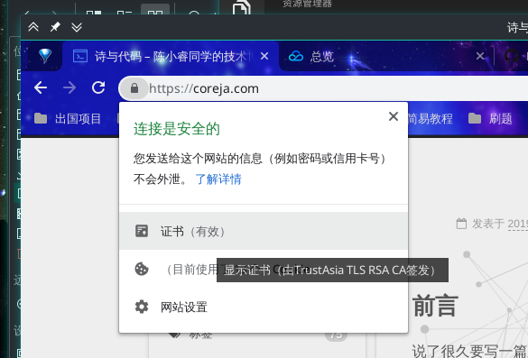
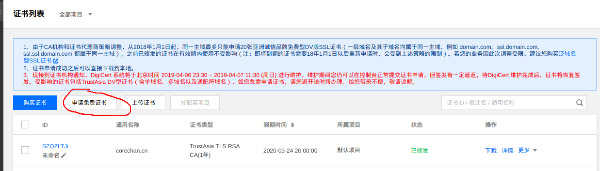
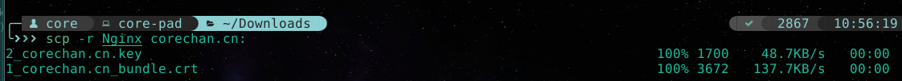
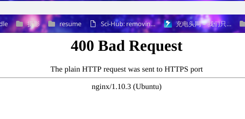
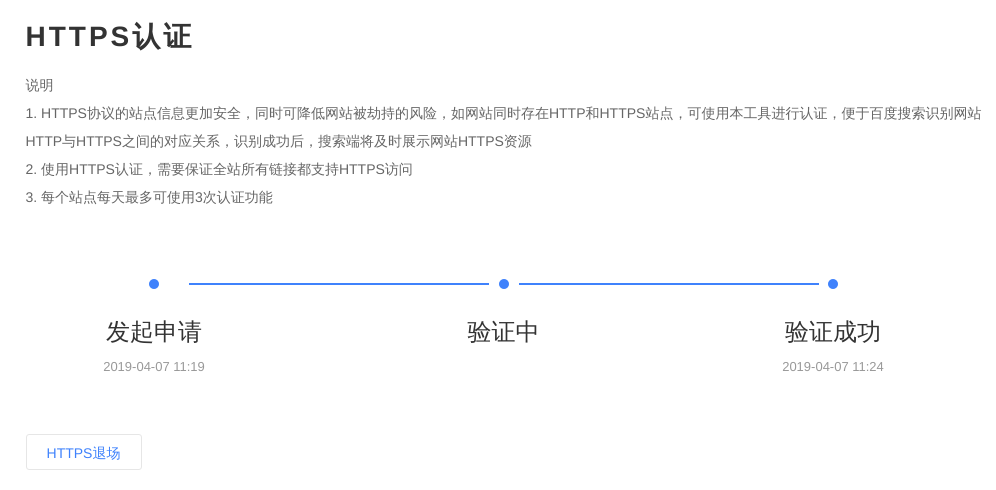

# 写在前面

https是个好东西，而且写在基本上都是免费申请证书了，之前一直说要写一篇这个的教程，搞起来啊诸位（我来还债了）。

放一张效果图



<!-- more -->

# 准备

- 一台服务器
- 一个域名，已经解析到该服务器

先在维基上引用一下https的定义

>**超文本传输安全协议**（英语：**Hypertext Transfer Protocol Secure**，[缩写](https://zh.wikipedia.org/wiki/%E7%B8%AE%E5%AF%AB)：**HTTPS**，常称为**HTTP over TLS**，**HTTP over SSL**或**HTTP Secure**）是一种通过[计算机网络](https://zh.wikipedia.org/wiki/%E8%A8%88%E7%AE%97%E6%A9%9F%E7%B6%B2%E7%B5%A1)进行安全通信的[传输协议](https://zh.wikipedia.org/wiki/%E7%B6%B2%E8%B7%AF%E5%82%B3%E8%BC%B8%E5%8D%94%E5%AE%9A)。HTTPS经由[HTTP](https://zh.wikipedia.org/wiki/HTTP)进行通信，但利用[SSL/TLS](https://zh.wikipedia.org/wiki/%E4%BC%A0%E8%BE%93%E5%B1%82%E5%AE%89%E5%85%A8)来加密数据包。HTTPS开发的主要目的，是提供对[网站](https://zh.wikipedia.org/wiki/%E7%B6%B2%E7%AB%99)服务器的[身份认证](https://zh.wikipedia.org/wiki/%E8%BA%AB%E4%BB%BD%E9%AA%8C%E8%AF%81)，保护交换数据的隐私与[完整性](https://zh.wikipedia.org/wiki/%E5%AE%8C%E6%95%B4%E6%80%A7)。这个协议由[网景](https://zh.wikipedia.org/wiki/%E7%B6%B2%E6%99%AF)公司（Netscape）在1994年首次提出，随后扩展到[互联网](https://zh.wikipedia.org/wiki/%E7%B6%B2%E9%9A%9B%E7%B6%B2%E8%B7%AF)上。
>
>历史上，HTTPS连接经常用于[万维网](https://zh.wikipedia.org/wiki/%E4%B8%87%E7%BB%B4%E7%BD%91)上的交易支付和企业信息系统中敏感信息的传输。在2000年代末至2010年代初，HTTPS开始广泛使用，以确保各类型的网页真实，保护账户和保持用户通信，身份和网络浏览的私密性。
>
>另外，还有一种[安全超文本传输协议](https://zh.wikipedia.org/wiki/%E5%AE%89%E5%85%A8%E8%B6%85%E6%96%87%E6%9C%AC%E4%BC%A0%E8%BE%93%E5%8D%8F%E8%AE%AE)（S-HTTP）的HTTP安全传输实现，但是HTTPS的广泛应用而成为事实上的HTTP安全传输实现，S-HTTP并没有得到广泛支持。

简单来说就是http本身是明文传输的，而https将http的数据包加密传输。

# 开始

## 获取免费SSL证书

我的SSL是在腾讯云上弄的，现在免费证书好像有20个二级域名的上限。



步骤很简单，绑定你的域名即可。不过要注意的是这里的域名仅限你所写的完整域名，如果这个域名下还有二级域名，则需要为该二级域名再申请一张证书[^域名]。那种一张SSL证书绑定所有二级域名的叫`泛域名型SSL证书`。

[^域名]: 由于CA机构和证书代理商策略调整，从2018年1月1日起，同一主域最多只能申请20张亚洲诚信品牌免费型DV版SSL证书（一级域名及其子域名均属于同一主域，例如 domain.com、ssl.domain.com、ssl.ssl.domain.com 都属于同一主域）。之前已颁发的证书在有效期内使用不受影响（注：即将到期的证书需要18年1月1日以后重新申请时，会受到上述策略的限制）。若您的业务因此次调整受限，建议您购买[泛域名型SSL证书](https://buy.cloud.tencent.com/ssl?fromSource=dv_ssl_warning)

## 下载并使用证书

点击旁边的下载它就会给你下载一个zip包，然后将其上传到你的服务器上去。

这里有一篇官方文档[^官方文档]，也可以直接参考。

[^官方文档]: [官方文档](<https://cloud.tencent.com/document/product/400/4143>)

因为我用的nginx，所以就只传压缩包里的nginx的证书就好啦。如果要尝试自己生成crt证书可以参考一下阮老师的[HTTPS 升级指南](<http://www.ruanyifeng.com/blog/2016/08/migrate-from-http-to-https.html>)



官方文档里的写法是把两个证书丢到`/etc/nginx`目录里，然后做一些配置就ok了。不过阮老师比较推荐放在`/etc/ssl`下，我个人的看法也如此，不过都差不太多，不太重要。

## 配置nginx服务器

配置，这里以我的博客举例子吧。

一共要完成两件事情，首先是配置这个站点`corechan.cn`的SSL，以完成https的访问；其次是将所有http协议的访问重定向到https上。

有些人会把nginx服务器上的所有配置写在一个文件里，我用了貌似是官方比较推荐的做法，一个站点一个配置文件，分别放在`site-available`和`site-enabled`里，后者是前者链过去的。

附带一提，实际上腾讯云给的官方指导有些过时了，很多的写法是不正确的，以至于我当时踩了些坑，后面会指出其中一部分。

以下内容的操作目录均在`/etc/nginx`下。

### 配置SSL

在`nginx.conf`中，找到`SSL Settings`这一段

加入以下内容

```nginx
     # ssl on; 这一句不要加，否则所有请求都是走ssl协议了。
     ssl_certificate 1_corechan.cn_bundle.crt;# 证书的路径
     ssl_certificate_key 2_corechan.cn.key;# 证书的路径
     ssl_session_timeout 5m;
     ssl_protocols TLSv1 TLSv1.1 TLSv1.2; #按照这个协议配置
     ssl_ciphers ECDHE-RSA-AES128-GCM-SHA256:HIGH:!aNULL:!MD5:!RC4:!DHE;#按照这个套件配置
     ssl_prefer_server_ciphers on;
 
```

腾讯云的官方文档是直接把这一段配置到了站点的配置信息里，直接放在nginx.conf下可以直接对整个nginx服务起作用。

### 配置站点

在`sites-available`里touch一个`your_site_name`文件。写入如下配置：

```nginx
server {
        listen         443 ssl; # 这里后面记得要加ssl，腾讯云文档里没有加，我当时https访问不了似乎是因为这个（没有查资料，有待考证）。
        server_name    corechan.cn;
        add_header		Strict-Transport-Security "max-age=31536000" always; # 这个是用来防止HSTS攻击的，具体地看下面
        root			/var/www/hexo_blogs;# 你站点的根目录
        [...]
}
```

如果是java或者php后端，则需要做一些转发，这里就不多说了。

最后把它链接到`sites-enabled`中使其生效。

```shell
sudo ln -s /etc/nginx/site-available/your_site_name /etc/nginx/site-enabled
```


#### HSTS攻击

摘自阮一峰老师[^HSTS]

> 访问网站时，用户很少直接在地址栏输入`https://`，总是通过点击链接，或者3xx重定向，从`HTTP`页面进入`HTTPS`页面。攻击者完全可以在用户发出`HTTP`请求时，劫持并篡改该请求。
>
> 另一种情况是恶意网站使用自签名证书，冒充另一个网站，这时浏览器会给出警告，但是许多用户会忽略警告继续访问。
>
> "HTTP严格传输安全"（简称 HSTS）的作用，就是强制浏览器只能发出`HTTPS`请求，并阻止用户接受不安全的证书。
>
> 它在网站的响应头里面，加入一个强制性声明。以下例子摘自[维基百科](https://zh.wikipedia.org/wiki/HTTP%E4%B8%A5%E6%A0%BC%E4%BC%A0%E8%BE%93%E5%AE%89%E5%85%A8)。
>
> > ```http
> > Strict-Transport-Security: max-age=31536000; includeSubDomains
> > ```
>
> 上面这段头信息有两个作用。
>
> > （1）在接下来的一年（即31536000秒）中，浏览器只要向`example.com`或其子域名发送HTTP请求时，必须采用HTTPS来发起连接。用户点击超链接或在地址栏输入`http://www.example.com/`，浏览器应当自动将`http`转写成`https`，然后直接向`https://www.example.com/`发送请求。
> >
> > （2）在接下来的一年中，如果`example.com`服务器发送的证书无效，用户不能忽略浏览器警告，将无法继续访问该网站。
>
> HSTS 很大程度上解决了 SSL 剥离攻击。只要浏览器曾经与服务器建立过一次安全连接，之后浏览器会强制使用`HTTPS`，即使链接被换成了`HTTP`。

[^HSTS]: <http://www.ruanyifeng.com/blog/2016/08/migrate-from-http-to-https.html>

### 301重定向

#### 全局重定向

如果这个时候你直接访问[corechan.cn](http://corechan.cn)的话是会返回这个400报错的，因为浏览器上默认使用的是http协议，而如果你去访问https://corechan.cn你就能发现它可以访问。而一般用户也不会专门去写一个`https://`的协议头，这个时候就需要web服务端做301重定向。



因为我们需要301重定向针对所有的http请求，所以可以写一个拦截所有请求的配置文件。

在`/etc/nginx.conf`的http的`{}`里加入下面这段内容[^default]，如果有相同的记得注释掉或者删除。

编辑如下：

```nginx
server {
       listen         80;
       server_name    corechan.cn *.corechan.cn; 
       return         301 https://$server_name$request_uri;
}
```
[^default]: 当然在`sites-available`里touch一个`default`文件并写以上内容也是可以的，然后记得链接到sites-enabled目录下即可。

附带一提，腾讯云上的写法是

> 您可在 HTTP 的 server 中增加 `rewrite ^(.*) https://$host$1 permanent;`，即可将 80 端口的请求重定向为 HTTPS。

实际上这个写法是不够好的，关于这个在serverfault上还讨论过[^301]，感谢阮老师孜孜不倦的写博客才让我看到了这个，基本上上面的写法是最好的，而rewrite其实多了一道正则匹配，不太ok，同时这个一改竟然解决了我之前`百度站长`上的`https认证`的问题[^baidu]。

[^301]: <https://serverfault.com/questions/67316/in-nginx-how-can-i-rewrite-all-http-requests-to-https-while-maintaining-sub-dom>
[^baidu]: 具体就是我已经保证我所有的站点都是https访问了，可是每次认证它都告诉我存在http访问的站点，而我http明明就是301跳转到https啊？后来才发现实际上写成`return 301 https://$server_name$request_uri`之后https的认证就通过了。猜测是rewrite没有直接返回301，而是跳转了一层，导致百度机器人不能认可这是全https站点。



#### 单个站点重定向

上面讲的是所有请求全部重定向，如果是想只对某一个站点做重定向，其余的不做重定向的话，只需要在其站点的文件里加上上面一段即可。（记得修改server_name)

# 结束

当完成所有操作之后，重载一下nginx就正式生效了！

```shell
sudo systemctl reload nginx.service
```

如果没有任何报错提示，则说明配置没有语法问题，就大功告成了！

如果有的话，可以把上面代码的`reload`改成`status`仔细看看报错提示，很有可能会不小心把`;`写掉喔～