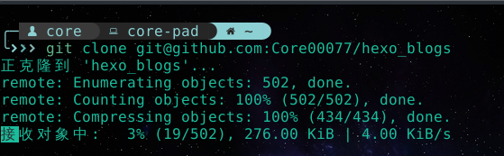
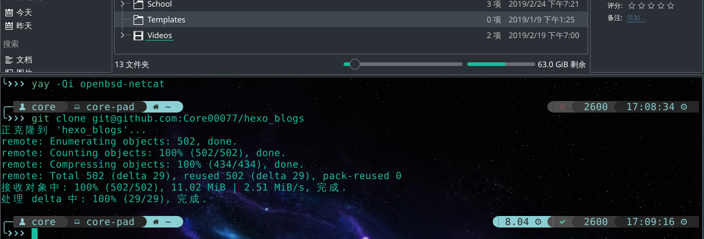
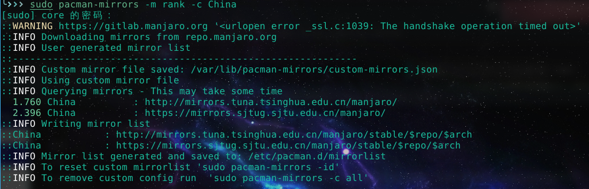

# 引言

- 前提：已有代理服务器
- 内容：诸如console内、git、pip等的代理配置

github由于一些很奇怪的原因，从很久以前就对境内网络的支持非常差，不知道是不是线路问题。所以github上clone还有push速度都非常感人：



之前通过配置`git config --global http.proxy "localhost:1080"`去访问代理服务器是可以解决问题的，但是像上面图里的ssh协议就走不了http了，于是速度依旧捉急，这篇博客统一写一下关于各种代理的配置。

<!-- more -->

# git代理设置

## http/https

对于http/https协议来说，非常简单，应该很多人都知道

```shell
git config --global http.proxy "[protocal]://localhost:port"
```

这句话配置了之后，对于git指令的所有http协议都会使用代理服务器访问，并且会记住（下次就不用配置了），协议如果不写似乎默认是http协议。

如果想要取消则是：

```shell
git config --global http.proxy ""
```

## ssh

对于ssh协议来说，需要去`~/.ssh/`目录下找到config文件（不存在就创建一个），在里面加入这样两行

```
Host			github.com
ProxyCommand	nc -X 5 -x localhost:1080 %h %p
```

这里是使用了nc(netcat)指令作为代理指令进行转发[^1]

其中host是指要代理的主机（域名），ProxyCommand是指代理要使用的指令。

我一开始用的时候还出了错，这里有两个坑：

1. 我的manjaro因为没有标配nc，在clone的时候说nc指令不存在，行吧搜了一下这个包叫`openbsd-netcat`，那就gkd安装咯 `yay -Sy openbsd-netcat`。
2. 第二个坑是你会发现它木有速度！原因是我当时写的代理端口写的是将socks5转换成http协议的端口[^2]，而在我`man nc`了之后才知道`-X 5`的意思是socks5协议，行8，多此一举。

[^1]:[Proxy SSH Over SOCKS (the easy way)](https://www.mikeheijmans.com/sysadmin/2014/08/12/proxy-ssh-over-socks/)
[^2]: linux下我用的shadowsocks-libev，它在本地只提供socks5协议，为了正常使用会安装polipo将其转成http协议。

在配置好了之后，前面的短细软瞬间就高大上了，速度激增。（当然速度是取决于你的代理服务器的）



one more thing: 这里配置好了ssh，是针对所有支持ssh协议的。比如其他指令需要走ssh协议的话，就不用再配置了。

# shell代理

这个是基本操作8？顺手写一写好了

应该来说大部分教程里都说过，就是设置一个环境变量来使当前shell可以通过代理访问

```shell
export http_proxy="localhost:port"
export https_proxy="localhost:port"
```

取消也很简单，直接改成空字符串就好

```shell
export http_proxy=""
export https_proxy=""
```

至于ssh的代理，在上面讲github的时候就说啦，在.ssh文件里加一个config是针对所有ssh协议的。（而且我的确不知道shell下关于ssh协议的操作）

# pip代理

拿pip3举例就是

参数列表里加一个`--proxy localhost:port `就好，记得这里的port得是http协议的代理。

# pacman代理

其实准确的说这里我不打算讲pacman的代理，而是讲使用国内的源

pacman安装包默认的源应该是指向美帝的。我在网上看到了挺多修改pacman.conf的，感觉不太利于维护emmmmmm，这里提供一个方便快捷的方式。

```shell
sudo pacman-mirrors -m rank -c China
```

pacman-mirrors会根据当前网络情况自动查找相关的源并且按照速度来排序所使用的源。



# apt代理

apt代理我是参考的一篇博客[^3]，好像是ubuntu16.04的设置，apt的代理不再使用shell代理，而是独立了（可真睿智啊）。只能使用博客里的方法二了，这里我就不展开了，自己去看8～

哦配置好了apt之后和博客不太一样的是，你必须指定你的代理配置文件（是真的僵硬），加入参数`-c /path/to/your/apt.conf`

```shell
sudo apt -c ~/.apt.conf
```


[^3]: [ubuntu apt代理设置](https://blog.csdn.net/u013063153/article/details/64440513)

# 使用别名

上面很多代理的设置其实蛮麻烦的，每次代理还得输入一大串命令，有没有简单一点的“开关”呢？

推荐在.zshrc/.bashrc里写一个开关设置的别名，例如我的是：

```shell
alias pip3p="sudo -H pip3 --proxy localhost:1081"
alias aptp="sudo apt -c ~/.apt.conf"

alias hp='export http_proxy="localhost:1081"
        export https_proxy="localhost:1081"
        echo "http_proxy:"$http_proxy "https_proxy:"$https_proxy'
alias np='export http_proxy="" export https_proxy=""
        echo "http_proxy:"$http_proxy "https_proxy "$https_proxy'

alias ghp='git config --global http.proxy "localhost:1081"
        git config --global http.proxy'
alias gnp='git config --global http.proxy ""
        git config --global http.proxy'
```

.zshrc/.bashrc文件一般就在你的用户目录下，它是你的shell每次加载时候都会读取的文件，你的shell的各种主题配置啊等等都存在这里面。

比如加入了如上的内容之后`source ~/.zshrc`（相当于刷新一下），再使用hp，就相当于帮你执行了`export blablablabla`这一大坨内容。


哦我的.zshrc里面带了输出反馈，emmmmmm这样看起来好看点，不喜欢也可以不要。