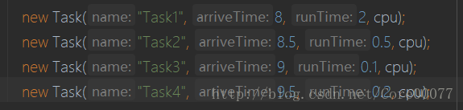

# 实验要求

- 选择1~3种进程调度算法（先来先服务、短作业优先、最高响应比优先、时间片轮转、优先级法等）模拟实现进程调度功能；
- 能够输入进程的基本信息，如进程名、到达时间和运行时间等；
- 根据选择的调度算法显示进程调度队列；
- 根据选择的调度算法计算平均周转时间和平均带权周转时间。

我选择了先来先服务FCFS、短作业优先SJF、最高响应比优先HRN、时间片轮转RR四种调度算法，使用java实现。
后面调度算法均用缩写表示。

源码已上传到本人[github](https://github.com/Core00077/OS_experiment)上，建议先看源码。

<!-- more -->

# 实验原理

## 代码结构

- Task类用来存放每个任务的详细信息，其私有成员记录任务名字、提交时间运行时间、已运行时间、完成时间、周转时间、带权周转时间，静态私有成员存放平均周转时间、平均带权周转时间以及任务总数。Task类的构造方法需要任务名、到达时间和运行时间。Task类其余方法都是setter和getter。
- CPU类表示处理机，私有成员包含调度算法、当前时间、时间片长度（RR算法需要用到）任务池、已到达任务池、已到达任务队列（RR算法需要用到）。核心的方法包括四个调度算法以及根据四个调度算法代码中可复用的部分封装出来的代码，比如更新已到达任务池、处理任务、打印时间等等，后续提及时会详细讲解。

## 代码思路
### 整体思路
和前面的进程调度不同，处理机调度实现的难点在于确定时间的流动，因为CPU何时会处理某个任务和调度算法有关，而只有知道这个时间才能确定该任务的完成时间，所以CPU类中timeAt用于存放当前时间，在有任务到达或者有任务完成的时候对其进行更新。

CPU类中的任务池和已到达任务池是两个Set，均用HashSet实现；已到达任务队列是Queue，用LinkedList实现。

 - 任务池： 所有任务的集合。每当完成一个任务就从该集合中删掉此任务，当任务池中没有任务则意味着所有任务已完成。
 - 已到达任务池：所有已到达任务的集合。所有已经到达且尚未被执行的任务都在此集合里，故算法调度主要是操作已到达任务池中的任务，每完成一个任务便从该集合中删除掉此任务。
 - 已到达任务队列：和已到达任务池类似，RR调度算法需要一个队列来轮转，每当有任务到达，便从已到达任务池中将任务加到已到达任务队列的队尾。队首的任务会被CPU处理一个时间片，然后出列并放到队尾，直到该任务被处理完毕。

由于各个调度算法中代码可以复用的部分比较多，比如打印时间、填写各个任务的时间等，笔者在重构多次了完成了一些封装，会在后面的算法中具体指出。

### FCFS
先来先服务算法向来是被认为是最简单的算法，然而这个调度算法我重构了近三次，因为写到后面才会发现FCFS的思想是其他算法都会用到的，**每个调度算法都需要找到最先到达CPU的任务**。对于FCFS而言，其过程不过是重复这个过程而已，所以这里代码看起来非常简短，逻辑也很清晰：只要任务池不为空，那就不停的去处理当前第一个到的任务。完成后去设置平均时间然后打印。

```java
    private void FCFS() {
        while (!tasks.isEmpty()) {
            processFirstOne();
        }
        setAvgTime();
        printAvg();
    }
```
### processFirstOne
处理第一个任务又包括找到第一个任务，设置当前时间，处理该任务，从任务池删除该任务以及设置时间和打印时间。不难看到这个方法依然是很多小方法的调用。这里笔者做了比较多的封装来解耦，具体理由可以在后面的调度算法中发现调度算法基本都需要找到处理当前第一个到达的任务，这样做有利于**代码复用**。

关于这里设置当前时间，因为我们不知道当前任务完成后，下一个任务是紧接着就来了还是会隔一段时间才来（即任务与任务之间间隔了一段时间，cpu没有处理任何任务）。所以需要判断下一个任务的到达时间和当前时间哪个更大，如果任务早就到达了，那么当前时间就保持不变即可；反之如果任务到达的比较慢则把当前时间调整为下一个任务的到达时间。
```java
    private void processFirstOne() {
        if (!tasks.isEmpty()) {
            Task chosenOne = findFirstOne();
            this.timeAt = Math.max(this.timeAt, chosenOne.getArriveTime());
            //执行作业
            processingJob(chosenOne);
            tasks.remove(chosenOne);
            setAllTime(chosenOne);
            printAllTime(chosenOne);
        }
    }
```
关于processingJob和findFirstOne方法其实没有太多需要讲解的地方，前者只是一串字符串的输出，而后者也不过是老生常谈的Set遍历。
###SJF
SJF调度算法也就是找出当前已到达任务中执行时间最短的并处理。

updateArrivedTasks()是更新已到达任务。即对比当前时间，将**所有到达时间<当前时间**的任务（也就是已经到达了的任务）放在已到达任务池里。
这里又对这部分逻辑做了封装，理由也同样是有利于代码复用，后面的HRN与RR调度都会用到。

只要任务池不为空，那么首先更新已到达任务看看有没有已经到达的任务，然后对已到达任务池进行遍历，并找出运行时间最短的任务执行，执行完成后从任务池与已到达任务池中删除，然后计算并设置该任务的周转时间完成时间云云……如果已到达任务池没有任何任务到达，那么就去找当前时间第一个到达的任务去执行。
```java
    private void SJF() {
        while (!tasks.isEmpty()) {
            //将早于当前时间的所有任务加入已到达任务池，后续任务从已到达任务池中选取并执行，直到已到达任务池中没有任务
            updateArrivedTasks();
            //找出已到达任务池中符合条件的作业并执行
            while (!arrivedTasks.isEmpty()) {
                Iterator<Task> iterator = arrivedTasks.iterator();
                Task chosenOne = iterator.next();
                while (iterator.hasNext()) {
                    Task t = iterator.next();
                    if (chosenOne.getRunTime() > t.getRunTime())
                        chosenOne = t;
                }
                //执行作业
                processingJob(chosenOne);
                //从已到达任务池和任务池中清除
                arrivedTasks.remove(chosenOne);
                tasks.remove(chosenOne);
                setAllTime(chosenOne);
                printAllTime(chosenOne);
            }
            //已到达任务池中没有任务可执行时，找到一个当前时间下最先到达了的作业
            processFirstOne();
        }
        setAvgTime();
        printAvg();
    }
```
### HRN
对比SJF的代码来看，HRN的实现和SJF的结构几乎没有区别，唯一的区别在于判断条件不再是找到一个运行时间最短的，而是找到一个响应比最高的任务。
这里再复习一下最高响应比的公式：HRN=1+响应时间/运行时间

```java
    private void HRN() {
        while (!tasks.isEmpty()) {
            updateArrivedTasks();
            while (!arrivedTasks.isEmpty()) {
                Iterator<Task> iterator = arrivedTasks.iterator();
                Task chosenOne = iterator.next();
                while (iterator.hasNext()) {
                    Task t = iterator.next();
                    double chosenOneHRN = 1 + (this.timeAt - chosenOne.getArriveTime()) / chosenOne.getRunTime();
                    double tHRN = 1 + (this.timeAt - t.getArriveTime()) / t.getRunTime();
                    if (tHRN > chosenOneHRN)
                        chosenOne = t;
                }
                processingJob(chosenOne);
                arrivedTasks.remove(chosenOne);
                tasks.remove(chosenOne);
                setAllTime(chosenOne);
                printAllTime(chosenOne);
            }
            processFirstOne();
        }
        setAvgTime();
        printAvg();
    }
```
###RR
时间片轮转调度属于比较好玩的，它不同于我前面搭设的架构，但是又能看出其拥有和前面相似的部分。它不同之处在于它不像作业调度每次送给cpu一个任务之后cpu一定会把这个任务执行完，cpu只会对**已到达任务队列**的队首任务处理一个时间片，然后将该任务出列并加到队尾，然后继续处理**已经到达任务队列**的队首任务一个时间片……直到队列中的任务被执行完成才不再将该任务放入队尾。随着时间的流动，别的任务也会到达cpu，达到的任务都放在已到达任务队列的队尾。

不难发现其实从while开始，代码也基本一致，不过这里多了一个更新已到达任务队列方法，类似更新已到达任务池方法，不予赘述。和处理任务不同，RR调度只会处理一个时间片，所以笔者写了处理进程方法让任务被cpu处理一个时间片，其返回一个boolean告诉程序该任务是否执行完成。若完成了则把它移出任务池并设置时间即可，若该任务没有完成，那么就再把它放在队尾，等待cpu对它继续处理。
```java
    private void RR() {
        Scanner in = new Scanner(System.in);
        System.out.print("请输入时间片长度(s)：");
        this.timeRobin = in.nextDouble();
        while (!tasks.isEmpty()) {
            updateArrivedTasks();
            updateArrivedTasksQueue();
            if (!arrivedTasksQueue.isEmpty()) {
                Task chosenOne = arrivedTasksQueue.poll();
                if (processingProcess(chosenOne)) {
                    tasks.remove(chosenOne);
                    setAllTime(chosenOne);
                    printAllTime(chosenOne);
                } else
                    arrivedTasksQueue.offer(chosenOne);
            }
            if(arrivedTasksQueue.isEmpty()&&!tasks.isEmpty()) {
                Task firstOne=findFirstOne();
                this.timeAt=Math.max(this.timeAt,firstOne.getArriveTime());
            }
        }
        setAvgTime();
        printAvg();
    }
```
# 实验结果
## 测试用例


## FCFS

>调度算法：1.FCFS 2.SJF 3.HRN 4.RR
请选择调度算法：1
请输入任务数量（输入0将以默认任务参数提交）：0
Task1 is running...Finished in 2.0s!
Task1完成时间为10.000s
Task1周转时间2.000s
Task1带权周转时间为1.000s
Task2 is running...Finished in 0.5s!
Task2完成时间为10.500s
Task2周转时间2.000s
Task2带权周转时间为4.000s
Task3 is running...Finished in 0.1s!
Task3完成时间为10.600s
Task3周转时间1.600s
Task3带权周转时间为16.000s
Task4 is running...Finished in 0.2s!
Task4完成时间为10.800s
Task4周转时间1.300s
Task4带权周转时间为6.500s

>此算法平均周转时间为1.725s
此算法平均带权周转时间为6.875s

>Process finished with exit code 0

## SJF

>调度算法：1.FCFS 2.SJF 3.HRN 4.RR
请选择调度算法：2
请输入任务数量（输入0将以默认任务参数提交）：0
Task1 is running...Finished in 2.0s!
Task1完成时间为10.000s
Task1周转时间2.000s
Task1带权周转时间为1.000s
Task3 is running...Finished in 0.1s!
Task3完成时间为10.100s
Task3周转时间1.100s
Task3带权周转时间为11.000s
Task4 is running...Finished in 0.2s!
Task4完成时间为10.300s
Task4周转时间0.800s
Task4带权周转时间为4.000s
Task2 is running...Finished in 0.5s!
Task2完成时间为10.800s
Task2周转时间2.300s
Task2带权周转时间为4.600s

>此算法平均周转时间为1.550s
此算法平均带权周转时间为5.150s

>Process finished with exit code 0

## HRN

>调度算法：1.FCFS 2.SJF 3.HRN 4.RR
请选择调度算法：3
请输入任务数量（输入0将以默认任务参数提交）：0
Task1 is running...Finished in 2.0s!
Task1完成时间为10.000s
Task1周转时间2.000s
Task1带权周转时间为1.000s
Task3 is running...Finished in 0.1s!
Task3完成时间为10.100s
Task3周转时间1.100s
Task3带权周转时间为11.000s
Task2 is running...Finished in 0.5s!
Task2完成时间为10.600s
Task2周转时间2.100s
Task2带权周转时间为4.200s
Task4 is running...Finished in 0.2s!
Task4完成时间为10.800s
Task4周转时间1.300s
Task4带权周转时间为6.500s

>此算法平均周转时间为1.625s
此算法平均带权周转时间为5.675s

>Process finished with exit code 0

## RR

>调度算法：1.FCFS 2.SJF 3.HRN 4.RR
请选择调度算法：4
请输入任务数量（输入0将以默认任务参数提交）：0
请输入时间片长度(s)：0.2
Task1 is running...已运行0.200s，剩余1.800s	当前时间8.200s
Task1 is running...已运行0.400s，剩余1.600s	当前时间8.400s
Task1 is running...已运行0.600s，剩余1.400s	当前时间8.600s
Task1 is running...已运行0.800s，剩余1.200s	当前时间8.800s
Task2 is running...已运行0.200s，剩余0.300s	当前时间9.000s
Task1 is running...已运行1.000s，剩余1.000s	当前时间9.200s
Task2 is running...已运行0.400s，剩余0.100s	当前时间9.400s
Task3 is running...Finished in0.100s!
Task3完成时间为9.500s
Task3周转时间0.500s
Task3带权周转时间为5.000s
Task1 is running...已运行1.200s，剩余0.800s	当前时间9.700s
Task2 is running...Finished in0.500s!
Task2完成时间为9.800s
Task2周转时间1.300s
Task2带权周转时间为2.600s
Task4 is running...Finished in0.200s!
Task4完成时间为10.000s
Task4周转时间0.500s
Task4带权周转时间为2.500s
Task1 is running...已运行1.400s，剩余0.600s	当前时间10.200s
Task1 is running...已运行1.600s，剩余0.400s	当前时间10.400s
Task1 is running...已运行1.800s，剩余0.200s	当前时间10.600s
Task1 is running...已运行2.000s，剩余0.000s	当前时间10.800s
Task1 is running...Finished in2.000s!
Task1完成时间为10.800s
Task1周转时间2.800s
Task1带权周转时间为1.400s

>此算法平均周转时间为1.275s
此算法平均带权周转时间为2.875s

>Process finished with exit code 0

# 马后炮
## 调试过程
其实处理机调度我本打算写成多线程实现。把每个任务都当作一个线程，cpu作为资源被每个进程抢占，而具体抢占资源的规则则根据不同调度算法制定。在我的[github](https://github.com/Core00077/OS_experiment)上，处理机调度这部分有两个包，一个是easy即本文的源码，另一个包是multithread，只完成了FCFS和SJF算法线程之间的竞争，能够输出正确的顺序。但是问题出现在每个任务等待的时间**无法精确获得**，也就是进程在wait()方法挂起后到被唤醒并被cpu处理这个过程的时间算不准。我代码上用的是getCurrentMills()方法，在wait()的前一句记录时间，在被唤醒后的第一时间记录时间，两者相减的结果不尽人意（代码执行时有sleep模拟任务执行过程）。猜想是执行代码本身是需要时间的，同时线程竞争也花了时间等原因导致算不准，以后有空再来填这个坑。

在对浮点型类型数值运算的时候需要注意其表示问题，因为很多数字浮点型是无法准确表示的。比如在updateArrivedTasks()代码里，比较当前时间>=任务到达时间时有一个小细节需要注意：

一开始的思路是：
```java
this.timeAt>=t.getArriveTime()
```
正确做法是：
```java
Math.abs(this.timeAt-t.getArriveTime())<0.000001||this.timeAt>t.getArriveTime()
```
理由很简单，因为浮点型数值比较相等时会有精度失真问题，所以比较浮点型相等不能直接比较。举例来说，二进制无法表示8.5，在调试过程中发现this.timeAt为8.49999999……，小于t.getArriveTime()的8.5，然而实际上我们是希望这两者相等的。

解决方案也比较粗暴，在一定范围内认为其相等即可，至于大于的情况那必然是大于的。

## 存在的问题
RR调度算法中，老师提出当某个任务A处理的时间片到达的瞬间，另一个任务B正好到达，则应当是先把任务B放入已到达任务队列的队尾，然后才把任务A放入已到达任务队列的队尾，而在我的代码中是先把A放到队尾，之后才更新已到达队列并把B再放到队尾。的确我更新已到达任务队列的时机有些问题。

## 小结
**构思流程并画图是很重要的。**

其实笔者还没有写到HRN调度算法的时候，单纯的去构思这样的数据结构时大概花了1个小时左右，这个过程说实话是异常艰辛的，因为我**没有**去打草稿画图来帮助我理解处理机调度的过程。当时想着一个个写完了事，于是我写好FCFS只花了不到10分钟就完成了，而且经过测试的确可以正常输出。但是写到后面就发现这部分代码可以封装，那部分代码能复用好多次……这么一来二去，边写边改边封装的效率实在不高。因为脑子并不能把整个结构清晰的记住，往往在写某个具体的代码之后就忘了宏观的思路，**一开始就埋头写代码不利于宏观观察问题**。而在我把前两个算法边封装边写完成之后，再来看整个代码，思路就非常清晰了，HRN调度我甚至只花了15分钟就完成了。后面的RR算法由于有些许区别，但我也先画好了思路再动手，事半功倍。

