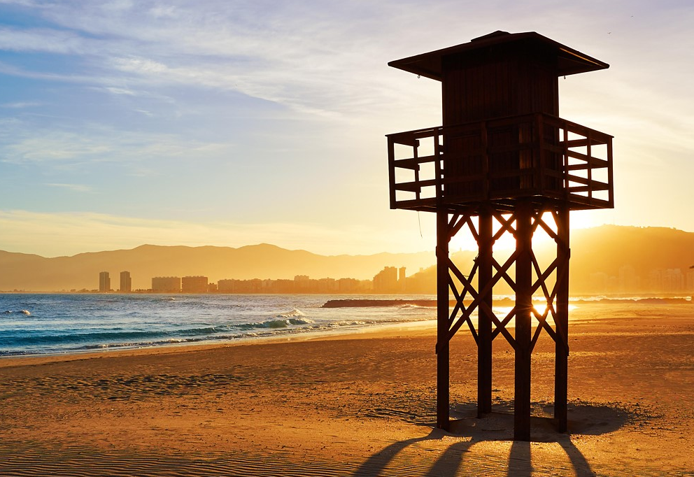

# 写在前面

毕业了要毕业了，偷个闲聊点东西。

后面就得继续忙咯。

岁月你别催，该来的我不推; 岁月你别催，走远点仍要追。

——引自好友孟孟的签名。

<!-- more -->

# ？

最近在忙着毕业，毕设、卖东西、填表格、顺便调了调blog……后面接连着还有T和G两座大山，还有ML和DL，还有论文，还有文书……啊说起来之前中介老师让我写的东西我还没写，这篇写完就去。

# 。

大家都在清理、收拾行李；我就想等我也走了，这又留下了什么记忆？

可我不走呐，我暑假还会悄咪咪留在学校里，这里适合学习。

我不走，我还要补各种基础知识，打牢地基；

我不走的，我还要搞搞论文，撸些英语；

我不走呀，我还在为起飞蓄力；

我不会走的。

吧？

# ！

搞毛啊！先把眼下的`大物`、`高数`、`线代`、`概率论`、`组成原理`刷了再说骚话行吗？

:sa:，事情多的一匹，不过只是毕设结束了，虽然95还 :accept: ，但省优今年又不评。

生活有的时候就是这样吧，我们大多数时候并不是迈向前走，而是被推着走。一件事情接着一件事情的开始，结束。Eason不也这么说嘛：

> 被推着走，跟着生活流。[^最佳损友]

[^最佳损友]: 歌词出自最佳损友

说真的，打心眼里羡慕那些收拾着、庆祝着、吃着喝着玩着，用这最后的自由时光致敬大学的青匆岁月的同学们，和他们一起吃着玩着，甚至有一瞬间把自己也当成了一个毕业生了…什么毕业生，明明是练习时长三年半的个人练习生，还有好长好长一段路要走。

---

也挺好的吧？把自己当成一个即将大四的奋斗青年感觉也还不错，奋斗逼加油:muscle:！

# ;

不知道该说些什么了，今天偶然发现初中旧友们在群里呼来喊去要出去吃饭，回头这才发现原来自己已经22，而那些曾经和我一起放学吃街边不干不净串串、去黑网吧上几个点、一起说着段子打着CF生化模式的小伙伴们，有些已经在上班了，而有些则刚考完研究生准备升学……大家都各有各的方向了，每个人在出发起点的时候就或多或少被暗中预示了前行的方向，如果从上帝视角来看，每个人的人生轨迹都是固定且恒定的，只是他们自己并不知道罢了……就像我也从来没想到，那些陪我度过了欢乐岁月的朋友们，我们走着走着就都长大了。

那便只好祝一声前程似锦，再约一句有缘再聚。

既然还不知道未来究竟是什么模样，

那就把它活出来吧。

# ……

前些日子老友来学校，想从头开始学前端，想真的把它学好然后靠它吃饭，实在是不由得感慨——其实要是ta再早一点意识到学习的重要该多好，当然我也不至于蠢到把这些都当面说出来——既伤了别人面子，又贬了自己里子——只是特别替ta感到惋惜，也感到欣慰。

惋惜的是如果早一点，能在ta风华正茂（？）最适合学习的日子里，或者是体会到了生活的艰辛与不易，又或许是体会到了掌握一门生存本领的重要性——随便什么理由罢——让他奋发上进，也不至于只是工作于一个混点的公司简简单单的过日子了。

欣慰的是这位友人总算是真的有学习的这股劲儿了。其实ta不止一次和我提过这些东西，我也或耐烦或不耐烦地给ta提供了各类学习资讯、资源——可能是受到环境的影响吧——ta一直都没有真的能醒过来好好学习。但愿新的工作环境、身边的接触的人等等因素不会影响到ta。

我的另一个友人也类似，只不过ta的环境要好一些，相对来说其在最后一年努力再努力后，成功地掌握了一些相对较强的能力，并找到了比较不错的offer，当然最后据说其选择了升学。

---

其实这类思考我有过不少，最起初是看到知乎KnowYourself机构号的回答，关于`延迟享乐`、`记忆自我`与`体验自我`这类话题。能够坚持、耐心的让自己在**看不到反馈**的情况下，依旧保持学习状态并且**相信学习是有效的**往往最难。以下根据记忆引用答主的回答，不保证准确性。

> 就像我们玩游戏，每使用鼠标、键盘或施法、或平A来操纵人物时，我们能很快的被其吸引，并且投入注意力……因为这些游戏就是**被设计为非常低的反馈延迟**，以获得**最大程度的吸引力**；相反对于学习这类可能投入很久都无法看到**成效（反馈）**的东西就很难变得**吸引人**。
>
> ……
>
> 我们很难抵抗吸引人的东西，这是天性，但那些发现了学习规律、并且理解学习成本曲线并能沉下心来去学习的人，他们是学习最大的受益者。学习本身是枯燥且乏味的，他们或通过**改变对学习的看法**或通过**沉下心来**等方式，让自己不被诸如`游戏`、`短视频`、`剧`这类低延迟高反馈速度的东西吸引，而是将时间投资给那些高延迟反馈的`学习`、`健身`上。

当然对于低延迟还是高延迟的取舍我不作评判，这是价值观的取舍。

我欣赏那些不学习，享乐就好好享乐的人，这些人也是很值得尊敬和佩服的，这是他们的选择。

但我同情或惋惜那些在享乐和学习两者间摇摆的人，他们既想要不学习享乐，又想获得学习的成果，简而言之就是——一夜暴富/天上掉馅饼。其实大多数人都是这个行当里的存在，学习的时候羡慕别人在玩的、学的不好/半吊子又羡慕那些学的好的，这过于真实的现状啊。

---

我又何尝不是这个B样呢？

不bb了，该留念的要留念，该庆祝的要庆祝；该学的还是要学，该追的仍要追。

> 岁月你别催，该来的我不推; 岁月你别催，走远点仍要追。（原来是歌词）