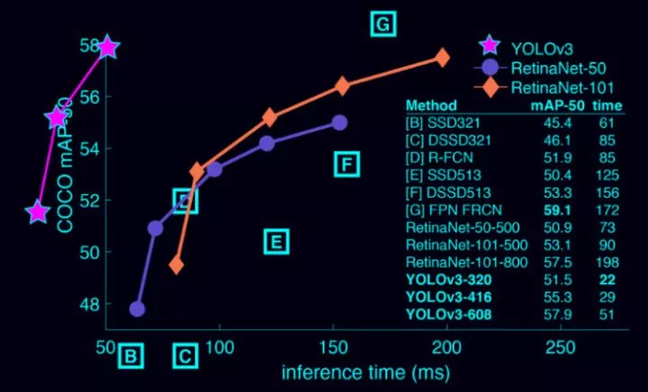

# 目的及意义（含国内外的研究现状分析）

## 研究目的

本毕业设计拟针对自动驾驶数据集BDD100K，针对物体检测算法YOLOv3提出一种改进思路，以提高算法在此数据集上的物体检测性能。

## 研究意义

计算机视觉中物体的检测、跟踪、识别是最基本的几个目标，而其中又以物体检测最为重要和基础。物体检测广泛应用于机器人导航、智能视频监控、工业检测、航空航天等诸多领域，通过计算机视觉减少对人力资本的消耗，具有重要的现实意义。不仅如此，物体检测同时也是泛身份识别领域的一个基础性的算法，它对后续的人脸识别、步态识别、人群计数、实例分割等任务也起着至关重要的作用。

<!-- more -->

## 国内外研究现状

自2012年Hinton课题组通过构建的 CNN 网络AlexNet在ImageNet图像识别比赛一举夺得冠军后，神经网络开始受到广泛的关注。深度学习利用多层计算模型来学习抽象的数据表示，能够发现大数据中的复杂结构，现在深度学习已成功地应用在包括计算机视觉领域在内的多种模式分类问题上，物体检测算法也在此期间得到了较为快速的发展。

根据我在网上阅读的各类资料，加上一些物体检测文献的参考，总结物体检测算法大致分为以下3类：

1. 传统的目标检测算法：Cascade + Harr / SVM + HOG / DPM 以及上述的诸多改进、优化；

2. 候选窗+深度学习分类：通过提取候选区域，并对相应区域进行以深度学习方法为主的分类的方案，如：RCNN / Fast-RCNN / Faster-RCNN / SPP-net / R-FCN 等系列方法；

3. 基于深度学习的回归方法：YOLO / SSD / DenseBox 等方法；以及最近出现的结合RNN算法的RRC detection；结合DPM的Deformable CNN等

早先的传统做法基本都以不同尺度的滑动窗口选定图像的某一区域为候选区域，然后从对应的候选区域提取如Harr HOG LBP LTP等一类或者多类特征，最后使用使用Adaboost SVM 等机器学习的分类算法对对应的候选区域进行分类，判断是否属于待检测的物体。

后面由于深度学习的广泛应用，解决了候选窗口数量巨大的问题，候选窗+深度学习的方式开始使用。深度学习的方法主要在于能够更好的提取特征，并且其模型具有更强大的描述能力，深度学习慢慢从特征提取到分类、回归等问题的end-to-end的方式，这里以rcnn举例，它通过selective search的方式从图片中提取可能的目标的候选窗口，将窗口拉伸到同一个尺寸，通过卷积网络从拉伸之后的候选窗口提取特征，将特征送给分类器进行分类，最后在加上bounding box regression等操作得到更准确的目标位置。而faster-rcnn提出的ROI pooling层解决了卷积重复计算的问题，同时其使用region proposal network替代了最费时的selective search，faster-rcnn基本上能达到实时检测。

而YOLO则基本可以认为是基于深度学习的回归方法的开篇之作，YOLO使用对输出的图像进行网格划分来提取候选窗口。YOLO方案会对输出的图像划分网格，每个网格的信息包含：1. 存在某个类别的物体的概率，比如有20类目标需要检测，那就是21类（包含背景类别）；2. 对应物体的bounding box参数，使用4个数字描述；3. 对应目标的概率。这个问题就转换成了一个回归问题。举例来说：如果输入图片分辨率是448×448，则输入的是一个7×7的网格，那么448×448×3作为输入；7×7×(b×5+c)作为回归的参数，然后进行end-to-end的学习。YOLO算法的一直被认为不擅长检测小物体，而在最近YOLOv3的推出，针对这些问题做出了巨幅的提升，如下图：

无论是传统的模式识别图像检测，还是基于 CNN 的视觉检测，**对于紧凑密集或者高度重叠目标的检测通常是非常困难的**。同时YOLOv3保持了其检测速度快的特点，和前辈们比，YOLO 的速度非常快，比 R-CNN 快 1000 倍，比 Fast R-CNN 快 100 倍。 YOLOv3-608 检测准确率比 DSSD 更高，接近 FPN，但是检测时间却只用了后面两者的三分之一不到。 最关键是它在测试时观察整张图像，预测会由图像中的全局上下文引导。它还通过单一网络评估做出预测，而不像 R-CNN 这种系统，一张图就需要成千上万次预测。

YOLO系列（以及后来的改进YOLO9000、YOLOv3）算法最显著的特点是其不依赖复杂框架，其使用的框架简洁，为后续的优化改进提供了相对较多的可能性；其次其计算性能相对较高，能达到实时检测。

物体识别算法性能对比

# 研究（设计）的基本内容、目标、拟采用的技术方案及措施

## 研究的基本内容

深入学习并理解物体检测算法YOLOv3并掌握物体检测的任务、方法与评价指标，理解YOLOv3算法所使用的主干网（backbone network）、bounding box priors、bounding box分类与定位等技术细节。

基于现有的YOLOv3算法，针对自动驾驶数据集BDD100k，提出一种YOLOv3算法的改进方案，提高算法在此数据集上的物体检测性能。

## 研究目标

检测性能提升的具体目标

- 基于BDD100K数据集中bounding box大小的分布，确定有针对性的bounding box priors
- 基于自动驾驶数据集中物体位置的分布特征，确定合适的检测策略
- 基于对不同类别物体的分布特征分析，逐类别提高算法的检测性能
- 设计合适的输入预处理方法，充分利用图像的高分辨率提高算法的物体检测性能
- 设计对夜景图像的有效处理方法

## 拟采用的技术方案及措施

### 改进思路

算法的改进将从两个部分展开：

1. 针对YOLOv3尚存在的不足，结合其他物体检测算法的优势进行改进
2. 针对BDD100K数据集，归纳出更合适的该数据集的特征提取方法

### 技术方法

(1) 文献资料法

利用图书馆、档案馆及互联网等途径，广泛查找相关的文献资料，加以分析与研究，以了解物体检测的现状。通过阅读大量的研究文献，了解物体检测各类算法的基本原理，有效的从底层出发，深刻理解和掌握物体检测算法。

(2) 分析归纳法

分析比对目前性能相对较高的各类物体检测算法，找到各自的优点和不足之处。通过分析其底层原理，理解各类算法优劣势的根本缘由，提取各类算法的优势技术，将其与YOLOv3的不足比对，尝试与YOLOv3结合；同时广泛分析各类使用BDD100K数据集的物体检测算法，分析出其可能针对数据集提出的优化从而归纳出一套适合BDD100K数据集的特征识别方法。

(3) 实证研究法

通过尝试改进后的思路调整YOLOv3算法，使用BDD100K数据集对改进后的YOLOv3算法进行实验验证，以标准的训练集、验证集与测试集验证算法性能的改进结果。

### 技术路线图

# 进度安排

进度安排具体如下：

| 时间段                | 进度安排                                                     |
| --------------------- | :----------------------------------------------------------- |
| 2019/03/01-2019/03/15 | 设计整体系统架构                                             |
| 2019/03/16-2019/03/31 | 针对已有算法开发程序雏形                                     |
| 2019/04/01-2019/04/20 | 根据已有算法理论提出改进方案，并针对程序雏形进行小规模测试   |
| 2019/04/21-2019/04/30 | 选择最优改进方案，针对方案完善程序开发，并进行系统化的测试。 |
| 2019/05/01-2019/05/20 | 撰写并修改毕业论文                                           |
| 2019/05/21-2019/05/25 | 论文查重及翻译                                               |
| 2019/05/26-2019/06/05 | 准备毕业答辩                                                 |

# 阅读的参考文献不少于15篇（其中近五年外文文献不少于3篇）

[1] J. Redmon and A. Farhadi, “YOLOv3: An incremental improvement”. arXiv preprint arXiv:1804.02767, 2018.

[2] J. Redmon and A. Farhadi, "YOLO9000: Better, Faster, Stronger," *2017 IEEE Conference on Computer Vision and Pattern Recognition (CVPR)*, Honolulu, HI, 2017, pp. 6517-6525.

[3] J. Redmon, S. Divvala, R. Girshick and A. Farhadi, "You Only Look Once: Unified, Real-Time Object Detection," 2016 IEEE Conference on Computer Vision and Pattern Recognition (CVPR), Las Vegas, NV, 2016, pp. 779-788.

[4] A. Krizhevsky, I. Sutskever, and G. E. Hinton, “Imagenet classification with deep convolutional neural networks,” in Advances in neural information processing systems, 2012, pp. 1097–1105.

[5] Shaoqing Ren, Kaiming He, Ross Girshick, and Jian Sun. Faster R-CNN: Towards real-time object detection with region proposal networks. In Neural Information Processing Systems (NIPS), 2015.

[6] Li Z, Peng C, Yu G, et al. Light-Head R-CNN: In Defense of Two-Stage Object Detector[J]. 2017.

[7]张富凯,杨峰,李策.基于改进YOLOv3的快速车辆检测方法[J].计算机工程与应用,2019,55(02):12-20.

[8]刘博,王胜正,赵建森,李明峰.基于Darknet网络和YOLOv3算法的船舶跟踪识别[J/OL].计算机应用:1-7[2019-02-28].http://kns.cnki.net/kcms/detail/51.1307.TP.20190129.1010.026.html.

[9]戴伟聪,金龙旭,李国宁,郑志强.遥感图像中飞机的改进YOLOv3实时检测算法[J].光电工程,2018,45(12):84-92.

[10]桑军,郭沛,项志立,罗红玲,陈欣.Faster-RCNN的车型识别分析[J].重庆大学学报,2017,40(07):32-36.

[11]潘广贞,孙艳青,王凤.基于Fast RCNN模型的车辆阴影去除[J].计算机工程与设计,2018,39(03):819-823.

[12]史凯静,鲍泓,徐冰心,潘卫国,郑颖.基于Faster RCNN的智能车道路前方车辆检测方法[J].计算机工程,2018,44(07):36-41.

[13]李珣,刘瑶,李鹏飞,张蕾,赵征凡.基于Darknet框架下YOLO v2算法的车辆多目标检测方法[J].交通运输工程学报,2018,18(06):142-158.

[14] Fu C Y, Liu W, Ranga A, et al. DSSD : Deconvolutional Single Shot Detector[J]. 2017.

[15] Li Z, Peng C, Yu G, et al. Light-Head R-CNN: In Defense of Two-Stage Object Detector[J]. 2017.

[16] T.-Y. Lin, P. Dollar, R. Girshick, K. He, B. Hariharan, and S. Belongie. Feature pyramid networks for object detection. In Proceedings of the IEEE Conference on Computer Vision and Pattern Recognition, pages 2117–2125, 2017. 2, 3

