# **摘要**

对于图像或视频中的物体进行检测是计算机视觉中基础且重要的任务，任务的难点在于在相对复杂的场景中以**实时**的速度对物体进行**定位**与**分类**。在目前的物体检测算法中， YOLOv3以One-Stage的方式达到了实时检测的效果，但在精度上有所欠缺。

本文针对以上问题提出一种针对YOLOv3算法的改进方案，实现对于复杂环境下不同物体的实时检测。文章从以下三部分进行阐述。

1. 对YOLOv3进行分析与实现。研究了YOLOv3的特征提取主干网络与特征交互网络，并基于PyTorch，通过模型、训练、预测与检测四个模块完成了YOLOv3的实现。
2. 分析YOLOv3的改进思路。从模型与数据集两方面出发，一方面对模型YOLO层的先验框以及特征金字塔的网络结构提出改进思路；另一方面对数据集物体的类别、大小、分辨率与图片参数特征提出了改进思路。
3. 从模型与数据集两方面出发，在基于MS COCO mAP-30的计算标准下，使用改进前的检测结果进行对比，从整体改进结果与局部改进结果两方面评估了改进后算法的精度并评价了改进效果。

实验表明，针对BDD100K数据集，在速度在达到实时检测级别（超过30 fps）的前提下，模型能达到58.59%的mAP（平均精度），高于同等条件下原生YOLOv3模型35.6%的mAP。本研究在保证实时检测的前提下提高了YOLOv3算法的精度，实现了改进。

**关键词：**YOLOv3; 特征融合; 物体检测; 实时检测

# **Abstract**

Objects detection in images or videos is a fundamental and important task in computer vision. The difficulty of the task is to locate and classify objects in real-time speed in complex scenes. In current algorithms, YOLOv3 achieves the real-time detection effect by One-Stage, but it lacks precision.

In this paper, an improved scheme for YOLOv3 algorithm is proposed for the above problems, realizing real-time detection for different objects in complex environments. This article describes the improvement from the following three parts.

1. Analyzed and implemented YOLOv3. This research studied the backbone feature extraction network and feature interaction network of YOLOv3, and implemented YOLOv3 through model, train, predict and detect module based on PyTorch.

2. Analyzed the improvement ideas. Starting from the two aspects of model and dataset. On the one hand, the improved model of the prior frame of the model YOLO layer and the network structure of the feature pyramid is proposed. On the other hand, the improvement of the class, size, resolution and picture parameters of the dataset object feature is proposed.

3. From the two aspects of model and dataset, under the calculation standard of MS COCO mAP-30, using the test results before improvement, the accuracy of the improved algorithm is evaluated and evaluated from the aspects of overall improvement results and partial improvement results. Improve the effect.

Experiment shows that, a model is trained that achieves 58.59%mAP(mean Average Precision) at the real-time level for detection (over 30 fps) on BDD100K dataset, higher than the native YOLOv3 model's result of 35.6% mAP. This research improves the accuracy of YOLOv3 under the premise of real-time detection.

**Key words:** YOLOv3; feature fusion; object detection; real-time detection

<!-- more -->

# **绪论**

## **研究背景与意义**

随着人工智能与深度学习的不断发展，计算机视觉这一领域获得了空前的发展。而作为计算机视觉中相当基础的任务，**物体检测算法**也随着在不断的进步。但目前大多数现存的物体检测算法需要大量算力进行训练，大部分算法面对复杂的场景时，在检测速度的实时性上有所欠缺。

**传统的物体检测算法**往往以人工设计特征并结合机器学习的分类器实现[^2]，但问题在于人工设计特征需要对数据和领域有丰富的经验，同时还要设计一个合适的分类器算法，两者达到最优需要大量的调试工作才能获得相对较好的检测效果；而到了深度学习的时代，**结合候选窗基于深度学习的分类方法**这样Two-Stage的方式成为了主流，最大的改进在于使用卷积神经网络来自动提取图片的特征[3]，极大的降低了手工设计特征的工作量的同时能提取到更丰富、更深层次的特征，同时结合特征提取与分类问题形成end-to-end的方式，在速度和精度上实现了突破，但问题在于由于其分步训练共享特征的方式，在速度仍然很难满足大部分实时场景的需求。

**而基于深度学习的回归方法**则使用One-Stage的方式，在保证一定精度的前提下实现完整单次训练来共享特征，速度得到了极大的突破，达到了真正的实时检测。其中YOLOv3算法则以其速度极快以及不俗的准确率而著称。但YOLOv3在精度上表现相对弱于小部分算法，主要是对于小物体的检测增强后，YOLOv3对尺寸较大物体的检测精度相对较弱[^1]。

针对以上现状，我们需要将优秀的物体检测算法进行有针对性的改进与优化，从而在识别速度与识别准确率上达到较高水平，从而可以有针对性的应用于自动驾驶技术。本文主旨在于使用YOLOv3算法，针对BDD100K（Berkeley DeepDrive 100K）数据集[^4][^5][^6]，有针对性的改进其物体检测的效果，在保证实时性前提下尽可能提高检测的**准确率**。

目前大多数现存的物体检测算法需要大量算力进行训练，大部分算法面对复杂的场景时，在实时性上仍有所欠缺[^1]。而YOLOv3基于轻量级网络darknet-53开发，以速度著称；且使用c语言编写，对嵌入式环境较为友好。在通过本研究有针对性的改进后，YOLOv3能在各类复杂的环境下保持**高准确率**的实时检测效果，对于如“无人驾驶”、“机器人导航”等实用投入方面具有建设性的意义。

同时物体检测是计算机视觉中的一个重要基础，它广泛应用于智能视频监控、机器人导航、工业检测等领域，通过计算机视觉减少对人力资本的消耗，具有重要的现实意义。不仅如此，物体检测同时也是泛身份识别领域的一个基础性的算法，它对后续的人脸与步态识别、计数、实例分割等任务也有着深远的影响。

## **国内外研究现状**

根据目标检测算法在实现方式与思路上的不同，可以将其分为三类：传统物体检测算法、**结合候选窗基于深度学习的分类方法**、基于深度学习的回归方法。以下对三类算法分别介绍。

### **传统物体检测算法**

传统的物体检测算法大多以不同尺度的窗口滑动来选定图像的区域作为候选区，在候选区提取HOG/LTP(Local Ternary Pattern)等一类或多类特征，最后使用Adaboost SVM 等等机器学习的分类算法对对应候选区域进行分类[^9][^10]。常见的算法如Haar Cascade、DPM（Deformable Parts Model）及对应的诸多改进等。比如使用以SVM(Support Vector Machine)+HOG(Histogram Of Gradient)的方法检测，尽管HOG特征在描述人体的轮廓特征上有较好的效果，但人的正面与侧面从视觉轮廓上来看差异巨大，尽管DPM通过多角度提取特征一定程度上缓解了这类问题，但人工设计特征提取的方式需要大量的调试经验，存在相当的局限性。同时因为候选滑窗的存在使得产生的候选框数量巨大，对使用的分类器效率有相当高的要求，而机器学习的方式很难使算法在短时间内以较高的效率收敛。这类算法最大的问题手工设计特征的方式与合适且高效的机器学习分类器很难同时达到最优的效果，这让传统的物体检测算法迟迟无法突破瓶颈。

### **结合候选窗基于深度学习的分类方法**

候选窗+深度学习分类算法起源于深度学习的广泛应用。在2012年Hinton基于CNN的AlexNet在图像识别比赛中脱颖而出夺冠后[^7]，神经网络、尤其是卷积神经网络对于计算机视觉方面的应用开始受到重视。其后，深度学习现已经成功地在包括计算机视觉领域内的多模式分类问题上得到了相当广泛的应用，而物体检测算法在其间也得到了突飞猛进的发展。相比较于传统算法，深度学习在深层次模型计算方面提取抽象特征的能力远远高于前者，能够在海量数据中提取出传统特征提取方法所无法发现的复杂结构，解决了传统算法产生的后选框数量太大，提取的特征与训练很难快速收敛的问题。其中著名的R-CNN算法便是通过selective search的方式，在图片中提取可能的物体候选窗口，将深度学习的特征送到分类器进行分类[^8]。后面的Faster-RCNN提出的ROI pooling层解决了前者大量重复的卷积计算问题，用RPN（Region Proposal Network）来取代selective search，基本能达到一定条件下的实时检测的效果[^3][^11]。这类算法以及优化有：RCNN、Fast-RCNN、Faster-RCNN、SPP-net（Spatial Pyramid Pooling - net）等。这类算法的问题在于将候选窗和分类分开训练，所以也有学者将这类算法称为Two-Stage算法，其在速度上有一定的局限性，比较难以满足各类场景下实时性的需求。

### **基于深度学习的回归方法**

基于深度学习的回归方法很好的解决了速度的问题，这类方法又被称为One-Stage方法。不同于分步训练共享检测结果的方式，One-Stage方法将分割与分类合并训练，能实现单次训练共享特征，在保证了精度的前提下极大的提升了速度[^1][^11]。这类算法的代表则是YOLO算法，YOLO的核心思想是对于输出的图像使用网格划分来提取候选框。对于每个划分的网格，有类别+置信度+bounding box与先验框的差距这三类参数组成，从而将物体检测中的分类+确定物体位置这两个问题合并为一个回归问题，从而在核心思想上完成One-Stage[^13]。YOLOv2借鉴了类似于Faster R-CNN的anchor机制，一定程度上框定了候选框的大致预测范围，使训练速度得到有效提升[^14]；而YOLOv3的改进则通过类FPN网络的思路进行了特征融合，加强了对于紧凑密集或者高度重叠目标的检测效果。基于C语言开发和其精简的网络结构以及其One-Stage的预测方式，在速度方面YOLOv3非常快，比R-CNN快1000倍，比Fast R-CNN快100倍；同时在精度方面YOLOv3-608 检测准确率比 DSSD 更高，接近 FPN，但是检测时间却只用了后面两者的三分之一不到，尽管如此，YOLOv3面对大尺寸的物体检测时，在精度方面的表现会相对弱于小部分算法[^1]。One-Stage这类算法的最显著特征就是在保持一定精度的前提下能够达到非常快的速度。这类算法以及优化有：YOLO系列、SSD、DenseBox、结合RNN的RRC detection、结合DPM的Deformable CNN等。

###  **国内外研究现状小结**

根据以上物体检测算法的分析，不难发现YOLOv3算法最显著的特点是其不依赖复杂框架，其使用的框架简洁，为后续的优化改进提供了相对较多的可能性；其次其计算性能相对较高，能达到各类复杂场景实时检测的效果。本文选择以现有YOLOv3作为研究目标，针对自动驾驶数据集BDD100K，提出物体检测算法YOLOv3的改进，在保证**实时性**的前提下提高算法的检测**精度**。

## **本文研究内容**

本文从YOLOv3的核心算法出发，使用Python基于PyTorch框架实现了YOLOv3算法。同时针对数据集所共有的特征进行分析，从YOLOv3**模型**与数据集**特征**两个方面提出各类改进的思路，最终对于所有改进思路进行尝试，总结出有效的改进方案并评价了改进效果。具体研究内容如下：

1. 针对YOLOv3的算法，从先验框与特征融合方面**分析YOLOv3的思路**；并从YOLOv3的特征提取网络与特征交互网络**分析其网络结构**；最后基于PyTorch框架**实现YOLOv3算法**。

2. 基于上述对YOLOv3的理解，针对其模型提出了对**网络结构**上的改进思路；同时分析BDD100K数据集，并针对数据集中物体特征提出了在**数据处理**上的改进思路。

3. 针对上述对**网络结构**与**数据特征**上的改进思路进行实现，以MS COCO mAP-30的标准评价改进的效果，并通过图表与样张对比这两种形式将改进效果直观呈现。

## **本文组织结构**

为了更清晰的呈现改进思路，本文将以如下形式组织：

第一章为绪论部分。本章从研究背景、意义与国内外的研究现状出发，针对物体检测算法的改进这一问题，阐述了各类物体检测算法的优缺点及选择YOLOv3改进的理由，确定了本文的研究内容。

第二章为YOLOv3算法分析与实现。本章分析了YOLOv3关于特征提取与特征金字塔以及特征融合的思想，分析了其特征提取网络Darknet-53与特征交互网络结构YOLO层；并基于此使用PyTorch框架对YOLOv3算法从模型模块、训练模块、预测模块与检测模块进行实现。

第三章为算法改进思路的分析与设计。本章承接第二章对YOLOv3的分析与实现，从YOLOv3模型与数据集特征两个角度提出改进思路。针对YOLOv3模型，从先验框与特征融合两个方向对**网络结构**提出了改进，针对数据集，从数据集中物体的类别、大小、分辨率与背景参数等特征对**数据处理**提出了改进。

第四章为实验与分析。本章针对第三章中对网络结构与数据处理两方面提出的改进思路与改进设计，以mAP-30的评价标准对改进前后的算法分析改进的**实际效果**，通过图片、样张对比的方式，从整体改进效果与局部改进效果两方面展示了改进的实验结果。

第五章为总结与展望。本章总结了本文在YOLOv3研究、实现、改进等各方面作出的努力与收获，概要性地阐述了基于YOLOv3所作出的有效改进与改进的效果，同时展望了下一步工作的方向。

##  **小结**

本章从研究背景出发，针对物体检测的改进这一问题就研究目的与意义展开探讨，以国内外研究现状作为参考，分析了当前各类物体检测算法存在的问题，最终选择了YOLOv3算法作为改进的蓝本。随后从YOLOv3的分析与实现、算法改进思路的分析、改进的实现三个部分介绍了本文的研究内容，最后针对每一章就全文的组织结构进行了概括。

# **YOLOv3分析与实现**

本章首先就YOLOv3思路展开分析，对检测框中先验框对应Darknet-53提取的不同层次特征的作用进行分析， 同时分析了YOLO层对Darknet-53后三次下采样实现的特征融合；随后对YOLOv3的网络结构展开研究，以网络模型图的形式对特征提取主干网Darknet-53与特征交互结构YOLO层做出了分析；最后基于上述对YOLOv3的理解，以模型、训练、预测与检测四个模块实现了YOLOv3算法。

##  **YOLOv3分析**

YOLOv3在物体检测上主要由Darknet-53主干网来提取图片的深度特征，随后使用三层YOLO层对于特征进行交互，让模型可以结合上下文做出预测。

###  **先验框**

YOLOv3在训练时使用先验框，其训练出来的坐标值与长宽均为相对先验框的偏移量而非绝对值。

如图2.1所示是YOLOv3在三个YOLO层上9个先验框分布。YOLOv3在每一个YOLO层的最终输出上，对在每个特征点都使用3个先验框来找到物体所在的位置，训练结果为预测框与先验框的偏移量。针对三层不同尺寸的YOLO层，分别对应的先验框尺寸不同。由于越高阶的特征图所包含的特征信息更高级，他们更适合检测大尺寸的物体，故越高层次的先验框越大；而低阶的特征由于融合了高阶特征的信息，其尺寸也更大，更适合检测小尺寸的物体。

### **特征融合**

YOLOv3基于Darknet-53的5次下采样中的后三次。一般可以认为，随着网络加深，浅层的特征图中主要包含一些较为低级的特征，例如物体的边缘、位置、颜色等；而深层次的特征图则包含相对高级的特征，例如物体的某些抽象的语义信息：车辆、动物等。所以通过将不同层次的特征融合起来进行回归训练，最后作出预测有利于提高识别的精度。

对于多重Scale，SSD算法在这一点上是使用了Pyramidal feature hierarchy，即针对不同层次的特征分别训练用来检测物体，这种思路的问题在于每一层特征来源仅来自下层，而之后提取的更高层的特征无法使用；而YOLOv3则在此基础之上额外增加了特征融合，将之后提取的更高层的特征做一次上采样，融合到当前层，这样低阶特征与高阶特征得到了有机融合，精度得以提升。

特征融合的具体结构如图2.2所示，每层下采样到最后经过卷积层后，数据流向分为两部分，一部分作为高阶下采样的特征图输出，而另一部分则通过1×1的卷积核调整格式，并上采样放大到较低阶下采样的尺寸（如13×13放大到26×26），与较低阶下采样的特征图concatenate合并为具有更多特征细节的特征图。

##  **YOLOv3网络结构**

YOLOv3一共两部分构成，前面0-74层网络为Darknet-53，而后面由卷积层与YOLO层构成，通过类似于FPN的结构将多个Scale的特征图融合起来，分别输出，来检测不同尺寸的物体[^12]。YOLOv3也正是通过这个方式解决了YOLOv2中对小物体以及密集物体检测效果不佳的问题。

### **Darknet-53**

YOLOv3的网络结构是基于Darknet-53实现的，Darknet-53是YOLOv3特征提取的主干网。

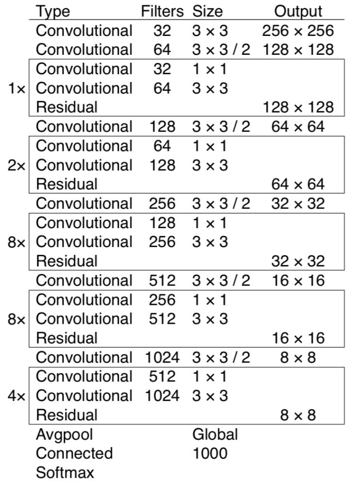 

图2.2是Darknet-53网络。如图所示，整个网络仅包含Convolutional（卷积层）与Residual（残差层），YOLOv3在使用时去除了其中的全连接层，而是使用1×1的卷积核做输出，这样可以保证输入的图片为任意大小。

Darknet-53的性能是resnet-101的1.5倍，是resnet-152效率的2倍。它仅使用卷积层提取特征与残差层控制训练效果的方式来构成特征提取网络，下面分别从卷积层和残差层的作用简单分析Darknet-53。

#### **卷积层分析**

卷积层的具体做法是：例如对于像素为256×256的三通道图片输入（YOLOv3默认的尺寸为416×416），使用32个不同的3×3的卷积核以1个像素为步长在图片输入上滑动，使用卷积核与对应3×3像素做卷积运算以提取特征，得到256×256×32的特征图作为该卷积层的输出。

卷积层的本质是用于提取图片的深度特征， YOLOv3的Darknet-53在绝大多数计算机视觉领域被广泛应用。

#### **残差层分析**

残差层不会改变输入与输出的尺寸，只求残差。本质上它是用来将一个深层网络分为若干小段，保证每一小段网络层次较浅，让每一小段对残差训练，只学习整体LOSS函数的一部分。用于加深网络同时控制了梯度的传播，避免出现梯度弥散、梯度爆炸等问题，强化了训练速度。

### **YOLO层**

在YOLOv3中除掉Darknet-53部分的网络的结构我们称之为YOLO层。YOLO层的网络主要是将Darknet-53多次下采样提取的特征进行交互。

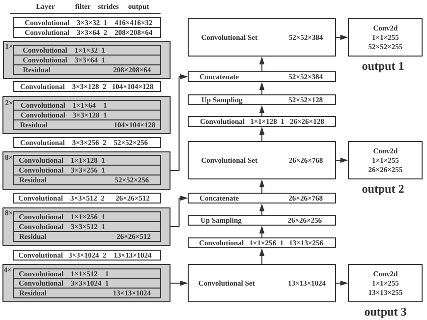 

YOLOv3的整体网络结构图如图2.3所示。YOLOv3中将5次下采样的后三次的特征输出，经过类似FPN结构的处理，得到三层不同尺度的YOLO层（即图2.3中右半部分）。为了叙述方便，此小节中举例的原始输入尺寸均为416×416，即经过五次下采样后，最小特征图尺寸为13×13，中尺度的特征图尺寸为26×26，最大尺度的特征图尺寸为52×52。三个不同尺度的YOLO层均使用1×1卷积核的方式实现类似全连接层的输出效果。

#### **最小尺度YOLO层**

通过Darknet-53的五次下采样得到的最高阶特征图尺寸为13×13，共1024个通道。在这个基础之上用尺寸为1×1、通道数为3×(c+4+1)的卷积核扫描，得到13×13×[3×(c+4+1)]的输出。（c为类别，下同）

#### **中尺度YOLO层**

输入为两部分，一部分为第四次下采样的特征图尺寸为26×26，通道数为512；另一部分则是最高阶特征图13×13×1024与1×1×256卷积核的输出（13×13×256）进行上采样的输出（26×26×256）；两部分结果做concat得到26×26×768的输出。在此基础上使用尺寸为1×1、通道数为3×(c+4+1)的卷积核扫描，得到26×26×[3×(c+4+1)]的输出。

#### **最大尺度的YOLO层**

输入同样为两部分，过程与中尺度YOLO层类似，由两部分构成，分别是中尺度YOLO层降维后上采样的结果和第三次下采样的输出concat的输出（52×52×384）。之后类似于中尺度YOLO层与最小尺度YOLO层，根据类别使用1×1×[3×(c+4+1)]的卷积核得到52×52×[3×(c+4+1)]的输出。

## **YOLOv3算法的实现**

算法的实现借鉴了YOLOv3的思想并基于PyTorch实现，主要有四个模块：模型模块、训练模块、检测模块与评估模块。

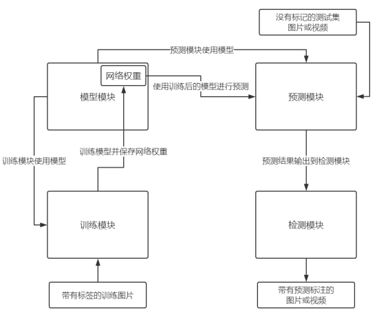

模块间的相互关系如图2.4所示。模型模块是YOLOv3的核心，作用是根据给定的网络结构构建对应的模型，模型将用于训练和预测，同时此模块还保存有模型的网络权重；训练模块从模型模块中读取模型，根据输入的训练集，使用梯度下降法训练模型使Loss函数下降，并将训练后的网络权重保存。预测模块则是通过读取模型以及对应的网络权重，对输入的不带标记的测试图片或视频进行预测；检测模块则是根据预测模块提供的预测框与分类标签，将对应结果绘制在原图或视频上。

### **模型模块**

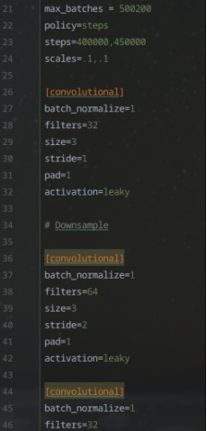

YOLOv3模型的具体组织形式以.cfg的文本格式保存。如图2.5所示。

本文模型模块主要使用PyTorch构建，根据YOLOv3的网络结构，由2.1节的分析可知，YOLOv3由Darknet-53与YOLO层构成，其中Darknet-53主要以卷积层与残差层组成，主要用于提取图片的特征；而YOLO层则主要用于不同层次的特征图交互。为了理解方便，模型的构建将使用流程图的方式将Darknet-53与YOLO层分别描述，在实际实现中二者是在同一循环中实现的。

对于Darknet-53网络的搭建，根据YOLOv3.cfg文本文件，通过读取文件中对应网络层次来构建网络。如在Darknet-53中，仅存在[convolutional]与[shortcut]，即卷积层与残差层，故对应于Darknet-53网络构建的流程图如图2.6所示。

如图2.6所示，Darknet-53的构建主要由卷积层与残差层组成。程序根据当前读入的配置文件判断读入的网络层是卷积层还是残差层。对于每个卷积层，需要根据配置文件设置卷积核数量、尺寸、步长、padding、激活函数；而对于每个残差层，需要设置残差层所需融合的层数以及激活函数；参数设置完成后，将该网络层添加到modules中，重复此步骤，直到配置文件读取完成。

对于YOLO层的网络搭建，则与Darknet-53的过程类似。主要区别在于神经网络的module不一样，YOLO层需要实现特征融合以及候选检测框，对应的层次则是上采样层[upsample]与yolo层以及卷积层[convolutional]，在YOLOv3.cfg文件中可看出其对应关系，每8层卷积层后对应一次yolo层输出，故对应于YOLO网络的构建流程图如图2.7所示。

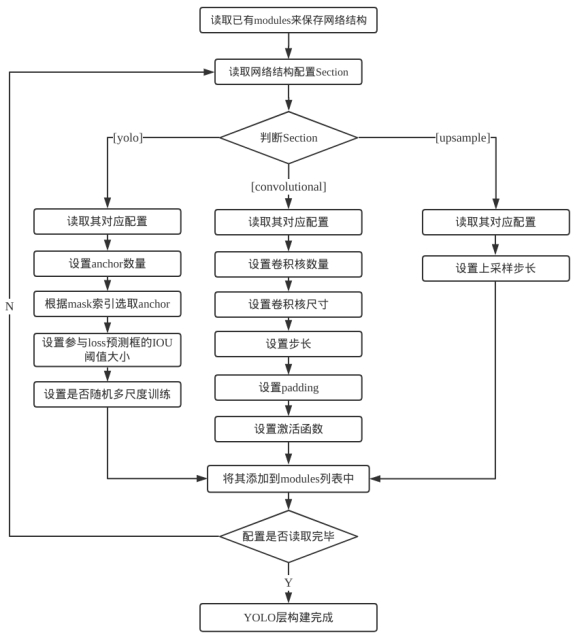

如图2.7所示，这部分网络构建主要由卷积层、yolo层与上采用层组成。程序根据当前读入的配置文件判断读入的网络层。对于每个卷积层，需要根据配置文件设置卷积核数量、尺寸、步长、padding、激活函数；对于每个yolo层，需要设置先验框数量及先验框对应索引，设置参与loss函数预测框的IOU阈值、设置是否随机多尺度训练；对于upsample层，读取并设置上采样的步长即可；参数设置完成后，将该网络层添加到modules中，重复此步骤，直到配置文件读取完成。

### **训练模块**

YOLOv3对于最后的输出通道数为3×(c+4+1)，3指的是三个YOLO层，而c+4+1则分别对应被预测的类别数、预测框与先验框的差（长、宽、中心坐标x，中心坐标y）以及置信度。

预测框的定义如下：

$$
\begin{align}
b_x&=\sigma(t_x)+c_x\\
b_y&=\sigma(t_y)+c_y\\
b_w&=p_wexp(t_w)\\
b_h&=p_hexp(t_h)
\end{align}
$$

最后Loss函数使用回归的方式训练模型，针对YOLOv3的三个输出：分类概率(Class loss)、预测框大小(Bbox loss)、置信度(Confidence loss)求加权和得到。由于YOLOv3作者论文中并未直接给出LOSS函数，其公式仅出现在YOLOv1的论文中[^13]。但不难根据其源码反推得到：

$$
bbox\space loss=\sum_{0}^{n}1^{obj}*[(b_x-l_x)^2+(b_y-l_y)^2+(b_w-l_w)^2+(b_h-l_h)^2]
$$

其中$b_x,b_y,b_w,b_h$分别对应我们预测的中心坐标、宽度与高度。而$l_x,l_y,l_w,l_h$是真实值。$1^{obj}$表示该box是否有目标。

$$
confidence\space loss= \sum_0^n KL(p_0,q_0)
$$

其中$p_0$为物体检测置信度，而$q_0$为真实值，即此处是否有物体（和上面$1^{obj}$）相同，此处选择$q_0$表示是为了统一表述为二者的输出概率，计算两者的交叉熵。

$$
class\space loss=\sum_0^n 1^{obj}*\sum_{c=0}^C KL(p(c),q(c))
$$

其中$1^{obj}$同上，$C$为类别的总数。$$p(c),q(c)$$表示各类别的预测概率与真实概率，计算二者交叉熵。

在实际训练的实现中，Loss函数的梯度下降法使用Adam优化器进行训练。

### **预测模块**

根据输出结果，对于416×416尺寸的图片YOLOv3会预测出(52×52 + 26×26 + 13×13)×3 = 10647个候选框，预测模块需要筛掉多余的候选框，流程如图2.8所示。

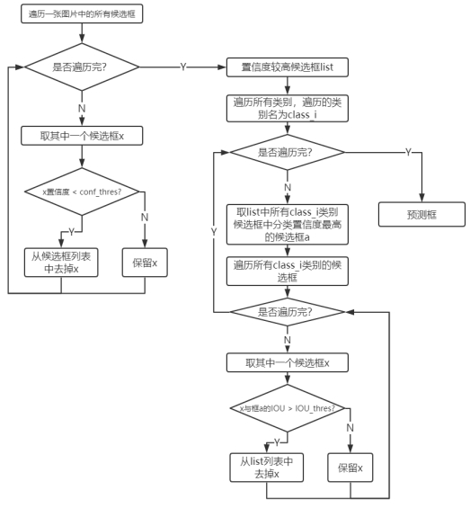

如图2.8所示，预测分为两部分：根据物体置信区度保留置信度较高预测框、根据NMS算法去除同一物体的多个预测框，仅保留IOU最大的预测框。首先根据物体置信区间，通过给出物体置信度阈值来筛选掉一部分置信度较低的结果。随后使用非极大值抑制算法（NMS）先选择分类置信度最高的框A，同时去掉与框A的IOU高于一定阈值的候选框。这里的分类置信度是物体置信度×分类概率；另外，去掉的候选框为与框A**相同类别**的候选框。这样做的好处主要在于防止两类过于接近的不同物体被筛选掉。

### **检测模块**

检测模块主要针对的是没有任何标签标注的数据集，是在预测模块的基础上实现。对于检测模块，预测的部分与2.3.3节相同，通过预测模块获得物体的预测框与预测分类，但额外使用OpenCV将检测到的物体与其分类结果绘制在图片上，并将图片输出为文件保存。由于图片中的小物体相当密集，对于类别标签长度小于图片框长度的标签，一类仅显示一个类别标签，其余不显示。此外，检测模块还实现了视频检测，同样使用OpenCV，对于视频每一帧做检测，并将检测结果实时标注在视频上，最后输出带有预测标注的视频。

### **程序运行结果**

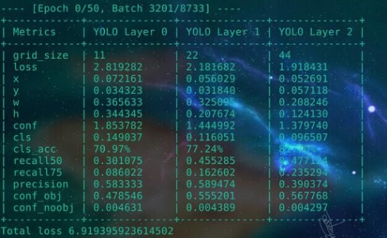

模型训练过程如图2.9所示。

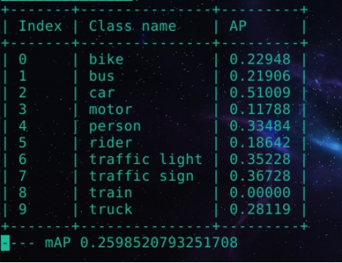

模型训练中某次迭代完成后预测结果如图2.10所示。

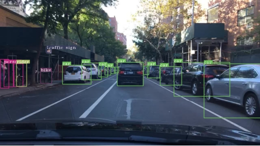

使用某次训练后的模型对图片进行检测，检测结果如图2.11所示。

## **小结**

本章通过分析YOLOv3的网络结构与其算法，理解了YOLOv3类FPN网络结构的高低阶特征融合的思想以及检测器与先验框的关系。同时基于PyTorch重新实现了YOLOv3算法，针对YOLOv3模型、训练、预测和检测的四大模块分别的实现流程予以呈现。通过代码的实现进一步加深对算法的理解，同时也在改进过程中也更容易对代码结构、模型构造等进行调整。

# **算法改进思路的分析与设计**

本章从YOLOv3**模型**与数据集**特征**两个角度提出改进思路并提出改进算法的设计。针对YOLOv3模型的网络结构，首先从先验框入手，对不同阶层的特征图中先验框的大小、数量进行调整，随后调整yolo层的特征金字塔，对于更低或更高阶的特征图信息进行融合；针对数据集，从数据集中物体的类别、大小、分辨率与背景参数的特征分别进行分析，从对数据的处理方向展开研究，分析改进的思路。最后基于改进思路的分析，从先验框于物体大小特征、特征融合、物体类别特征、图片分辨率于图片参数着手设计改进算法。

## **对YOLOv3模型的分析**

### **先验框**

首先针对YOLOv3的先验框进行分析，先验框本质上相当于是YOLOv3在原图片上画格子后，该格子上的检测器的来根据深度特征图去检测物体。由于我们训练的检测框是基于先验框的偏移量，所以理论上，如果先验框的大小一开始就与被监测物体比较接近，则训练的收敛速度就会较快；反之，如果先验框是随机生成的，那么要训练它接近真实的物体框则会以一个相对较慢的速度生成。故改进思路可以从调整先验框着手。

而同时每一个YOLO层由于其特征信息提取的阶层不同，其所包含的特征信息的维度也有所不同。YOLOv3每一层使用了三个检测器（所以对应三个先验框），由于高阶层的特征图所包含的语义特征更多，更适合检测大尺寸物体，所以分配到的先验框相对偏大，在重新分配先验框时，应当将尺寸较大的先验框分配给高阶特征图。

除了先验框的尺寸可以对数据集有针对性的改变，先验框的数量也可以作出改变。但需要注意的是数量增加意味着训练成本与检测成本的上升。这一点在YOLOv2到YOLOv3的升级上也有充分的体现：同样对于416×416的输入图片，YOLOv2的候选框为13×13×5[14]，而YOLOv3的候选框则增加到(13×13+26×26+52×52)×3，这也正是YOLOv3在小物体上检测效果得到显著提升的原因。YOLOv3牺牲了一部分速度来提升了其对于小物体检测等方面的性能，但YOLOv3在速度上还是超过了绝大部分同类算法。如果要增加先验框的数量，则不得不衡量速度与性能之间的取舍。

### **特征融合**

YOLOv3在小物体检测的性能方面大幅度提升，但在面对大尺寸物体时，有些时候反而检测效果不太理想。这可能是由于高维度特征融合到了低维度后，对于高维度的特征权重一定程度上被判低了。

针对这一点有两方面的改进思路：

调整特征金字塔结构。多做一次下采样，然后取后四次的特征进行类似于YOLOv3的融合[^16]。缺点同样是计算量会变大，让YOLOv3变慢。对于投入到实用物体检测算法，准确率并不是唯一的判断标准，更多的应该是精准与速度的权衡。

调整LOSS函数，由前面对损失函数的分析可知，可以有针对性的加大对高阶特征图的置信度权重。但是这个做法的缺点有可能对于整个网络的调整幅度过大。

## **对BDD100K数据集的分析**

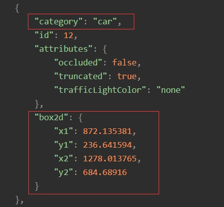

如图3.1所示，BDD100K数据集的标签以JSON格式组织，其中每个待检测的物体对于物体检测有效的标签如图中红色方框所示，给出了物体的类别与物体所在位置真实框的左上角与右下角的坐标。

### **物体大小特征**

由于物体的大小往往是有一定比例的，同时由于数据集均来自车辆内部拍摄，所以不同距离的物体尺寸遵循一定的特征分布。针对这一点，我们可以使用聚类算法针对训练集的物体大小特征进行聚类，得到的结果可以用于YOLOv3层的先验框，用来加快训练的速度与效果。

### **物体类别特征**

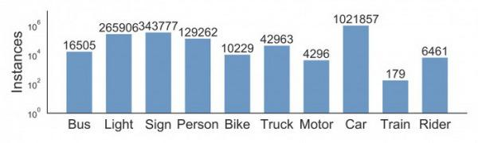

针对BDD100K数据集，其公开标注的训练集包含的物体如图3.2所示。

由于各个类别的数据差距过大，这里的纵坐标只能以数量级差距呈现。因为这一特点，在训练的时候会发现由于某些物体的数量过少，以至于训练程度相对较差。所以可以考虑单独提取包含这些物体的图片进行“特训”，有针对性的对物体类别进行训练，来提升整体的准确率。

### **图片分辨率影响**

比起YOLOv3针对的COCO数据集的输入分辨率640×480，BDD100K数据集的输入分辨率为1280×720，分辨率更大更高清了。这样的情况下显然作为416×416的输入相对而言比较小，不利于模型提取一些细节特征。而YOLOv3由于要保证最终采样的图片尺寸能有中心点，则其尺寸必须为奇数。针对1280×720，可供选择的输入则有480×480、544×544、608×608、672×672；对应最深的特征图尺寸则为：15×15、17×17、19×19、21×21。

对于较高的分辨率，可以得到相对较为细腻的特征图，特征信息也会更加丰富，但同样需要以牺牲速度为代价，需要权衡性能与速度。

### **物体图片参数影响**

大部分物体检测的算法训练中都会涵盖数据增强：即把训练集中的部分图片做各类处理后再进行训练，其中包括调整训练数据的亮度、饱和度、图片抖动等参数，以此来增加模型的鲁棒性。

针对这一点可以对训练集图片的参数进行调整，以下图片分别对原图（图3.3）在饱和度、曝光度于色温方面进行了处理，分别对图片进行了过饱和（图3.4）/欠饱和（图3.5）、过曝（图3.6）/欠曝（图3.7）、低色温（图3.8）/高色温（图3.9）的处理。

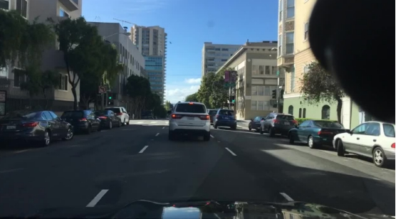

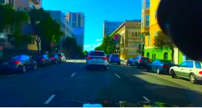 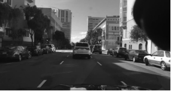

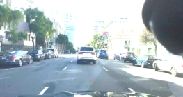 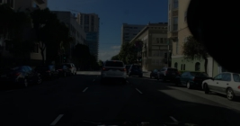

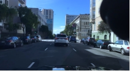 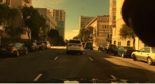

## **改进算法的设计**

针对以上对网络结构与数据处理两方面提出的改进思路，以下从先验框与物体大小特征、特征融合、物体类别、图片分辨率与图片参数，分别阐述了对应的**具体****改进设计**。

### **针对先验框与物体大小特征的改进设计**

基于BDD100K数据集的先验框，使用k-means++聚类方法[^15]，得到如图3.10所示的9个质心的分布位置。

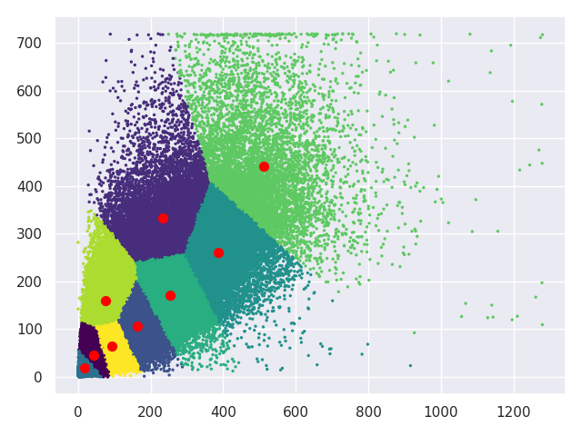 

根据得到的9个质心，对YOLOv3结构进行调整。由于此时我以采用608×608的输入尺寸作为标准，所以将上面anchors归一化后再并放大到608×608分辨率上得到二维坐标如图3.11所示，其在二维空间分布如图3.12所示。

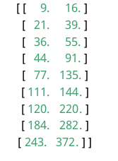

基于此，具体对YOLO层结构的先验框尺寸进行调整（如图3.13所示）。

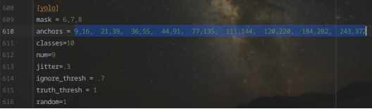

比起YOLOv3作者在COCO数据集上针对416×416尺寸的输入而言，将其归一化并缩放到同一尺寸（608×608）后（图2.1），发现BDD100K数据集中的物体在更窄，更小。这一点也并不难理解，由于拍摄的图像都来自车内，而车本身的边框是会在图片出呈现的，所以有针对性的先验框的训练速度、准确率会更高。

### **针对特征融合的改进设计**

 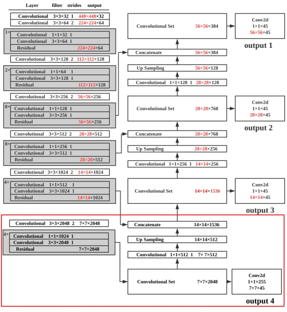

如图3.14所示，对YOLOv3的特征金字塔结构进行调整，在Darknet-53的基础上额外多进行一次下采样（红色方框），同时在YOLO层，使用类FPN网络结构，从更高阶层的特征图（7×7）开始提取特征，并做上采样操作。基于此改进，YOLO层由原先的三层扩展到四层，输出也变成了四层。

### **针对物体类别特征的改进设计**

针对数据集中train这个单独分类的准确率相当低的问题的出现主要在于训练集类别失衡，所存在物体train分类的图片的数量太少。每训练70000张图片时，针对train的图片不超过179张。数据集的样本存在严重失衡的现象。

改进的方式是对数据集进行上采样。经过将存在train类别以及bus、rider、motor这些数量分布较少类别的300张图片单独对模型进行“特训”。

### **针对图片分辨率的改进设计**

图片分辨率的提升能提高图片细节，但更多像素点的特征意味着检测速度可能的降低，由于目前检测速度能达到接近45+fps，所以取一个偏高的尺寸进行改进，取输入图片尺寸为608×608进行改进，对于YOLOv3模型结构，调整如图3.15所示。

### **针对物体图片参数的改进设计**

以0.3的比例使用OpenCV对训练集中的图片分别针对色相饱和度、曝光度于色温三个方面调整参数，由每张被调整的图片可得其过饱和/欠饱和、过曝/欠曝、低色温/高色温的处理后的图片，同时对其标签复制6份以其变换后的命名对应命名标签。以扩充训练集的样本数。

## **小结**

本章从YOLOv3模型与数据集两个方面出发，依据模型的特点与数据集物体特征，分别分析了若干种改进方案与思路，并基于改进思路对算法提出了具体的改进设计。

对于模型，本章从先验框与特征融合两个角度出发分析了YOLOv3的改进思路，对于先验框，从先验框的数量与尺寸上进行调整以改进算法；对于特征融合，从特征金字塔融合的特征阶层高低进行改进。对于数据集，本章从物体类别、大小特征上分析可以在训练中应用于YOLOv3的改进，从图片分辨率与物体背景的影响分析了图片质量对物体检测算法的性能上的改进。最后对于提出的改进思路进行的具体的改进设计。

# **实验与分析**

本章对第3章中对网络结构与数据处理两方面提出的改进思路与设计，对改进前后的算法改进设计进行的具体的实验，并以mAP-30的评价标准了改进的**实际效果**。其中每个改进实验均使用控制变量法，仅调整了单一因素，通过图片、样张对比的方式，展示了改进的实验结果。最后将所有改进同时应用于模型上进行训练，并对比了准确率。

实验在Nvidia GTX 1080Ti GPU、i9-7900X、16G内存基于Ubuntu 16.04 LTS操作系统的设备下运行。为叙述方便，如未特殊说明，本节中改进后的效果的对比均来自原始YOLOv3在BDD100K的检测效果。同时，实验中所有对于算法准确率的评估，均使用MS COCO的mAP-30计算方法来衡量。对于速度的评估，以能达到实时性检测（检测速度不低于30fps）为标准。

## **整体改进效果对比**

将所有改进均作用于模型上并对比未改进前时的检测效果如表所示。表中每个类别均展示了改进前的准确率于改进后的准确率，最后一行展示了改进前后所有类别的平均精度的对比。

| **类别**      | **原始AP** | **改进后AP** |
| ------------- | ---------- | ------------ |
| bike          | 32.12      | **52.54**    |
| bus           | 21.79      | **50.72**    |
| car           | 72.65      | **83.72**    |
| motor         | 13.04      | **49.22**    |
| person        | 52.53      | **68.21**    |
| rider         | 24.49      | **45.62**    |
| traffic light | 57.90      | **75.22**    |
| traffic sign  | 52.60      | **70.23**    |
| train         | 0.01       | **37.1**     |
| truck         | 28.75      | **53.29**    |
| mAP           | 35.60      | **58.59**    |

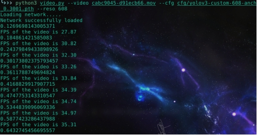

如图4.1所示，在使用改进后的模型对视频进行检测时，速度仍能帧率仍能保持在30fps以上，达到了实时的效果。

## **针对先验框与物体大小特征的改进效果对比**

图4.2中蓝线为改进后算法的mAP。改进后方案的训练曲线由于时间原因仅迭代了50次，不过也是因为仅训练50次便能体现优化效果。根据曲线的收敛速度，不难发现改进后方案在准确率与训练速度方面均高于蓝线。取最好一次的mAP为52.92。

## **针对特征融合的改进效果对比**

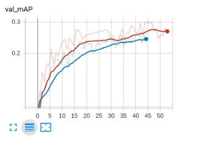

如图4.3所示，针对1K数据集（指在训练集中随机挑选的1000张图的训练集），深红线代表采用了针对特征融合改进后的YOLOv3网络结构的训练结果，蓝线表示使用原始YOLOv3结构的训练结果。在额外增加了一层特征融合的情况下，识别精度有了一定的提升。

## **针对物体类别的改进效果对比**

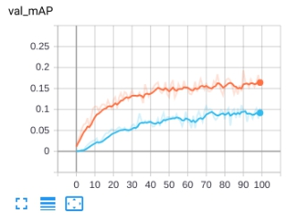

如图4.4所示，针对1K数据集（指在训练集中随机挑选的1000张图的训练集），黄线表示每次迭代额外训练300张上采样数据。而蓝线使用原始网络结构训练数据，训练时额外训练300张训练集中的随机图片（以排除训练次数对精度的影响）。对特定结果较差分类的数据进行额外训练，模型会在整体的检测效果上有一定的提升。 

## **针对图片分辨率的改进效果对比**

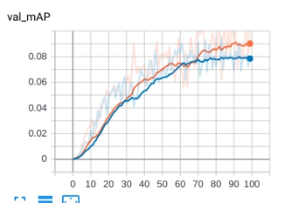

如图4.5所示，针对1K数据集，黄线是608*608分辨率的输入，蓝线则是原始的416*416分辨率的输入。在高分辨率的输入下，模型的准确率更高。

## **针对物体图片参数的改进效果对比**

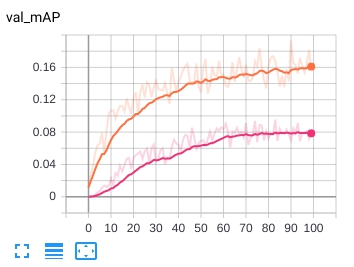

如图4.6所示，针对1K数据集，在每次迭代时，黄线是额外训练了调整了图片参数后的结果，而红线训练的图片则是原始数据集额外加上相同数量但没有经过参数调整的图片（以为排除训练次数对精度的影响）。使用调整了参数的图片训练的模型，其准确率更高。

## **改进前后的样张展示**

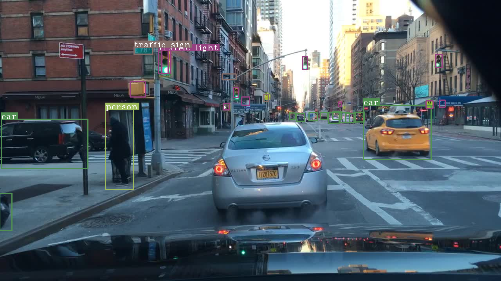 

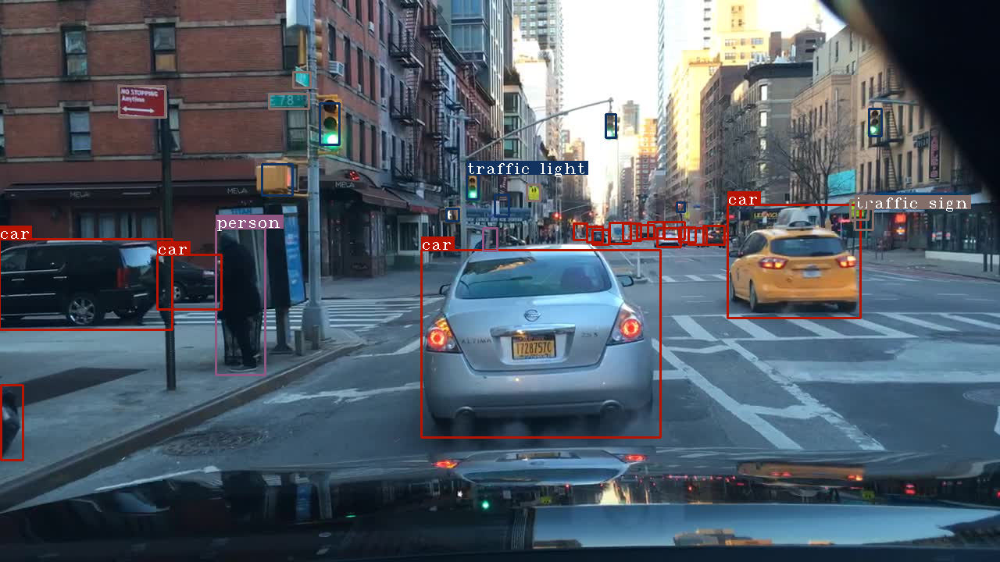

改进前（如图4.7）的样张对于眼前大尺寸物体的检测效果较差，无法较准确地识别较远处的车辆，由于使用特征融合改进，改进后（如图4.8）对大尺寸物体的检测效果有显著提升，同时因为先验框的改进，对于远处信号灯、遮挡车辆等的检测有了显著提升。

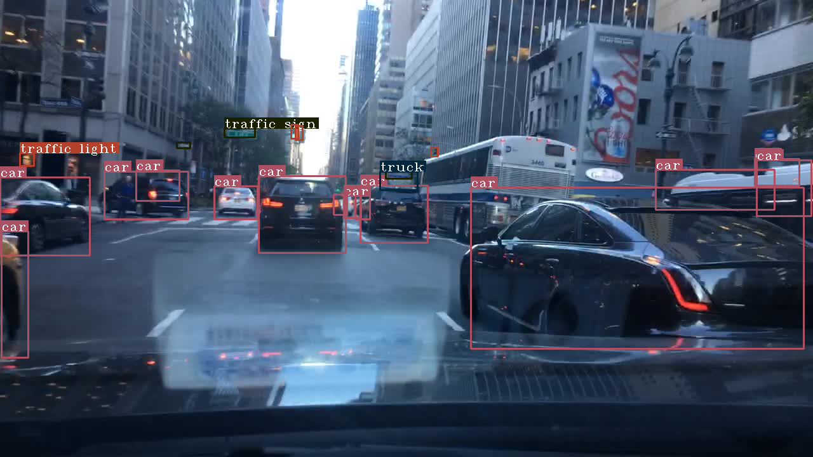 

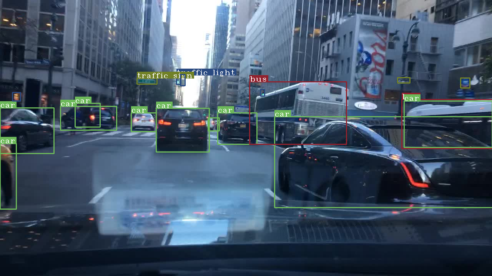

改进后的算法在bbox的准确度和识别物体分类的准确度上得到了显著提升。改进前的样张（如图4.9所示）因为bus类别出现较少而没有识别出来，对类别有针对性的上采样强化训练解决了数据集中类别不平衡的问题（如图4.10所示）。  

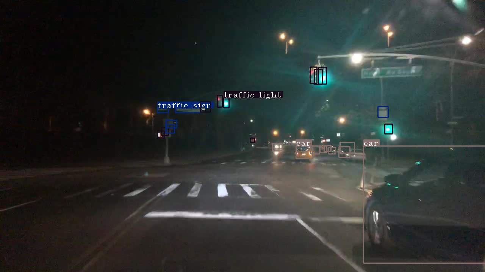 

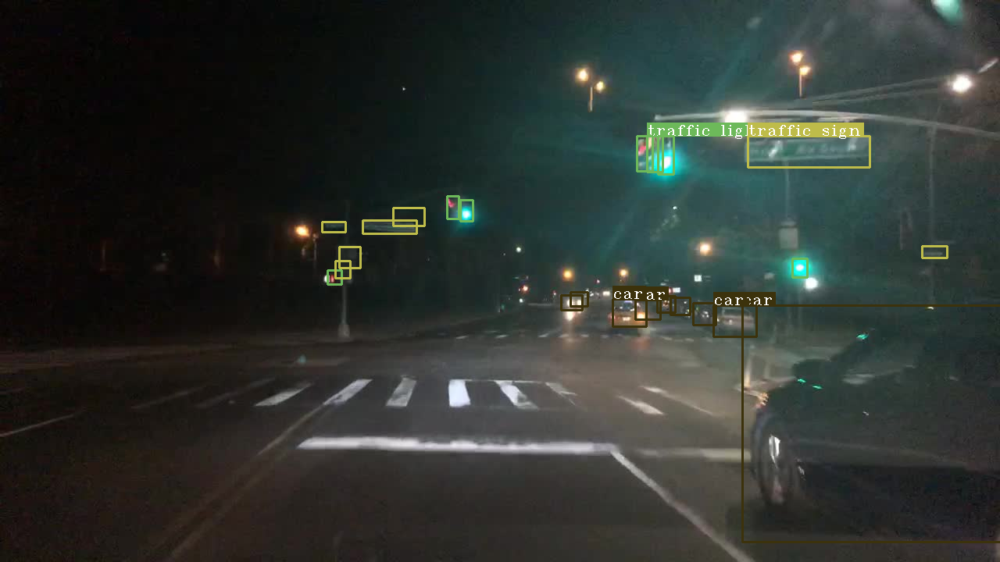

得益于分辨率的提升以及物体背景参数的改进，在夜景环境下，样张（如图4.11）在改进后的算法对于交通信号灯与交通指示牌的识别率要高于改进前（如图4.12）的效果。 

## **小结**

本章给出了物体检测算法YOLOv3的改进的具体实验结果。先给出了整体上的改进效果对比；随后以图表等形式展示了控制变量法下每个改进的改进效果；最后以数张样张直观地呈现了具体改进前后的样张对比。

# **总结与展望**

在计算机视觉飞速发展的今天，对于算法的实际应用而言，我们更加关注的不再只是准确率的高低，而还会去考察性能与速度的权衡。以下从算法的分析实现与改进展开进行总结，并基于完成的工作以及工作中的思考进行下一步工作的展望。

## **总结**

对于YOLOv3算法的分析与实现，本研究深入分析了YOLOv3算法，从YOLOv3的先验框与特征融合入手，理解了先验框对于每个YOLO层检测器的影响以及每层YOLO的特征信息之间的交互，加深了对YOLOv3特征金字塔的理解。随后针对YOLOv3的网络结构，深入理解了Darknet-53多次下采样的方式来特征提取的思路，以及使用残差层来加深网络并控制梯度爆炸、梯度弥散的思想。最后为了从细节理解YOLOv3算法，我从模型模块、训练模块、预测模块与检测模块四个方面基于PyTorch框架实现了YOLOv3算法，模型模块通过读取编写网络结构.cfg的文本文件来组织YOLOv3的整体网络结构，并实现了网络权重的读取与保存功能，以用于继续训练或预测模块使用；训练模块使用模型模块来读取网络结构，并通过读取图片以及对应标注，针对基于预测框置信度、预测框到真实框的偏差与类别预测概率的LOSS函数，使用Adam优化器对网络进行训练，并使用模型模块将训练后的网络权重保存；预测模块通过预测框置信度与针对类别的NMS算法实现，并通过验证集的标签实现了mAP计算的功能；最后检测模块主要针对没有标注的图片或视频，模块使用openCV将预测框与对应类别画在输入的图片或视频中并输出。

对于算法改进思路的分析与设计，本研究针对先验框与物体大小特征，使用了K-means++聚类算法针对BDD100K数据集的物体大小做了聚类分析，获得了9个聚类质心，并把它们作为先验框的尺寸进行训练，收敛速度有显著提升；针对特征融合，我调整了特征金字塔的结构，在多一次降采样与上采样的特征融合的效果下，准确率得到了一定的提升；针对图片分辨率的影响，我选择了19×19作为最深层特征图，输入的尺寸提升到了608×608。因为分辨率的提升，训练时对特征的提取得到了进一步的提升，预测的候选框数量也有增加，所以准确率获得了很明显的提升，尽管检测的速度相对略有下降，但其检测速度能保持在“实时”的效果之上；针对物体类别特征，由于BDD100K训练集中所包含的物体的数量比例不尽相同，存在严重的类别失衡情况。在挑出了接近300多张包含train、bus、rider、motor等这类出现频率很低的图片进行训练后，这些类别的效果也得到很好的提升。

## **展望**

对于图片分辨率的影响这一点的改进，我尝试了608×608的输入尺寸，对于19×19规格的特征图，在效果上由于细节的增加肯定会提升准确率，但同时其检测效果仅受到了小幅度的影响——仍能维持“实时”的水平。对于这一点改进思路我会进一步拓展，一方面尝试672×672规格的输入，并试图找到某个打破性能与速度平衡的临界值；另一方面测试嵌入式设备——Jetson TX1/TX2的检测性能，并找到一个在嵌入式设备上能维持实时检测、同时达到准确率尽可能高的临界尺寸。

对于特征融合这一改进思路上，由于在提取一次特征必须要求有更大尺寸的图片，同时所需要的计算量也变得更加大，尤其是如果在三层特征金字塔的基础上再加一层，可能会较大幅度的影响到嵌入式设备的检测速度，下一步工作会往修改Loss函数的方向探索，通过改善对大尺寸物体的检测来获得mAP的提升。

对于物体类别的改进，有可能引起这些类别的过拟合问题。应当考虑在上采样的同时，针对性的做一些下采样，即限制过多类别上比例较多的图片的训练。后续可以考虑依据标签的类别比例来训练模型。

[^1]:  Redmon J, Farhadi A. Yolov3: An incremental improvement[J]. arXiv: 1804.02767, 2018.

[^2]:  D. F. Llorca, R. Arroyo, M. A. Sotelo, Vehicle logo recognition in traffic images using HOG features and SVM, Proc. 16th Int. IEEE Conf. Intell[C]. Transp. Syst. (ITSC), pp. 2229-2234, Oct. 2013.

[^3]:  S. Gidaris and N. Komodakis. Object detection via a multi-region & semantic segmentation-aware CNN model[J]. arXiv:1505.01749v3,2015.

[^4]:  Huazhe Xu, Yang Gao, Fisher Yu, and Trevor Darrell. End-to-end learning of driving models from large-scale video datasets[J]. arXiv: 1612.01079, 2017.

[^5]:  Fisher Yu, Wenqi Xian, Yingying Chen, Fangchen Liu, Mike Liao, Vashisht Madhavan, Trevor Darrell. "BDD100K: A Diverse Driving Video Database with Scalable Annotation Tooling"[J]. arXiv:1805.04687, 2017.

[^6]:  Ye Xia, Danqing Zhang, Jinkyu Kim, Ken Nakayama, Karl Zipser, David Whitney. "Predicting Driver Attention in Critical Situations"[J]. arXiv:1711.06406v3, 2018

[^7]:  A. Krizhevsky, I. Sutskever, and G. E. Hinton, “Imagenet classification with deep convolutional neural networks,” in Advances in neural information processing systems, 2012[C]. pp. 1097–1105, 2012.

[^8]:  Shaoqing Ren, Kaiming He, Ross Girshick, and Jian Sun. Faster R-CNN: Towards real-time object detection with region proposal networks[J]. arXiv:1605.06409v2, 2016.

[^9]:  李名波.基于机器学习的目标检测算法综述[J].计算机产品与流通,2019(06):154-155.

[^10]:  郭明玮,赵宇宙,项俊平,张陈斌,陈宗海.基于支持向量机的目标检测算法综述[J].控制与决策,2014,29(02):193-200.

[^11]:  李丹.基于深度学习的目标检测综述[J].科技经济导刊,2019,27(13):1-2+31.

[^12]:  Lin T Y, Dollár P, Girshick R, et al.Feature pyramid net-works for object detection[J].arXiv: 612.03144v2, 2017.

[^13]:  J. Redmon, S. Divvala, R. Girshick and A. Farhadi, "You Only Look Once: Unified, Real-Time Object Detection," 2016 IEEE Conference on Computer Vision and Pattern Recognition (CVPR), Las Vegas, NV, 2016[C]. pp. 779-788, 2016.

[^14]:  J. Redmon and A. Farhadi, "YOLO9000: Better, Faster, Stronger," *2017 IEEE Conference on Computer Vision and Pattern Recognition (CVPR)*, Honolulu, HI, 2017[C]. pp. 6517-6525, 2017.

[^15]:  Bahman Bahmani , Benjamin Moseley , Andrea Vattani , Ravi Kumar , Sergei Vassilvitskii, Scalable k-means++[J]. Proceedings of the VLDB Endowment, v.5 n.7, p.622-633, March 2012.

[^16]:  李云鹏,侯凌燕,王超.基于YOLOv3的自动驾驶中运动目标检测[J].计算机工程与设计,2019,40(04):1139-1144.
