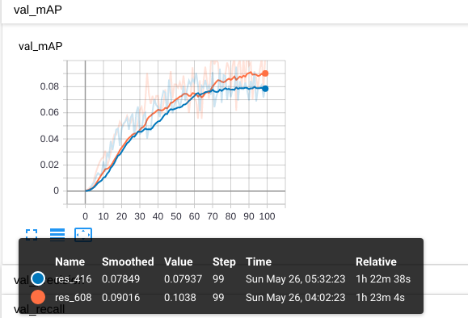
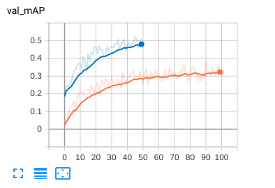

**物体检测算法YOLOv3的改进——论文**

2019-05-23 16:55:17

# **摘要**

对于图像或视频中的车辆、行人、信号灯等交通物体进行检测是自动驾驶领域中非常基础且重要的任务。任务的难点在于在路况复杂的场景中对于车辆、行人、信号灯、信号牌等物体进行精确的定位与分类。针对此问题，本文提出一种针对传统YOLOv3算法的改进方案，实现对于不同复杂环境下对于不同目标的实时检测。改进方案针对物体的大小分布特征调整了先验框的大小，随后针对高分辨率的输入数据对网络进行调整，最后根据不同类别物体的特征，针对类别不平衡问题，对类别比例少的物体进行了上采样强化训练。具体地，针对BDD100K数据集，对于608×608分辨率的图形输入，在NVIDIA GTX 1080Ti GPU的训练下，能达到58.59%的mAP（平均精度），速度达到实时检测级别（超过30 fps）。高于同等条件下原生YOLOv3模型35.6%的mAP。

关键词: YOLOv3; 特征融合; 卷积神经网络; 物体检测; 实时检测

# **Abstract**

Vehicles, people and traffic lights such traffic objects detection on images or video data is a fundamental and important task for self-driving vehicle. The difficulty of it is to accurately classify and locate traffic objects such as vehicles, people, traffic lights and traffic signs on complex road conditions. To solve this problem, the paper presents a improved solution based on the native YOLOv3 for different types of traffic object detection in varied complex situation. The improved solution adjust bounding box priors based on object size distribution, then change the size of input for high resolution images. The solution use up sampling enhancing training on unappropriated class data to get rid of imbalanced classes problem on dataset. Specifically, for 608×608 input, on NVIDIA GTX 1080Ti GPU platform, we trained a model that achieves 58.59%mAP at the real-time level for detection (over 30 fps) on BDD100K dataset, higher than the native YOLOv3 model's result of 35.6% mAP.

Key words: YOLOv3; feature fusion; convolutional neural network; object detection; real-time detection

# **绪论**

## **研究背景与意义**

### **研究背景**

随着人工智能与深度学习的不断发展，计算机视觉这一领域获得了空前的发展。而作为计算机视觉最基础的目标：物体检测也随着在不断的进步。目前以YOLOv3[^1]（You Only Look Once version 3）、Faster-RCNN（Region Convolutional Neural Network）等为代表的物体检测算法则表现的尤为出色，而其中YOLOv3算法则以其速度极快以及不俗的准确率而著称。而伴随着科技的不断发展，自动驾驶技术开始从实验室中的技术积累向商业化实际使用落地。这其间涉及大量自动化控制、物体识别、惯量测量以及各类感知传感器等技术的应用，而物体识别在其中尤为突出。对于图像或视频中的车辆、行人、信号灯等交通物体进行检测是自动驾驶领域中非常基础且重要的任务[^2][^3]。

针对以上现状，我们需要将优秀的物体检测算法进行有针对性的改进与优化，从而在识别速度与识别准确率上达到较高水平，从而可以有针对性的应用于自动驾驶技术。本文主旨在于使用YOLOv3算法，针对BDD100K（Berkeley DeepDrive 100K）数据集[^4][^5][^6]，有针对性的改进其物体检测的效果。

### **研究意义**

基础理论意义

物体检测是计算机视觉中的一个重要基础，它广泛应用于智能视频监控、机器人导航、工业检测等领域，通过计算机视觉减少对人力资本的消耗，具有重要的现实意义。不仅如此，物体检测同时也是泛身份识别领域的一个基础性的算法，它对后续的人脸与步态识别、计数、实例分割等任务也有着深远的影响。

现实意义

目前大多数现存的物体检测算法需要大量算力进行训练，即使是检测也需要如x86平台高配置GPU这样较为苛刻的环境才能达到“实时”的效果。而YOLOv3基于轻量级网络darknet-53开发，使用c语言编写，对嵌入式环境相当友好。在有针对性的改进后，仍能在嵌入式环境下保持高准确率的实时检测效果，对于如“无人驾驶”、“机器人导航”等实用投入方面具有建设性的意义。

## **国内外研究现状**

在2012年Hinton基于CNN的AlexNet在图像识别比赛中脱颖而出夺冠后[^7]，神经网络、尤其是卷积神经网络对于计算机视觉方面的应用开始受到重视。相比较于传统算法，深度学习在深层次模型计算方面提取抽象特征的能力远远高于前者，能够在海量数据中提取出传统特征提取方法所无法发现的复杂结构。从12年CNN在图像识别方面的应用爆发后，深度学习现已经成功地在包括计算机视觉领域内的多模式分类问题上得到了相当广泛的应用，而物体检测算法在其间也得到了突飞猛进的发展。

根据查阅的物体检测文献以及各类网络资料，简要地总结物体检测算法大致可分为如下三类：

• 传统物体检测算法

• 候选窗+深度学习分类

• 基于深度学习的回归方法

早先传统的物体检测算法大多以不同尺度的窗口滑动来选定图像的区域作为候选区，在候选区提取HOG/LTP等一类或多类特征，最后使用支持向量机等机器学习的分类算法对对应候选区域进行分类。常见的算法如Haar Cascade、DPM（Deformable Parts Model）及对应的诸多改进等。

第二类算法起源于深度学习的广泛应用。由于传统算法产生的后选框数量太大，提取的特征与训练往往很难快速收敛，而深度学习的方法具有更强大的模型描述能力与特征提取效果，物体检测算法开始向深度学习方向发展。其中最有名的R-CNN算法便是通过selective search的方式，在图片中提取可能的物体候选窗口，将深度学习的特征送到分类器进行分类[^8]。后面的Faster-RCNN提出的ROI pooling层解决了前者大量重复的卷积计算问题，用RPN（Region Proposal Network）来取代selective search，基本能达到实时监测的效果。这类算法以及优化有：RCNN、Fast-RCNN、Faster-RCNN、SPP-net（Spatial Pyramid Pooling - net）等。

而基于深度学习的回归方法的代表则是YOLO算法，YOLO的核心思想是对于输出的图像使用网格划分来提取候选框。对于每个划分的网格，有类别+置信度+bounding box与先验框的差距这三类参数组成，从而将物体检测中的分类+确定物体位置这两个问题合并为一个回归问题。而YOLOv3的改进则通过类FPN网络的思路进行了特征融合，加强了对于紧凑密集或者高度重叠目标的检测效果。基于C语言开发和其精简的网络结构以及其One-Stage的预测方式，YOLO的速度非常快，比R-CNN快1000倍，比Fast R-CNN快100倍。这类算法以及优化有：YOLO系列、SSD、DenseBox、结合RNN的RRC detection、结合DPM的Deformable CNN等。

## **本文研究内容**

根据以上物体检测算法的分析，不难发现YOLOv3算法最显著的特点是其不依赖复杂框架，其使用的框架简洁，为后续的优化改进提供了相对较多的可能性；其次其计算性能相对较高，能达到实时检测。本文选择以现有YOLOv3作为研究目标，针对自动驾驶数据集BDD100K，提出一种基于YOLOv3算法的改进方案，以提高算法在此数据集上的物体检测性能。

基于此，本文主要完成以下几个方面的内容以实现改进：

基于BDD100K数据集中bounding box大小的分布，确定有针对性的bounding box priors

基于对不同类别物体的分布特征分析，逐类别提高算法的检测性能

设计合适的输入预处理方法，充分利用图像的高分辨率提高算法的物体检测性能

## **本文组织结构**

为了更清晰的呈现改进思路，本文将以如下形式组织：

第一章为绪论部分。本章从研究背景、意义与国内外的研究现状出发，对比了各类物体检测算法的优缺点以及选择YOLOv3改进的理由，阐述了研究的出发点与改进的主要方向与思路。

第二章为YOLOv3算法核心思想的研究。本章研究了YOLOv3的模型结构，详细分析了YOLOv3算法的核心原理，从原理上阐述了YOLOv3关于特征提取与特征金字塔以及特征融合的思想，详细分析了其训练与检测过程中的步骤。

第三章为算法改进思路的分析。本章承接第二章对YOLOv3核心思路的分析与不足，加以研究其他学者针对物体检测算法核心思路的分析[^9][^10][^11]，提出了YOLOv3针对BDD100K数据集的改进思路的分析与可行性研究。

第四章为改进算法的实现与效果。本章在第三章对改进思路进行分析后，着重阐述了改进思路具体实现的尝试与改进的实际效果。效果的评价方式使用标准的mAP@[.5:.95]方法计算模型性能。并依据呈现的改进效果，分别对于其产生正效果与负效果做出了分析。

第五章为总结与展望。本章总结了本文基于YOLOv3所作出的所有有效改进与实际产生的成效，同时基于自己的工作阐述了其中存在的一些问题与不足，最后描述了对物体检测方向应用的一些展望。

# **YOLOv3算法核心思想的研究**

YOLOv3是一个全卷积的结构，包括结果输出网络也没有使用全连接层以减少计算量与保证输入可不固定，而是使用了1×1的卷积核做输出。由于YOLOv3算法的核心思想并非本文的重点，本文仅对其网络结构与核心思想做出描述。

## **YOLOv3网络结构**

YOLOv3一共两部分构成，前面0-74层网络为Darknet-53，而后面由卷积层与YOLO层构成，通过类似于FPN的结构将多个Scale的特征图融合起来，分别输出，来检测不同尺寸的物体[^12]。YOLOv3也正是通过这个方式解决了YOLOv2中对小物体以及密集物体检测效果不佳的问题。

### **Darknet-53**

YOLOv3的网络结构是基于Darknet-53实现的，Darknet-53是YOLOv3特征提取的主干网。

 

 

此图是Darknet-53网络，图片直接引用自YOLOv3作者的原图。如图所示，整个网络仅包含Convolutional（卷积层）与Residual（残差层），YOLOv3在使用时去除了其中的全连接层，而是使用1×1的卷积核做输出，这样可以保证输入的图片为任意大小。

Darknet-53的性能是resnet-101的1.5倍，是resnet-152效率的2倍。它仅使用卷积层提取特征与残差层控制训练效果的方式来构成特征提取网络，下面分别从卷积层和残差层的作用简单分析Darknet-53。

#### **卷积层分析**

卷积层的具体做法是：例如对于像素为256×256的三通道图片输入（YOLOv3默认的尺寸为416×416），使用32个不同的3×3的卷积核以1个像素为步长在图片输入上滑动，使用卷积核与对应3×3像素做卷积运算以提取特征，得到256×256×32的特征图作为该卷积层的输出。

卷积层的本质是用于提取图片的深度特征，在YOLOv3的Darknet-53与绝大多数计算机视觉领域被广泛应用。

#### **残差层分析**

残差层不会改变输入与输出的尺寸，只求残差。本质上它是用来将一个深层网络分为若干小段，保证每一小段网络层次较浅，让每一小段对残差训练，只学习整体LOSS函数的一部分。用于加深网络同时控制了梯度的传播，避免出现梯度弥散、梯度爆炸等问题，强化了训练速度。

### **YOLO层**

在YOLOv3中除掉Darknet-53部分的网络的结构我们称之为YOLO层。YOLO层的网络主要是将Darknet-53多次下采样提取的特征进行交互。

YOLOv3中将5次下采样的后三次的特征输出，经过类似FPN结构的处理，得到三层不同尺度的YOLO层。为了叙述方便，此小节中举例的原始输入尺寸均为416×416，即经过五次下采样后，最小特征图尺寸为13×13，中尺度的特征图尺寸为26×26，最大尺度的特征图尺寸为52×52。

三个不同尺度的YOLO层均使用1×1卷积核的方式实现类似全连接层的输出效果。具体结构如图所示。

 

 

#### **最小尺度YOLO层**

通过Darknet-53的五次下采样得到的最高阶特征图尺寸为13×13，共1024个通道。在这个基础之上用尺寸为1×1、通道数为3×(c+4+1)的卷积核扫描，得到13×13×[3×(c+4+1)]的输出。（c为类别，下同）

#### **中尺度YOLO层**

输入为两部分，一部分为第四次下采样的特征图尺寸为26×26，通道数为512；另一部分则是最高阶特征图13×13×1024与1×1×256卷积核的输出（13×13×256）进行上采样的输出（26×26×256）；两部分结果做concat得到26×26×768的输出。在此基础上使用尺寸为1×1、通道数为3×(c+4+1)的卷积核扫描，得到26×26×[3×(c+4+1)]的输出。

#### **最大尺度的YOLO层**

输入同样为两部分，过程与中尺度YOLO层类似，由两部分构成，分别是中尺度YOLO层降维后上采样的结果和第三次下采样的输出concat的输出（52×52×384）。之后类似于中尺度YOLO层与最小尺度YOLO层，根据类别使用1×1×[3×(c+4+1)]的卷积核得到52×52×[3×(c+4+1)]的输出。

## **YOLOv3的核心思想分析**

YOLOv3在物体检测上主要由Darknet-53主干网来提取图片的深度特征，随后使用三层YOLO层对于特征进行交互，让模型可以结合上下文做出预测。

### **特征融合**

YOLOv3基于Darknet-53的5次下采样中的后三次。一般可以认为，随着网络加深，浅层的特征图中主要包含一些较为低级的特征，例如物体的边缘、位置、颜色等；而深层次的特征图则包含相对高级的特征，例如物体的某些抽象的语义信息：车辆、动物等。所以通过将不同层次的特征融合起来进行回归训练，最后作出预测有利于提高识别的精度。

对于多重Scale，SSD算法在这一点上是使用了Pyramidal feature hierarchy，即针对不同层次的特征分别训练用来检测物体，这种思路的问题在于每一层特征来源仅来自下层，而之后提取的更高层的特征无法使用；而YOLOv3则在此基础之上额外增加了特征融合，将之后提取的更高层的特征做一次下采样，融合到当前层，这样低阶特征与高阶特征得到了有机融合，精度得以提升。

### **先验框**

YOLOv3在训练时使用先验框，其训练出来的坐标值与长宽均为相对先验框的偏移量而非绝对值。先验框是通过聚类算法在训练集上预测9个聚类物体的大小获得。

YOLOv3在每一个YOLO层的最终输出上，对在每个特征点都使用3个先验框来找到物体所在的位置，训练结果为预测框与先验框的偏移量。针对三层不同尺寸的YOLO层，分别对应的先验框尺寸不同。由于越高阶的特征图所包含的特征信息更高级，他们更适合检测大尺寸的物体，故越高层次的先验框越大；而低阶的特征由于融合了高阶特征的信息，其尺寸也更大，更适合检测小尺寸的物体。

### **训练**

YOLOv3对于最后的输出通道数为3×(c+4+1)，3指的是三个YOLO层，而c+4+1则分别对应被预测的类别数、预测框与先验框的差（长、宽、中心坐标x，中心坐标y）以及置信度。

预测框的定义如下：

$$
\begin{align}
b_x&=\sigma(t_x)+c_x\\
b_y&=\sigma(t_y)+c_y\\
b_w&=p_wexp(t_w)\\
b_h&=p_hexp(t_h)
\end{align}
$$


最后Loss函数使用回归的方式训练模型，针对YOLOv3的三个输出：分类概率(Class loss)、预测框大小(Bbox loss)、置信度(Confidence loss)求加权和得到。由于YOLOv3作者论文中并未直接给出LOSS函数，其公式仅出现在YOLOv1的论文中[^13]。但不难根据其源码反推得到：


$$
bbox\space loss=\sum_{0}^{n}1^{obj}*[(b_x-l_x)^2+(b_y-l_y)^2+(b_w-l_w)^2+(b_h-l_h)^2]
$$

其中$b_x,b_y,b_w,b_h$分别对应我们预测的中心坐标、宽度与高度。而$l_x,l_y,l_w,l_h$是真实值。$1^{obj}$表示该box是否有目标。

$$
confidence\space loss= \sum_0^n KL(p_0,q_0)
$$

其中$p_0$为物体检测置信度，而$q_0$为真实值，即此处是否有物体（和上面$1^{obj}$）相同，此处选择$q_0$表示是为了统一表述为二者的输出概率，计算两者的交叉熵。

$$
class\space loss=\sum_0^n 1^{obj}*\sum_{c=0}^C KL(p(c),q(c))
$$

其中$1^{obj}$同上，$C$为类别的总数。$$p(c),q(c)$$表示各类别的预测概率与真实概率，计算二者交叉熵。

### **预测**

根据输出结果，对于416×416尺寸的图片，YOLOv3会预测出(52×52+26×26+13×13)×3=10647个候选框，需要筛选出有效结果。预测分为两部分：

首先根据物体置信区间，通过给出物体置信度阈值来筛选掉一部分置信度较低的结果。

使用非极大值抑制算法（NMS）先选择分类置信度最高的框A，同时去掉与框A的IOU高于一定阈值的候选框。

对于第二点，这里的分类置信度是物体置信度×分类概率；另外，去掉的候选框为框A相同类别的候选框。这样做的好处主要在于防止两类过于接近的不同物体被筛选掉。

# **算法改进思路的分析**

根据前文对YOLOv3算法的详细分析，对于其改进从两方面展开，一方面去挖掘模型中可能存在的不足或者可以调整的部分；另一方面去挖掘数据集所包含的特征。

## **对YOLOv3模型的分析**

### **先验框**

首先针对YOLOv3的先验框进行分析，先验框本质上相当于是YOLOv3在原图片上画格子后，该格子上的检测器的来根据深度特征图去检测物体。由于我们训练的检测框是基于先验框的偏移量，所以理论上，如果先验框的大小一开始就与被监测物体比较接近，则训练的收敛速度就会较快；反之，如果先验框是随机生成的，那么要训练它接近真实的物体框则会以一个相对较慢的速度生成。故改进思路可以从调整先验框着手。

而同时每一个YOLO层由于其特征信息提取的阶层不同，其所包含的特征信息的维度也有所不同。YOLOv3每一层使用了三个检测器（所以对应三个先验框），由于高阶层的特征图所包含的语义特征更多，更适合检测大尺寸物体，所以分配到的先验框相对偏大，在重新分配先验框时，应当将尺寸较大的先验框分配给高阶特征图。

出了先验框的尺寸可以对数据集有针对性的改变，先验框的数量也可以作出改变。但需要注意的是数量增加意味着训练成本与检测成本的上升。这一点在YOLOv2到YOLOv3的升级上也有充分的体现：同样对于416×416的输入图片，YOLOv2的候选框为13×13×5[^14]，而YOLOv3的候选框则增加到(13×13+26×26+52×52)×3，这也正是YOLOv3在小物体上检测效果得到显著提升的原因。YOLOv3牺牲了一部分速度来提升了其对于小物体检测等方面的性能，但YOLOv3在速度上还是超过了绝大部分同类算法。如果要增加先验框的数量，则不得不衡量速度与性能之间的取舍。

### **特征融合**

YOLOv3在小物体检测的性能方面大幅度提升，但在面对大尺寸物体时，有些时候反而检测效果不太理想。这可能是由于高维度特征融合到了低维度后，对于高维度的特征权重一定程度上被判低了。

针对这一点有两方面的改进思路：

调整特征金字塔结构。多做一次下采样，然后取后四次的特征进行类似于YOLOv3的融合。缺点同样是计算量会变大，让YOLOv3变慢。对于投入到实用物体检测算法，准确率并不是唯一的判断标准，更多的应该是精准与速度的权衡。

调整LOSS函数，由前面对损失函数的分析可知，可以有针对性的加大对高阶特征图的置信度权重。但是这个做法的缺点有可能对于整个网络的调整幅度过大。

## **对BDD100K数据集的分析**

### **物体类别特征**

针对BDD100K数据集，其公开标注的训练集包含的物体如图所示。

 

 

由于各个类别的数据差距过大，这里的纵坐标只能以数量级差距呈现。因为这一特点，在训练的时候会发现由于某些物体的数量过少，以至于训练程度相对较差。所以可以考虑单独提取包含这些物体的图片进行“特训”，有针对性的对物体类别进行训练，来提升整体的准确率。

### **物体大小特征**

由于物体的大小往往是有一定比例的，同时由于数据集均来自车辆内部拍摄，所以不同距离的物体尺寸遵循一定的特征分布。针对这一点，我们可以使用聚类算法针对训练集的物体大小特征进行聚类，得到的结果可以用于YOLOv3层的先验框，用来加快训练的速度与效果。

### **物体位置特征**

类似地，BDD100K数据集中，对于物体的位置特征（例如红绿灯往往会处于图片的上方位置等）同样可以使用聚类算法提取大致的分布。

### **图片分辨率影响**

比起YOLOv3针对的COCO数据集的输入分辨率640×480，BDD100K数据集的输入分辨率为1280×720，分辨率更大更高清了。这样的情况下显然作为416×416的输入相对而言比较小，不利于模型提取一些细节特征。而YOLOv3由于要保证最终采样的图片尺寸能有中心点，则其尺寸必须为奇数。针对1280×720，可供选择的输入则有480×480、544×544、608×608、672×672；对应最深的特征图尺寸则为：15×15、17×17、19×19、21×21。

对于较高的分辨率，可以得到相对较为细腻的特征图，特征信息也会更加丰富，但同样需要以牺牲速度为代价，需要权衡性能与速度。

### **物体背景参数影响**

大部分物体检测的算法训练中都会涵盖数据增强：即把训练集中的部分图片做各类处理后再进行训练，其中包括调整训练数据的亮度、饱和度、图片抖动等参数，以此来增加模型的鲁棒性。

针对这一点可以对训练集图片的参数进行调整，比如为了增强夜间物体检测的效果，可以通过降低图片的亮度与饱和度来训练；为了增强减速带、碎石路段的检测效果，可以通过为图片增加一些抖动效果进行训练等，以增强模型的泛化能力。

# **改进算法的实现与效果**

本章节的结构将以以下四个方面出发来阐述。

• 评价算法改进的标准

• 在不作出改进时模型对BDD100K检测的效果

• 做出的改进实现

• 改进后与改进前的效果对比

## **算法改进的标准**

作为针对无人驾驶数据集BDD100K的YOLOv3算法改进，应当以实用性为主，不能一味追求准确率，模型力求准确的同时还应当兼顾检测速度。基于以上要求，对算法改进的标准判定如下：

• 对于没有达到“实时检测”——即检测速度低于25fps——的模型不应当认定为算法的改进。

• 改进应当基于未改进算法的准确率或速度，即在准确率保持不变的情况下得到了速度的提升、或速度保持不变的情况下得到了准确率的提升；或者二者同时提升，应当被视作算法的改进。

所有对于算法准确率的评估，使用标准的MS COCO的mAP-50计算方法来衡量。而对于速度的评估，速度应当包括检测速度与训练速度两方面。

## **原始YOLOv3在BDD100K上的检测效果**

在保证原网络结构不变的前提下，仅改变网络的类别数量与对应输出的卷积核数量，在100次迭代后得到训练结果如下：

| 类别          | AP-50 |
| ------------- | ----- |
| bike          | 32.12 |
| bus           | 21.79 |
| car           | 72.65 |
| motor         | 13.04 |
| person        | 52.53 |
| rider         | 24.49 |
| traffic light | 57.90 |
| traffic sign  | 52.60 |
| train         | 0.01  |
| truck         | 28.75 |
| mAP           | 35.60 |

## **改进后的YOLOv3**

以下仅列出对于算法改进有积极成效的做法，对于没有取得较好效果的改进思路将在总结与展望章节中展开分析。

### **针对图片分辨率的改进**

图片分辨率是相对明显且容易的改进。唯一可能影响的是检测速度，由于目前检测速度能达到接近45+fps，所以取一个偏高的尺寸进行改进，取输入图片尺寸为608×608。由于这一个改进相对直观，且原作者以及许多学者针对YOLOv3在不同分辨率上都有过研究，结果证明更高的分辨率能提升准确率。我认为在大部分人已经检验过的结果上重复验证的必要性不强，同时整个训练集包含7w张图片，训练起来很消耗时间。所以在验证了608×608的输入尺寸不对检测的实时性产生影响后，仅在一个1k张图片的训练集上单独针对此项实验检查其影响效果。

效果如图所示，在高分辨率的效果下，模型的准确率更好。

 

 

### **针对先验框与物体大小特征的改进**

基于BDD100K数据集的先验框，使用k-means++聚类方法，得到9个质心的分布位置。

 

 

根据得到的9个质心，对YOLOv3结构进行调整。由于此时我以采用608×608的输入尺寸作为标准，所以将上面anchors归一化后再并放大到608×608分辨率上得到结果：

```python
[[  9.  16.]
 [ 21.  39.]
 [ 36.  55.]
 [ 44.  91.]
 [ 77. 135.]
 [111. 144.]
 [120. 220.]
 [184. 282.]
 [243. 372.]]
```

 

 

 

比起YOLOv3作者在COCO数据集上针对416×416尺寸的输入而言，将其归一化并缩放到同一尺寸（608×608）后，发现BDD100K数据集中的物体在更窄，更小。这一点也并不难理解，由于拍摄的图像都来自车内，而车本身的边框是会在图片出呈现的，所以有针对性的先验框的训练速度、准确率会更高一些。

 

 

图中蓝线为改进后算法的mAP-50。改进后方案的训练曲线由于时间原因仅迭代了50次，不过也是因为仅训练50次便能体现优化效果。根据曲线的收敛速度，不难发现改进后方案在准确率与训练速度方面均高于蓝线。取最好一次的mAP-50为52.92。

训练后的准确率如表所示（仅迭代了50次）。

| 类别          | AP-50 |
| ------------- | ----- |
| bike          | 47.79 |
| bus           | 45.57 |
| car           | 83.89 |
| motor         | 45.67 |
| person        | 66.74 |
| rider         | 40.72 |
| traffic light | 76.04 |
| traffic sign  | 69.03 |
| train         | 1.14  |
| truck         | 52.61 |
| mAP           | 52.92 |

### **针对物体类别特征的改进**

针对数据集中train这个单独分类的准确率相当低的问题的出现主要在于训练集中，存在物体train分类的图片的数量太少。每训练70000张图片时，针对train的图片不超过179张。数据集的样本存在严重失衡的现象。

改进的方式是对数据集进行上采样。经过将存在train类别以及bus、rider、motor这些数量分布较少类别的300张图片单独对模型进行“特训”，经过500次迭代，模型在特定分类的检测效果有了一定的提升。

| 类别          | AP-50 |
| ------------- | ----- |
| bike          | 52.54 |
| bus           | 50.72 |
| car           | 83.72 |
| motor         | 49.22 |
| person        | 68.21 |
| rider         | 45.62 |
| traffic light | 75.22 |
| traffic sign  | 70.23 |
| train         | 37.1  |
| truck         | 53.29 |
| mAP           | 58.59 |

## **改进前后的样张对比**

 

 

 改进前的样张对于眼前大尺寸物体的检测效果较差，无法较准确地识别较远处的车辆。

 

 

 改进后的算法在bbox的准确度和识别物体分类的准确度上得到了显著提升。

 

  

 在夜景环境下，改进后的算法对于交通信号灯与交通指示牌的识别率仍然高于改进前的。

# **总结与展望**

在计算机视觉飞速发展的今天，对于算法的实际应用而言，我们更加关注的不再只是准确率的高低，而还会去考察性能与速度的权衡。以下将针对提出的改进思路中，取得了一定成效和没有获得很好效果的思路做出分析与总结；然后针对本文的一些未完成或为实现的地方进行补充作为下一步的工作；最后再针对整个计算机视觉领域做出一些展望。

## **有所成效的改进思路**

对于物体位置特征的训练并没有获得很好的结果，原因主要在于YOLOv3的检测机制本身其检测框便是以先验框取偏移量获得的。而先验框本身是没有位置属性的，即物体在哪个位置上对于YOLOv3的模型并没有可下手之处——这一点从YOLOv3的宏观模型上也很好解释：YOLOv3将输入图片划分为若干个格子，各个格子间本身是等同的——每个格子均设有5个检测器，而它们本身也没有位置属性（只有长与宽）；另外，格子的划分本质上是通过卷积层对输入图片的下采样，这个过程没有办法通过分配权重或者其他方式来增强某个格子对于特定物体检测的效果。

对于物体背景参数影响这一点，在许多论文中都有所提及的数据增强：把训练集中的部分图片做各类处理后再进行训练以提升模型的稳定性这一点也令我比较诧异。不过随后分析其共同特点便不难发现：大部分使用这类训练方式主要原因在于数据集的训练图片数量不够，而反复迭代不能获得很好效果的时候便采用这样的方式对图片二次处理，让模型认为这是新的图片从而扩充数据集。但实际上BDD100K数据集包含的训练集多达70000张，其中有各类天气阴晴、夜间行车、各种抖动的照片，它们的数据集相当丰富、标注准确，以至于当我把数据集训练到一个比较好的效果的时候再使用这些二次处理后的图片训练时，并不能获得准确率的提升。

## **暂时失败的改进思路**

针对先验框与物体大小特征，我使用了K-means++聚类算法针对BDD100K数据集的物体大小做了聚类分析[^15]，获得了9个聚类质心，并把它们作为先验框的尺寸进行训练，收敛速度有显著提升。分析不难发现本身先验框本身可以作为前人的知识经验来看待，通过预先分析数据集每个物体大小的分布特征，提前告知模型根据这些大小的分布特征来学习训练数据中物体的大小与位置，自然能在收敛速度上得到显著提升。

针对图片分辨率的影响，我选择了19×19作为最深层特征图，输入的尺寸提升到了608×608。因为分辨率的提升，训练时特征的提取得到了进一步的提升，预测的候选框数量也有增加，所以准确率获得了很明显的提升，不过检测的速度相对略有下降，不过其检测速度能保持在“实时”的效果之上。

针对物体类别特征，由于BDD100K训练集中所包含的物体的数量比例不尽相同，其中最多的物体car，与最少的物体train，在数值上竟然相差了5700多倍！存在严重的类别失衡情况，在每训练70000张图片时，针对train的图片不超过179张。这也可以解释为什么在针对类别进行改进之前，train这个类别的mAP相当低，几乎维持在0不变。在挑出了接近300多张包含train、bus、rider、motor等这类出现频率很低的图片进行训练后，这些类别的效果也得到很好的提升。不过针对这一点，有可能引起这些类别的过拟合问题。应当考虑在上采样的同时，针对性的做一些下采样，即限制过多类别上比例较多的图片的训练。后续可以考虑依据标签的类别比例来训练模型。

## **下一步工作**

对于图片分辨率的影响这一点的改进，受制于时间与精力，我仅尝试了608×608的输入尺寸，对于19×19规格的特征图，在效果上由于细节的增加肯定会提升准确率，但同时其检测效果仅受到了小幅度的影响——仍能维持“实时”的水平。对于这一点改进思路我会进一步拓展，一方面尝试672×672规格的输入，并试图找到某个打破性能与速度平衡的临界值；另一方面测试嵌入式设备——Jetson TX1/TX2的检测性能，并找到一个在嵌入式设备上能维持实时检测、同时达到准确率尽可能高的临界尺寸。

对于特征融合这一改进思路，本文并没有做出过多尝试，主要是因为在提取一次特征必须要求有更大尺寸的图片，同时所需要的计算量也变得更加大，尤其是如果在三层特征金字塔的基础上再加一层，会较大幅度的影响到检测效果；另外修改Loss函数本应该是不错的思路，但受限于工作量的限制，这一思路没有得到应验。对于Loss函数这一方面我会进一步寻找改进的思路，通过改善对大尺寸物体的检测来获得mAP的提升。

## **对于计算机视觉的展望**

计算机视觉的蓬勃发展令人向往与憧憬，像YOLOv3这样的快速而又轻量级的模型实在是不可多得，它并不是先切割图片再做分类，实际上它是根据中心的格子来同时完成预测其边框与分类。其实很多情况下我们没有创新真的不是因为我们没有什么想法，而是我们压根就没有想到物体检测可以这么实现。要承认的是目前在特征提取方面的网络结构上改进余地并不大，但是在使用网格和网格检测器来表征物体这一点上，YOLOv3为我们提供了一种新的思路。

老实说我认为计算机视觉在物体检测方面，如果不是有更创新型的算法出现，我认为目前物体检测这一任务已经达到了一个缓慢增长期。在短期内可能更多的是在速度和性能权衡之下，有针对性地将不同的物体检测算法应用于不同场景。不过这两者往往是相辅相成的，有针对性的改进与应用离不开理论基础，这些改进与应用能更好地将理论基础投入到实际应用中，从而激励社区与企业更大的投入到理论基础的研究中去。深度学习的发展是不可限量的，在物体检测之上的人脸与步态识别、计数、实例分割等领域都有着相当大的发展前景与提升空间。

[^1]: J. Redmon and A. Farhadi, "YOLOv3: An incremental improvement". arXiv preprint arXiv:1804.02767, 2018.

[^2]: 刘博艺,程杰仁,唐湘滟,等 . 复杂动态环境下运动车辆的识别方法[J]. 计算机科学与探索, 2017, 11 (1): 134-143.

[^3]: Li H, Fu K, Yan M L, et al.Vehicle detection in remote sensing images using denoizing-based convolutional neural networks[J].Remote Sensing Letters, 2017, 8 (3): 262-270.

[^4]: Huazhe Xu, Yang Gao, Fisher Yu, and Trevor Darrell. "End-to-end learning of driving models from large-scale video datasets." CVPR 2017

[^5]: Fisher Yu, Wenqi Xian, Yingying Chen, Fangchen Liu, Mike Liao, Vashisht Madhavan, Trevor Darrell. "BDD100K: A Diverse Driving Video Database with Scalable Annotation Tooling" arXiv:1805.04687

[^6]: Ye Xia, Danqing Zhang, Jinkyu Kim, Ken Nakayama, Karl Zipser, David Whitney. "Predicting Driver Attention in Critical Situations" ACCV 2018

[^7]: A. Krizhevsky, I. Sutskever, and G. E. Hinton, "Imagenet classification with deep convolutional neural networks," in Advances in neural information processing systems, 2012, pp. 1097--1105.

[^8]: Shaoqing Ren, Kaiming He, Ross Girshick, and Jian Sun. Faster R-CNN: Towards real-time object detection with region proposal networks. In Neural Information Processing Systems (NIPS), 2015.

[^9]: 张富凯,杨峰,李策.基于改进YOLOv3的快速车辆检测方法[J].计算机工程与应用,2019,55(02):12-20.

[^10]: 刘博,王胜正,赵建森,李明峰.基于Darknet网络和YOLOv3算法的船舶跟踪识别[J/OL].计算机应用:1-7[2019-02-28].http://kns.cnki.net/kcms/detail/51.1307.TP.20190129.1010.026.html.

[^11]: 戴伟聪,金龙旭,李国宁,郑志强.遥感图像中飞机的改进YOLOv3实时检测算法[J].光电工程,2018,45(12):84-92.

[^12]: Lin T Y, Dollár P, Girshick R, et al.Feature pyramid net-works for object detection[J].arXiv: 612.03144v2, 2017.

[^13]: J. Redmon, S. Divvala, R. Girshick and A. Farhadi, "You Only Look Once: Unified, Real-Time Object Detection," 2016 IEEE Conference on Computer Vision and Pattern Recognition (CVPR), Las Vegas, NV, 2016, pp. 779-788.

[^14]: J. Redmon and A. Farhadi, "YOLO9000: Better, Faster, Stronger," *2017 IEEE Conference on Computer Vision and Pattern Recognition (CVPR)*, Honolulu, HI, 2017, pp. 6517-6525.

[^15]: Bahman Bahmani , Benjamin Moseley , Andrea Vattani , Ravi Kumar , Sergei Vassilvitskii, Scalable k-means++, Proceedings of the VLDB Endowment, v.5 n.7, p.622-633, March 2012