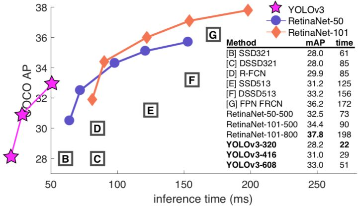
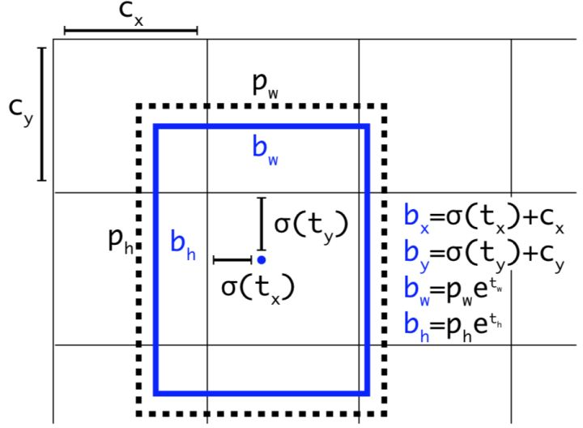
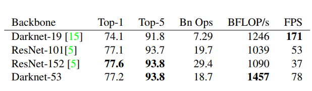
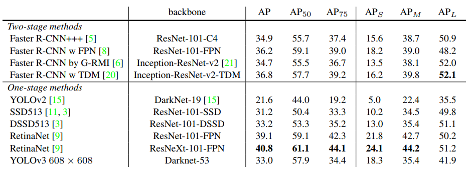
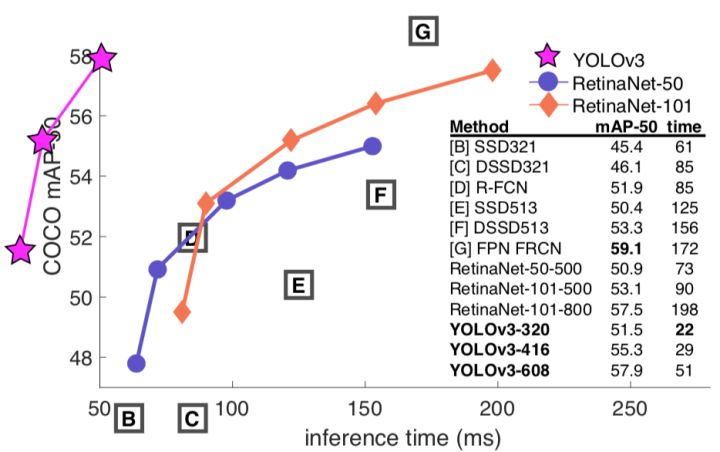

# 写在前面

论文原文：YOLOv3: An Incremental Improvement

参考的一些大佬们的翻译，这篇论文的翻译在网上已经算很多的了，po上来纯粹是为了记录。

以下是翻译正文

---

# **摘要**

我们推出了YOLO的一些更新！我们做了一篮子微小的设计上的改变来让YOLO变得更好。我们同时也把这个新网络训练得更臃肿了。它虽然比上一版本大了一点，但更加准确。别担心，它依然很快。在320x320的分辨率28.2mAP上YOLOv3跑出了22ms，跟SSD准确率一样但比它快三倍。用老旧的0.5 IOU mAP检测标准来衡量，YOLOv3很吼了。在Titan X上它达到了57.9 $AP_{50}$ 推断时间（inference time）51ms以内，对比RetinaNet的57.5 $AP_{50}$推断时间198ms，性能相当但相比快了3.8倍。照旧，所有的代码都在[https://pjreddie.com/yolo/](https://pjreddie.com/yolo/)。

<!-- more -->

# **1.引言**

有时一不小心就虚度了一年，我这一年没做太多的研究，而是沉迷推特；玩了一下GAN。上一年研究《自然哲学的数学原理》^[12]^和《类比》*（Analogy）*^[1]^花了我大笔的时间；我尽力对YOLO做了些提升。但说实话，没什么有意思的，都是些小改动。我同时也给其他人的研究提供了些帮助。

事实上，促成这篇文章的原因是这样的。我们截稿的ddl快到了^[4]^，而且我们需要引用我对YOLO做的一些随机更新，但是我们没有材料。所以，做好读**技术报告**的准备吧！

技术报告很棒的一点就是我们不需要简介，所以你懂的，为什么会有这篇东西。那么，在这个引言的最后会阐述这篇文章。首先我们会告诉你YOLOv3是怎么一回事。然后我们会告诉你我们是怎么做的。我们也会讲那些我们试了但是没效果的尝试。最后我们思考这一切的意义。

# **2.做法**

YOLOv3的真相是：我们吸取了其他人的好点子。我们也训练了比其他网络更好的分类器网络。我们将带你从头过一遍整个系统，让你能够彻底理解。

我们从Focal Loss^[9]^的论文里拿来了这张图。在相同的性能下YOLOv3跑得比其他检测方法快得多得多。时间数据来自M40或者Titan X ,他们基本上是相同的GPU。

# **2.1. Bounding Box 预测**

顺着YOLO9000的做法，我们的系统用维度聚类当anchor boxes^[15]^来预测bounding boxes。网络预测每个bounding box的4个坐标，$N\times N \times [3*(4+1+80)]$ 。

如果cell是从图像左上角偏移$(c_x,c_y)$ ，bounding box prior的宽度是$b_w=p_we^{t_w}$ 高度是$mAP$，

那么预测框为：
$$
\begin{align}
b_x&=\sigma(t_x)+c_x \\
b_y&=\sigma(t_y)+c_y \\
b_w&=p_we^{t_w}\\
&mAP
\end{align}
$$
在训练期间，我们用了误差平方和损失函数。如果一些坐标预测的ground truth是 $\hat{t}_*$，梯度是ground truth的值（由ground truth计算得到）减去我们的预测值：$\hat{t}_*-b_w=p_we^{t_w}$。ground truth的值能够通过逆变换上面的式子很方便地计算出来。

YOLOv3用逻辑回归从每个bounding box里预测了是物体的得分。如果bounding box prior比其他任何bounding box prior的物体得分都要高，那它的值应该是1。如果bounding box prior并不是最佳的，但是确实在多个阈值上与一个ground truth物体重合，我们就忽略这个预测，按照^[17]^。我们使用0.5的阈值。不像^[17]^我们的系统对每一个ground truth只分配一个bounding box prior。如果一个bounding box没被分配到一个ground truth对象上，它会导致一个坐标或类预测没有loss，只是说明有物体。

带维度先验的Bounding Boxes和位置预测。我们从聚类中心预测宽度和高度当作offset。我们预测框的中心坐标，中心坐标与用sigmoid函数的滤波器的位置有关。这张图来自我之前的论文^[15]^。

# **2.2. 类预测**

用多标签的分类法，每个框预测它可能会包含的类别。我们不用softmax因为我们发现它不能提高性能，相反，我们只是使用了独立的逻辑分类器。在训练期间，我们使用了双向交叉熵损失函数（binary cross-entropy loss）作类别预测。

当我们迁移到更复杂的数据集，比如Open Image Dataset^[7]^，这个方法帮助了我们。在这个数据集中有很多相互重叠的标签（例如：女人和人）。利用softmax限制假设在每个框中正好有一个类别，通常并不符合情况。多标签方法能更好地模型化这类数据。

# **2.3. 多尺度预测**

YOLOv3在3个不同的尺度上预测物体框。我们的系统用一个与特征金字塔网络^[8]^类似的概念从这些尺度上提取出特征。在基础特征提取器上我们添加了几个卷积层。最后几层预测一个三维张量来编码bounding box，有没有物体，和类别预测。以我们在COCO^[10]^上的经验，我们在每个尺度预测3个框，因此张量为$N\times N \times [3*(4+1+80)]$ ，对应为4个bounding box的offset，1为预测物体，还有80个类预测。

下一步，我们取前两层的特征图升采样2倍。我们还取一个网络早期的特征图，并用元素加法把它合并进我们的升采样特征里。这个方法让我们从升采样特征里得到更多含义丰富的语义信息，还有从早期特征图里得到更多细粒度信息。然后我们加多了几层卷积网络来处理这个合成的特征图，并最终预测一个相似的张量，虽然模型大小翻了一倍。

我们把同样的设计在最终尺寸预测框框上再执行了一遍。因此我们对第三尺度的预测得益于所有的prior计算和早期网络细粒度特征。

我们还使用k-means聚类来决定我们的bounding box prior。我们只是随意地排序了选定的9个聚类和3个尺度，然后均分每个聚类到各个尺度上。在COCO数据集这9个聚类是：(10x13)，(16x30)，(33x23)，(30x61)，(62x45)，(59x119)，(116x90)，(156x198)，(373x326)。

# **2.4. 特征提取**

我们用一个新网络来做特征提取的工作。我们的新网络是用在YOLOv2里的Darknet-19和时髦的残差网络这类东西的杂糅。我们的网络用了连续的3x3和1x1的卷积层，但是同时也有一些跨层连接，网络明显更大了。它有53层卷积，所以我们叫他....当当当当....Darknet-53!

表1.Darknet-53.

这个新网络比Darknet-19更加强大但仍然比ResNet-101或者ResNet-152更加高效。这是一些ImageNet的结果：

骨架比较。准确率，每秒十亿次浮点运算，和帧率FPS。

每个网络都在相同的设置下训练，并在256x256的分辨率，以single crop accuracy测试。运行时间在Titan X上测量，分辨率为256x256。因此Darknet-53与state-of-the-art分类器们效果上不分伯仲，但是浮点运算次数更少还有速度更快。Darknet-53比ResNet-101还要好但是1.5倍快。Darknet-53与ResNet-152表现相当，但是2倍快于它。

Darknet-53同样还达到了最高的每秒浮点运算数。这意味着这个网络结构更好地利用GPU，让它更高效地去运算，也因此更快。这是更多是因为ResNet们包含了太太太多层了，才不高效。

# **2.5. 训练**

我们依然在全图上作训练，不加很难区分的负样本之类的东西。我们用了多尺度训练，大量的数据增强，批归一化（batch normalization），全是些标准玩意。我们用Darknet神经网络框架来做训练和测试^[14]^。

# **3.我们怎么做的**

YOLOv3相当好！！看表 3 。在COCO数据集诡异的均值AP测量方法下它跟SSD参数相当但是3倍快于SSD。虽然它比起其他模型，像RetinaNet，也仍然有一丢丢差距。

我确实从^[9]^里用了所有的表格，他们花了相相相相当长的时间白手起家做出来的。好吧，YOLOv3做得还不赖。给我记住RetinaNet可是花了3.8倍的时间处理一张图片。YOLOv3比SSD变体们还有AP50下的state-of-the-art的模型们好太多了。

但是，当我们用$mAP$ 上的（$mAP$或者表格里 $AP_{50}$）这种“老的”检测标准来看，YOLOv3是相当强的。它几乎相当于RetinaNet，还远超SSD的各种变体。这表明了YOLOv3是一个相当强的检测器，擅长生成合格的物体检测框。但是，随着IOU阈值的增加效果下降地很明显，说明YOLOv3在检测框完美贴合物体上还是有困难。

过去，YOLO对付小物体有困难。但是，现在我们看到形势发生了反转。在新的多尺度预测下我们看到YOLOv3有相当高的$AP_{50}$表现。但是，它相对地在中尺寸和大尺寸物体上表现更差。要找到这个问题的瓶颈还需要更多的研究。

当我们在$AP_{50}$（见图3）上绘出准确度和速度的图表，我们看到YOLOv3超越其他的检测系统成效显著。毫不客气地说，YOLOv3更快也更好。

# **4.我们尝试了但无效的内容**

我们尝试了很多的方法，在耕耘YOLOv3的期间。相当一部分不Work。以下是我们能记得的。

**Anchor box $x,y$ offset predictions**.我们试过用正常的anchor box预测机制，用线性激活函数预测偏 $x,y$  移即相当于检测框的多个宽或高。我们发现这个设计降低了模型的稳定性和工作得不是很好。

**用线性**$x, y$ **预测代替logistic**。我们尝试用线性激活代替logistic激活来直接预测 $x, y$ offset。这导致了$mAP$几个点的下跌。

**Focal loss.**我们试着用了focal loss。他让我们的$mAP$掉了2个点。YOLOv3可能在focal loss要解决的问题上已经足够鲁棒，因为YOLOv3将物体预测和条件类别预测分开了。因此在很多情况上类别预测没有带来loss？还是因为别的？我们还不能完全确定。

还是从^[9]^里借鉴的，这次展示了在.5 IOU mAP上 speed/accuracy 的tradeoff。你可以分辨出YOLOv3很棒因为数值很高还有左得都要出去了。是否能引用自己的论文？猜猜谁要试试？这个家伙→^[16]^。

**双IOU阈值和真值指派**。Faster R-CNN在训练的时候用了两个IOU阈值。如果一个预测和ground truth重叠超过0.7那它是个正样本，如果在[0.3-0.7]之间就忽视掉，小于0.3对于所有的ground truth它就是一个负样本。我们尝试了相同的策略，但是并没有得到好的结果。

我们相当喜欢我们现在的方案，它似乎至少是现在的一个局部最优解。很大可能以上这些技术能最终得到好的结果，或许我们只是需要一些调试来使训练稳定下来。

# **5.一切的意义**

YOLOv3是个很棒的检测器。又快又精确。它在COCO的0.5和0.95 IOU之间的平均AP上不太好。但是它在0.5 IOU的老检测评估方法上非常棒啊。

话说回来我们为什么换了评测方法呢？原始的COCO论文含有这样的话：

> A full discussion of evaluation metrics will be added once the evaluation server is complete.
> 一个经充分讨论的评估标准会在评估服务完成的时候被加进去.

Russakovsky等人报告过人类从0.5里分辨0.3的IOU也很困难！

> Training humans to visually inspect a bounding box with IOU of 0.3 and distinguish it from one with IOU 0.5 is surprisingly difficult.^[18]^
> 训练人类来视觉检索一个0.3 IOU的bounding box，并将它从0.5 IOU里区分出来，这出乎意料地困难。

如果人类都不能分辨有什么不同，那用哪个评价标准又有什么关系？

但可能更好的问题是：“我们现在有了这些检测器，我们要拿来干嘛？”很多人在Google和Facebook做这些研究。我想至少我们还知道这些技术在好人手里，还有绝对不会被用于收割人们的个人信息还有把它卖给....等等，你说这正是它的用处？噢。

好吧其他重金投入视觉研究的人是军队，他们从没做过任何像用新技术杀大量人这样可怕的事情啊等等......

我十分希望大多数使用计算机视觉的人只是用它来做令人愉快的、好的事情，比如数一数国家公园的斑马数量^[13]^，或者追踪在家旁边游荡的猫主子^[19]^。但是计算机视觉已经被投入有争议性的用法上了，作为一个研究者我们有责任去最起码地考虑我们的工作被滥用所造成的伤害，和考虑降低伤害的方式。我们欠这个世界太多了。

最后，别艾特我。（我好不容易戒掉了Twitter。）

# **引用**

[1] Analogy. Wikipedia, Mar 2018. 1

[2] M. Everingham, L. Van Gool, C. K. Williams, J. Winn, and A. Zisserman. The pascal visual object classes (voc) challenge. International journal of computer vision, 88(2):303–338, 2010. 6

[3] C.-Y. Fu, W. Liu, A. Ranga, A. Tyagi, and A. C. Berg. Dssd: Deconvolutional single shot detector. arXiv preprint arXiv:1701.06659, 2017. 3

[4] D. Gordon, A. Kembhavi, M. Rastegari, J. Redmon, D. Fox, and A. Farhadi. Iqa: Visual question answering in interactive environments. arXiv preprint arXiv:1712.03316, 2017. 1

[5] K. He, X. Zhang, S. Ren, and J. Sun. Deep residual learning for image recognition. In Proceedings of the IEEE con- ference on computer vision and pattern recognition, pages 770–778, 2016. 3

[6] J. Huang, V. Rathod, C. Sun, M. Zhu, A. Korattikara, A. Fathi, I. Fischer, Z. Wojna, Y. Song, S. Guadarrama, et al. Speed/accuracy trade-offs for modern convolutional object detectors. 3

[7] I. Krasin, T. Duerig, N. Alldrin, V. Ferrari, S. Abu-El-Haija, A. Kuznetsova, H. Rom, J. Uijlings, S. Popov, A. Veit, S. Belongie, V. Gomes, A. Gupta, C. Sun, G. Chechik, D. Cai, Z. Feng, D. Narayanan, and K. Murphy. Open- images: A public dataset for large-scale multi-label and multi-class image classification. Dataset available from [openimages](http://link.zhihu.com/?target=https%3A//github.com/openimages), 2017. 2

[8] T.-Y. Lin, P. Dollar, R. Girshick, K. He, B. Hariharan, and S. Belongie. Feature pyramid networks for object detection. In Proceedings of the IEEE Conference on Computer Vision and Pattern Recognition, pages 2117–2125, 2017. 2, 3

[9] T.-Y. Lin, P. Goyal, R. Girshick, K. He, and P. Dolla ́r. Focal loss for dense object detection. arXiv preprint arXiv:1708.02002, 2017. 1, 3, 4

[10] T.-Y. Lin, M. Maire, S. Belongie, J. Hays, P. Perona, D. Ra- manan, P. Dolla ́r, and C. L. Zitnick. Microsoft coco: Com- mon objects in context. In European conference on computer vision, pages 740–755. Springer, 2014. 2

[11] W. Liu, D. Anguelov, D. Erhan, C. Szegedy, S. Reed, C.- Y. Fu, and A. C. Berg. Ssd: Single shot multibox detector. In European conference on computer vision, pages 21–37. Springer, 2016. 3

[12] I. Newton. Philosophiae naturalis principia mathematica. William Dawson & Sons Ltd., London, 1687. 1

[13] J. Parham, J. Crall, C. Stewart, T. Berger-Wolf, and D. Rubenstein. Animal population censusing at scale with citizen science and photographic identification. 2017. 4

[14] J. Redmon. Darknet: Open source neural networks in c. [Darknet: Open Source Neural Networks in C](http://link.zhihu.com/?target=http%3A//pjreddie.com/darknet/), 2013–2016. 3

[15] J.RedmonandA.Farhadi.Yolo9000:Better,faster,stronger. In Computer Vision and Pattern Recognition (CVPR), 2017 IEEE Conference on, pages 6517–6525. IEEE, 2017. 1, 2,3

[16] J.RedmonandA.Farhadi.Yolov3:Anincrementalimprove- ment. arXiv, 2018. 4

[17] S. Ren, K. He, R. Girshick, and J. Sun. Faster r-cnn: To- wards real-time object detection with region proposal net- works. arXiv preprint arXiv:1506.01497, 2015. 2

[18] O. Russakovsky, L.-J. Li, and L. Fei-Fei. Best of both worlds: human-machine collaboration for object annotation. In Proceedings of the IEEE Conference on Computer Vision and Pattern Recognition, pages 2121–2131, 2015. 4

[19] M. Scott. Smart camera gimbal bot scanlime:027, Dec 2017.4

[20] A. Shrivastava, R. Sukthankar, J. Malik, and A. Gupta. Be- yond skip connections: Top-down modulation for object de- tection. arXiv preprint arXiv:1612.06851, 2016. 3

[21] C. Szegedy, S. Ioffe, V. Vanhoucke, and A. A. Alemi. Inception-v4, inception-resnet and the impact of residual connections on learning. 2017. 3