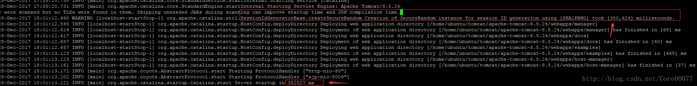
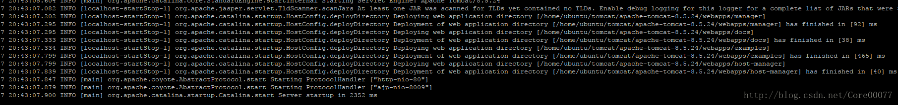

# 日常
今天和学弟学妹们在实验室吹水好不快乐，然而自己服务器问题还没解决，具体问题是——之前使用windows服务端，一直想换成linux的，然后最近终于有时间换，却发现问题解决到tomcat部署之后，部署的贼慢！大概需要5-6分钟之久，遂找到一篇大佬写的[文章](http://ian.wang/304.htm)，就此记录。

<!-- more -->

# 解决
## 查日志
一开始我还以为是服务器搭不上去，重启了好几次，结果玩手机等了一会儿，tomcat反而启动了，当时也没太注意，后来发现每次都是固定的5分钟左右，就很奇怪了。其实tomcat的log下是会记录各种用时的，这里我们进入log目录会找到当时的记录。



可以看到SessionIdGeneratorBase.createSecureRandom Creation of SecureRandom instance for session ID generation ，这个是罪魁祸首，占据了300s钟的大头！

## 找原因

>Tomcat的SessionID是通过SHA1PRNG算法计算得到的，SHA1算法需要一个密钥，这个密钥在Tomcat启动的时候随机生成一个，生成是使用了Linux随机函数生成器/dev/random。读取它相当于生成随机数字。/dev/random会根据 噪音 产生随机数，如果噪音不够它就会阻塞。Linux是通过I/O，键盘终端、内存使用量、CPU利用率等方式来收集噪音的，如果噪音不够生成随机数的时候就会被阻塞。

这里直接照搬大佬的原话了，做做笔记。其实玩putty生产putty特有的公钥.ppk文件的时候也遇到过，当时需要鼠标乱移以得到一些随机值，应该和这个随机噪音类似。

### 解决方案

既然是噪音不够，那我们就增大熵池解决问题好了，

```shell
#获取服务
apt-get install rng-tools  
#启动服务
service rng-tools start
service rng-tools status
service rng-tools stop
```
## 结果
这次效果就非常明显，直接2s多就搞定了。


# 总结

多查，多看，多问。
